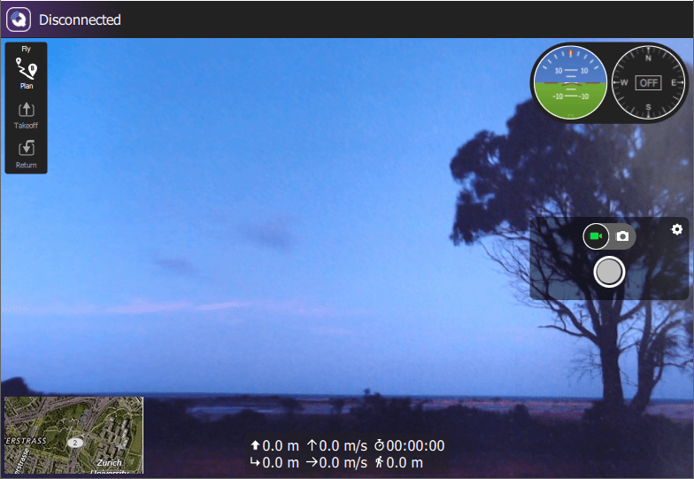

# 오드로이드 C1에서 QGroundControl로의 동영상 스트리밍

:::note
이 글 일부는 내용이 오래됐습니다. 여러 커뮤니티 구성원은 최근 우분투 버전에 맞추어 절차를 다시 시험해주었으면 좋겠고, 위치에 오드로이드 설치 절차 내용도 가져다 두었으면 좋겠습니다.
:::

이 주제에서는 보조 컴퓨터([Odroid C1](https://magazine.odroid.com/wp-content/uploads/odroid-c1-user-manual.pdf))에 붙은 카메라(로지텍 C920)로 동영상을 촬영한 후 (무선랜 연결에 실어) 다른 컴퓨터로 실시간 전송하여 *QGroundControl*에 띄우는 방법을 보여드립니다.

하드웨어 구성은 아래 그림과 같습니다. 다음 부분으로 구성합니다:
* 오드로이드 C1
* 로지텍 카메라 C920
* 무선랜 모듈 TP-LINK TL-WN722N


절차는 우분투 14.04에서 테스트했지만 최근 우분투 버전에서도 비슷한 방식으로 동작할 수도 있습니다.

## 오드로이드 C1에 리눅스 환경 설치

오드로이드 C1에는 5V 직류 전원 커넥터로 전원을 공급합니다. 오드로이드를 드론에 연결할 경우 아래 그림과 같이 홀을 관통하는 [방식](https://learn.sparkfun.com/tutorials/how-to-solder---through-hole-soldering)으로 5V 직류 연결 커넥터 옆 핀 두개의 납땜을 권장합니다.

## 대안 전원 연결 설정

오드로이드 C1에는 5V 직류 전원 커넥터로 전원을 공급합니다. 오드로이드를 드론에 연결할 경우 아래 그림과 같이 홀을 관통하는 [방식](https://learn.sparkfun.com/tutorials/how-to-solder---through-hole-soldering)으로 5V 직류 연결 커넥터 옆 핀 두개의 납땜을 권장합니다. 전원은 예제 설정과 같이 점퍼 케이블(그림 위쪽의 적색 케이블)을 직류 전압 공급원(5V)과 오드로이드 C1에 연결하고, 점퍼 케이블(그림 위쪽의 흑색)을 회로의 접지부와 오드로이드 C1의 접지 핀을 연결하여 끌어옵니다.


## 오드로이드 C1 무선랜 연결 사용

이 절에서는 오드로이드 C1을 액세스 포인트로 구성하는 방법을 알려드리겠습니다. 이 내용은 pixhawk.org의 "액세스 포인트" 구축 자습서(더이상 내용이 없음)의 일부 적용 예에서 가져왔습니다.


## 무선랜 액세스 포인트 구성

다음 단계에서는 오드로이드 C1에서 무선랜 모듈 이름을 wlan0(으)로 지정했음을 가정합니다. wlan0이(가) 나오는 모든 부분 대신 인터페이스 이름이 차이가 있는 경우 적절한 이름(예: wlan1)으로 바꾸십시오. Odroid C1으로 촬영한 카메라 동영상을 컴퓨터에서 실행하는 QGroundControl로의 실시간 전송을 활성화하려 한다면 이 절의 내용을 따를 필요가 없습니다. 그러나, 오드로이드 C1를 자체 동작 모드 시스템으로 사용할 수 있는 액세스 포인트로 구성할 것이기에 이 내용을 보여드립니다. TP-LINK TL-WN722N을 무선랜 모듈로 활용합니다.

다음 단계에서는 오드로이드 C1에서 무선랜 모듈 이름을 wlan0(으)로 지정했음을 가정합니다. wlan0이(가) 나오는 모든 부분 대신 인터페이스 이름이 차이가 있는 경우 적절한 이름(예: wlan1)으로 바꾸십시오.

### 액세스 포인트 내장 컴퓨터

좀 더 자세한 내용은 [RPI-Wireless-Hotspot](http://elinux.org/RPI-Wireless-Hotspot) 문서를 살펴볼 수 있습니다

필요한 프로그램을 설치하십시오


```bash
sudo apt-get install hostapd udhcpd
```

DHCP를 설정합니다. `/etc/udhcpd.conf` 파일을 편집하십시오

```bash
start 192.168.2.100 # This is the range of IPs that the hotspot will give to client devices.
end 192.168.2.200
interface wlan0 # The device uDHCP listens on.
remaining yes
opt dns 8.8.8.8 4.2.2.2 # The DNS servers client devices will use (if routing through the Ethernet link).
opt subnet 255.255.255.0
opt router 192.168.2.1 # The Onboard Computer's IP address on wlan0 which we will set up shortly.
opt lease 864000 # 10 day DHCP lease time in seconds
```
`/etc/default/udhcpd` 파일을 편집하여 다음 줄을:

`/etc/default/udhcpd` 파일을 편집하여 다음 줄을:

```bash
DHCPD_ENABLED="no"
```

다음처럼 주석 처리하십시오.

```bash
#DHCPD_ENABLED="no"
```

초기 (무선랜 클라이언트) 자동 설정을 끄십시오. 다음 줄을(아마 해당 설정은 같이 두지 않든지 모두 두지 않는게 좋을지도 모릅니다):

```sh
auto wlan0
iface wlan0 inet static
address 192.168.2.1
netmask 255.255.255.0
network 192.168.2.0
broadcast 192.168.2.255
wireless-power off
```

초기 (무선랜 클라이언트) 자동 설정을 끄십시오. 다음 줄을(아마 해당 설정은 같이 두지 않든지 모두 두지 않는게 좋을지도 모릅니다):

```sh
allow-hotplug wlan0
wpa-roam /etc/wpa_supplicant/wpa_supplicant.conf
iface default inet dhcp
```
을:

```sh
#allow-hotplug wlan0
#wpa-roam /etc/wpa_supplicant/wpa_supplicant.conf
#iface default inet dhcp
```

*오드로이드 C1 자습서*(pixhawk.org에 있었음)의 내용을 따라 무선랜 연결을 설정했다면, `/etc/network/interfaces.d/wlan0` 파일을 이미 만들었을지도 모릅니다. 파일의 해당 줄을 모두 주석처리하여 더이상 설정 내용이 반영되지 않게 하십시오.

HostAPD를 설정하십시오. WPA 보안 네트워크를 만들려면 `/etc/hostapd/hostapd.conf` 파일을 편집(없다면 새로 만드십시오)하고, 다음 줄을 추가하십시오:


```
auth_algs=1
channel=6            # Channel to use
hw_mode=g
ieee80211n=1          # 802.11n assuming your device supports it
ignore_broadcast_ssid=0
interface=wlan0
wpa=2
wpa_key_mgmt=WPA-PSK
wpa_pairwise=TKIP
rsn_pairwise=CCMP
# Change the to the proper driver
driver=nl80211
# Change these to something else if you want
ssid=OdroidC1
wpa_passphrase=QGroundControl
```

`ssid=`, `channel=`, `wpa_passphrase=` 값을 원하는 값으로 바꾸십시오. SSID는 다른 서비스에 뿌려주는 핫스팟 이름이고, 채널은 핫스팟을 실행할 주파수 대역이며, wpa_passphrase는 무선 네트워크의 암호입니다. 더 많은 옵션 내용을 보려면 `/usr/share/doc/hostapd/examples/hostapd.conf.gz` 파일을 살펴보십시오. 해당 영역에서 사용하지 않는 채널을 확인하십시오. *wavemon* 과 같은 도구를 활용해볼 수 있습니다.

`/etc/default/hostapd` 파일을 편집하여 다음 줄을:

```
#DAEMON_CONF=""
```
다음과 같이 주석처리하십시오:
```
DAEMON_CONF="/etc/hostapd/hostapd.conf"
```
내장 컴퓨터 자체를 액세스 포인트로 띄워 나타내는데는 이정도면 충분하며, 지상 통제 장치에서 연결할 수 있습니다. 실제 액세스 포인트로 동작하게끔 하려면(무선랜 트래픽을 온보드 컴퓨터의 이더넷 연결로 전달하려면), 라우팅과 네트워크 주소 변환(NAT)을 설정해야합니다.

```
sudo update-rc.d hostapd enable
sudo update-rc.d udhcpd enable
```

내장 컴퓨터 자체를 액세스 포인트로 띄워 나타내는데는 이정도면 충분하며, 지상 통제 장치에서 연결할 수 있습니다. 실제 액세스 포인트로 동작하게끔 하려면(무선랜 트래픽을 온보드 컴퓨터의 이더넷 연결로 전달하려면), 라우팅과 네트워크 주소 변환(NAT)을 설정해야합니다. 커널에서 IP 전달을 활성화하십시오:

```sh
sudo sh -c "echo 1 > /proc/sys/net/ipv4/ip_forward"
```

이 설정을 영구적으로 동작하게 하려면, 다음 명령을 실행하십시오:

```sh
sudo iptables -t nat -A POSTROUTING -o eth0 -j MASQUERADE
sudo iptables -A FORWARD -i eth0 -o wlan0 -m state --state RELATED,ESTABLISHED -j ACCEPT
sudo iptables -A FORWARD -i wlan0 -o eth0 -j ACCEPT
```

/etc/network/interfaces 파일을 편집하여 다음 줄을 파일 하단에 추가하십시오:

```sh
sudo sh -c "iptables-save > /etc/iptables.ipv4.nat"
```

컴퓨터와 오드로이드 C1에 지스트리머 꾸러미를 설치하고 스트리밍을 시작하려면, [QGroundControl README](https://github.com/mavlink/qgroundcontrol/blob/master/src/VideoReceiver/README.md)에 설명하는 내용을 따르십시오.

```sh
up iptables-restore < /etc/iptables.ipv4.nat
```

# 지스트리머 설치

uvch264 플러그인으로 오드로이드에서 스트리밍 전송을 시작할 수 없다면, v4l2src 플러그인도 함께 시작하게 할 수도 있습니다.

여기서 `xxx.xxx.xxx.xxx` 부분은 QGC를 실행하는 컴퓨터의 IP 주소입니다.

```sh
gst-launch-1.0 v4l2src device=/dev/video0 ! video/x-h264,width=1920,height=1080,framerate=24/1 ! h264parse ! rtph264pay ! udpsink host=xxx.xxx.xxx.xxx port=5000
```
여기사 `xxx.xxx.xxx.xxx` 부분은 QGC를 실행하는 컴퓨터의 IP 주소입니다.

:::tip
`Permission denied` 오류가 뜬다면, 위 명령 앞에 `sudo`를 붙여야 합니다.
:::

대신 아래와 같이 현재 사용자를 `video` 그룹에 추가할 수 있습니다(그리고 로그아웃한 다음 다시 로그인하십시오).

  ```sh
  sudo usermod -aG video $USER
  ```

실시간 동영상 전송 화면을 누르면, 좌측 하단 구석에는 인공위성 지도가 뜨고, 전체 배경에 동영상이 뜹니다.



실시간 동영상 전송 화면을 누르면, 좌측 하단 구석에는 인공위성 지도가 뜨고, 전체 배경에 동영상이 뜹니다.
