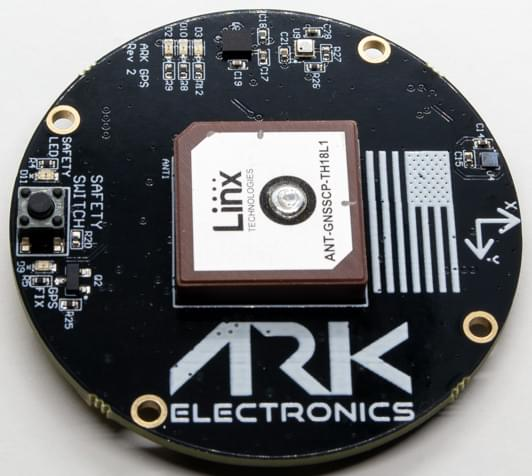

# ARK GPS

ARK GPS is an open source [UAVCAN](README.md) [GNSS/GPS](../gps_compass/README.md), magnetometer, IMU, buzzer, and safety switch module.



## Where to Buy

Order this module from:

* [ARK Electronics](https://arkelectron.com/product/ark-gps/) (US)

## Specifications

* [Open Source Schematic and BOM](https://github.com/ARK-Electronics/ARK_GPS)
* Runs [PX4 Open Source Firmware](https://github.com/PX4/PX4-Autopilot/tree/master/boards/ark/can-gps)
* Supports [UAVCAN](README.md) [Firmware Updating](node_firmware.md)
* Dynamic [UAVCAN](README.md) node enumeration
* Sensors
  * Ublox M9N GPS
    * Ultra-robust meter-level GNSS positioning
    * Maximum position availability with concurrent reception of 4 GNSS
    * Advanced spoofing and jamming detection
    * Excellent RF interference mitigation
  * Bosch BMM150 Magnetometer
  * Bosch BMP388 Barometer
  * Invensense ICM-42688-P 6-Axis IMU
* STM32F412CEU6 MCU
* Safety Button
* Buzzer
* Two Pixhawk Standard CAN Connectors
  * 4 Pin JST GH
* Pixhawk Standard Debug Connector
  * 6 Pin JST SH
* Small Form Factor
  * 5cm x 5cm x 1cm
* LED Indicators
  * Safety LED
  * GPS Fix
  * RGB System Status
* USA Built
* Power Requirements
  * 5V
  * 110mA Average
  * 117mA Max


### Wiring/Connecting

ARK GPS is connected to the CAN bus using a Pixhawk standard 4 pin JST GH cable. Multiple sensors can be connected by plugging additional sensors into ARK GPS's second CAN connector.

General instructions for UAVCAN wiring can also be found in [UAVCAN > Wiring](../uavcan/README.md#wiring).

<a id="mounting"></a>

### Mounting/Orientation

The recommended mounting orientation is with the connectors on the board pointing towards the **back of vehicle**.

The sensor can be mounted anywhere on the frame, but you will need to specify its position, relative to vehicle centre of gravity, during [PX4 configuration](#px4-configuration).


## PX4 Setup

### Enabling UAVCAN

In order to use the ARK GPS board, connect it to the Pixhawk CAN bus and enable the UAVCAN driver by setting parameter [UAVCAN_ENABLE](../advanced_config/parameter_reference.md#UAVCAN_ENABLE) to `2` for dynamic node allocation (or `3` if using [UAVCAN ESCs](../uavcan/escs.md)).

The steps are:
- In *QGroundControl* set the parameter [UAVCAN_ENABLE](../advanced_config/parameter_reference.md#UAVCAN_ENABLE) to `2` or `3` and reboot (see [Finding/Updating Parameters](../advanced_config/parameters.md)).
- Connect ARK GPS CAN to the Pixhawk CAN.

Once enabled, the module will be detected on boot. GPS data should arrive at 10Hz.

General instructions for UAVCAN PX4 configuration can also be found in [UAVCAN > PX4 Configuration](../uavcan/README.md#px4-configuration).

### PX4 Configuration

You need to set necessary [UAVCAN](README.md) parameters and define offsets if the sensor is not centred within the vehicle.
- Enable [UAVCAN_SUB_GPS](../advanced_config/parameter_reference.md#UAVCAN_SUB_GPS), [UAVCAN_SUB_MAG](../advanced_config/parameter_reference.md#UAVCAN_SUB_MAG), and [UAVCAN_SUB_BARO](../advanced_config/parameter_reference.md#UAVCAN_SUB_BARO).
- The parameters [EKF2_GPS_POS_X](../advanced_config/parameter_reference.md#EKF2_GPS_POS_X), [EKF2_GPS_POS_Y](../advanced_config/parameter_reference.md#EKF2_GPS_POS_Y) and [EKF2_GPS_POS_Z](../advanced_config/parameter_reference.md#EKF2_GPS_POS_Z) can be set to account for the offset of the Ark GPS from the vehicles centre of gravity.


## Building ARK GPS Firmware

ARK GPS is sold with a recent firmware build. Developers who want to update to the very latest version can build and install it themselves using the normal PX4 toolchain and sources.

The steps are:

1. Install the [PX4 toolchain](../dev_setup/dev_env.md).
1. Clone the PX4-Autopilot sources, including ARK GPS, using *git*:
   ```
   git clone https://github.com/PX4/PX4-Autopilot --recursive
   cd PX4-Autopilot
   ```
1. Build the ARK GPS firmware:
   ```
   make ark_can-gps_default
   ```
1. That will have created a binary in **build/ark_can-gps_default** named **XX-X.X.XXXXXXXX.uavcan.bin**. Put this binary on the root directory of the flight controller’s SD card to flash the ARK GPS. Next time you power your flight controller with the SD card installed, ARK GPS will automatically be flashed and you should notice the binary is no longer in the root directory and there is now a file named **80.bin** in the *ufw* directory of the SD card.

:::note
The ARK GPS will not boot if there is no SD card in the flight controller when powered on.
:::


## Updating ARK GPS Bootloader

The ARK GPS comes with the bootloader pre-installed. You can, however, rebuild and reflash it within the PX4-Autopilot environment.

The steps are:

1. Build the ARK GPS bootloader firmware:
   ```
   make ark_can-gps_canbootloader
   ```
:::note
This will setup your `launch.json` file if you are in VS code. If using the Black Magic Probe and VS code, make sure to update `BMPGDBSerialPort` within this file to the correct port that your debugger is connected to. On MacOS, the port name should look something like `cu.usbmodemE4CCA0E11`.
:::
1. Connect your ARK GPS to any Serial Wire Debugging (SWD) device that supports use of GNU Project Debugger (GDB), such as the Black Magic Probe and then connect power to your ARK GPS via one of the CAN ports.
1. Flash the ARK GPS with `ark_can-gps_canbootloader`. To do so in VS code, you should see `CMake: [ark_can-gps_canbootloader]: Ready` on the bottom bar of VS code, indicating what you are flashing. You then flash the bootloader by selecting `Start Debugging` in the Run and Debug window of VS code.
3. With the bootloader flashed, you are ready to build and flash the ARK GPS firmware `ark_can-gps_default` as outlined above.


## LED Meanings

You will see green, blue and red LEDs on the ARK GPS when it is being flashed, and a blinking green LED if it is running properly.

If you see a red LED there is an error and you should check the following:
- Make sure the flight controller has an SD card installed.
- Make sure the ARK GPS has `ark_can-gps_canbootloader` installed prior to flashing `ark_can-gps_default`.
- Remove binaries from the root and ufw directories of the SD card and try to build and flash again.
