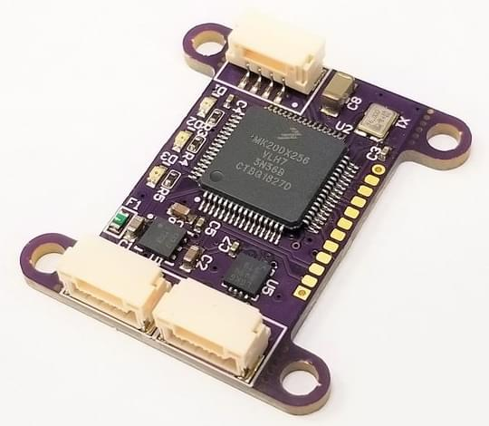

# Avionics Anonymous Laser Altimeter UAVCAN 인터페이스

[Avionics Anonymous Laser Altimeter Interface](https://www.tindie.com/products/avionicsanonymous/uavcan-laser-altimeter-interface/)는 UAVCAN 버스로 [공통 거리계](#supported_rangefinders)를 연결합니다 (이는 I2C보다 강력한 인터페이스).

## 구매처

* [AvAnon 레이저 인터페이스](https://www.tindie.com/products/avionicsanonymous/uavcan-laser-altimeter-interface/)

## 지원되는 거리 측정기

지원되는 거리계의 전체 목록은 위의 링크를 참고하십시오.

이 문서 작성 시점에는 아래의 거리 측정기들이 지원됩니다.

- Lightware SF30/D
- Lightware SF10/a
- Lightware SF10/b
- Lightware SF10/c
- Lightware SF11/c
- Lightware SF/LW20/b
- Lightware SF/LW20/c

## 핀배열

### CAN 커넥터
| 핀 | 명칭       | 설명                                           |
| - | -------- | -------------------------------------------- |
| 1 | POWER_IN | 전원 공급. 4.0-5.5V가 지원되지만, 연결된 레이저와도 호환되어야 합니다. |
| 2 | TX/SCL   | 직렬 모드용 TX, I2C 모드용 Clock                     |
| 3 | RX/SDA   | 직렬 모드용 RX, I2C 모드용 데이터                       |
| 4 | GND      | 신호/전원 접지                                     |

### 레이저 커넥터

| 핀 | 명칭        | 설명                       |
| - | --------- | ------------------------ |
| 1 | POWER_OUT | 공급 전압에서 필터링된 전력.         |
| 2 | CAN+      | 직렬 모드용 TX, I2C 모드용 Clock |
| 3 | RX/SDA    | 직렬 모드용 RX, I2C 모드용 데이터   |
| 4 | GND       | 신호/전원 접지                 |

## 배선

거리계 (레이저)는 자동조종장치의 CAN 포트 하나에 연결된 AvAnon 인터페이스 보드에 연결됩니다. 배선은 위의 핀 배치에 따르거나, 필요한 케이블을 구매하여 연결할 수 있습니다. [여기](https://www.tindie.com/products/avionicsanonymous/uavcan-laser-altimeter-interface/) 링크를 참고하십시오.

인터페이스 보드는 레이저에 대해 필터링된 전력 출력을 제공하지만 자체 규정을 제공하지 않습니다. 따라서, 레이저는 보드에 공급되는 전압과 호환되어야합니다.

## 소프트웨어 설정

UAVCAN은 [UAVCAN_ENABLE](../advanced_config/parameter_reference.md#UAVCAN_ENABLE)을 0이 아닌 값으로 설정하여 활성화하여야 합니다.

레이저의 최소/최대 유효 범위는 [UAVCAN_RNG_MIN](../advanced_config/parameter_reference.md#UAVCAN_RNG_MIN)와 [UAVCAN_RNG_MAX](../advanced_config/parameter_reference.md#UAVCAN_RNG_MAX) 매개변수로 설정합니다.
