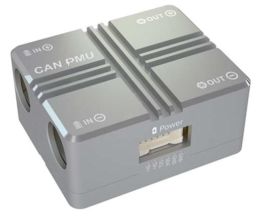
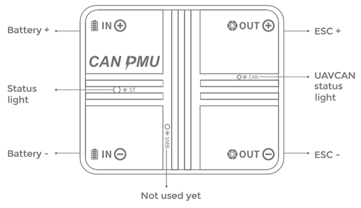

# CAUV CAN PMU

CAN PMU&reg;는 CUAV&reg;에서 개발한 고정밀 [UAVCAN](../uavcan/README.md) 전원 모듈입니다. CUAV ITT 보상 알고리즘으로 보다 정확한 배터리 데이터를 획득합니다.

대형 상업용 기체에 사용하는 것이 좋지만, 연구용 기체에도 사용할 수 있습니다.

## 사양

- **프로세스:** STM32F412
- **입력 전압**: 6~62V\(2-15S\)
- **최대 전류:** 110A
- **전압 정확도:** ±0.05V
- **전류 정확도:** ±0.1A
- **해상도:** 0.01A/V
- **최대 출력 전력:** 6000W/90S
- **최대 안정 전력:** 5000W
- **전원 포트 출력:** 5.4V/5A
- **프로토콜:** UAVCAN
- **작동 온도:** -20~+100
- **폄웨어 업그레이드:** 지원
* **보종:** 불필요
* **인터페이스 타입:**
  - **입력/출력:** XT90\(케이블) /Amass 8.0\(모듈)
  - **전원 포트:** 5025850670
  - **CAN:** GHR-04V-S
- **외양**
  - **크기:** 46.5mm \* 38.5mm \* 22.5mm
  - **중량:** 76g

## 구매

- [CUAV 상점](https://store.cuav.net/index.php)
- [CUAV aliexpress ](https://www.aliexpress.com/item/4000369700535.html)

## 핀배열

## 연결

연결 절차는 다음과 같습니다:
* 비행 제어 CAN1/2과 모듈 CAN 인터페이스를 연결합니다.
* V5 시리즈 전원 케이블을 V5 비행 제어 전원 2(다른 비행 콘트롤러가 전원 인터페이스에 연결된 경우)와 모듈 전원 인터페이스에 연결합니다.

## CAN PMU 활성화

*QGroundControl* [매개변수 목록](../advanced_config/parameters.md)에서 아래의 매개변수를 설정후 다시 시작합니다.

* `UAVCAN_ENABLE`: 설정: *Sensors Automatic Config*

  

# 패키지 내용물

## 추가 정보

[CAN PMU 매뉴얼](http://manual.cuav.net/power-module/CAN-PMU.pdf)

[CAN PMU 전원 감지 모듈 > CAN PMU 활성화 > PX4 펌웨어](http://doc.cuav.net/power-module/can-pmu/en/) (CUAV 문서)

[UAVCAN](https://new.uavcan.org/)