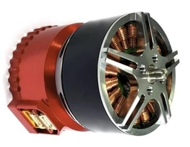

# UAVCAN ESC (모터 컨트롤러)

PX4는 [UAVCAN](../uavcan/README.md) ESC를 지원합니다. [PWM ESC](../peripherals/pwm_escs_and_servo.md)와 비교하여 다음과 같은 장점들이 있습니다.
- UAVCAN은 비교적 장거리에도 강력하고 안정적인 연결을 제공하도록 설계되었습니다. 더 큰 기체에서 ESC를 안전하게 사용하고, 통신 이중화가 가능합니다.
- 버스는 양방향이므로, 상태 모니터링과 진단이 가능합니다.
- 모든 ESC 및 기타 UAVCAN 주변 장치를 연결하기 위한 단일 버스를 가질 수 있으므로, 배선이 비교적 간단합니다.
- (대부분의 UAVCAN ESC 유형의 경우) 각 모터를 수동으로 회전하여 ESC 번호 지정을 구성하면 설정이 더 용이합니다.

  

     <a href="https://shop.zubax.com/collections/integrated-drives/products/sadulli-integrated-drive-open-hardware-reference-design-for-mitochondrik?variant=27740841181283">Zubax Sadulli 통합 드라이브</a>
  

  
  

   <a href="https://zubax.com/products/orel_20">Zubax Orel 20</a>
  

  

     <a href="https://shop.holybro.com/kotleta20_p1156.html">Holybro Kotleta20</a>
  

## PX4 지원 ESC

PX4는 모든 UAVCAN ESC와 호환됩니다 (UAVCAN은 일반적으로 플러그 앤 플레이 프로토콜을 의미합니다).

:::note
작성 당시 PX4는 UAVCAN v0.x (v1.0 아님)를 지원합니다.
:::

설정 관점에서 UAVCAN ESC의 유일한 차이점은 모터 순서와 방향을 구성하는  커넥터와 소프트웨어가 다를 수 있다는 것입니다.

널리 사용되는 UAVCAN ESC 펌웨어/제품은 다음과 같습니다.
- [Sapog](https://github.com/PX4/sapog#px4-sapog) 펌웨어; 전기 무인 기체의 추진 시스템에 사용하도록 설계된 고급 오픈 소스 센서리스 PMSM/BLDC 모터 컨트롤러 펌웨어입니다.
  - [Zubax Orel 20](https://zubax.com/products/orel_20)
  - [Holybro Kotleta20](https://shop.holybro.com/kotleta20_p1156.html)
- [Mitochondrik](https://zubax.com/products/mitochondrik) - 통합 센서리스 PMSM/BLDC 모터 컨트롤러 칩 (ESC 및 통합 드라이브에 사용)
  - [Zubax Sadulli 통합 드라이브](https://shop.zubax.com/collections/integrated-drives/products/sadulli-integrated-drive-open-hardware-reference-design-for-mitochondrik?variant=27740841181283)
- [Myxa](https://zubax.com/products/myxa) - 경량 무인 항공기 및 선박용 고급 PMSM/BLDC 모터 컨트롤러 (FOC ESC).
- [VESC 프로젝트 ESC](https://vesc-project.com/) ([Benjamin Vedder의 블로그](http://vedder.se) - 프로젝트 소유자 참조)
- [OlliW의 UC4H ESC - 액추에이터 노드](http://www.olliw.eu/2017/uavcan-for-hobbyists/#chapterescactuator)
- 그 외 다수가 [여기에 기술](https://forum.uavcan.org/t/uavcan-esc-options/452/3?u=pavel.kirienko)되어 있습니다.

:::note
이 목록은 *완전하지 않습니다*. 다른 ESC를 알고 있으시면, 목록에 추가하십시오!
:::

## 구매

Sapog 기반 ESC:
- [Zubax Orel 20](https://zubax.com/products/orel_20)
- [Holybro Kotleta20](https://shop.holybro.com/kotleta20_p1156.html)

Mitochondrik 기반 드라이브 및 ESC:
- [Zubax Sadulli 통합 드라이브](https://shop.zubax.com/collections/integrated-drives/products/sadulli-integrated-drive-open-hardware-reference-design-for-mitochondrik?variant=27740841181283)

:::note
다른 상용 ESC가 많이 있습니다. 새 링크를 찾으면 추가하십시오!
:::

<!--

-->

## 배선

모든 온보드 UAVCAN 장치를 체인에 연결하고, 버스가 끝 노드에서 종료되었는 지 확인합니다. ESC가 연결/체인 순서는 중요하지 않습니다.

자세한 정보는 [UAVCAN > 배선](../uavcan/README.md#wiring)을 참고하십시오.

:::note
모든 UAVCAN ESC는 동일한 연결 아키텍처를 공유하며 동일한 방식으로 연결됩니다. 그러나, 실제 커넥터는 다릅니다 (예 : *Zubax Orel 20* 및 *Holybro Kotleta20*은 Dronecode 표준 커넥터 (JST-GH 4 핀)를 사용하지만 VESC는 사용하지 않음).
:::

## PX4 설정

PX4에서 UAVCAN ESC를 사용하려면 UAVCAN 드라이버를 활성화하여야 합니다.
1. 배터리에서 기체에 전원을 공급하고 (비행 콘트롤러뿐만 아니라 전체 기체에 전원을 공급하여야 함) *QGroundControl*을 연결합니다.
1. **기체 설정 > 매개 변수** 화면으로 이동합니다. :::note [매개변수](../advanced_config/parameters.md)에서 매개변수를 검색/설정 방법을 설명합니다.
:::
1. [UAVCAN_ENABLE](../advanced_config/parameter_reference.md#UAVCAN_ENABLE)을 *센서 및 모터* (3) 값으로 설정후, 비행 콘트롤러를 재부팅합니다. 이렇게 하면 [다음 섹션](#esc-setup)에 설명대로 모터(ESC)의 자동 열거가 가능합니다.
1. (선택 사항) [UAVCAN_ESC_IDLT](../advanced_config/parameter_reference.md#UAVCAN_ESC_IDLT)를 1로 설정하여 시스템이 준비된 동안 모터가 항상 최소한 유휴 스로틀에서 실행되도록 합니다. :::note 일부 시스템은이 동작의 장점을 사용하지 못합니다 (예: 글라이더 드론).
:::

## ESC 설정

UAVCAN 장치는 일반적으로 *플러그 앤 플레이*이지만, 시스템에 사용된 각 ESC를 열거 (번호)하고 PX4에서 식별/제어하도록 방향을 설정하여야 합니다.

:::note ESC
색인과 방향은 기체 유형에 대한 [기체 정의서](../airframes/airframe_reference.md)와 일치/매핑되어야 합니다. 0-7의 ESC 인덱스는 MAIN 1-8에 매핑되고, ESC 인덱스 8-15는 AUX 1-8에 매핑됩니다.
:::

UAVCAN ESC의 각 유형을 열거하는 메커니즘은 다릅니다 (ESC 설명서를 참고하십시오). 일부 UAVCAN ESC에 대한 설정 정보는 다음과 같습니다.

### QGroundControl을 사용한 Sapog ESC 열거

이 섹션에서는 *QGroundControl*을 사용하여 [Sapog 기반](https://github.com/PX4/sapog#px4-sapog) 기반 ESC를 "자동으로" 열거하는 방법을 설명합니다.

:::tip ESC
색인이 기본적으로 이미 0으로 설정되어 있으므로, 설정에 ESC가 하나만 있는 경우에는 이 섹션을 건너 뛸 수 있습니다.
:::

ESC를 열거하려면:
1. 배터리로 기체에 전원을 공급하고 *QGroundControl*에 연결합니다.
1. **기체 설정 > QGC 전력** 화면으로 이동합니다.
1. 아래 스크린 샷과 같이 **Start Assignment** 버튼을 눌러서, ESC 자동 열거 프로세스를 시작합니다.

   

   비행 컨트롤러가 ESC 열거 모드에 진입한 소리가 들립니다.
1. 첫 번째 모터에서 시작하여 마지막 모터로 마무리하면서 각 모터를 올바른 회전 방향 ([Airframe Reference](../airframes/airframe_reference.md)에 지정된대로)으로 수동으로 돌립니다. 모터를 돌릴 때마다 확인음이 들려야합니다.

   :::note ESC가 자동으로 방향을 학습하고 기억하므로 각 모터를 올바른 방향으로 돌리십시오 (즉, 정상 작동 중에 시계 방향으로 회전하는 모터도 열거 중에 시계 방향으로 돌려야 함).
:::

1. 마지막 모터가 열거된 후에는 열거 절차가 완료되었음을 알리는 확인 소리가 변경되어야합니다.
1. PX4와 Sapog ESC를 재부팅하여 새 열거 ID를 적용합니다.

다음 비디오는 프로세스를 보여줍니다.

@[유투브](https://www.youtube.com/watch?v=4nSa8tvpbgQ)

### Sapog를 사용한 수동 ESC 열거

:::tip
수동 열거보다는 위에 표시된 자동화된 [Sapog ESC 열거](#sapog-esc-enumeration-using-qgroundcontrol)를 권장합니다 (더 쉽고 안전하기 때문입니다).
:::

[UAVCAN GUI 도구](https://uavcan.org/GUI_Tool/Overview/)를 사용하여 ESC 색인과 방향을 수동으로 설정할 수 있습니다. 이렇게하면 열거된 각 ESC에 대하여, 다음 Sapog 설정 매개변수가 할당됩니다.
- `esc_index`
- `ctl_dir`

:::note
매개변수에 대한 자세한 내용은 [Sapog 설명서](https://files.zubax.com/products/io.px4.sapog/Sapog_v2_Reference_Manual.pdf)를 참조하십시오.
:::

### Myxa ESC 설정

Myxa [Telega 기반 ESC](https://zubax.com/products/telega)에 대한 모터 열거는 일반적으로 [Kucher 도구](https://files.zubax.com/products/com.zubax.kucher/) (또는 덜 "GUI 친화적"인 [UAVCAN GUI 도구](https://uavcan.org/GUI_Tool/Overview/))를 사용합니다.

여기에 몇 가지 지침이 있습니다. [Myxa v0.1 빠른 시작 가이드](https://forum.zubax.com/t/quick-start-guide-for-myxa-v0-1/911) (Zubax 블로그).

### VESC ESC 설정

[VESC ESC](https://vesc-project.com/)의 경우 모터 열거에 선호되는 도구는 [VESC 도구](https://vesc-project.com/vesc_tool)입니다. VESC 도구에서 설정하는 일반 모터 설정 외에도 앱 구성을 올바르게 설정하여야 합니다. 권장되는 앱 설정은 다음과 같습니다.

| 매개변수                    | 옵션                     |
| ----------------------- | ---------------------- |
| 사용할 앱                   | `No App`               |
| VESC ID                 | `1,2,...`              |
| Can Status Message Mode | `CAN_STATUS_1_2_3_4_5` |
| CAN Baud Rate           | `CAN_BAUD_500K`        |
| CAN Mode                | `UAVCAN`               |
| UAVCAN ESC Index        | `0,1,...`              |

VESC ID는 PX4 규칙과 동일한 모터 번호를 가져야합니다. 오른쪽 상단 모터의 경우 `1`, 왼쪽 하단 모터의 경우 `2`에서 시작합니다. 그러나, `UAVCAN ESC 인덱스`는 `0`에서 시작하므로 항상 `VESC ID`보다 낮은 인덱스입니다. 예를 들어, 쿼드 콥터에서 왼쪽 하단 모터는 `VESC ID=2` 및 `UAVCAN ESC Index=1`입니다.

마지막으로 `CAN Baud Rate`는 [UAVCAN_BITRATE](../advanced_config/parameter_reference.md#UAVCAN_BITRATE)에 설정된 값과 일치하여야 합니다.

## 문제 해결

#### 시동시 모터가 회전하지 않음

PX4 펌웨어 암이 회전하지만 모터가 회전을 시작하지 않는 경우, UAVCAN ESC를 사용하려면 매개 변수 `UAVCAN_ENABLE=3`을 확인하십시오. 추력이 증가하기 전에 모터가 회전을 시작하지 않으면 `UAVCAN_ESC_IDLT=1`을 확인하십시오.

#### UAVCAN 장치가 노드 ID를 얻지 못함 / 펌웨어 업데이트 실패

PX4는 UAVCAN 노드 할당 및 펌웨어 업데이트 (부팅 중에 발생)를 위해 SD 카드가 필요합니다. (작동하는) SD 카드가 있는 지 확인하고 재부팅하십시오.

## 추가 정보

- [PX4/Sapog](https://github.com/PX4/sapog#px4-sapog) (Github)
- [Sapog v2 설명서](https://files.zubax.com/products/io.px4.sapog/Sapog_v2_Reference_Manual.pdf)
- [UAVCAN 장치 상호 연결](https://kb.zubax.com/display/MAINKB/UAVCAN+device+interconnection) (Zubax KB)
- [PX4와 함께 Sapog 기반 ESC 사용](https://kb.zubax.com/display/MAINKB/Using+Sapog-based+ESC+with+PX4) (Zubax KB)

