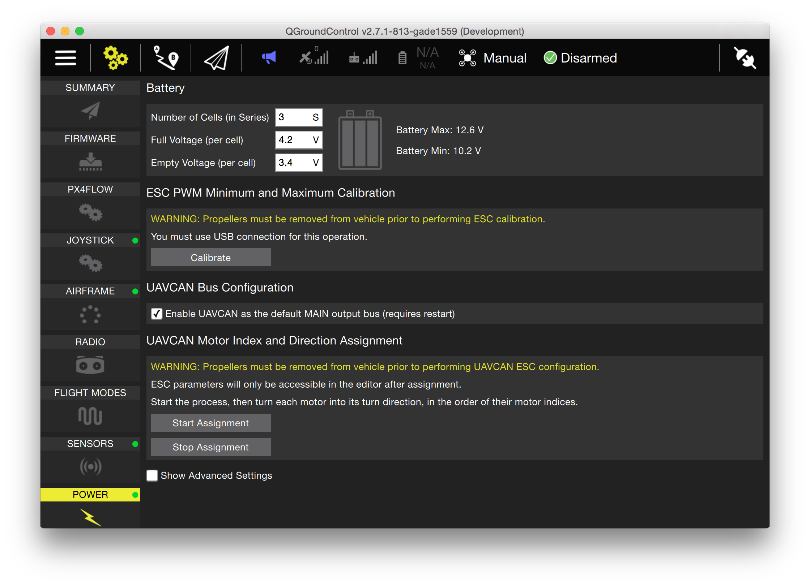

# UAVCAN 기수 부여 및 설정

[QGroundControl](../qgc/README.md)을 활용하여 설정 보기로 전환하십시오. 좌측의 전원 설정을 선택하십시오. '할당 시작' 단추를 누르십시오.
:::

처음 비프음이 울린 다음에는 처음 전동 변속기의 프로펠러를 올바른 회전 방향으로  재빨리 돌리십시오. 전동 변속기는 기수를 부여할 때마다 비프음을 냅니다. [모터 맵](../airframes/airframe_reference.md)에 나타난대로 이 단계를 모든 모터 컨트롤러에 순서대로 반복하십시오.

After the first beep, turn the propeller on the first ESC swiftly into the correct turn direction. The ESCs will all beep each time one is enumerated. Repeat this step for all motor controllers in the order as shown on the [motor map](../airframes/airframe_reference.md). ESCs running the Sapog firmware will need to be rebooted after enumeration for the new enumeration ID to be applied. This step has to be performed only once and does not need to be repeated after firmware upgrades.

