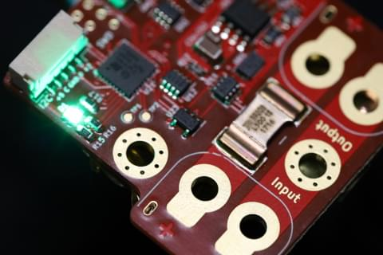
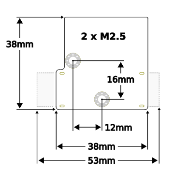

# Pomegranate 시스템 전원 모듈



고해상도 전류 통합 기능과 전력 모니터링 기능이 있는 5V/2A 전원, 단일 UAVCAN v0 CANbus 인터페이스와 RGB 상태 LED가 있는 디지털 전원 모듈.

자세한 설정과 문제 해결 정보는 [제조업체 홈 페이지](https://p-systems.io/product/power_module)를 참고하십시오.

## 사양

 - **입력 전압:** 6-26V \(2-6S\)
 - **최대 연속 전류:**
   - **벤치탑:** 40A
   - **강제 냉각:** 100A
 - **최대 5V 출력 전류:** 2A
 - **전압 해상도:** 0.04 ΔV
 - **전류 해상도:**
   - **기본/배터리 버스:** 0.02 ΔA
   - **5V 버스:** 0.001 ΔA
 - **CANbus 종단:** 전자 (기본값)
 - **MCU:** STM32 F302K8U
 - **펨웨어:** [오픈 소스](https://bitbucket.org/p-systems/firmware/)
 - **전기 인터페이스:**
   - **전원:** 솔더 패드 또는 XT60PW (직각, 보드 장착 커넥터)
   - **CANbus** 듀얼 JST GH-4 (표준 UAVCAN 마이크로 커넥터)
   - **I2C / 직렬:** JST GH-5
   - **5V 출력:** 솔더 패드 또는 CANbus / I2C 커넥터
 - **장치 질량:**
   - **커넥터 제외:** 9g
   - **XT60PW 커넥터 포함:** 16g


 

## 설정

 1. [UAVCAN_ENABLE](../advanced_config/parameter_reference.md#UAVCAN_ENABLE) 매개변수를 `2` (센서 자동 구성) 또는 `3`으로 설정하여 UAVCAN을 활성화합니다.
 2. [Mavlink 콘솔](https://docs.qgroundcontrol.com/en/analyze_view/mavlink_console.html)을 사용하여 다음 모듈의 매개변수를 설정합니다.
    * 배터리 용량 (mAh): `battery_capacity_mAh`
    * *full* 일 때 배터리 전압: `battery_full_V`
    * *비어있을 때* 배터리 전압 : `battery_empty_V`
    * 현재 통합 켜기: `enable_current_track`
    * (선택 사항) CANbus 종단 저항 끄기: `enable_can_term`

**예:** `5000mAh` 용량의 `3S` LiPo에 연결된 UAVCAN 노드 ID가 `125` 인 전원 모듈을 아래의 명령으로 설정할 수 있습니다.

```
uavcan param set 125 battery_capacity_mAh 5000
uavcan param set 125 battery_full_V 12.5
uavcan param set 125 battery_empty_V 11.2
uavcan param set 125 enable_current_track 1
uavcan param save 125
```

전체 매개변수 목록은 [장치 설정 페이지](https://p-systems.io/product/power_module/configuration)를 참고하십시오.
