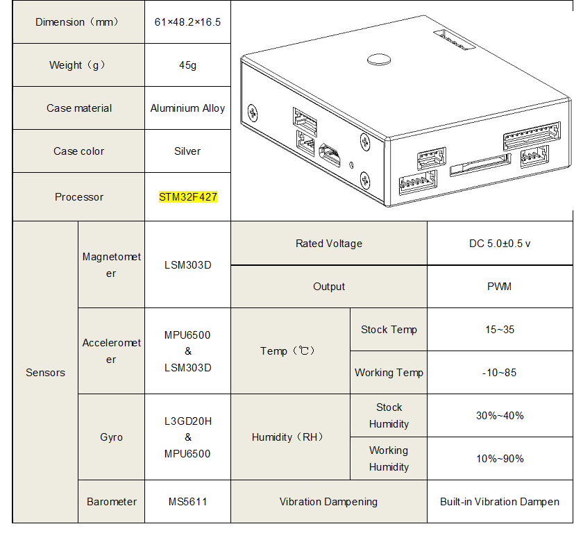

# MindPX 하드웨어

MindPX 시리즈는 AirMind에서 만들었습니다. http://mindpx.net 를 참고하세요.

## 간략 요약

> **Note** 메인 하드웨어 문서는 [여기](http://mindpx.net/assets/accessories/Specification9.18_3_pdf.pdf)를 참고하세요.

MindPX는 Pixhawk에서 브랜치한 차세대 autopilot 시스템으로 회로도와 구조를 개선하고 무인비행체를 보다 스마트하고 사용하게 편리하게 하기 위해서 새로운 기능으로 개선하였습니다.

MindPX은 전체 PWM 출력 채널을 16까지 늘렸습니다. (8개 메인 출력 + 8 aux 출력) 이를 이용해서 MindPX는 보더 복잡한 VTOL 설정과 세밀한 조정을 지원합니다. FMU-V4 기반 flight controllers를 이용해서 단일 FMU로 main과 aux 출력을 구현했다는 점에서 특별한 의미가 있습니다.

* Main System-on-Chip: STM32F427
  * CPU: 32bits, 168 MHz ARM Cortex M4 with FPU
  * RAM: 256 KB SRAM
  * 2MB Flash
  * ST Micro LSM303D 14 bit accelerometer/magnetometer
  * MEAS MS5611 barometer
  * InvenSense MPU6500 integrated 6-axis sensors

  * 강조 기능 :
    * 알루미늄 합금 소재의 CNC 프레스로 만든 케이스로 밝고 튼튼함
    * 빌트인으로 분리된 추가 IMU
    * 모두 16 PWM 출력 채널 (8 main + 8 aux)
    * flow 연결을 위한 추가로 1개 I2C 포트
    * companion computer 연결을 위한 추가로 1개 USB 포트 (built-in UART-to-USB 컨버터)
    * 개발용으로 debug 포트 제공

## 바로 시작하기

### Mounting

### Wiring

### Pin

|Num.|Description|Num.|Description|
|:--:|:--:|:--:|:--:|
|1|Power|9|I2C2 (MindFLow)|
|2|Debug (refresh bootloader)|10|USB2 (Serial 2 to USB)|
|3|USB1 (refresh firmware)|11|UART4,5|
|4|Reset|12|UART1 (Telemetry)|
|5|UART3 (GPS)|13|CAN|
|6|I2C1(external compass)|14|ADC|
|7|TF card slot|15|Tricolor Light|
|8|NRF/SPI(Remote Control)|16|Looper|

### Radio Receiver

MindPX는 PPM/SBUS/DSM/DSM2/DSMX와 같이 다양한 라디오 수신기를 지원합니다.(V2.6 버전 이후) MindPX는 FrSky의 양방향 텔레메트리 D와 S.Pot를 지원합니다.

상세 Pin 다이어그램은 [사용자 가이드](http://mindpx.net/assets/accessories/UserGuide9.18_2_pdf.pdf)를 참조하세요.

### 빌드 방법

[Getting Started](../setup/getting_started.md)와 [Building the Code](../setup/building_px4.md)을 따라하세요.
그리고 MindPX에 대한 target명령은 `nuttx_mindpx-v2_default`로 다음과 같습니다 :

`make nuttx_mindpx-v2_default`

### Companion PC 연결

MindPX는 USB-TO-UART 브리지 IC가 보드에 포함되어 있습니다. micro-USB to USB type A 케이블을 사용해서 연결합니다. micro-USB 끝을 MindPX의 'OBC' 포트에 연결하고 USB type A 끝을 companion 컴퓨터에 연결합니다.

그리고 최대 BAUD rate는 px4 계열과 동일하며 최대 921600까지 지원합니다.

### 사용자 가이드

> **Note** 사용자 가이드는 [다음](http://mindpx.net/assets/accessories/UserGuide9.18_2_pdf.pdf) 링크를 참고하세요.

## 구매하기

인터넷 [AirMind Store](http://drupal.xitronet.com/?q=catalog)에서 MindRacer를 구매할 수 있습니다. Amazon이나 eBay에서도 가능합니다.

## 지원

보다 상세한 정보는 http://www.mindpx.org 에서 찾을 수 있습니다. 문의나 도움이 필요한 경우 [support@mindpx.net](mailto:support@mindpx.net)로 전달해 주세요.
