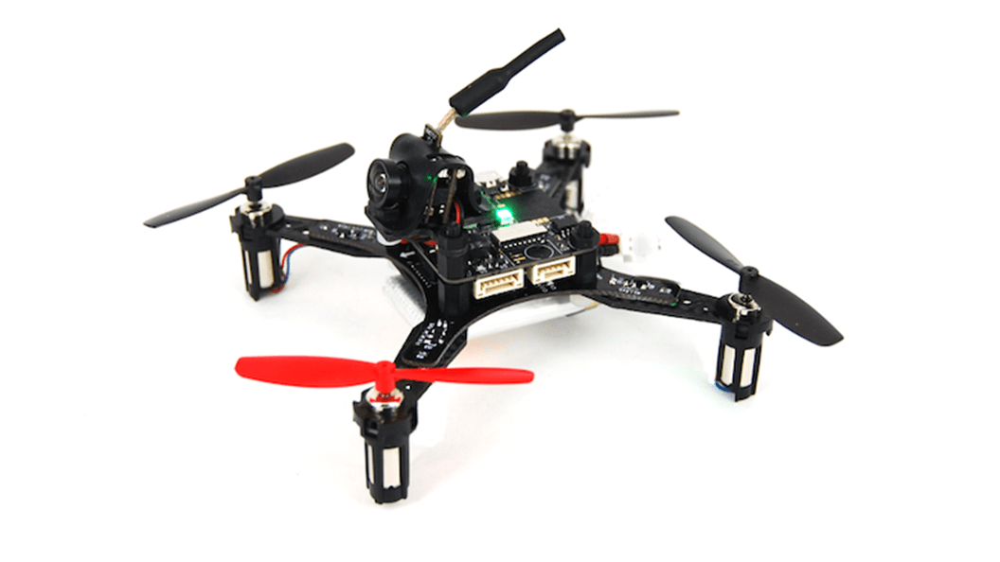

## NanoMind 110

### Summary

나노 사이즈 (110mm 대각선) RTF 쿼드 콥터로 실내 비행/레이싱용.
NanoMind는 flight controller로 MindRacer를 사용하며 PX4/MindPX 완전한 flight stack을 실행

### Highlights

1. 36g 자기무게, 최대 80g 이륙 무게
2. 6~7 분 비행시간
3. PPM/S.Bus/Specktrum DSM receiver 사용 가능
4. SEP/WEP 소켓을 사용하여 납땜 없이 기능 확장시 쌓아올리는 형태로 확장

### 사용자 가이드

> **Note** 사용자 가이드는 [여기](http://mindpx.net/assets/accessories/NanoMind_110_user_manual.pdf) 링크를 참고하세요.

### 구매하기

[AirMind Store](http://drupal.xitronet.com/?q=catalog)에서 구매할 수 있습니다. Amazon이나 eBay에서도 가능합니다.

### Support

보다 상세한 정보는 http://www.mindpx.org 에서 찾을 수 있습니다. 문의나 도움이 필요한 경우 [support@mindpx.net](mailto://support@mindpx.net)로 전달해 주세요.
