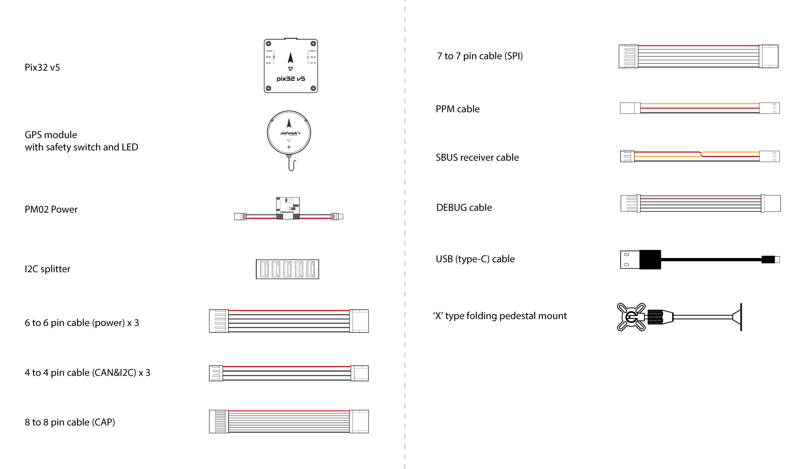
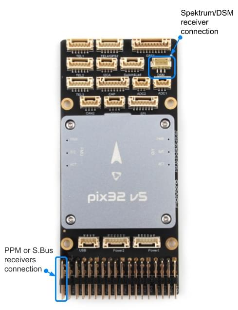

# Pix32 v5 Wiring Quick Start

:::warning PX4 does not manufacture this (or any) autopilot. Contact the [manufacturer](https://holybro.com/) for hardware support or compliance issues.
:::

This quick start guide shows how to power the [Holybro Pix32v5](../flight_controller/holybro_pix32_v5.md)&reg; flight controller and connect its most important peripherals.

## Unboxing

Pix32 v5 is sold bundled with a number of different combinations of accessories, including the _pix32 v5 Base board_, power module _PM02 V3_, and the [Holybro M8N GPS](https://holybro.com/collections/gps/products/m8n-gps) (UBLOX NEO-M8N).

The content of the box with the _PM02 V3_ power module and _Pixhawk 4 GPS/Compass_ is shown below. The box also includes a pinout guide and power module instructions, and Base board (not shown on the schematic below).

## Wiring Chart Overview

The image below shows how to connect the most important sensors and peripherals (except the motor and servo outputs). We'll go through each of these in detail in the following sections.

:::tip
More information about available ports can be found [here](https://cdn.shopify.com/s/files/1/0604/5905/7341/files/Holybro_Pix32-V5-Base-Mini-Pinouts.pdf).
:::

## Mount and Orient Controller

_Pix32 v5_ should be mounted on the frame positioned as close to your vehicle’s center of gravity as possible, oriented top-side up with the arrow pointing towards the front of the vehicle.

:::note
If the controller cannot be mounted in the recommended/default orientation (e.g. due to space constraints) you will need to configure the autopilot software with the orientation that you actually used: [Flight Controller Orientation](../config/flight_controller_orientation.md).
:::

:::tip
The board has internal vibration-isolation.
Do not use vibration-isolation foam to mount the controller (double sided tape is normally sufficient).
:::

## GPS + Compass + Buzzer + Safety Switch + LED

Pix32 v5 is designed to work well with the [Holybro M8N GPS](https://holybro.com/collections/gps/products/m8n-gps), which has an integrated compass, safety switch, buzzer and LED. It connects directly to the **GPS port** using the 10 pin cable.

The GPS/Compass should be mounted on the frame as far away from other electronics as possible, with the direction marker towards the front of the vehicle (separating the compass from other electronics will reduce interference).

:::note
The GPS module's integrated safety switch is enabled _by default_ (when enabled, PX4 will not let you arm the vehicle). To disable the safety press and hold the safety switch for 1 second. You can press the safety switch again to enable safety and disarm the vehicle (this can be useful if, for whatever reason, you are unable to disarm the vehicle from your remote control or ground station).
:::

## Power

You can use a power module or power distribution board to power motors/servos and measure power consumption. The recommended power modules are shown below.

### PM02 v3 Power Module

The [Power Module (PM02 v3)](../power_module/holybro_pm02.md) can be bundled with _pix32 v5_. It provides regulated power to flight controller and sends battery voltage/current to the flight controller.

Connect the output of the _Power Module_ as shown.

- PM voltage/current port: connect to POWER1 port (or `POWER2`) using the 6-wire GH cable supplied.
- PM input (XT60 male connector): connect to the LiPo battery (2~12S).
- PM power output (XT60 female connector): wire out to any motor ESCs.

:::note
As this power module does not include power distribution wiring, you would normally just connect all the ESCs in parallel to the power module output (the ESC must be appropriate for the supplied voltage level).
:::

:::note
The 8 pin power (+) rail of **MAIN/AUX** is not powered by the power module supply to the flight controller. If it will need to be separately powered in order to drive servos for rudders, elevons etc., the power rail needs to be connected to a BEC equipped ESC or a standalone 5V BEC or a 2S LiPo battery. Ensure the voltage of servo you are going to use is appropriate.
:::

The power module has the following characteristics/limits:

- Max input voltage: 60V
- Max current sensing: 120A Voltage
- Current measurement configured for SV ADC Switching regulator outputs 5.2V and 3A max
- Weight: 20g
- Package includes:
  - PM02 board
  - 6pin MLX cable (1)
  - 6pin GH cable (1)

### Battery Configuration

The battery/power setup must be configured in [Battery Estimation Tuning](../config/battery.md). For either Power Module you will need to configure the _Number of Cells_.

You will not need to update the _voltage divider_ unless you are using some other power module (e.g. the one from the Pixracer).

## Radio Control

A remote control (RC) radio system is required if you want to _manually_ control your vehicle (PX4 does not require a radio system for autonomous flight modes).

You will need to [select a compatible transmitter/receiver](../getting_started/rc_transmitter_receiver.md) and then _bind_ them so that they communicate (read the instructions that come with your specific transmitter/receiver).

The instructions below show how to connect the different types of receivers to _Pix32 v5_ with Baseboard:

- Spektrum/DSM receivers connect to the **DSM RC** input shown below.

  

- PPM and S.Bus receivers connect to the **SBUS_IN/PPM_IN** input port (marked as RC IN):

  

- PPM and PWM receivers that have an _individual wire for each channel_ must connect to the **PPM RC** port _via a PPM encoder_ [like this one](http://www.getfpv.com/radios/radio-accessories/holybro-ppm-encoder-module.html) (PPM-Sum receivers use a single signal wire for all channels).

For more information about selecting a radio system, receiver compatibility, and binding your transmitter/receiver pair, see: [Remote Control Transmitters & Receivers](../getting_started/rc_transmitter_receiver.md).

## Telemetry Radios (Optional)

Telemetry radios may be used to communicate and control a vehicle in flight from a ground station (for example, you can direct the UAV to a particular position, or upload a new mission).

The vehicle-based radio should be connected to the **TELEM1** port as shown below (if connected to this port, no further configuration is required). The other radio is connected to your ground station computer or mobile device (usually by USB).

## SD Card (Optional)

SD cards are most commonly used to [log and analyse flight details](../getting_started/flight_reporting.md). A micro SD card should come preinstalled on the pix32 v5, if you have your own micro SD card, insert the card into _pix32 v5_ as shown below.

:::tip
The SanDisk Extreme U3 32GB is [highly recommended](../dev_log/logging.md#sd-cards).
:::

## Motors

Motors/servos control signals are connected to the **I/O PWM OUT** (**MAIN**) and **FMU PWM OUT** (**AUX**) ports in the order specified for your vehicle in the [Airframe Reference](../airframes/airframe_reference.md).

The motors must be separately [powered](#power).

:::note
If your frame is not listed in the airframe reference then use a "generic" airframe of the correct type.
:::

## Other Peripherals

The wiring and configuration of optional/less common components is covered within the topics for individual [peripherals](../peripherals/README.md).

## Pinouts

[Pix32 v5 Pinouts](https://cdn.shopify.com/s/files/1/0604/5905/7341/files/Holybro_Pix32-V5-Base-Mini-Pinouts.pdf) (Holybro)

## Configuration

General configuration information is covered in: [Autopilot Configuration](../config/README.md).

QuadPlane specific configuration is covered here: [QuadPlane VTOL Configuration](../config_vtol/vtol_quad_configuration.md)

<!-- Nice to have detailed wiring infographic and instructions for different vehicle types. -->

## Further information

- [Pix32 v5 Overview](../flight_controller/holybro_pix32_v5.md) (Overview page)
- [Pix32 v5 Technical Data Sheet](https://cdn.shopify.com/s/files/1/0604/5905/7341/files/Holybro_PIX32-V5_technical_data_sheet_v1.1.pdf)
- [Pix32 v5 Pinouts](https://cdn.shopify.com/s/files/1/0604/5905/7341/files/Holybro_Pix32-V5-Base-Mini-Pinouts.pdf)
- [Pix32 v5 Base Schematic Diagram](https://cdn.shopify.com/s/files/1/0604/5905/7341/files/Holybro_PIX32-V5-BASE-Schematic_diagram.pdf)
- [Pix32 v5 Base Components Layout](https://holybro.com/manual/Holybro_PIX32-V5-BASE-ComponentsLayout.pdf)
- [FMUv5 reference design pinout](https://docs.google.com/spreadsheets/d/1-n0__BYDedQrc_2NHqBenG1DNepAgnHpSGglke-QQwY/edit#gid=912976165).
