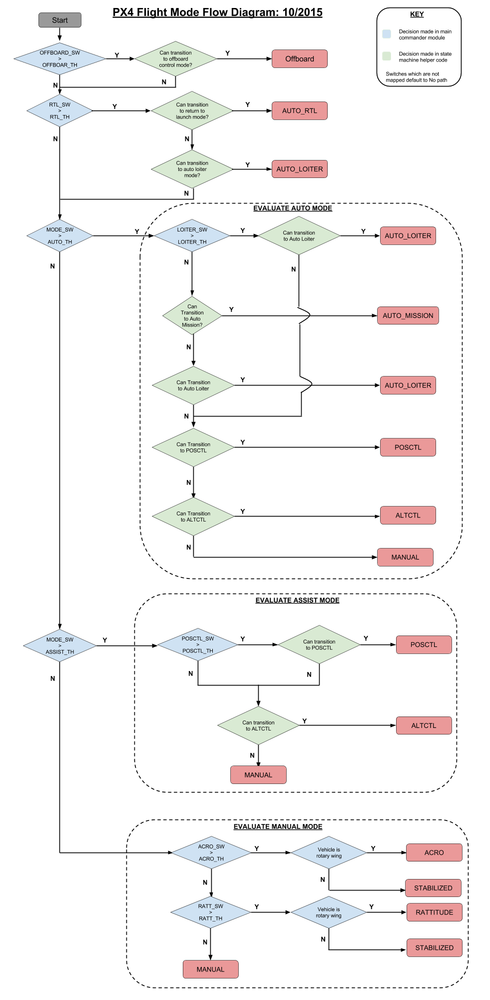

# Flight Modes

*Flight Modes* define how the autopilot responds to user input and controls vehicle movement. They are loosely grouped into *manual*, *assisted* and *auto* modes, based on the level/type of control provided by the autopilot. The pilot transitions between flight modes using switches on the remote control or with a ground control station.

Not all flight modes are available on all vehicle types, and some modes behave differently on different vehicle types (as described below). Finally, some flight modes make sense only under specific pre-flight and in-flight conditions (e.g. GPS lock). The system will not allow transitions to those modes until the right conditions are met.

The sections below provide an overview of the modes, followed by a [flight mode evaluation diagram](#flight-mode-evaluation-diagram) that shows the conditions under which PX4 will transition into a new mode.

:::note
User-facing flight mode documentation can be found in:
- [Getting Started > Flight Modes](../getting_started/flight_modes.md): Beginner friendly explanation of all flight modes.
- [Flying > Flight Modes](../flight_modes/README.md): Detailed documentation of each mode.
:::

## Flight Mode Summary

### Manual Flight Modes

"Manual" modes are those where the user has direct control over the vehicle via the RC control (or joystick). Vehicle movement always follows stick movement, but the level/type of response changes depending on the mode. For example, experienced fliers can use modes that provide direct passthrough of stick positions to actuators, while beginners will often choose modes that are less responsive to sudden stick-position changes.

- **Rovers / Boats:**
  * **MANUAL/STABILIZED/ACRO:** The pilot's control inputs (raw user inputs from RC transmitter) are passed directly to control allocation.

- **Fixed-wing aircraft:**

  - **MANUAL:** The pilot's control inputs (raw user inputs from RC transmitter) are passed directly to control allocation.
  - **STABILIZED:** The pilot's pitch and roll inputs are passed as angle commands to the autopilot, while the yaw input is sent directly via control allocation to the rudder (manual control). If the RC roll and pitch sticks are centered, the autopilot regulates the roll and pitch angles to zero, hence stabilizing (leveling-out) the attitude against any wind disturbances. However, in this mode the position of the aircraft is not controlled by the autopilot, hence the position can drift due to wind. With nonzero roll input the vehicle does a coordinated turn to achieve zero sideslip (the acceleration in y-direction (sidewards) is zero). During a coordinated turn, the rudder is used to control the sideslip and any manual yaw input is added to that.
  - **ACRO:** The pilot's inputs are passed as roll, pitch, and yaw *rate* commands to the autopilot. The autopilot controls the angular rates. Throttle is passed directly to control allocation.

- **Multirotors:**

  - **MANUAL/STABILIZED** The pilot's inputs are passed as roll and pitch *angle* commands and a yaw *rate* command. Throttle is passed directly to control allocation. The autopilot controls the attitude, meaning it regulates the roll and pitch angles to zero when the RC sticks are centered, consequently leveling-out the attitude. However, in this mode the position of the vehicle is not controlled by the autopilot, hence the position can drift due to wind.

    :::note
For Multirotors, Manual and Stabilized modes are the same.
:::

  - **ACRO:** The pilot's inputs are passed as roll, pitch, and yaw *rate* commands to the autopilot. The autopilot controls the angular rates, but not the attitude. Hence, if the RC sticks are centered the vehicle will not level-out. This allows the multirotor to become completely inverted. Throttle is passed directly to control allocation.

### Assisted flight modes

"Assisted" modes are also user controlled but offer some level of "automatic" assistance - for example, automatically holding position/direction, against wind. Assisted modes often make it much easier to gain or restore controlled flight.

- **ALTCTL** (Altitude Control)

  - **Fixed-wing aircraft:** When the roll, pitch and yaw (RPY) RC sticks are all centered (or less than some specified deadband range) the aircraft will return to straight and level flight and keep its current altitude. Its x and y position will drift with the wind.
  - **Multirotors:** Roll, pitch and yaw inputs are as in Stabilised mode. Throttle inputs indicate climb or sink at a predetermined maximum rate. Throttle has large deadzone. Centered Throttle holds altitude steady. The autopilot only controls altitude so the x,y position of the vehicle can drift due to wind.
- **POSCTL** (Position Control)

  - **Fixed-wing aircraft:** Neutral inputs (centered RC sticks) give level flight and it will crab against the wind if needed to maintain a straight line.
  - **Multirotors** Roll controls left-right speed, pitch controls front-back speed over ground. Yaw controls yaw rate as in MANUAL mode. Throttle controls climb/descent rate as in ALTCTL mode. This means that the x, y, z position of the vehicle is held steady by the autopilot against any wind disturbances, when the roll, pitch and throttle sticks are centered.

### Auto flight modes

"Auto" modes are those where the controller requires little to no user input (e.g. to takeoff, land and fly missions).

- **AUTO_LOITER** (Loiter)

  - **Fixed-wing aircraft:** The aircraft loiters around the current position at the current altitude (or possibly slightly above the current altitude, good for 'I'm losing it').
  - **Multirotors:**  The multirotor hovers / loiters at the current position and altitude.
- **AUTO_RTL** (Return to Launch)

  - **Fixed-wing aircraft:** The aircraft returns to the home position and loiters in a circle above the home position.
  - **Multirotors:** The multirotor returns in a straight line on the current altitude (if the current altitude is higher than the home position + [RTL_RETURN_ALT](../advanced_config/parameter_reference.md#RTL_RETURN_ALT)) or on the [RTL_RETURN_ALT](../advanced_config/parameter_reference.md#RTL_RETURN_ALT) (if the [RTL_RETURN_ALT](../advanced_config/parameter_reference.md#RTL_RETURN_ALT) is higher than the current altitude), then lands automatically.
- **AUTO_MISSION** (Mission)
  - **All system types:** The aircraft obeys the programmed mission sent by the ground control station (GCS). If no mission received, aircraft will LOITER at current position instead.
  - **_OFFBOARD_** (Offboard) In this mode the position, velocity or attitude reference / target / setpoint is provided by a companion computer connected via serial cable and MAVLink. The offboard setpoint can be provided by APIs like [MAVSDK](http://mavsdk.mavlink.io) or [MAVROS](https://github.com/mavlink/mavros).

## Flight Mode Evaluation Diagram

