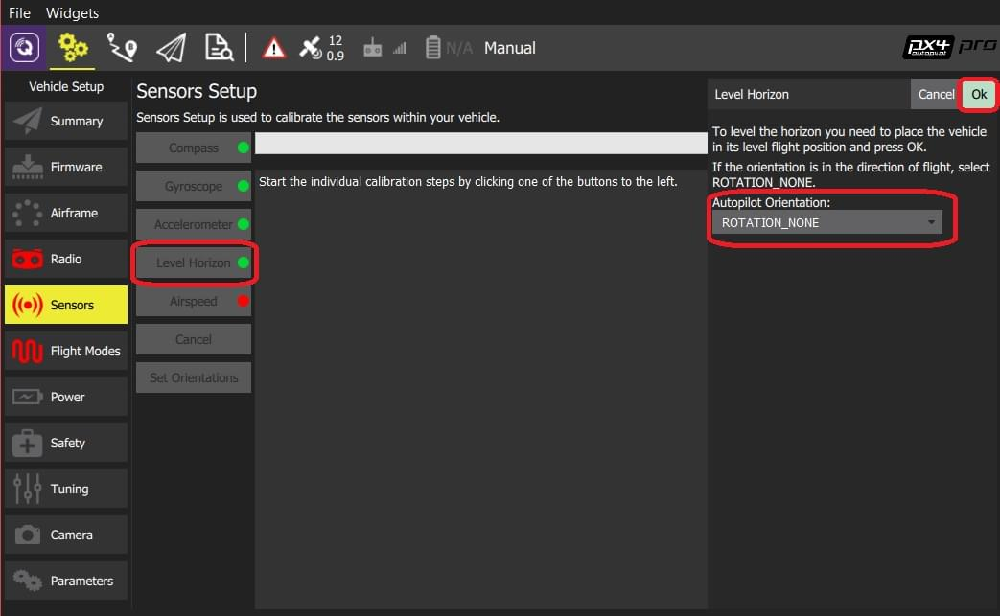

# Level Horizon Calibration

You can use *Level Horizon Calibration* to compensate for small miss-alignments in controller orientation and to level the horizon in the *QGroundControl* flight view (blue on top and green on bottom).

:::tip
Leveling the horizon is highly recommended, and will result in the best flight performance.
This process can also be repeated if you notice a constant drift during flight.
:::

## Performing the Calibration

To level the horizon:

1. Start *QGroundControl* and connect the vehicle.
1. Select the **Gear** icon (Vehicle Setup) in the top toolbar and then **Sensors** in the sidebar.
1. Click the **Level Horizon** button.  :::note You should already have set the [Autopilot Orientation](../config/flight_controller_orientation.md). If not, you can also set it here. :::
1. Place the vehicle in its level flight orientation on a level surface:
  * For planes this is the position during level flight (planes tend to have their wings slightly pitched up!)
  * For copters this is the hover position.
1. Press **OK** to start the calibration process.
1. Wait until the calibration process is finished.

## Verification

After the orientation is set and level-horizon calibration is complete, check in the flight view that the heading in the compass shows a value around 0 when you point the vehicle towards north and that the horizon is level (blue on top and green on bottom).

## Further Information

* [Advanced Orientation Tuning](../advanced_config/advanced_flight_controller_orientation_leveling.md) (advanced users only).
* [QGroundControl User Guide > Sensors](https://docs.qgroundcontrol.com/en/SetupView/sensors_px4.html#level-horizon)
* [PX4 Setup Video "Gyroscope" - @1m14s](https://youtu.be/91VGmdSlbo4?t=1m14s) (Youtube)
