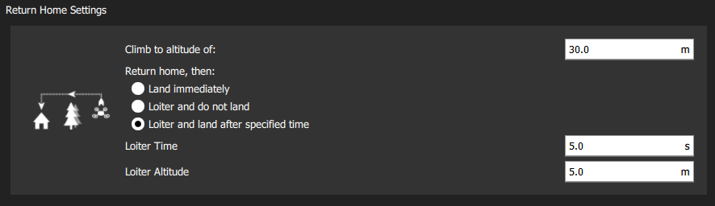

# Safety Configuration (Failsafes)

PX4 has a number of safety features to protect and recover your vehicle if something goes wrong:

* *Failsafes* allow you to specify areas and conditions under which you can safely fly, and the [action](#failsafe_actions) that will be performed if a failsafe is triggered (for example, landing, holding position, or returning to a specified point). The most important failsafe settings are configured in the *QGroundControl* [Safety Setup](#qgc_safety_setup) page. Others must be configured via [parameters](#failsafe_other).
* [Safety switches](#safety_switch) on the remote control can be used to immediately stop motors or return the vehicle in the event of a problem.

## Failsafe Actions

Each failsafe defines its own set of actions. Some of the more common failsafe actions are:

| Action                                                                                  | Description                                                                                                                                                                                                                                                                                                                                                                                                                   |
| --------------------------------------------------------------------------------------- | ----------------------------------------------------------------------------------------------------------------------------------------------------------------------------------------------------------------------------------------------------------------------------------------------------------------------------------------------------------------------------------------------------------------------------- |
| None/Disabled                                                  | No action (the failsafe will be ignored).                                                                                                                                                                                                                                                                                                                                                                                     |
| Warning                                                        | A warning message will be sent to *QGroundControl*.                                                                                                                                                                                                                                                                                                                                                                           |
| [Hold mode](../flight_modes/hold.md)                           | The vehicle will enter *Hold mode*. For multicopters this means the vehicle will hover, while for fixed/wing the vehicle will circle.                                                                                                                                                                                                                                                                                         |
| [Return mode](../flight_modes/return.md)                       | The vehicle will enter *Return mode*. Return behaviour can be set in the [Return Home Settings](#return_settings) (below).                                                                                                                                                                                                                                                                                                    |
| [Land mode](../flight_modes/land.md)                           | The vehicle will enter *Land mode*, and lands immediately.                                                                                                                                                                                                                                                                                                                                                                    |
| [Flight termination](../advanced_config/flight_termination.md) | Turns off all controllers and sets all PWM outputs to their failsafe values (e.g. [PWM_MAIN_FAILn](../advanced_config/parameter_reference.md#PWM_MAIN_FAIL1), [PWM_AUX_FAILn](../advanced_config/parameter_reference.md#PWM_AUX_FAIL1)). The failsafe outputs can be used to deploy a parachute, landing gear or perform another operation. For a fixed-wing vehicle this might allow you to glide the vehicle to safety. |
| Lockdown                                                       | Kills the motors (sets them to disarmed). This is the same as using the [kill switch](#kill_switch).                                                                                                                                                                                                                                                                                                                          |

:::note
It is possible to recover from a failsafe action (if the cause is fixed) by switching modes. For example, in the case where RC Loss failsafe causes the vehicle to enter *Return mode*, if RC is recovered you can change to *Position mode* and continue flying.
:::

:::note
If a failsafe occurs while the vehicle is responding to another failsafe (e.g. Low battery while in Return mode due to RC Loss), the specified failsafe action for the second trigger is ignored. Instead the action is determined by separate system level and vehicle specific code. This might result in the vehicle being changed to a manual mode so the user can directly manage recovery.
:::

## QGroundControl Safety Setup

The *QGroundControl* Safety Setup page is accessed by clicking the *QGroundControl* **Gear** icon (Vehicle Setup - top toolbar) and then **Safety** in the sidebar). This includes the most important failsafe settings (battery, RC loss etc.) and the settings for the return actions *Return* and *Land*.

### Low Battery Failsafe

The low battery failsafe is triggered when the battery capacity drops below one (or more warning) level values.

The most common configuration is to set the values and action as above (with `Warn > Failsafe > Emergency`). With this configuration the failsafe will trigger warning, then return, and finally landing if capacity drops below the respective levels.

It is also possible to set the *Failsafe Action* to warn, return, or land when the [Battery Failsafe Level](#BAT_CRIT_THR) failsafe level is reached.

The settings and underlying parameters are shown below.

| Setting                                         | Parameter                                                                      | Description                                                                                                                                                               |
| ----------------------------------------------- | ------------------------------------------------------------------------------ | ------------------------------------------------------------------------------------------------------------------------------------------------------------------------- |
| Failsafe Action                                 | [COM_LOW_BAT_ACT](../advanced_config/parameter_reference.md#COM_LOW_BAT_ACT) | Warn, Return, or Land based when capacity drops below [Battery Failsafe Level](#BAT_CRIT_THR), OR Warn, then return, then land based on each of the level settings below. |
| Battery Warn Level                              | [BAT_LOW_THR](../advanced_config/parameter_reference.md#BAT_LOW_THR)         | Percentage capacity for warnings (or other actions).                                                                                                                      |
| Battery Failsafe Level | [BAT_CRIT_THR](../advanced_config/parameter_reference.md#BAT_CRIT_THR)       | Percentage capacity for Return action (or other actions if a single action selected).                                                                                     |
| Battery Emergency Level                         | [BAT_EMERGEN_THR](../advanced_config/parameter_reference.md#BAT_EMERGEN_THR) | Percentage capacity for triggering Land (immediately) action.                                                                                                             |

### RC Loss Failsafe

The RC Loss failsafe is triggered if the RC transmitter link is lost *in manual modes* (RC loss does not trigger the failsafe in automatic modes - e.g. during missions).

:::note PX4 and the receiver may also need to be configured in order to *detect RC loss*: [Radio Setup > RC Loss Detection](../config/radio.md#rc_loss_detection).
:::

The settings and underlying parameters are shown below.

| Setting         | Parameter                                                                  | Description                                                                     |
| --------------- | -------------------------------------------------------------------------- | ------------------------------------------------------------------------------- |
| RC Loss Timeout | [COM_RC_LOSS_T](../advanced_config/parameter_reference.md#COM_RC_LOSS_T) | Amount of time after losing the RC connection before the failsafe will trigger. |
| Failsafe Action | [NAV_RCL_ACT](../advanced_config/parameter_reference.md#NAV_RCL_ACT)     | Disabled, Loiter, Return, Land, Terminate, Lockdown.                            |

### Data Link Loss Failsafe

The Data Link Loss failsafe is triggered if a telemetry link (connection to ground station) is lost when flying a [mission](../flying/missions.md).

The settings and underlying parameters are shown below.

| Setting                | Parameter                                                                  | Description                                                                       |
| ---------------------- | -------------------------------------------------------------------------- | --------------------------------------------------------------------------------- |
| Data Link Loss Timeout | [COM_DL_LOSS_T](../advanced_config/parameter_reference.md#COM_DL_LOSS_T) | Amount of time after losing the data connection before the failsafe will trigger. |
| Failsafe Action        | [NAV_DLL_ACT](../advanced_config/parameter_reference.md#NAV_DLL_ACT)     | Disabled, Hold mode, Return mode, Land mode, Terminate, Lockdown.                 |

### Geofence Failsafe

The *Geofence Failsafe* is a "virtual" cylinder centered around the home position. If the vehicle moves outside the radius or above the altitude the specified *Failsafe Action* will trigger.

:::tip PX4 separately supports more complicated GeoFence geometries with multiple arbitrary polygonal and circular inclusion and exclusion areas: [Flying > GeoFence](../flying/geofence.md).
:::

The settings and underlying [geofence parameters](../advanced_config/parameter_reference.md#geofence) are shown below.

| Setting          | Parameter                                                                      | Description                                                     |
| ---------------- | ------------------------------------------------------------------------------ | --------------------------------------------------------------- |
| Action on breach | [GF_ACTION](../advanced_config/parameter_reference.md#GF_ACTION)               | None, Warning, Hold mode, Return mode, Terminate, Land.         |
| Max Radius       | [GF_MAX_HOR_DIST](../advanced_config/parameter_reference.md#GF_MAX_HOR_DIST) | Horizontal radius of geofence cylinder. Geofence disabled if 0. |
| Max Altitude     | [GF_MAX_VER_DIST](../advanced_config/parameter_reference.md#GF_MAX_VER_DIST) | Height of geofence cylinder. Geofence disabled if 0.            |

:::note
Setting `GF_ACTION` to terminate will kill the vehicle on violation of the fence. Due to the inherent danger of this, this function is disabled using [CBRK_FLIGHTTERM](#CBRK_FLIGHTTERM), which needs to be reset to 0 to really shut down the system.
:::

The following settings also apply, but are not displayed in the QGC UI.

| Setting                                                          | Parameter                                                                    | Description                                                                                                           |
| ---------------------------------------------------------------- | ---------------------------------------------------------------------------- | --------------------------------------------------------------------------------------------------------------------- |
| Geofence altitude mode                                           | [GF_ALTMODE](../advanced_config/parameter_reference.md#GF_ALTMODE)           | Altitude reference used: 0 = WGS84, 1 = AMSL.                                                                         |
| Geofence counter limit                                           | [GF_COUNT](../advanced_config/parameter_reference.md#GF_COUNT)               | Set how many subsequent position measurements outside of the fence are needed before geofence violation is triggered. |
| Geofence source                                                  | [GF_SOURCE](../advanced_config/parameter_reference.md#GF_SOURCE)             | Set whether position source is estimated global position or direct from the GPS device.                               |
| Circuit breaker for flight termination | [CBRK_FLIGHTTERM](../advanced_config/parameter_reference.md#CBRK_FLIGHTTERM) | Enables/Disables flight termination action (disabled by default).                                                     |

### Return Mode Settings

*Return* is a common [failsafe action](#failsafe_actions) that engages [Return mode](../flight_modes/return.md) to return the vehicle to the home position. This section shows how to set the land/loiter behaviour after returning.

The settings and underlying parameters are shown below:

| Setting           | Parameter                                                                      | Description                                                                                            |
| ----------------- | ------------------------------------------------------------------------------ | ------------------------------------------------------------------------------------------------------ |
| Climb to altitude | [RTL_RETURN_ALT](../advanced_config/parameter_reference.md#RTL_RETURN_ALT)   | Vehicle ascend to this minimum height (if below it) for the return flight.                             |
| Return behaviour  |                                                                                | Choice list of *Return then*: Land, Loiter and do not land, or Loiter and land after a specified time. |
| Loiter Altitude   | [RTL_DESCEND_ALT](../advanced_config/parameter_reference.md#RTL_DESCEND_ALT) | If return with loiter is selected you can also specify the altitude at which the vehicle hold.         |
| Loiter Time       | [RTL_LAND_DELAY](../advanced_config/parameter_reference.md#RTL_LAND_DELAY)   | If return with loiter then land is selected you can also specify how long the vehicle will hold.       |

:::note
The return behavour is defined by [RTL_LAND_DELAY](../advanced_config/parameter_reference.md#RTL_LAND_DELAY). If negative the vehicle will land immediately. Additional information can be found in [Return mode](../flight_modes/return.md).
:::

### Land Mode Settings

*Land at the current position* is a common [failsafe action](#failsafe_actions) that engages [Land Mode](../flight_modes/land.md). This section shows how to control when and if the vehicle automatically disarms after landing. For Multicopters (only) you can additionally set the descent rate.

The settings and underlying parameters are shown below:

| Setting              | Parameter                                                                      | Description                                                                                                                          |
| -------------------- | ------------------------------------------------------------------------------ | ------------------------------------------------------------------------------------------------------------------------------------ |
| Disarm After         | [COM_DISARM_LAND](../advanced_config/parameter_reference.md#COM_DISARM_LAND) | Select checkbox to specify that the vehicle will disarm after landing. The value must be non-zero but can be a fraction of a second. |
| Landing Descent Rate | [MPC_LAND_SPEED](../advanced_config/parameter_reference.md#MPC_LAND_SPEED)   | Rate of descent (MC only).                                                                                                           |

## Other Failsafe Settings

This section contains information about failsafe settings that cannot be configured through the *QGroundControl* [Safety Setup](#qgc_safety_setup) page.

### Position (GPS) Loss Failsafe

The *Position Loss Failsafe* is triggered if the quality of the PX4 position estimate falls below acceptable levels (this might be caused by GPS loss) while in a mode that requires an acceptable position estimate.

The failure action is controlled by [COM_POSCTL_NAVL](../advanced_config/parameter_reference.md#COM_POSCTL_NAVL), based on whether RC control is assumed to be available (and altitude information):

* `0`: Remote control available. Switch to *Altitude mode* if a height estimate is available, otherwise *Stabilized mode*.
* `1`: Remote control *not* available. Switch to *Land mode* if a height estimate is available, otherwise enter flight termination.

Fixed Wing vehicles additionally have a parameter ([NAV_GPSF_LT](../advanced_config/parameter_reference.md#NAV_GPSF_LT)) for defining how long they will loiter (circle) after losing position before attempting to land.

The relevant parameters for all vehicles shown below (also see [GPS Failure navigation parameters](../advanced_config/parameter_reference.md#gps-failure-navigation)):

| Parameter                                                                        | Description                                                                                               |
| -------------------------------------------------------------------------------- | --------------------------------------------------------------------------------------------------------- |
| [COM_POS_FS_DELAY](../advanced_config/parameter_reference.md#COM_POS_FS_DELAY) | Delay after loss of position before the failsafe is triggered.                                            |
| [COM_POSCTL_NAVL](../advanced_config/parameter_reference.md#COM_POSCTL_NAVL)   | Position control navigation loss response during mission. Values: 0 - assume use of RC, 1 - Assume no RC. |
| [CBRK_VELPOSERR](../advanced_config/parameter_reference.md#CBRK_VELPOSERR)       | Circuit breaker for position error check (disables error checks in all modes).                            |

Parameters that only affect Fixed Wing vehicles:

| Parameter                                                              | Description                                                                                         |
| ---------------------------------------------------------------------- | --------------------------------------------------------------------------------------------------- |
| [NAV_GPSF_LT](../advanced_config/parameter_reference.md#NAV_GPSF_LT) | Loiter time (waiting for GPS recovery before it goes into flight termination). Set to 0 to disable. |
| [NAV_GPSF_P](../advanced_config/parameter_reference.md#NAV_GPSF_P)   | Fixed pitch angle while circling.                                                                   |
| [NAV_GPSF_R](../advanced_config/parameter_reference.md#NAV_GPSF_R)   | Fixed roll/bank angle while circling.                                                               |
| [NAV_GPSF_TR](../advanced_config/parameter_reference.md#NAV_GPSF_TR) | Thrust while circling.                                                                              |

### Offboard Loss Failsafe

The *Offboard Loss Failsafe* is triggered if the offboard link is lost while under Offboard control. Different failsafe behaviour can be specified based on whether or not there is also an RC connection available.

The relevant parameters are shown below:

| Parameter                                                                    | Description                                                                                                       |
| ---------------------------------------------------------------------------- | ----------------------------------------------------------------------------------------------------------------- |
| [COM_OF_LOSS_T](../advanced_config/parameter_reference.md#COM_OF_LOSS_T)   | Delay after loss of offboard connection before the failsafe is triggered.                                         |
| [COM_OBL_ACT](../advanced_config/parameter_reference.md#COM_OBL_ACT)       | Failsafe action if no RC is available: Land mode, Hold mode, Return mode.                                         |
| [COM_OBL_RC_ACT](../advanced_config/parameter_reference.md#COM_OBL_RC_ACT) | Failsafe action if RC is available: Position mode, Altitude mode, Manual mode, Return mode, Land mode, Hold mode. |

### Mission Failsafe

The Mission Failsafe checks prevent a previous mission being started at a new takeoff location or if it is too big (distance between waypoints is too great). The failsafe action is that the mission will not be run.

The relevant parameters are shown below:

| Parameter                                                                | Description                                                                                                                                     |
| ------------------------------------------------------------------------ | ----------------------------------------------------------------------------------------------------------------------------------------------- |
| [MIS_DIST_1WP](../advanced_config/parameter_reference.md#MIS_DIST_1WP) | The mission will not be started if the current waypoint is more distant than this value from the home position. Disabled if value is 0 or less. |
| [MIS_DIST_WPS](../advanced_config/parameter_reference.md#MIS_DIST_WPS) | The mission will not be started if any distance between two subsequent waypoints is greater than this value.                                    |

### Traffic Avoidance Failsafe

The Traffic Avoidance Failsafe allows PX4 to respond to transponder data (e.g. from [ADSB transponders](../advanced_features/traffic_avoidance_adsb.md)) during missions.

The relevant parameters are shown below:

| Parameter                                                                      | Description                                                      |
| ------------------------------------------------------------------------------ | ---------------------------------------------------------------- |
| [NAV_TRAFF_AVOID](../advanced_config/parameter_reference.md#NAV_TRAFF_AVOID) | Set the failsafe action: Disabled, Warn, Return mode, Land mode. |

### Adaptive QuadChute Failsafe

Failsafe for when a pusher motor fails (or airspeed sensor) and a VTOL vehicle can no longer achieve a desired altitude setpoint in fixed-wing mode. If triggered, the vehicle will transition to multicopter mode and enter failsafe [Return mode](../flight_modes/return.md).

:::note
You can pause *Return mode* and transition back to fixed wing if desired. Note that if the condition that caused the failsafe still exists, it may trigger again!
:::

The relevant parameters are shown below:

| Parameter                                                                  | Description                                                                                                                                                                                       |
| -------------------------------------------------------------------------- | ------------------------------------------------------------------------------------------------------------------------------------------------------------------------------------------------- |
| [VT_FW_ALT_ERR](../advanced_config/parameter_reference.md#VT_FW_ALT_ERR) | Maximum negative altitude error for fixed wing flight. If the altitude drops more than this value below the altitude setpoint the vehicle will transition back to MC mode and enter failsafe RTL. |

## Failure Detector

The failure detector allows a vehicle to take protective action(s) if it unexpectedly flips, or if it is notified by an external failure detection system.

During **flight**, the failure detector can be used to trigger [flight termination](../advanced_config/flight_termination.md) if failure conditions are met, which may then launch a [parachute](../peripherals/parachute.md) or perform some other action.

:::note
Failure detection during flight is deactivated by default (enable by setting the parameter: [CBRK_FLIGHTTERM=0](#CBRK_FLIGHTTERM)).
:::

During **takeoff** the failure detector [attitude trigger](#attitude_trigger) invokes the [lockdown action](#action_lockdown) if the vehicle flips (lockdown kills the motors but, unlike flight termination, will not launch a parachute or perform other failure actions). Note that this check is *always enabled on takeoff*, irrespective of the `CBRK_FLIGHTTERM` parameter.

The failure detector is active in all vehicle types and modes, except for those where the vehicle is *expected* to do flips (i.e. [Acro mode (MC)](../flight_modes/altitude_mc.md), [Acro mode (FW)](../flight_modes/altitude_fw.md), and [Manual (FW)](../flight_modes/manual_fw.md)).

### Attitude Trigger

The failure detector can be configured to trigger if the vehicle attitude exceeds predefined pitch and roll values for longer than a specified time.

The relevant parameters are shown below:

| Parameter                                                                                              | Description                                                                                                                      |
| ------------------------------------------------------------------------------------------------------ | -------------------------------------------------------------------------------------------------------------------------------- |
| [CBRK_FLIGHTTERM](../advanced_config/parameter_reference.md#CBRK_FLIGHTTERM) | Flight termination circuit breaker. Unset from 121212 (default) to enable flight termination due to FailureDetector or FMU loss. |
| [FD_FAIL_P](../advanced_config/parameter_reference.md#FD_FAIL_P)           | Maximum allowed pitch (in degrees).                                                                                              |
| [FD_FAIL_R](../advanced_config/parameter_reference.md#FD_FAIL_R)           | Maximum allowed roll (in degrees).                                                                                               |
| [FD_FAIL_P_TTRI](../advanced_config/parameter_reference.md#FD_FAIL_P_TTRI) | Time to exceed [FD_FAIL_P](#FD_FAIL_P) for failure detection (default 0.3s).                                                   |
| [FD_FAIL_R_TTRI](../advanced_config/parameter_reference.md#FD_FAIL_R_TTRI) | Time to exceed [FD_FAIL_R](#FD_FAIL_R) for failure detection (default 0.3s).                                                   |

### External Automatic Trigger System (ATS)

The [failure detector](#failure_detector), if [enabled](#CBRK_FLIGHTTERM), can also be triggered by an external ATS system. The external trigger system must be connected to flight controller port AUX5 (or MAIN5 on boards that do not have AUX ports), and is configured using the parameters below.

:::note
External ATS is required by [ASTM F3322-18](https://webstore.ansi.org/Standards/ASTM/ASTMF332218). One example of an ATS device is the [FruityChutes Sentinel Automatic Trigger System](https://fruitychutes.com/uav_rpv_drone_recovery_parachutes/sentinel-automatic-trigger-system.htm).
:::

| Parameter                                                                                                | Description                                                                                                                                      |
| -------------------------------------------------------------------------------------------------------- | ------------------------------------------------------------------------------------------------------------------------------------------------ |
| [FD_EXT_ATS_EN](../advanced_config/parameter_reference.md#FD_EXT_ATS_EN)     | Enable PWM input on AUX5 or MAIN5 (depending on board) for engaging failsafe from an external automatic trigger system (ATS). Default: Disabled. |
| [FD_EXT_ATS_TRIG](../advanced_config/parameter_reference.md#FD_EXT_ATS_TRIG) | The PWM threshold from external automatic trigger system for engaging failsafe. Default: 1900 ms.                                                |

## Emergency Switches

Remote control switches can be configured (as part of *QGroundControl* [Flight Mode Setup](../config/flight_mode.md)) to allow you to take rapid corrective action in the event of a problem or emergency; for example, to stop all motors, or activate [Return mode](#return_switch).

This section lists the available emergency switches.

### Kill Switch

A kill switch immediately stops all motor outputs (and if flying, the vehicle will start to fall)! The motors will restart if the switch is reverted within 5 seconds. After 5 seconds the vehicle will automatically disarm; you will need to arm it again in order to start the motors.

### Arm/Disarm Switch

The arm/disarm switch is a *direct replacement* for the default stick-based arming/disarming mechanism (and serves the same purpose: making sure there is an intentional step involved before the motors start/stop). It might be used in preference to the default mechanism because:

* Of a preference of a switch over a stick motion.
* It avoids accidentally triggering arming/disarming in-air with a certain stick motion.
* There is no delay (it reacts immediately).

The arm/disarm switch immediately disarms (stop) motors for those [flight modes](../getting_started/flight_modes.md) that *support disarming in flight*. This includes:

* *Manual mode*
* *Acro mode*
* *Stabilized*

For modes that do not support disarming in flight, the switch is ignored during flight, but may be used after landing is detected. This includes *Position mode* and autonomous modes (e.g. *Mission*, *Land* etc.).

:::note
[Auto disarm timeouts](#auto-disarming-timeouts) (e.g. via [COM_DISARM_LAND](#COM_DISARM_LAND)) are independent of the arm/disarm switch - ie even if the switch is armed the timeouts will still work.
:::

<!--
**Note** This can also be done by [manually setting](../advanced_config/parameters.md) the [RC_MAP_ARM_SW](../advanced_config/parameter_reference.md#RC_MAP_ARM_SW) parameter to the corresponding switch RC channel.
  If the switch positions are reversed, change the sign of the parameter [RC_ARMSWITCH_TH](../advanced_config/parameter_reference.md#RC_ARMSWITCH_TH) (or also change its value to alter the threshold value).
-->

### Return Switch

A return switch can be used to immediately engage [Return mode](../flight_modes/return.md).

## Other Safety Settings

### Auto-disarming Timeouts

You can set timeouts to automatically disarm a vehicle if it is too slow to takeoff, and/or after landing (disarming the vehicle removes power to the motors, so the propellers won't spin).

The [relevant parameters](../advanced_config/parameters.md) are shown below:

| Parameter                                                                                                  | Description                                                |
| ---------------------------------------------------------------------------------------------------------- | ---------------------------------------------------------- |
| [COM_DISARM_LAND](../advanced_config/parameter_reference.md#COM_DISARM_LAND)   | Timeout for auto-disarm after landing.                     |
| [COM_DISARM_PRFLT](../advanced_config/parameter_reference.md#COM_DISARM_PRFLT) | Timeout for auto disarm if vehicle is too slow to takeoff. |

## Further Information

* [QGroundControl User Guide > Safety Setup](https://docs.qgroundcontrol.com/en/SetupView/Safety.html)