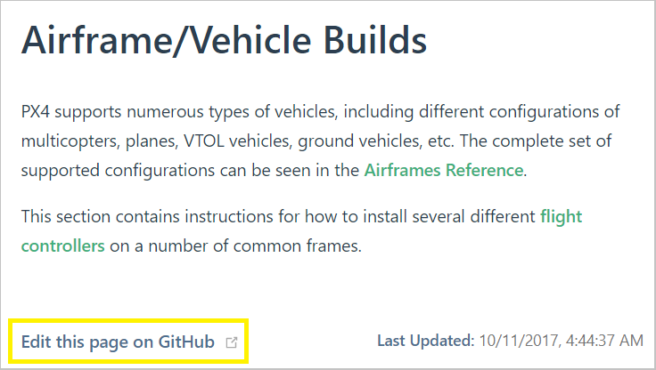

# Contributing to Documentation

Contributions to the PX4 User Guide are very welcome; from simple fixes to spelling and grammar, through to the creation of whole new sections.

This topic explains how to make and test changes. Towards the end there is a basic style guide.

:::tip
Note You will need a (free) [Github](https://github.com/) account to contribute to the guides.
:::

<a id="github_changes" ></a>

## Quick Changes in Github

Simple changes to _existing content_ can be made by clicking the **Edit this page on GitHub** link that appears at the bottom of every page (this opens the page on Github for editing).



To edit an existing page:

1. Open the page.
1. Click the **Edit this page on GitHub** link below the page content.
1. Make the desired change.
1. Below the Github page editor you'll be prompted to create a separate branch and then guided to submit a _pull request_.

The documentation team will review the request and either merge it or work with you to update it.

<a id="big_changes" ></a>

## Changes using Git (New Pages and Images)

More substantial changes, including adding new pages or adding/modifying images, aren't as easy to make (or properly test) on Github. For these kinds of changes we suggest using the same approach as for _code_:

1. Use the _git_ toolchain to get the documentation source code onto your local computer.
1. Modify the documentation as needed (add, change, delete).
1. _Test_ that it builds properly using Vuepress.
1. Create a branch for your changes and create a pull request (PR) to pull it back into the documentation.

The following explain how to get the source code, build locally (to test), and modify the code.

### Get/Push Documentation Source Code

To get the library(s) sources onto your local computer you will need to use the git toolchain. The instructions below explain how to get git and use it on your local computer.

1. Download git for your computer from [https://git-scm.com/downloads](https://git-scm.com/downloads)
1. [Sign up](https://github.com/join) for Github if you haven't already
1. Create a copy (Fork) of the [PX4 User Guide repo](https://github.com/PX4/PX4-user_guide) on Github ([instructions here](https://docs.github.com/en/get-started/quickstart/fork-a-repo)).
1. Clone (copy) your forked repository to your local computer:
   ```sh
   cd ~/wherever/
   git clone https://github.com/<your git name>/px4_user_guide.git
   ```
   For example, to clone the PX4 userguide fork for a user with Github account "john_citizen":
   ```sh
   git clone https://github.com/john_citizen/px4_user_guide.git
   ```
1. Navigate to your local repository:
   ```sh
   cd ~/wherever/px4_user_guide
   ```
1. Add a _remote_ called "upstream" to point to the PX4 version of the library:

   ```sh
   git remote add upstream https://github.com/PX4/px4_user_guide.git
   ```

:::tip
A "remote" is a handle to a particular repository. The remote named _origin_ is created by default when you clone the repository, and points to _your fork_ of the guide. Above you create a new remote _upstream_ that points to the PX4 project version of the documents.
:::

1. Create a branch for your changes:
   ```sh
   git checkout -b <your_feature_branch_name>
   ```
   This creates a local branch on your computer named `your_feature_branch_name`.
1. Make changes to the documentation as needed (general guidance on this in following sections)
1. Once you are satisfied with your changes, you can add them to your local branch using a "commit":
   ```sh
   git add <file name>
   git commit -m "<your commit message>"
   ```
   For a good commit message, please refer to the [Source Code Management](../contribute//code.md#commits-and-commit-messages) section.
1. Push your local branch (including commits added to it) to your forked repository on Github.
   ```sh
   git push origin your_feature_branch_name
   ```
1. Go to your forked repository on Github in a web browser, e.g.: `https://github.com/<your git name>/px4_user_guide.git`. There you should see the message that a new branch has been pushed to your forked repository.
1. Create a pull request (PR):
   - On the right hand side of the "new branch message" (see one step before), you should see a green button saying "Compare & Create Pull Request". Press it.
   - A pull request template will be created. It will list your commits and you can (must) add a meaningful title (in case of a one commit PR, it's usually the commit message) and message (<span style="color:orange">explain what you did for what reason</span>. Check [other pull requests](https://github.com/PX4/px4_user_guide/pulls) for comparison)
1. You're done! Maintainers for the PX4 User Guide will now have a look at your contribution and decide if they want to integrate it. Check if they have questions on your changes every once in a while.

### Building the Library Locally

Build the library locally to test that any changes you have made have rendered properly:

1. Install the [Vuepress prerequiresites](https://vuepress.vuejs.org/guide/getting-started.html#prerequisites):

   - [Nodejs 10+](https://nodejs.org/en)

:::note
For recent nodejs versions (after v16.15.0) you need to enable the node legacy OpenSSL provider. On Ubuntu you can do this by running the terminal command:

     ```bash
     export NODE_OPTIONS=--openssl-legacy-provider
     ```

   - [Yarn classic](https://classic.yarnpkg.com/en/docs/install)

1. Navigate to your local repository:

   ```sh
   cd ~/wherever/PX4-user_guide
   ```

1. Install dependencies (including Vuepress):

   ```sh
   yarn install
   ```

1. Preview and serve the library:

   ```sh
   yarn docs:dev
   ```

   - Now you can browse the guide on http://localhost:8080/px4_user_guide/
   - Stop serving using **CTRL+C** in the terminal prompt.

1. Build the library using:

   ```sh
   # Ubuntu
   yarn docs:build

   # Windows
   yarn docs:buildwin
   ```

:::tip
Use `yarn docs:dev` to preview changes _as you make them_ (documents are updated and served very quickly). Before submitting a PR you should also build it using `docs:build`, as this can highlight issues that are not visible when using `docs:dev`.
:::

### Source Code Structure

The guide uses the [Vuepress](https://vuepress.vuejs.org/) toolchain. The PX4 User Guide has some minor differences, mostly related to configuration and setup.

In overview:

- Pages are written in separate files using markdown.
  - The syntax is almost the same as that used by the Github wiki.
  - Vuepress also supports some [markdown extensions](https://vuepress.vuejs.org/guide/markdown.html). We try and avoid using these, except for [tips, warning, etc.](https://vuepress.vuejs.org/guide/markdown.html#custom-containers).
- This is a [multilingual](https://vuepress.vuejs.org/guide/i18n.html#default-theme-i18n-config) book:
  - Pages for each language are stored in the folder named for the associated language code (e.g. "zh" for Chinese, "ko" for Korean).
  - Only edit the ENGLISH (**/en**) version of files. We use [Crowdin](../contribute/translation.md) to manage the translations.
- All pages must be in an appropriately named sub-folder of **/en** (e.g. this page is in folder **en/contribute/**).
  - This makes linking easier because other pages and images are always as the same relative levels
- The _structure_ of the book is defined in **SUMMARY.md**
  - If you add a new page to the guide you must also add an entry to this file! :::tip This is not "standard vuepress" way to define the sidebar (the summary file is imported by [.vuepress/get_sidebar.js](https://github.com/PX4/PX4-user_guide/blob/main/.vuepress/get_sidebar.js)).
:::
- Images must be stored in a sub folder of **/assets**. This is two folders down from content folders, so if you add an image you will reference it like:

  ```plain
  
  ```

- A file named **package.json** defines any dependencies of the build.
- A web hook is used to track whenever files are merged into the master branch on this repository, causing the book to rebuild.

### Adding New Pages

When you add a new page you must also add it to **en/SUMMARY.md**!

## Style Guide

1. Files/file names

   - Put new files in an appropriate sub-folder of **/en/**. Do not further nest folders.
   - Use descriptive names. In particular, image filenames should describe what they contain.
   - Use lower case filenames and separate words using underscores "\_"

2. Images

   - Use the smallest size and lowest resolution that makes the image still useful (this reduces download cost for users with poor bandwidth).
   - New images should be created in a sub-folder of **/assets/** by default (so they can be shared between translations).

3. Content:

   - Use "style" \(bold, emphasis, etc\) consistently.
     - **Bold** for button presses and menu definitions.
     - _Emphasis_ for tool names. - Otherwise use as little as possible.
   - Headings and page titles should use "First Letter Capitalisation"
   - The page title should be a first level heading \(\#\). All other headings should be h2 \(\#\#\) or lower.
   - Don't add any style to headings.
   - Don't translate the _first part_ of a note, tip or warning declaration (e.g. `::: tip`) as this precise text is required to render the note properly.

## Where Do I Add Changes?

Add new documentation in-line with the existing structure!

Some of the main categories are:

- Development: content related to:
  - Evolving the platform (new modes, modules, flight modes, hardware, software and hardware architecture and porting).
  - "Experimental" work that requires developer expertise to reproduce.
- Flying: content related to flying a standard vehicle (flight modes, arming, taking off, landing)
- Basic configuration: Configuration that every vehicle will need to do
- Advanced configuration: Configuration that is specific to a vehicle type, or some segment of users.
- Peripherals: Documentation on different hardware that can be used.
  - This also includes setup and configuration information for hardware that isn't covered in Basic configuration.
- Basic Assembly: Assembly of an autopilot and its main peripherals
- Airframe Builds: Examples of how to build a whole system.

## Translations

For information about translation see: [Translation](../contribute/translation.md).

## Licence

All PX4/Dronecode documentation is free to use and modify under terms of the permissive [CC BY 4.0](https://creativecommons.org/licenses/by/4.0/) licence.
