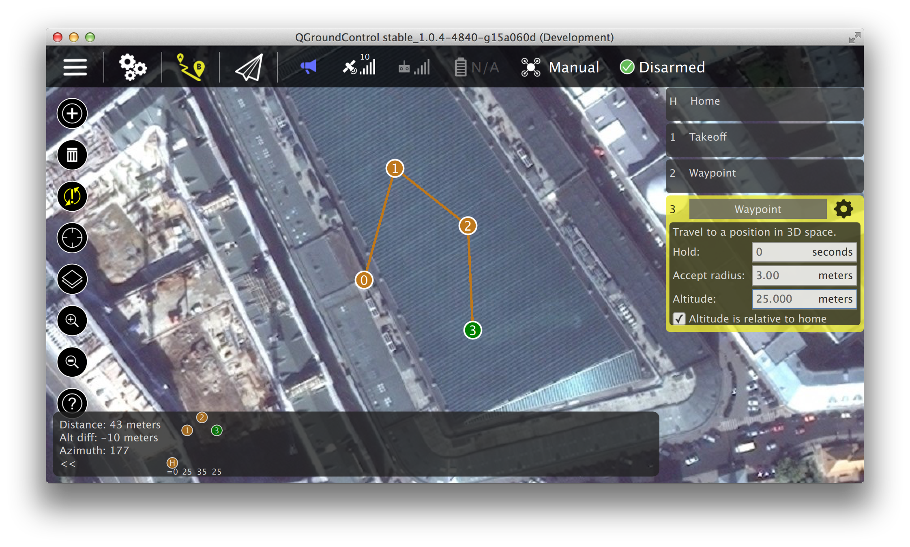
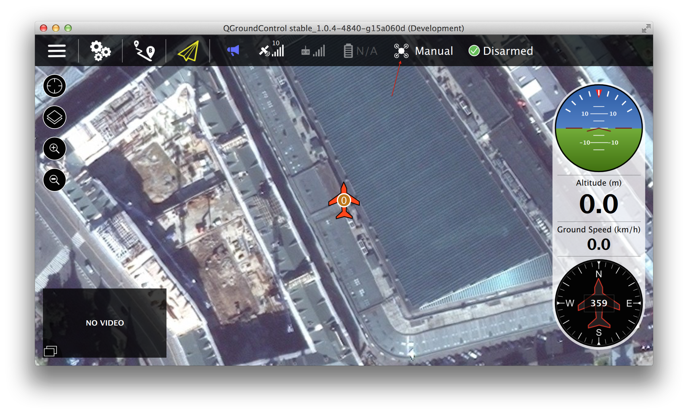
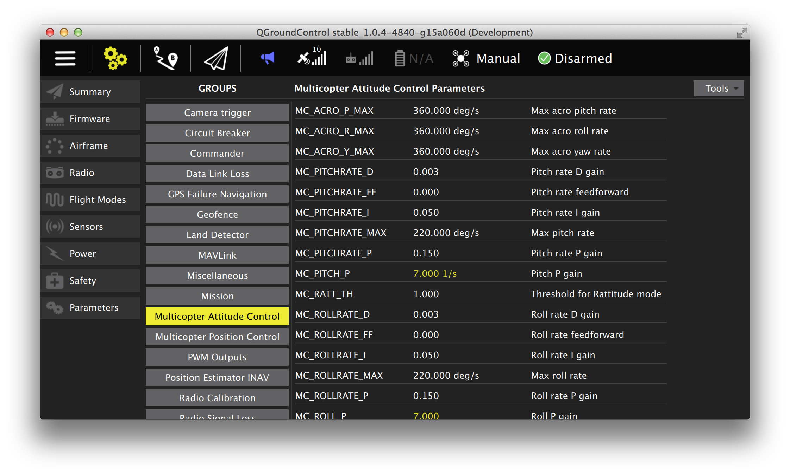

# QGroundControl

QGroundControl is an app to configure and fly a PX4 based autopilot. It is cross platform and supports all major operating systems:

  * Mobile: Android and iOS (currently focused on tablet)
  * Desktop: Windows, Linux, Mac OS

## Planning Missions

To plan a new mission, switch to the planning tab, click on the + icon in the top left and click on the map to create waypoints. A context menu will open on the side to adjust the waypoints. Click on the highlight transmission icon to send them to the vehicle.

## Flying Missions

Switch to the flying tab. The mission should be visible on the map. Click on the current flight mode to change it to MISSION and click on DISARMED to arm the vehicle. If the vehicle is already in flight it will fly to the first leg of the mission and then follow it.

## Setting parameters

Switch to the setup tab. Scroll the menu on the left all the way to the bottom and click on the parameter icon. Parameters can be changed by double-clicking on them, which opens a context menu to edit, along with a more detailed description.

## Installation

QGroundControl can be downloaded from its [website](http://qgroundcontrol.com/downloads).

> **Tip** Developers are advised to use the latest daily build instead of the stable release.

## Building from source

Firmware developers are encouraged to build from source in order to have a matching recent version to their flight code.

Follow the [QGroundControl build instructions](https://dev.qgroundcontrol.com/en/getting_started/) to install Qt and build the source code.
