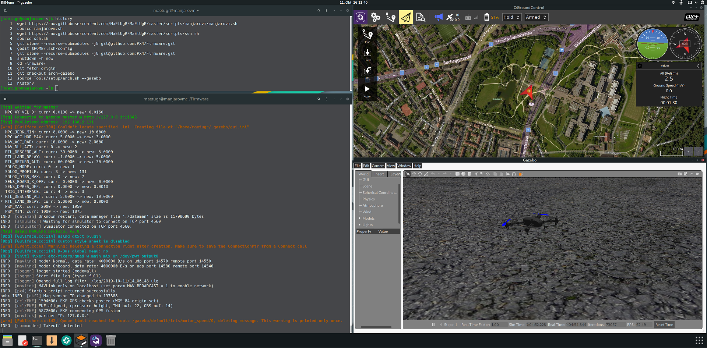

# Arch Linux Development Environment

:::warning
This development environment is [not supported](../advanced/dev_env_unsupported.md). See [Toolchain Installation](../dev_setup/dev_env.md) for information about the environments and tools we do support!
:::

The PX4-Autopilot repository provides a convenient script to set your Arch installation up for PX4 development: [Tools/setup/arch.sh](https://github.com/PX4/PX4-Autopilot/blob/master/Tools/setup/arch.sh). <!-- NEED px4_version -->

The script installs (by default) all tools to build PX4 (without RTPS) for NuttX targets and run simulation with *jMAVsim*. You can additionally install the *Gazebo* simulator by specifying the command line argument: `--gazebo`.



:::note
The instructions have been tested on [Manjaro](https://manjaro.org/) (Arch based distribution) as it is much easier to set up than Arch Linux.
:::

To get and run the scripts, do either of:
* [Download PX4 Source Code](../dev_setup/building_px4.md) and run the scripts in place:
  ```
  git clone https://github.com/PX4/PX4-Autopilot.git
  bash PX4-Autopilot/Tools/setup/arch.sh
  ```
* Download just the needed scripts and then run them:
  ```sh
  wget https://raw.githubusercontent.com/PX4/PX4-Autopilot/master/Tools/setup/arch.sh
  wget https://raw.githubusercontent.com/PX4/PX4-Autopilot/master/Tools/setup/requirements.txt
  bash arch.sh
  ```

The script takes the following optional parameters:
- `--gazebo`: Add this parameter to install Gazebo from the [AUR](https://aur.archlinux.org/packages/gazebo/). :::note Gazebo gets compiled from source. It takes some time to install and requires entering the `sudo` password multiple times (for dependencies).
:::

- `--no-nuttx`: Do not install the NuttX/Pixhawk toolchain (i.e. if only using simulation).
- `--no-sim-tools`: Do not install jMAVSim/Gazebo (i.e. if only targeting Pixhawk/NuttX targets)
