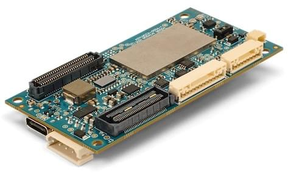

# ModalAI VOXL 2

:::warning
PX4 does not manufacture this (or any) autopilot. Contact the [manufacturer](https://forum.modalai.com/) for hardware support or compliance issues.
:::

The ModalAI [VOXL 2](https://modalai.com/voxl-2) ([Datasheet](https://docs.modalai.com/voxl2-datasheets/))  is ModalAI’s next-gen autonomous computing platform built around the Qualcomm QRB5165 processor. VOXL 2 boasts 8 cores, integrated PX4, seven camera concurrency, advanced onboard AI up to 15+ TOPS, and 5G connectivity. At 16 grams, VOXL 2 is the future of fully autonomous and connected drones!

:::note
This flight controller is [manufacturer supported](../flight_controller/autopilot_manufacturer_supported.md).
:::

## Specifications

### System

| Feature                                                                       | VOXL 2                                                                             |
| ----------------------------------------------------------------------------- | ---------------------------------------------------------------------------------- |
| CPU                                                                           | QRB5165  8 cores up to 3.091GHz  8GB LPDDR5 128GB Flash |
| OS                                                                            | Ubuntu 18.04 - Linux Kernel v4.19                                                  |
| GPU                                                                           | Adreno 650 GPU – 1024 ALU                                                          |
| NPU                                                                           | 15 TOPS                                                                            |
| Flight Controller Embedded                                                    | Yes (Sensors DSP, PX4)                                                             |
| Built in WiFi                                                                 | No                                                                                 |
| Add-on Connectivity                                                           | WiFi, 5G, 4G/LTE, Microhard                                                        |
| Video Encoding                                                                | 8K30 h.264/h.265 108MP still images                                                |
| Computer Vision Sensors                                                       | QTY 6 4-lane CSI, QTY4 CCI (e.g. 2 stereo pair, hires, tracking)                   |
| Tracking Sensor                                                               | Yes                                                                                |
| Dimensions                                                                    | 70mm x 36mm                                                                        |
| Weight                                                                        | 16g                                                                                |
| VOXL SDK: GPS-denied navigation, SLAM, obstacle avoidance, object recognition | Yes                                                                                |
| ROS                                                                           | ROS 1 & 2                                                                          |
| QGroundControl                                                                | Yes                                                                                |
| ATAK                                                                          | Yes                                                                                |
| NDAA ’20 Section 848 Compliant                                                | Yes, Assembled in USA                                                              |
| PMD TOF                                                                       | Yes (SDK 1.0 and newer)                                                            |
| FLIR Boson                                                                    | USB                                                                                |
| FLIR Lepton                                                                   | USB, SPI in development                                                            |

:::note
More detailed hardware documentation can be found [here](https://docs.modalai.com/voxl-flight-datasheet/).
:::

## Dimensions

### 2D Dimensions

### 3D Dimensions

[3D STEP File](https://storage.googleapis.com/modalai_public/modal_drawings/M0054_VOXL2_PVT_SIP_REVA.step)

## PX4 Firmware Compatibility

### voxl-dev branch

ModalAI is actively working on a [branched PX4 version](https://github.com/modalai/px4-firmware/tree/voxl-dev) that can be used.

As VOXL 2 runs Ubuntu, the production releases of PX4 for VOXL 2 are distributed through [apt package management](https://docs.modalai.com/configure-pkg-manager/) and the [VOXL SDK](https://docs.modalai.com/voxl-sdk/).

More information about the firmware can be found [here](https://docs.modalai.com/voxl2-px4-developer-guide/).

### main branch

PX4 mainline support is a work in progress (currently started [here](https://github.com/PX4/PX4-Autopilot/tree/main/boards/modalai/voxl2)).

## QGroundControl Support

This board supported in QGroundControl 4.0 and later.

## Availability

- [Sentinel Development Drone powered by VOXL 2](https://www.modalai.com/pages/sentinel)
  - [Demo Video](https://www.youtube.com/watch?v=hMhQgWPLGXo)
- [VOXL 2 Flight Deck, ready to mount, tune and fly](https://www.modalai.com/collections/ready-to-mount/products/voxl-2-flight-deck)
- [VOXL 2 Development Kits](https://www.modalai.com/products/voxl-2)
  - [Demo Video](https://www.youtube.com/watch?v=aVHBWbwp488)

## Quick Start

Quickstarts from the vendor are located [here](https://docs.modalai.com/voxl2-quickstarts/).

### VOXL SDK

VOXL SDK (Software Development Kit) consists of the open source [voxl-px4](https://docs.modalai.com/voxl-px4/), [core libraries](https://docs.modalai.com/core-libs/), [services](https://docs.modalai.com/mpa-services/), [tools](https://docs.modalai.com/inspect-tools/), [utilities](https://docs.modalai.com/sdk-utilities/), and [build environments](https://docs.modalai.com/build-environments/) that ModalAI provide to accelerate the use and development of VOXL compute boards and accessories.

VOXL SDK runs on VOXL, VOXL 2 and RB5 Flight!

The source code for projects within VOXL SDK can be found at https://gitlab.com/voxl-public, alongside build instructions.

### Connectors

Detailed information about the pinouts can be found [here](https://docs.modalai.com/voxl2-connectors/) along with a [video overview here](https://www.youtube.com/watch?v=xmqI3msjqdo)

All single ended signals on B2B connectors J3, J5, J6, J7, and J8 are 1.8V CMOS unless explicitly noted. All single ended signals on cable-to-board connectors J10, J18, & J19 are 3.3V CMOS unless explicitly noted.

| Connector | Description                   | MPN (Board Side)        | Mating MPN (Board/Cable Side) | Type                         | Signal Feature Summary                                                                                                                                                                                     |
| --------- | ----------------------------- | ----------------------- | ----------------------------- | ---------------------------- | ---------------------------------------------------------------------------------------------------------------------------------------------------------------------------------------------------------- |
| J2        | Fan                           | SM02B-SRSS-TB(LF)(SN)   | SHR-02V-S                     | Cable Header, 2-pin R/A      | 5V DC for FAN + PWM Controlled FAN-Return (GND)                                                                                                                                                            |
| J3        | Legacy B2B                    | QSH-030-01-L-D-K-TR     | QTH-030-01-L-D-A-K-TR         | B2B Receptacle, 60-pin       | 5V/3.8V/3.3V/1.8V power for plug-in boards, JTAG and Debug Signals, QUP expansion, GPIOs, USB3.1 Gen 2 (USB1)                                                                                              |
| J4        | Prime Power In                | 22057045                | 0050375043                    | Cable Connector, 4-pin R/A   | +5V main DC power in + GND, I2C@5V for power monitors                                                                                                                                                      |
| J5        | High Speed B2B                | ADF6-30-03.5-L-4-2-A-TR | ADM6-30-01.5-L-4-2-A-TR       | B2B Socket, 120-pin          | More 3.8V/3.3V/1.8V power for plug-in boards, 5V power in for “SOM Mode”, QUP expansion, GPIOS (including I2S), SDCC (SD Card V3.0), UFS1 (secondary UFS Flash), 2L PCIe Gen 3, AMUX and SPMI PMIC signals |
| J6        | Camera Group 0                | DF40C-60DP-0.4V(51)     | DF40C-60DS-0.4V               | B2B Plug, 60-pin             | Qty-2 4L MIPI CSI ports, CCI and camera control signals, 8 power rails (from 1.05V up to 5V) for cameras and other sensors, dedicated SPI (QUP) port                                                       |
| J7        | Camera Group 1                | DF40C-60DP-0.4V(51)     | DF40C-60DS-0.4V               | B2B Plug, 60-pin             | Qty-2 4L MIPI CSI ports, CCI and camera control signals, 8 power rails (from 1.05V up to 5V) for cameras and other sensors, dedicated SPI (QUP) port                                                       |
| J8        | Camera Group 2                | DF40C-60DP-0.4V(51)     | DF40C-60DS-0.4V               | B2B Plug, 60-pin             | Qty-2 4L MIPI CSI ports, CCI and camera control signals, 8 power rails (from 1.05V up to 5V) for cameras and other sensors, dedicated SPI (QUP) port                                                       |
| J9        | USB-C (ADB)                   | UJ31-CH-3-SMT-TR        | USB Type-C                    | Cable Receptacle, 24-pin R/A | ADB USB-C with re-driver and display port alternate mode (USB0)                                                                                                                                            |
| J10       | SPI Expansion                 | SM08B-GHS-TB(LF)(SN)    | GHR-08V-S                     | Cable Header, 8-pin R/A      | SPI@3.3V with 2 CS_N pins, 32kHz CLK_OUT@3.3V                                                                                                                                                            |
| J18       | ESC (SLPI Access)             | SM04B-GHS-TB(LF)(SN)    | GHR-04V-S                     | Cable Header, 4-pin R/A      | ESC UART@3.3V, 3.3V reference voltage                                                                                                                                                                      |
| J19       | GNSS/MAG/RC/I2C (SLPI Access) | SM12B-GHS-TB(LF)(SN)    | GHR-12V-S                     | Cable Header, 6-pin R/A      | GNSS UART@3.3V, Magnetometer I2C@3.3V, 5V, RC UART, Spare I2C                                                                                                                                              |

### User Guide

The PX4 user guide for VOXL 2 is available [here](https://docs.modalai.com/voxl-px4/).

### Developer Guide

The PX4 developer guide for VOXL 2 is available [here](https://docs.modalai.com/voxl-px4-developer-guide/).

### How to Build

See the [VOXL PX4 Build Guide](https://docs.modalai.com/voxl2-px4-build-guide/) on how to build.

## Support

Please visit the [ModalAI Forum](https://forum.modalai.com/category/26/voxl-2) for more information.
