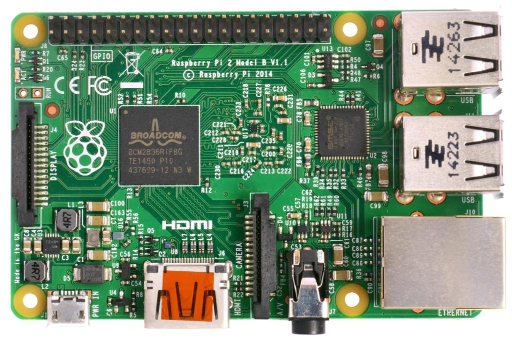

# Raspberry Pi 2/3/4 Navio2 Autopilot

:::warning PX4 does not manufacture this (or any) autopilot. Contact the [manufacturer](https://emlid.com/) for hardware support or compliance issues.
:::

:::warning PX4 support for this flight controller is [experimental](../flight_controller/autopilot_experimental.md).
:::

This is the developer "quickstart" for Raspberry Pi 2/3/4 Navio2 autopilots. It allows you to build PX4 and transfer to the RasPi, or build natively.



## OS Image

Use the preconfigured [Emlid Raspberry Pi OS image for Navio 2](https://docs.emlid.com/navio2/configuring-raspberry-pi). The default image will have most of the setup procedures shown below already done.

:::warning
Make sure not to upgrade the system (more specifically the kernel). By upgrading, a new kernel can get installed which lacks the necessary HW support (you can check with `ls /sys/class/pwm`, the directory should not be empty).
:::

## Setting up Access

The Raspberry Pi OS image has SSH setup already. Username is "pi" and password is "raspberry". We assume that the username and password remain at their defaults for the purpose of this guide.

To setup the Pi to join your local wifi, follow [this guide](https://www.raspberrypi.org/documentation/configuration/wireless/wireless-cli.md), or connect it via an ethernet cable.

To connect to your Pi via SSH, use the default username (`pi`) and hostname (`navio`). Alternatively (if this doesn't work), you can find the IP address of your RPi and specify it.

```sh
ssh pi@navio.local
```

or

```sh
ssh pi@<IP-ADDRESS>
```

## Expand the Filesystem

Expand the file system to take advantage of the entire SD card by running:

```sh
sudo raspi-config --expand-rootfs
```

## Disable Navio RGB Overlay

The existing Navio RGB overlay claims GPIOs used by PX4 for RGB Led. Edit `/boot/config.txt` by commenting the line enabling the `navio-rgb` overlay.

```
#dtoverlay=navio-rgb
```

## Testing file transfer

We use SCP to transfer files from the development computer to the target board over a network (WiFi or Ethernet).

To test your setup, try pushing a file from the development PC to the Pi over the network now. Make sure the Pi has network access, and you can SSH into it.

```sh
echo "Hello" > hello.txt
scp hello.txt pi@navio.local:/home/pi/
rm hello.txt
```

This should copy over a "hello.txt" file into the home folder of your Pi. Validate that the file was indeed copied, and you can proceed to the next step.

## Building the Code

:::note
PX4 binaries for Navio 2 can only be built on Ubuntu 18.04.
Ubuntu 20.04 and later do not currently work (as of September 2023). 
:::

Follow the instructions below to build the source code on your development machine and transfer the compiled program to the Pi. Note that earlier versions allowed code to be built natively (on the Pi), but this option is no longer available.

### Cross-compiler Build

First install the [standard PX4 developer environment](../dev_setup/dev_env_linux_ubuntu.md#raspberry-pi) on your Ubuntu 18.04 development computer.

Specify the IP (or hostname) of your Pi using:

```sh
export AUTOPILOT_HOST=navio.local
```

or

```sh
export AUTOPILOT_HOST=192.168.X.X
```

:::note
The value of the environment variable should be set before the build, or `make upload` will fail to find your Pi.
:::

Build the executable file on your development machine:

```sh
cd PX4-Autopilot
make emlid_navio2
```

The "px4" executable file is in the directory **build/emlid_navio2_default/**. Make sure you can connect to your Pi over SSH, see [instructions how to access your Pi](#setting-up-access) following the instructions for armhf under Raspberry Pi.

Then upload it with:

```sh
cd PX4-Autopilot
make emlid_navio2 upload
```

Then, connect over ssh and run it on the Pi (as root):

```sh
cd ~/px4
sudo ./bin/px4 -s px4.config
```

A successful build followed by executing px4 will give you something like this:

```sh

______  __   __    ___
| ___ \ \ \ / /   /   |
| |_/ /  \ V /   / /| |
|  __/   /   \  / /_| |
| |     / /^\ \ \___  |
\_|     \/   \/     |_/

px4 starting.


pxh>
```

## Autostart

To autostart px4, add the following to the file **/etc/rc.local** (adjust it accordingly if you use native build), right before the `exit 0` line:

```sh
cd /home/pi && ./bin/px4 -d -s px4.config > px4.log
```
