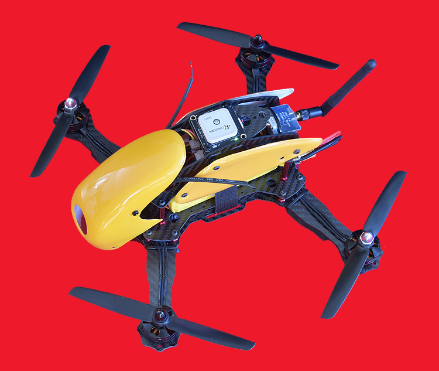
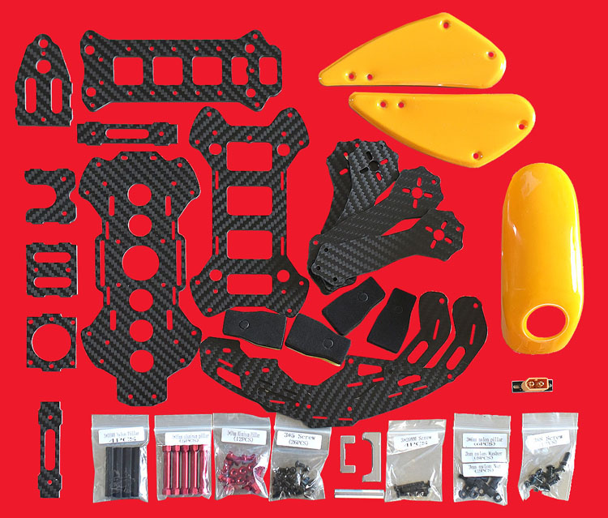
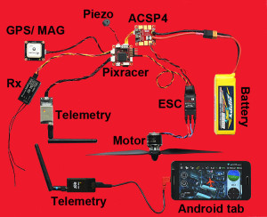
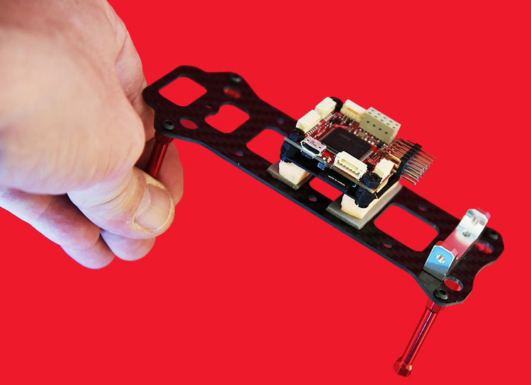
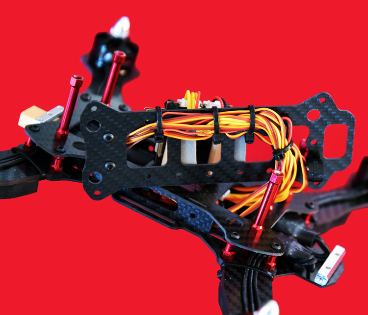
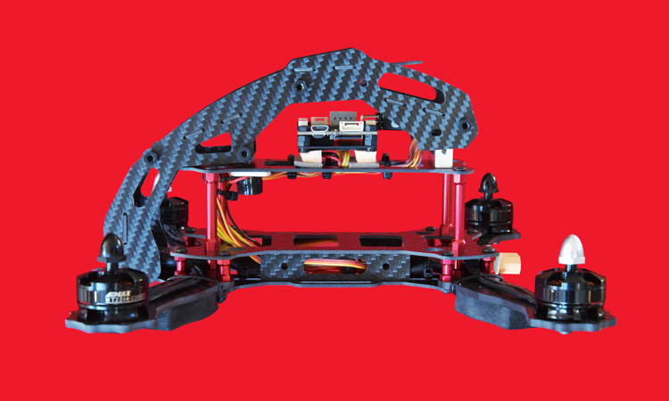
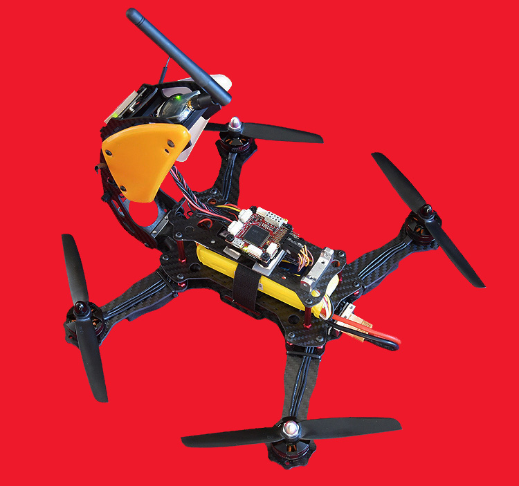

# Robocat 270

The Robocat 270 is a small quadcopter design, rather meant for cruising than for racing, still a perfect trial base for the [Pixracer](../flight_controller/pixracer.md) autopilot. It is heavier than a typical 250 racer, but offers a lot of space for add ons and bigger batteries up to 3S/2200mAh. Its an robust small quadcopter for beginners, very well visible for older Pros as well. It's so easy: Robocat, Pixracer with PX4 Software and QGroundControl Groundstation: Build, calibrate and fly !

## Mounting and Wiring

The Robocat 270 frame kits are available from several sources.Two versions: Fiber glass or carbon. The latter is coming with an assortment of aluminium stand offs instead of fragile plastic provided with the fiber glass version.

The shown kit comes with EMAX MT2204 motors, EMAX 12A ESC, pre-flashed with SimonK and 6045 carbon props. This is rather bargain than top quality, but pretty decent, considering the price. Experienced pilots, not on budget, will rather use e.g. Tiger Motors and faster ESC, even CAN versions can be used with the Pixracer / PX4 stack. Those CAN based FOC/Vector Control ESCs have the potential for huge gains in efficiency and reliability.

The first step should be the attachment of all parts for a test, before before mounting them onto the frame. Wiring details are shown @ the [Pixracer instructions](../flight_controller/pixracer.md) guide.

After that, one starts to assemble the bottom part, where the 36x36mm AUAV ACSP4 Power Module / PDB and the ESC fit very well. If ESC w/o heatsink are used, its recommended to install them on top of the arms, where airflow is provided.

Its a good idea to install the ACSP4 with the shunt resistor for current sensing sunnyside down. Since it might get hot, one has to make sure, that no wire is touching it. It is very important to take care that all the wire insulation is nowhere damaged, since the conductive carbon might lead to shorts. If a 12V source / PDB is not required, a smaller (17x17mm) new ACSP5 Power Module, providing I/U sensing and a 5V BEC is available as well.

The Pixracer is soft mounted @ the 1st floor, above the battery compartment. This appears like a waste of space, but one needs about 20mm space for wires clearance,since closely tied wire would badly affect vibration damping.

Excursus: Effective damping is required by all advanced flight stacks and pilots using Althold and GPS modes. Although there are still *hard mounters* around, most builds/controllers/flight stacks are affected by vibrations, leading to the core issues Aliasing/Clipping.

The PX4 stack is logging those impacts as well, so its easy to analyse them. The  example plot shows that the vibration induced dropout peaks are going one way instead of rising above and below the sensor values. This shifts the center of the signal, wrongly "telling" the flight controller rising or falling height. Although newer EKF filter algorithms are designed to handle this to a certain amount, its better to prevent impacts like this by the shown soft mount.

This is realized either by 3DR foam pads or HK orange latex. The latter is not self-adhesive, but double faced tape such as 3M 5925F does the job nicely. If no housing is used for the Pixracer, the pads are sticking underneath a 36x36mm fiber or carbon board, squeezing the mandatory foam on top of the baro sensor as well. This foam reduces all light and most airflow impacts onto the sensor.

It is recommended to fix the cables underneath the Pixracer to prevent damages or relocation during battery placement. Zip ties for the motor wires are worth discussing. If one arm breaks, the damage might be even bigger. For the required X Quad config, connect the four motors according to the layout shown below, so the MAIN1 connector should connect to ESC for motor 1, and so on.

[

The side view shows lots of space for the battery and other addons like an FPV Cam/Tx, RC Rx, OSD and 3DR radio (if the ESP 8266 Wifi board, provided with the Pixracer is not used.) The Piezo speaker is mounted sunnyside down near the front stand off. The safety switch, still provided with the Pixracer kit, is not needed at all. The PX4 stack doesn´t use it.

The Pixracer with PX4 stack is providing several GPS dependent flight modes, such as Auto Missions,Loiter, Position Control and Return to Land. If the GPS is not only used for the latter, it is recommended to install one of the better GNSS units with concurrent GPS / GLONASS ability. Any type with U-BLOX M8N on a 35x35mm board will fit @ 2nd floor, acting as a mast replacement. It is better to use a GNSS bord with a MAG sensor onboard, since the internal MAG of a flight Controller is always prone to EMI impacts and build related offsets. These might cause TBE (Toilet bowl) effects, impacting GPS modes. Any good rec. for the Pixhawk will work with the Pixracer as well.

The foldable upper part of the Robocat frame allows easy access to the Pixracer and other external components.The wiring provided with the Pixracer kit will be long enough for this application. For others it might be required to enlongate them, which is easier than to crimp new ones with JST-GH connectors.

> **Note** AUAV.CO supplies a large variety of replacements for several applications.

When everything is ready, its time for configuration and calibration with QGroundControl.

## Airframe Configuration

Select the QAV250 configuration as shown below. This will not only put PX4 into quadrotor mode, but also load decent default tuning gains.

