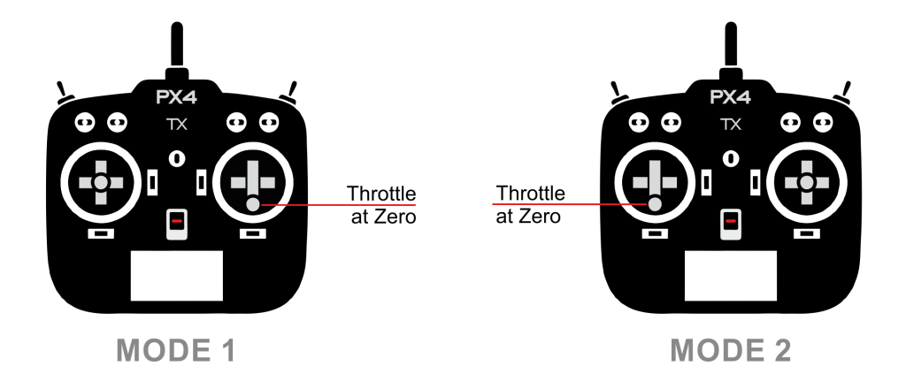

# Radio Control Systems

A Radio Control (RC) system can be used to *manually* control your vehicle from a handheld RC controller. This topic provides an overview of how RC works, how to choose an appropriate radio system for your vehicle, and how to connect it to your flight controller.

:::tip PX4 can also be manually controlled using a [Joystick](../config/joystick.md) or gamepad-like controller:  this is different to an RC system! The [COM_RC_IN_MODE](../advanced_config/parameter_reference.md#COM_RC_IN_MODE) parameter [can be set](../advanced_config/parameters.md) to choose whether RC (default), Joystick, both, or neither, are enabled. :::

:::note
PX4 does not require a remote control system for autonomous flight modes.
:::

## How do RC Systems Work?

An *RC system* has a ground-based *remote control unit* that is used by the operator to command the vehicle. The remote has physical controls that can be used to specify vehicle movement (e.g. speed, direction, throttle, yaw, pitch, roll, etc.) and to enable autopilot [flight modes](../flight_modes/README.md) (e.g. takeoff, land, return to land, mission etc.). On *telemetry-enabled* RC systems, the remote control unit can also receive and display information from the vehicle, such as battery level, flight mode, and warnings.

The ground based RC controller contains a radio module that is bound to, and communicates with, a (compatible) radio module on the vehicle. The vehicle-based unit is connected to the flight controller. The flight controller determines how to interpret the commands based on the current autopilot flight mode and vehicle state, and drives the vehicle motors and actuators appropriately.

<!-- image showing the different parts here would be nice -->

:::note
The ground- and vehicle- based radio modules are referred to as the transmitter and receiver respectively (even if they support bidirectional communication) and are collectively referred to as a *transmitter/receiver pair*. The RC controller and it's included radio module are commonly referred to as a "transmitter". :::

An important quality of an RC system is how many "channels" it supports. The number of channels defines how many different physical controls on the remote control can be used to send commands to the vehicle (e.g. how many switches, dials, control sticks can actually be used).

An aircraft must use a system that supports at least 4 channels (for roll, pitch, yaw, thrust). Ground vehicles need at least two channels (steering + throttle). An 8 or 16 channel transmitter provides additional channels that can be used to control other mechanisms or activate different [flight modes](../flight_modes/README.md) provided by the autopilot.

## Types of Remote Controllers

### Remote Control Units for Aircraft

The most popular *form* of remote control unit for UAVs is shown below. It has separate control sticks for controlling roll/pitch and for throttle/yaw as shown (i.e. aircraft need at least 4 channels).

There are numerous possible layouts for the control sticks, switches, etc. The more common layouts have been given specific "Mode" numbers. *Mode 1* and *Mode 2* (shown below) differ only in the placement of the throttle.

:::note
The choice of mode is largely one of taste (*Mode 2* is more popular). :::

## Remote Control Units for Ground Vehicles

An Unmanned Ground Vehicle (UGV)/car minimally requires a 2 channel transmitter in order to send the values for steering and speed. Commonly transmitters set these values using a wheel and trigger, two single-axis control sticks, or a single dual-axis control stick.

There is nothing to stop you using more channels/control mechanisms, and these can be very useful for engaging additional actuators and autopilot modes.

## Choosing RC System Components

You will need to select a transmitter/receiver pair that are compatible with each other. In addition, receivers have to be [compatible with PX4](#compatible_receivers) and the flight controller hardware.

Compatible radio systems are often sold together. For example, [FrSky Taranis X9D and FrSky X8R](https://hobbyking.com/en_us/frsky-2-4ghz-accst-taranis-x9d-plus-and-x8r-combo-digital-telemetry-radio-system-mode-2.html?___store=en_us) are a popular combination.

### Transmitter/Receiver Pairs

One of the most popular RC units is the *FrSky Taranis X9D*. It has an internal transmitter module can be used with the recommended *FrSky X4R-SB* (S-BUS, low delay) or *X4R* (PPM-Sum, legacy) receivers out of the box. It also has a custom radio transmitter module slot and customizable open source OpenTX Firmware.

:::note
This remote control unit can display vehicle telemetry when used with [FrSky](../peripherals/frsky_telemetry.md) or [TBS Crossfire](../telemetry/crsf_telemetry.md) radio modules. :::

Other popular transmitter/receiver pairs

* Turnigy remote using, for example, the FrSky transmitter/receiver modules.
* Futaba Transmitters and compatible Futaba S-Bus receivers.
* Long range ~900MHz, low latency: "Team Black Sheep Crossfire" or "Crossfire Micro" set with a compatible remote (e.g. Taranis)
* Long Range ~433MHz: ImmersionRC EzUHF set with a compatible remote (e.g. Taranis)

### PX4-Compatible Receivers

In addition to the transmitter/receiver pairs being compatible, the receiver must also be compatible with PX4 and the flight controller hardware.

*PX4* and *Pixhawk* have been validated with:

- All Spektrum DSM RC receivers
- All Futaba S.BUS and S.BUS2 RC receivers
- All FrSky PPM and S.Bus models
- Graupner HoTT
- All PPM models from other manufacturers
- TBS Crossfire/Express LRS Receivers using [CRSF Telemetry](../telemetry/crsf_telemetry.md) (UART connection).

## Connecting Receivers

As general guidance, receivers connect to the flight controller using the port appropriate to their supported protocol:

- Spektrum and DSM receivers must connect to a **SPKT/DSM** input.
- Graupner HoTT receivers: SUMD output must connect to a **SPKT/DSM** input.
- PPM-Sum and S.BUS receivers must connect directly to the **RC** ground, power and signal pins (typically labeled RC or RCIN)
- PPM receivers that have an individual wire for each channel must connect to the RCIN channel *via* a PPM encoder [like this one](http://www.getfpv.com/radios/radio-accessories/holybro-ppm-encoder-module.html) (PPM-Sum receivers use a single signal wire for all channels).

Instructions for connecting to specific flight controllers are given in their [quick-start](../assembly/README.md) guides (such as [CUAV Pixhawk V6X Wiring Quick Start: Radio Control](../assembly/quick_start_cuav_pixhawk_v6x.md#radio-control) or [Holybro Pixhawk 6X Wiring Quick Start: Radio Control](../assembly/quick_start_pixhawk6x.md#radio-control)).

:::tip
See the manufacturer's flight controller setup guide for additional information.
:::

## Binding Transmitter/Receiver

Before you can calibrate/use a radio system you must *bind* the receiver and transmitter so that they communicate only with each other. The process for binding a transmitter and receiver pair is hardware specific (see your manual for instructions).

If you are using a *Spektrum* receiver, you can put it into bind mode using *QGroundControl*: [Radio Setup > Spectrum Bind](../config/radio.md#spectrum-bind).

## Set Signal-Loss Behaviour

RC receivers have different ways of indicating signal loss:
- Output nothing (automatically detected by PX4)
- Output a low throttle value (you can [configure PX4 to detect this](../config/radio.md#rc-loss-detection)).
- Output the last received signal (PX4 cannot handle this case!)

Choose a receiver that can emit nothing (preferred) when RC is lost, or a low throttle value. This behaviour may require hardware configuration of the receiver (check the manual).

For more information see [Radio Control Setup > RC Loss Detection](../config/radio.md#rc-loss-detection).

## Related Topics

* [Radio Control Setup](../config/radio.md) - Configuring your radio with PX4.
* [Manual Flying](../flying/basic_flying.md) - Learn how to fly with a remote control.
* [TBS Crossfire (CRSF) Telemetry](../telemetry/crsf_telemetry.md)
* [FrSky Telemetry](../peripherals/frsky_telemetry.md)