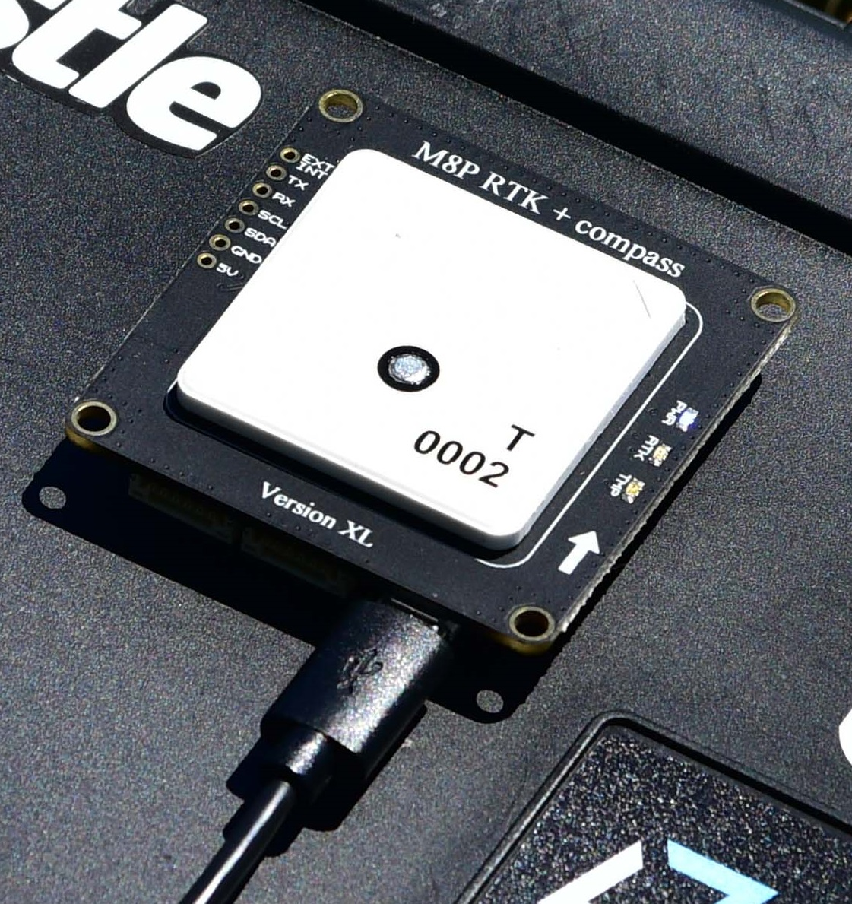
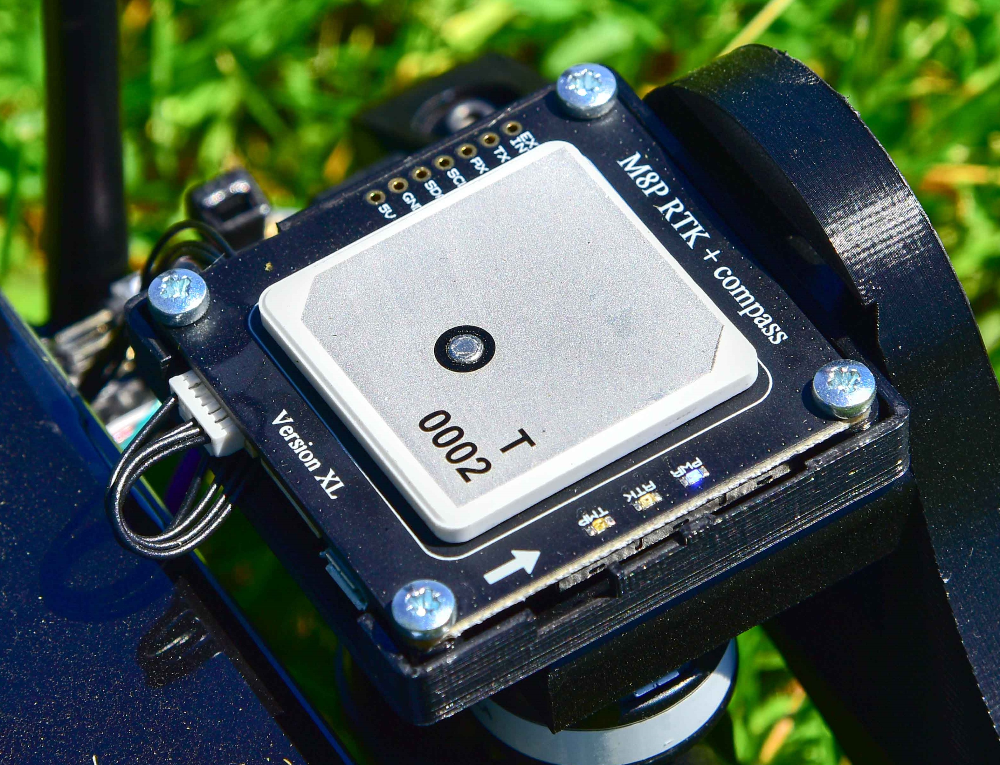

# Drotek XL RTK GPS

The [Drotek XL RTK GPS receiver](https://store-drotek.com/881-DP0503.html) is a competitively priced [RTK GPS module](../gps_compass/rtk_gps.md) that can be configured as either base or rover. Using RTK, PX4 can get its position with centimetre-level accuracy, which is much more accurate than can be provided by a normal GPS.

 

## Purchase

[Drotek XL RTK](https://store-drotek.com/881-DP0503.html) (drotek.com)

## Configuration

RTK setup and use on PX4 via *QGroundControl* is largely plug and play (see [RTK GPS](../advanced_features/rtk-gps.md) for more information).

:::tip
The Drotek UCenter tool is not required for configuration - everything is handled by *QGroundControl*.
:::

## Wiring and Connections

The module inputs/outputs are [shown here](https://drotek.gitbooks.io/doc-rtk/content/rtkmodules/schematics.html#xl-rtk-module) (Drotek docs) <!-- link private 18Nov2019 -->
