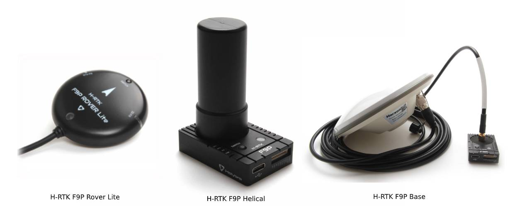
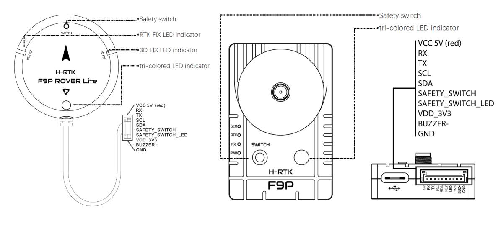
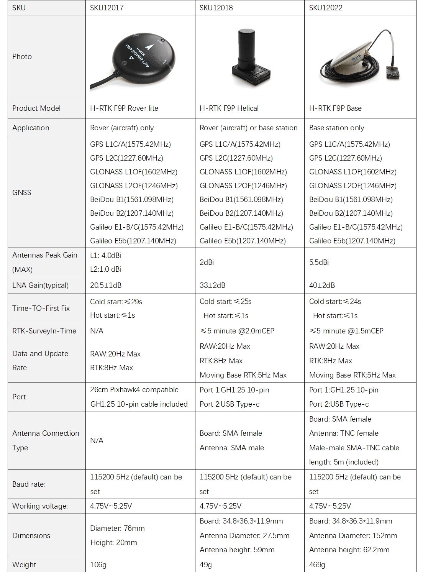
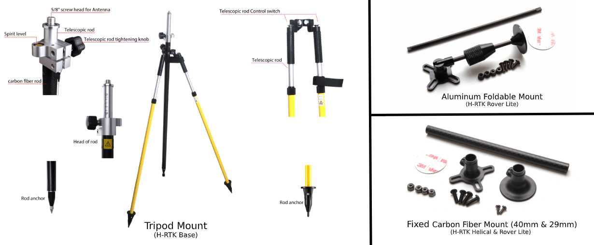

# Holybro H-RTK F9P GNSS

The [Holybro H-RTK F9P GNSS](http://www.holybro.com/product/h-rtk-f9p/) is an multi-band high-precision [RTK GNSS System](../gps_compass/rtk_gps.md) series launched by Holybro. This family is similar to the [H-RTK M8P](../gps_compass/rtk_gps_holybro_h-rtk-m8p.md) series, but uses multi-band RTK with faster convergence times and reliable performance, concurrent reception of GPS, GLONASS, Galileo and BeiDou, and faster update rate for highly dynamic and high volume applications with centimeter-accuracy. It uses a u-blox F9P module, a IST8310 compass, and a tri-colored LED indicator. It also has an integrated safety switch for a simple and convenient operation.

There are three models of Holybro H-RTK F9P to choose from, each with different antenna design to meet different needs. Refer to [Specification and Model Comparison section](#specification-and-model-comparison) for more details.

Using RTK allows PX4 to get its position with centimeter-level accuracy, which is much more accurate than can be provided by a normal GPS.

## Purchase

* [H-RTK F9P (Holybro Website)](https://shop.holybro.com/h-rtk-f9p_p1226.html?)
* [H-RTK Accessories (Holybro Website)](https://shop.holybro.com/c/h-rtk_0512)

## Configuration

RTK setup and use on PX4 via _QGroundControl_ is largely plug and play \(see [RTK GPS](../advanced_features/rtk-gps.md) for more information\).

## Wiring and Connections

All H-RTK GNSS models come with a GH 10-pin connector/cable that is compatible with [Pixhawk 4](../flight_controller/pixhawk4.md).

:::note
The cables/connectors may need to be modified in order to connect to other flight controller boards (see [Pin Map](#pin-map) below).
:::

## Pin Map

## Specification and Model Comparison

## GPS Accessories

[H-RTK Mount (Holybro Website)](https://shop.holybro.com/spare-parts-gps-mount_p1228.html)

