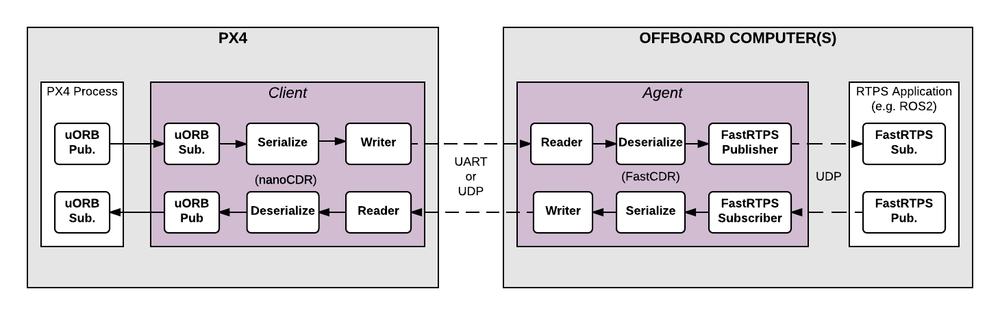

# RTPS/DDS Interface: PX4-Fast RTPS(DDS) Bridge

The *PX4-Fast RTPS(DDS) Bridge*, which is also referred to as as the *microRTPS Bridge*, adds a Real Time Publish Subscribe (RTPS) interface to the PX4 Autopilot, enabling the exchange of [uORB messages](../middleware/uorb.md) between the various PX4 Autopilot internal components and (offboard) *Fast DDS* applications in realtime.

This allows us to better integrate with applications running and linked in DDS domains (including ROS nodes), making it easy to share sensor data, commands, and other vehicle information.

The following guide describes the RTPS/DDS bridge architecture, and shows the reader how to write a simple *Fast DDS* application to subscribe to telemetry updates from the PX4 Autopilot.

:::note RTPS
is the underlying protocol of the Object Management Group's (OMG) Data Distribution Service (DDS) standard. It aims to enable scalable, real-time, dependable, high-performance and inter-operable data communication using the publish/subscribe pattern.

*Fast DDS* is a very lightweight cross-platform implementation of the latest version of the RTPS protocol / DDS middleware.  It was previously named *Fast RTPS*.
:::

## When should RTPS be used?

RTPS should be used when you need to reliably share time-critical/real-time information between the flight controller and offboard components. It is instrumental in cases where offboard software needs to become a *peer* of software components running in PX4 (sending and receiving uORB topics).

Possible use cases include communicating with robotics libraries for computer vision and other use cases where real-time data to/from actuators and sensors is essential for vehicle control.

*Fast DDS* is not intended as a replacement for MAVLink. [MAVLink](../middleware/mavlink.md) remains the most appropriate protocol for communicating with ground stations, gimbals, cameras, and other offboard components (although *Fast DDS* may open other opportunities for working with some peripherals at higher frequencies).

:::tip
It is possible to use Fast RTPS(DDS) over slower links (e.g., radio telemetry) by being mindful of your link's extra constraints. Keep in mind you can easily overload your telemetry channel.
:::

## Architectural overview

### microRTPS Bridge

The *microRTPS* bridge exchanges messages between PX4 and DDS-participant applications, seamlessly converting between the [uORB](../middleware/uorb.md) and RTPS/DDS messages used by each system.



The main elements of the architecture are the client and agent processes shown in the diagram above.

#### The microRTPS Client
The *Client* is the PX4 Autopilot middleware daemon process that runs on the flight controller. This client subscribes to uORB topics published by other PX4 Autopilot components and sends any updates to the *Agent* (via a UART or UDP port), and also receives messages from the *Agent* and publishes them as uORB messages to the PX4 Autopilot.

#### The microRTPS Agent
The *Agent* runs as a daemon process on an offboard computer (outside the flight controller). This agent watches for uORB update messages from the *Client* and (re)publishes them over RTPS, and also subscribes to "uORB" RTPS/DDS messages from other DDS-participant applications and forwards them to the *Client*.

#### microRTPS Agent/Client Communication
The *Agent* and *Client* are connected via a serial link (UART) or UDP network, and the uORB information is [CDR serialized](https://en.wikipedia.org/wiki/Common_Data_Representation) before being sent (*CDR serialization* provides a common format for exchanging serial data between different platforms).

The *Agent* and any *Fast DDS* applications are connected via UDP and may be on the same or another device. In a typical configuration, they will be on the same system (e.g., a development computer, Linux companion computer, or compute board), connected to the *Client*. This can be through a Wifi link or USB.

## Code generation

### Dependencies
Fast DDS 2.0.0 or later and Fast-RTPS-Gen 1.0.4 (not later!) must be installed in order to generate the required code, and continue to the next steps. [Follow the installation guide.](../dev_setup/fast-dds-installation.md)

:::note RTPS
has been adopted as the middleware for the ROS 2 (Robot Operating System).

For information about how to use this interface within the ROS 2 applications and development workflows, see [PX4-ROS 2 bridge](../ros/ros2_comm.md).
:::

### Fast RTPS(DDS) Applications (ROS Independent)

All the code needed to create, build and use the bridge is automatically generated when PX4-Autopilot is compiled.

The *Client* application is also compiled and built into the firmware as part of the normal build process. The *Agent* must be separately/manually compiled for the target computer.

:::tip
Most users will not need to do so. Still, the bridge can be [manually generated](micrortps_manual_code_generation.md), providing a more detailed overview of the build process and useful for troubleshooting.
:::

## Supported uORB messages

The generated bridge code will enable a specified subset of uORB topics to be published/subscribed via RTPS, regardless if you are deploying a ROS application or not.

For *automatic code generation* there's a *yaml* definition file in the PX4 **PX4-Autopilot/msg/tools/** directory called **uorb_rtps_message_ids.yaml**. This file defines the set of uORB messages to be used with RTPS, whether the messages are to be sent, received or both, and the RTPS ID for the message to be used in DDS/RTPS middleware.

:::note
It's essential to note that every RTPS message **needs** an ID to be set in this file.
:::

```yaml
rtps:
  - msg: actuator_armed
    id: 0
  - msg: actuator_control
    id: 1
  - ...
  - msg: airspeed
    id: 5
    send: true
  - msg: battery_status
    id: 6
    send: true
  - msg: camera_capture
    id: 7
  - msg: camera_trigger
    id: 8
    receive: true
  - ...
  - msg: sensor_baro
    id: 63
    receive: true
    send: true
```

<a id="client_firmware"></a>

## Client (PX4/PX4-Autopilot)

The *Client* source code is generated, compiled and built into the PX4 Autopilot firmware as part of the normal build process.

To build the PX4 Autopilot firmware for NuttX/Pixhawk flight controllers use the `_rtps` feature in the configuration target.

For example, to build RTPS for px4_fmu-v4:
```sh
make px4_fmu-v4_rtps
```

To build the firmware for a SITL target:
```sh
make px4_sitl_rtps
```

The *Client* application can be launched from [NuttShell/System Console](../debug/system_console.md). The command syntax is shown below (you can specify a variable number of arguments):

```sh
> micrortps_client start|stop|status [options]
  -t <transport>          [UART|UDP] Default UART
  -d <device>             UART device. Default /dev/ttyACM0
  -l <loops>              How many iterations will this program have. -1 for infinite. Default -1.
  -w <sleep_time_ms>      Time in ms for which each iteration sleep. Default 1ms
  -b <baudrate>           UART device baudrate. Default 460800
  -p <poll_ms>            Time in ms to poll over UART. Default 1ms
  -r <reception port>     UDP port for receiving. Default 2019
  -s <sending port>       UDP port for sending. Default 2020
  -i <ip_address>         Select IP address (remote) values: <x.x.x.x>. Default: 127.0.0.1
```

:::note
By default the *Client* runs as a daemon, but it does not automatically start, and must be manually launched.

The PX4 Autopilot firmware initialization code may in future automatically start the *Client* as a permanent daemon process.
:::

For example, in order to run the *Client* daemon with SITL connecting to the Agent via UDP:

```sh
micrortps_client start -t UDP
```

## Agent in an Offboard Fast DDS interface (ROS-independent)

The *Agent* code is automatically *generated* when you build the associated PX4 Autopilot firmware, and you can find the source here: `build/<target-platform>/src/modules/micrortps_bridge/micrortps_client/micrortps_agent/`.

To build the *Agent* application, compile the code:

```sh
cd build/<target-platform>/src/modules/micrortps_bridge/micrortps_client/micrortps_agent
mkdir build && cd build
cmake ..
make
```

The command syntax for the *Agent* is listed below:

```sh
$ ./micrortps_agent [options]
  -t <transport>          [UART|UDP] Default UART.
  -d <device>             UART device. Default /dev/ttyACM0.
  -w <sleep_time_us>      Time in us for which each iteration sleep. Default 1ms.
  -b <baudrate>           UART device baudrate. Default 460800.
  -p <poll_ms>            Time in ms to poll over UART. Default 1ms.
  -r <reception port>     UDP port for receiving. Default 2019.
  -s <sending port>       UDP port for sending. Default 2020.
  -n <set namespace>      Set a namespace for the micrortps_agent.
```

To launch the *Agent*, run `micrortps_agent` with appropriate options for specifying the connection to the *Client* (the default options connect from a Linux device to the *Client* over a UART port).

As an example, to start the *micrortps_agent* with connection through UDP, issue:

```sh
./micrortps_agent -t UDP
```

## Creating a Fast DDS Listener application

Once the *Client* (on the flight controller) and the *Agent* (on an offboard computer) are running and connected, *Fast DDS* applications can publish and subscribe to uORB topics on the PX4 Autopilot using RTPS.

This example shows how to create a *Fast DDS* "listener" application that subscribes to the `sensor_combined` topic and prints out updates published from the PX4 Autopilot. A connected RTPS application can run on any computer on the same network as the *Agent*. For this example the *Agent* and *Listener application* will be on the same computer.

The *fastrtpsgen* script can be used to generate a simple RTPS application from an IDL message file.

:::note RTPS
messages are defined in IDL files and compiled to C++ using *fastrtpsgen*.

When building the bridge code, IDL files are generated for the uORB messages that may be sent/received, these IDL files are needed when you create a Fast DDS application to communicate with the PX4 Autopilot.

You can find them in following path per build target: **build/BUILDPLATFORM/src/modules/micrortps_bridge/micrortps_agent/idl/*.idl**.
:::

Enter the following commands to create the application:

```sh
cd /path/to/PX4/PX4-Autopilot
cd build/px4_sitl_rtps/src/modules/micrortps_bridge
mkdir micrortps_listener
cd micrortps_listener
fastrtpsgen -example x64Linux2.6gcc ../micrortps_agent/idl/sensor_combined.idl
```

This creates a basic subscriber and publisher, and a main-application that you can run. In order to print the data from the `sensor_combined` topic, modify the `onNewDataMessage()` method in **sensor_combined_Subscriber.cxx**:

```cpp
void sensor_combined_Subscriber::SubListener::onNewDataMessage(Subscriber* sub)
{
    // Take data
    sensor_combined_ st;

    if(sub->takeNextData(&st, &m_info))
    {
        if(m_info.sampleKind == ALIVE)
        {
            // Print your structure data here.
            ++n_msg;
            std::cout << "\n\n\n\n\n\n\n\n\n\n";
            std::cout << "Sample received, count=" << n_msg << std::endl;
            std::cout << "=============================" << std::endl;
            std::cout << "gyro_rad: " << st.gyro_rad().at(0);
            std::cout << ", " << st.gyro_rad().at(1);
            std::cout << ", " << st.gyro_rad().at(2) << std::endl;
            std::cout << "gyro_integral_dt: " << st.gyro_integral_dt() << std::endl;
            std::cout << "accelerometer_timestamp_relative: " << st.accelerometer_timestamp_relative() << std::endl;
            std::cout << "accelerometer_m_s2: " << st.accelerometer_m_s2().at(0);
            std::cout << ", " << st.accelerometer_m_s2().at(1);
            std::cout << ", " << st.accelerometer_m_s2().at(2) << std::endl;
            std::cout << "accelerometer_integral_dt: " << st.accelerometer_integral_dt() << std::endl;
            std::cout << "magnetometer_timestamp_relative: " << st.magnetometer_timestamp_relative() << std::endl;
            std::cout << "magnetometer_ga: " << st.magnetometer_ga().at(0);
            std::cout << ", " << st.magnetometer_ga().at(1);
            std::cout << ", " << st.magnetometer_ga().at(2) << std::endl;
            std::cout << "baro_timestamp_relative: " << st.baro_timestamp_relative() << std::endl;
            std::cout << "baro_alt_meter: " << st.baro_alt_meter() << std::endl;
            std::cout << "baro_temp_celcius: " << st.baro_temp_celcius() << std::endl;

        }
    }
}
```

To build and run the application on Linux:

```sh
make -f makefile_x64Linux2.6gcc
bin/*/sensor_combined_PublisherSubscriber subscriber
```

Now you should see the sensor information being printed out:

```sh
Sample received, count=10119
Received sensor_combined data
=============================
gyro_rad: -0.0103228, 0.0140477, 0.000319406
gyro_integral_dt: 0.004
accelerometer_timestamp_relative: 0
accelerometer_m_s2: -2.82708, -6.34799, -7.41101
accelerometer_integral_dt: 0.004
magnetometer_timestamp_relative: -10210
magnetometer_ga: 0.60171, 0.0405879, -0.040995
baro_timestamp_relative: -17469
baro_alt_meter: 368.647
baro_temp_celcius: 43.93
```

:::note
Make sure the *Client* is running, if the *Listener application* does not print anything.
:::

## Setting up the bridge with real hardware

This section is work-in-progress.

## Troubleshooting

### Client reports that selected UART port is busy

If the selected UART port is busy, it's possible that the MAVLink application is already being used. If both MAVLink and RTPS connections are required you will have to either move the connection to use another port or using the available protocol splitter for PX4 and companion computers.

:::tip
A quick/temporary fix to allow bridge testing during development is to stop MAVLink from *NuttShell*:
```sh
mavlink stop-all
```
:::

### Agent not built/fastrtpsgen is not found

The *Agent* code is generated using a *Fast DDS* tool called *fastrtpsgen*.

If you haven't installed Fast DDS in the default path then you must specify its installation directory by setting the `FASTRTPSGEN_DIR` environment variable before executing *make*.

On Linux/Mac this is done as shown below:

```sh
export FASTRTPSGEN_DIR=/path/to/fastrtps/install/folder/bin
```

:::note
This should not be a problem if [Fast DDS is installed in the default location](../dev_setup/fast-dds-installation.md).
:::

### Enable UART on a companion computer

For UART transport on a Raspberry Pi or any other companion computer you will have to enable the serial port:

1. Make sure the `userid` (default is pi on a Raspberry Pi) is a member of the `dialout` group:

   ```sh
   groups pi
   sudo usermod -a -G dialout pi
   ```
1. For the Raspberry Pi in particular, you need to stop the GPIO serial console that is using the port:

   ```sh
   sudo raspi-config
   ```

   In the menu showed go to **Interfacing options > Serial**. Select **NO** for *Would you like a login shell to be accessible over serial?*. Valid and reboot.
1. Check UART in kernel:

   ```sh
   sudo vi /boot/config.txt
   ```

   And make sure that the `enable_uart` value is set to 1:
   ```
    enable_uart=1
   ```


## Helpful Resources

* [Fast DDS Installation](../dev_setup/fast-dds-installation.md)
* [Manually Generate Client and Agent Code](micrortps_manual_code_generation.md)
