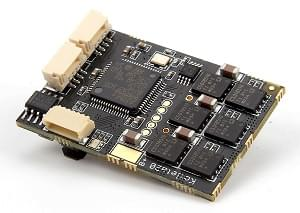

# UAVCAN ESCs (Motor Controllers)

PX4 supports the [UAVCAN](https://uavcan.org/) bus for connecting peripherals, including ESCs, GPS modules, various types of sensors, etc.

UAVCAN ESCs have a number of advantages over [PWM ESCs and Servos](../peripherals/pwm_escs_and_servo.md):

- UAVCAN has been specifically designed to deliver robust and reliable connectivity over relatively large distances. It enables safe use of ESCs on bigger vehicles and communication redundancy.
- The bus is bi-directional, enabling health monitoring and diagnostics.
- Wiring is less complicated as you can have a single bus for connecting all your ESCs and other UAVCAN peripherals.
- Setup is easier as you configure ESC numbering by manually spinning each motor.

## PX4 Supported ESC

PX4 is compatible with any/all UAVCAN ESCs (UAVCAN is generally speaking a plug'n'play protocol).

> **Note** At time of writing PX4 supports UAVCAN v0 (not v1.0).

The only difference between UAVCAN ESCs from a setup perspective is that the physical connectors and the software tools used to configure the motor order and direction may be different.

Some popular UAVCAN ESC firmware/products include:

- [Sapog](#sapog) firmware; an advanced open source sensorless PMSM/BLDC motor controller firmware designed for use in propulsion systems of electric unmanned vehicles. 
  - [Zubax Orel 20](https://zubax.com/products/orel_20)
  - [Holybro Kotleta20](https://shop.holybro.com/kotleta20_p1156.html)
- [Mitochondrik](https://zubax.com/products/mitochondrik) - integrated sensorless PMSM/BLDC motor controller chip (used in ESCs and integrated drives) 
  - [Zubax Sadulli Integrated Drive](https://shop.zubax.com/collections/integrated-drives/products/sadulli-integrated-drive-open-hardware-reference-design-for-mitochondrik?variant=27740841181283)
- [Myxa](https://zubax.com/products/myxa) - High-end PMSM/BLDC motor controller (FOC ESC) for light unmanned aircraft and watercraft.
- [VESC Project ESCs](https://vesc-project.com/) (see also [Benjamin Vedder's blog](http://vedder.se) - project owner)
- [OlliW’s UC4H ESC-Actuator Node](http://www.olliw.eu/2017/uavcan-for-hobbyists/#chapterescactuator)
- A number of others are [listed here](https://forum.uavcan.org/t/uavcan-esc-options/452/3?u=pavel.kirienko)

> **Note** This list is *not exhaustive/complete*. If you know of another ESC, please add it to the list!

## Purchase

Sapog-based ESCs:

- [Zubax Orel 20](https://zubax.com/products/orel_20)
  
    

- [Holybro Kotleta20](https://shop.holybro.com/kotleta20_p1156.html)
  
     

Mitochondrik based drives and ESC:

- [Zubax Sadulli Integrated Drive](https://shop.zubax.com/collections/integrated-drives/products/sadulli-integrated-drive-open-hardware-reference-design-for-mitochondrik?variant=27740841181283)
  
    

> **Note** There are many other commercially available ESCs; please add new links as you find them!

## Wiring/Connections {#connecting}

Connect all of the on-board UAVCAN devices into a chain and make sure the bus is terminated at the end nodes. The order in which the ESCs are connected/chained does not matter.

> **Note** All UAVCAN ESCs share the same connection architecture/are wired the same way. Note however that the actual connectors differ (e.g. *Zubax Orel 20* and *Holybro Kotleta20* use Dronecode standard connectors (JST-GH 4 Pin) - while VESCs do not).

For more information information about proper bus connections see [UAVCAN Device Interconnection](https://kb.zubax.com/display/MAINKB/UAVCAN+device+interconnection) (Zubax KB).

## PX4 Configuration

In order to use a UAVCAN ESC with PX4 you will need to enable the UAVCAN driver:

1. Power the vehicle using the battery (you must power the whole vehicle, not just the flight controller!) and connect *QGroundControl*.
2. Navigate to the **Vehicle Setup > Parameters** screen > [Parameters](../advanced_config/parameters.md) explains how to find and set parameters.
3. Set [UAVCAN_ENABLE](../advanced_config/parameter_reference.md#UAVCAN_ENABLE) to the value *Sensors and Motors* (3) and then reboot the flight controller.

If applicable (some systems will not benefit from this behavior, e.g. glider drones):

1. Set [UAVCAN_ESC_IDLT](../advanced_config/parameter_reference.md#UAVCAN_ESC_IDLT) to 1 in order to ensure that the motors are always running at least at the idle throttle while the system is armed.

## ESC Setup

While UAVCAN devices are generally *plug'n'play* you will still need to enumerate (number) each of the ESC used in your system and set their direction so that they can be identified/controlled by PX4.

> **Note** The ESC index and direction must match/map to the [Airframe Reference](../airframes/airframe_reference.md) for the vehicle type. ESC indexes from 0-7 map to MAIN 1-8, while ESC indexes 8-15 map to AUX 1-8.

The mechanism for enumerating each type of UAVCAN ESC is different (look up the instructions in your ESC's manual). Setup information for some UAVCAN ESCs is provided below.

### Sapog ESC setup {#sapog}

The following sections explain how to enumerate [Sapog-based](https://github.com/PX4/sapog#px4-sapog)-based ESCs with PX4. The instructions should work for any Sapog-based ESC design.

#### ESC Enumeration using QGroundControl {#sapog_esc_qgc}

> **Tip** You can skip this section if there is only one ESC in your setup, because the ESC index is already set to zero by default.

To enumerate the ESC:

1. Power the vehicle with a battery and connect to *QGroundControl*
2. Navigate to **Vehicle Setup > Power** in QGC.
3. Start the process of ESC auto-enumeration by pressing the **Start Assignment** button, as shown on the screenshot below.
  
    
  
    You will hear a sound indicating that the flight controller has entered the ESC enumeration mode.

4. Manually turn each motor in the correct direction of its rotation, starting from the first motor and finishing with the last motor. Each time you turn a motor, you should hear a confirmation.
  
  > **Note** Make sure to turn each of the motors in the correct direction, because the ESC will automatically learn and remember the direction (i.e. motors that spin clockwise during normal operation must also be turned clockwise during enumeration).

5. After the last motor is enumerated, the confirmation sound should change to indicate that the enumeration procedure is complete.

The following video demonstrates the process:

 https://www.youtube.com/watch?v=4nSa8tvpbgQ 

#### Manual ESC Enumeration using Sapog

> **Tip** We recommend automated [ESC Enumeration using QGroundControl](#sapog_esc_qgc) rather than manual enumeration - it is easier and safer.

You can manually configure the ESC index and direction using the [UAVCAN GUI Tool](https://uavcan.org/GUI_Tool/Overview/). This assigns the following Sapog configuration parameters for each enumerated ESC:

- `esc_index`
- `ctl_dir`

> **Note** See [Sapog reference manual](https://files.zubax.com/products/io.px4.sapog/Sapog_v2_Reference_Manual.pdf) for more information about the parameters.

### Myxa ESC Setup

Motor enumeration for Myxa [Telega-based ESCs](https://zubax.com/products/telega) is usually performed using the [Kucher tool](https://files.zubax.com/products/com.zubax.kucher/) (or less "GUI-friendly" [UAVCAN GUI Tool](https://uavcan.org/GUI_Tool/Overview/)).

There is some guidance here: [Quick start guide for Myxa v0.1](https://forum.zubax.com/t/quick-start-guide-for-myxa-v0-1/911) (Zubax blog).

### VESC ESC Setup

For VESC the preferred tool for motor enumeration is the [VESC tool](https://vesc-project.com/vesc_tool).

## Further Information

- [PX4/Sapog](https://github.com/PX4/sapog#px4-sapog) (Github)
- [Sapog v2 Reference Manual](https://files.zubax.com/products/io.px4.sapog/Sapog_v2_Reference_Manual.pdf)
- [UAVCAN Device Interconnection](https://kb.zubax.com/display/MAINKB/UAVCAN+device+interconnection) (Zubax KB)
- [Using Sapog based ESC with PX4](https://kb.zubax.com/display/MAINKB/Using+Sapog-based+ESC+with+PX4) (Zubax KB)