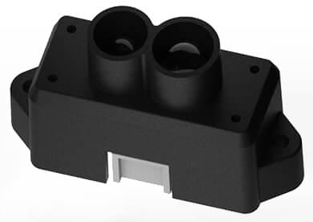

# Benewake TFmini LiDAR

The [Benewake TFmini LiDAR](http://en.benewake.com/product/detail/5c345e26e5b3a844c472329c.html) is a tiny, low cost, and low power LIDAR with 12m range. It must be connected to a UART/serial bus.

## Hardware Setup

TFmini can be connected to any unused *serial port* (UART), e.g.: TELEM2, TELEM3, GPS2 etc.

## Parameter Setup

[Configure the serial port](../peripherals/serial_configuration.md) on which the lidar will run using [SENS_TFMINI_CFG](../advanced_config/parameter_reference.md#SENS_TFMINI_CFG). There is no need to set the baud rate (this is hard coded in the sensor driver as only one rate is supported).

:::note
If the configuration parameter is not available in *QGroundControl* then you may need to [add the driver to the firmware](../peripherals/serial_configuration.md#parameter_not_in_firmware):

    drivers/distance_sensor/tfmini
    

:::