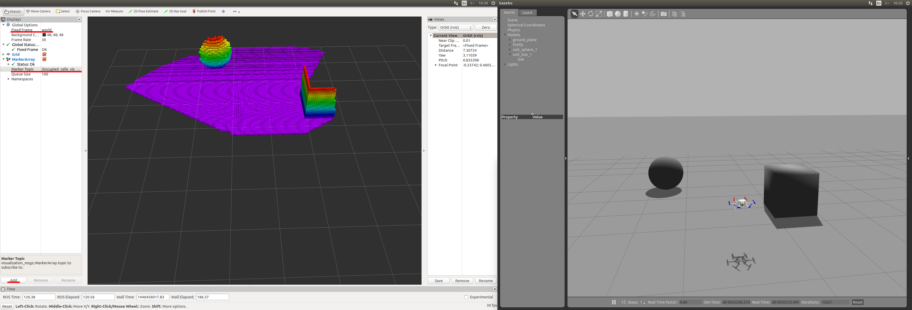

# OctoMap 3D Models with ROS/Gazebo

The [OctoMap library](http://octomap.github.io/) is an open source library for generating volumetric 3D environment models from sensor data. This model data can then be used by a drone for navigation and obstacle avoidance.

This guide covers how to use *OctoMap* with the Gazebo [Rotors Simulator](https://github.com/ethz-asl/rotors_simulator/wiki/RotorS-Simulator) and ROS.

## Installation

The installation requires ROS, Gazebo and the Rotors Simulator plugin. Follow the [Rotors Simulator instructions](https://github.com/ethz-asl/rotors_simulator) to install.

Next, install the *OctoMap* library:
```sh
sudo apt-get install ros-indigo-octomap ros-indigo-octomap-mapping
rosdep install octomap_mapping
rosmake octomap_mapping
```

Now, open ~/catkin_ws/src/rotors_simulator/rotors_gazebo/CMakeLists.txt and add the following lines to the bottom of the file
```sh
find_package(octomap REQUIRED)
include_directories(${OCTOMAP_INCLUDE_DIRS})
link_libraries(${OCTOMAP_LIBRARIES})
```

Open ~/catkin_ws/src/rotors_simulator/rotors_gazebo/package.xml and add the following lines
```sh
<build_depend>octomap</build_depend>
<run_depend>octomap</run_depend>
```

Run the following two lines:

:::note
The first line changes your default shell editor to *gedit*. This is recommended for users who have little experience with *vim* (the default editor), but can otherwise be omitted.
:::

```sh
export EDITOR='gedit'
rosed octomap_server octomap_tracking_server.launch
```
and change the two following lines:

```sh
<param name="frame_id" type="string" value="map" />
...
<!--remap from="cloud_in" to="/rgbdslam/batch_clouds" /-->
```

to:
```sh
<param name="frame_id" type="string" value="world" />
...
<remap from="cloud_in" to="/firefly/vi_sensor/camera_depth/depth/points" />
```


## Running the Simulation

Run the following three lines in *separate* terminal windows. This opens up [Gazebo](../simulation/gazebo.md), *Rviz* and an octomap server.

```sh
roslaunch rotors_gazebo mav_hovering_example_with_vi_sensor.launch  mav_name:=firefly
rviz
roslaunch octomap_server octomap_tracking_server.launch
```

In *Rviz*, change the field 'Fixed Frame' from 'map' to 'world' in the top left of the window. Now click the add button in the bottom left and select MarkerArray. Then double click the MarkerArray and change 'Marker Topic' from '/free_cells_vis_array' to '/occupied_cells_vis_array'

Now you should see a part of the floor.

In the *Gazebo* window, insert a cube in front of the red rotors and you should see it in *Rviz*.



