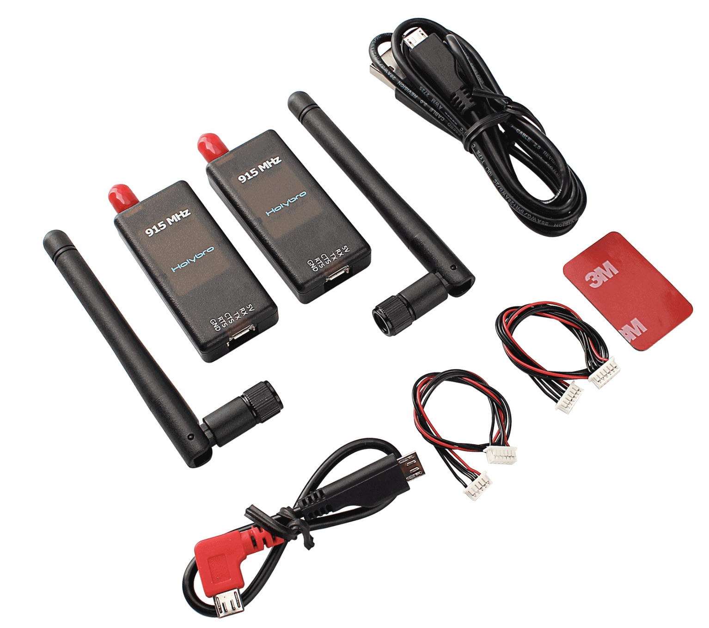

# Holybro Telemetry Radio

Holybro has a number of [SiK](../telemetry/sik_radio.md)-compatible telemetry radios that can be used with PX4. 915MHz (USA) and 433MHz (Europe) versions are available.

## Purchase:

* [Holybro Transceiver Telemetry Radio V3 433MHz](http://www.holybro.com/product/transceiver-telemetry-radio-v3/)
* [Holybro Transceiver Telemetry Radio V3 915MHz](http://www.holybro.com/product/transceiver-telemetry-radio-v3-915mhz/)
* [Holybro Telemetry Radio V3](https://shop.holybro.com/transceiver-telemetry-radio-v3_p1103.html)