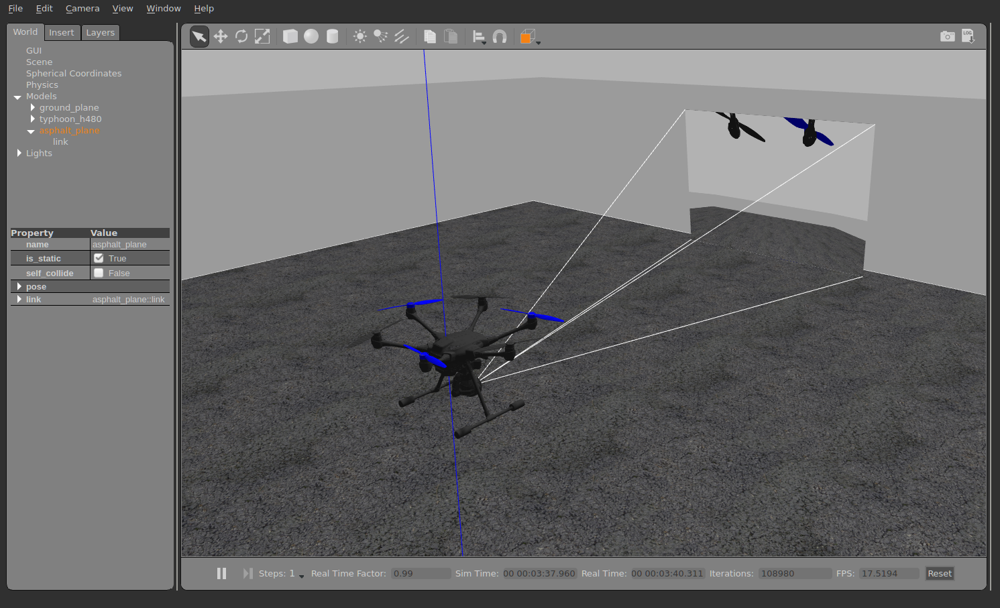

# Gimbal Control Setup

If you want to control a gimbal with a camera (or any other payload) attached to the vehicle, you need to configure how you want to control it and how PX4 can command it. This page explains the setup.

PX4 contains a generic mount/gimbal control driver with different input and output methods.
- The input defines how you control the gimbal: via RC or via MAVLink commands (for example in missions or surveys).
- The output defines how the gimbal is connected: either via MAVLink commands or using the Flight Controller AUX PWM port. Any input method can be selected to drive any output, and both input and output have to be configured via parameters.

## Parameters

The [Mount](../advanced_config/parameter_reference.md#mount) parameters are used to setup the mount driver.

The most important ones are the input ([MNT_MODE_IN](../advanced_config/parameter_reference.md#MNT_MODE_IN)) and the output ([MNT_MODE_OUT](../advanced_config/parameter_reference.md#MNT_MODE_OUT)) mode. By default, the input is disabled and the driver does not run. After selecting the input mode, reboot the vehicle so that the mount driver starts.

If the input mode is set to `AUTO`, the mode will automatically be switched based on the latest input. To switch from MAVLink to RC, a large stick motion is required.

## MAVLink Gimbal (MNT_MODE_OUT=MAVLINK)

To enable a MAVLink gimbal, first set parameter [MNT_MODE_IN](../advanced_config/parameter_reference.md#MNT_MODE_IN) to `MAVLINK_DO_MOUNT` and [MNT_MODE_OUT](../advanced_config/parameter_reference.md#MNT_MODE_OUT) to `MAVLINK`.

The gimbal can be connected to *any free serial port* using the instructions in [MAVLink Peripherals (GCS/OSD/Companion)](../peripherals/mavlink_peripherals.md) (also see [Serial Port Configuration](../peripherals/serial_configuration.md#serial-port-configuration)).

A common configuration is to have a serial connection to the gimbal from the Flight Controller TELEM2 port (assuming TELEM2 is free). For this configuration you would set:
- [MAV_1_CONFIG](../advanced_config/parameter_reference.md#MAV_1_CONFIG) to **TELEM2** (if `MAV_1_CONFIG` is already used for a companion computer (say), use `MAV_2_CONFIG`).
- [MAV_1_MODE](../advanced_config/parameter_reference.md#MAV_1_MODE) to **NORMAL**
- [SER_TEL2_BAUD](../advanced_config/parameter_reference.md#SER_TEL2_BAUD) to manufacturer recommended baud rate.

This will enable the user to command the gimbal using [MAV_CMD_DO_MOUNT_CONTROL](https://mavlink.io/en/messages/common.html#MAV_CMD_DO_MOUNT_CONTROL) and [MAV_CMD_DO_MOUNT_CONFIGURE](https://mavlink.io/en/messages/common.html#MAV_CMD_DO_MOUNT_CONFIGURE).


## Gimbal on Flight Controller (MNT_MODE_OUT=AUX)

The gimbal can be connected to the Flight controller AUX ports by setting the output mode to `MNT_MODE_OUT=AUX`.

A mixer file is required to define the mapping for the output pins and the [mount mixer](https://github.com/PX4/PX4-Autopilot/blob/release/1.13/ROMFS/px4fmu_common/mixers/mount.aux.mix) is automatically selected (this overrides any AUX mixer provided by the airframe configuration).

The output assignment is as following:
- **AUX1**: Pitch
- **AUX2**: Roll
- **AUX3**: Yaw
- **AUX4**: Shutter/retract

### Customizing the mixer configuration

:::tip
Read [Mixing and Actuators](../concept/mixing.md) for an explanation of how mixers work and the format of the mixer file.
:::

The outputs can be customized by [creating a mixer file](../concept/system_startup.md#starting-a-custom-mixer) on the SD card named `etc/mixers/mount.aux.mix`.

A basic mixer configuration for a mount is shown below.

```
# roll
M: 1
O:      10000  10000      0 -10000  10000
S: 2 0  10000  10000      0 -10000  10000

# pitch
M: 1
O:      10000  10000      0 -10000  10000
S: 2 1  10000  10000      0 -10000  10000

# yaw
M: 1
O:      10000  10000      0 -10000  10000
S: 2 2  10000  10000      0 -10000  10000
```


## SITL

The Typhoon H480 model comes with a preconfigured simulated gimbal.

To run it, use:
```
make px4_sitl gazebo_typhoon_h480
```

To just test the mount driver on other models or simulators, make sure the driver runs (using `vmount start`), then configure its parameters.


## Testing
The driver provides a simple test command - it needs to be stopped first with `vmount stop`. The following describes testing in SITL, but the commands also work on a real device.

Start the simulation with (no parameter needs to be changed for that):
```
make px4_sitl gazebo_typhoon_h480
```
Make sure it's armed, eg. with `commander takeoff`, then use the following command to control the gimbal (for example):
```
vmount test yaw 30
```

Note that the simulated gimbal stabilizes itself, so if you send MAVLink commands, set the `stabilize` flags to `false`.



