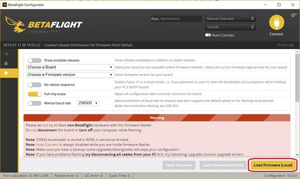

# Bootloader Flashing onto Betaflight Systems

This page documents how to flash the PX4 bootloader onto boards preflashed with Betaflight (e.g. [OmnibusF4 SD](../flight_controller/omnibus_f4_sd.md) or [Kakute F7](../flight_controller/kakutef7.md)).

There are two options for flashing the bootloader: via *Betaflight Configurator* (easier), or building from source.

<span id="betaflight_configurator"></span>
### Bootloader Update using Betaflight Configurator

To install the PX4 bootloader using the *Betaflight Configurator*:
1. You should have downloaded already the pre-built bootloader binary (this depends on the board you want to flash).
1. Download the [Betaflight Configurator](https://github.com/betaflight/betaflight-configurator/releases) for your platform. :::tip If using the *Chrome* web browser, a simple cross-platform alternative is to install the configurator as an [extension from here](https://chrome.google.com/webstore/detail/betaflight-configurator/kdaghagfopacdngbohiknlhcocjccjao).
:::
1. Connect the board to your PC and start the Configurator.
1. Press the **Load Firmware [Local]** button 
1. Select the bootloader binary from the file system and then flash the board.

You should now be able to install PX4 firmware on the board.

### Bootloader Update using Source

#### Download Bootloader Source

Download and build the [Bootloader](https://github.com/PX4/Bootloader) via:
```
git clone --recursive  https://github.com/PX4/Bootloader.git
cd Bootloader
make <target> # For example: omnibusf4sd_bl or kakutef7_bl
```

#### Flash Bootloader

You can flash the PX4 bootloader using the [dfu-util](http://dfu-util.sourceforge.net/) or the graphical [dfuse](https://www.st.com/en/development-tools/stsw-stm32080.html) tool on windows.

Don't be afraid to try flashing using any of the methods below.

:::note
The STM32 MCU cannot be bricked. 
DFU cannot be overwritten by flashing and will always allow you to install a new firmware, even if flashing fails.
:::

##### Enter DFU mode

Both methods require the board to be in DFU mode. To enter DFU mode, hold the boot button down while connecting the USB cable to your computer. The button can be released after the board is powered up.

##### dfu-util

```
dfu-util -a 0 --dfuse-address 0x08000000 -D  build/<target>/<target>.bin
```

Reboot the flight controller and it let it boot without holding the boot button.

##### dfuse

See the dfuse manual here: https://www.st.com/resource/en/user_manual/cd00155676.pdf

Flash the **<target>.bin** file.


<span id="reinstall_betaflight"></span>
## Reinstall Betaflight

In order to switch back to *Betaflight*:
- Backup the PX4 parameters, e.g. by [exporting](../advanced/parameters_and_configurations.md#exporting-and-loading-parameters) them to an SD card
- Keep the **bootloader** button pressed while attaching the USB cable
- Then flash *Betaflight* as usual with the *Betaflight-configurator*

