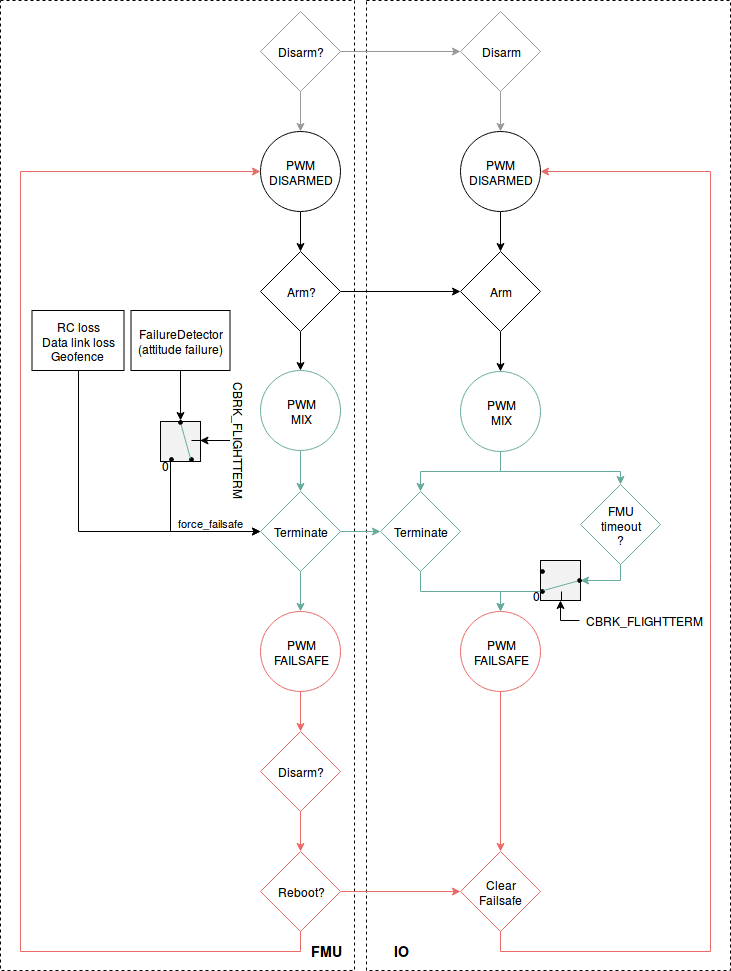

# Flight Termination Configuration

The *Flight termination* [failsafe action](../config/safety.md#failsafe_actions) may be triggered by a [safety check](../config/safety.md) (e.g. RC Loss, geofence violation, etc. on any vehicle type or in any flight mode), or by the [Failure Detector](../config/safety.md#failure_detector).

When *Flight termination* is activated, PX4 simultaneously turns off all controllers and sets all PWM outputs to their failsafe values.

Depending on what devices are connected, the PWM failsafe outputs can be used to:

- Deploy a [parachute](../peripherals/parachute.md).
- Extend retractable landing gear.
- Move a PWM-connected gimbal to a safe orientation (or retract it) in order to protect the camera.
- Trigger an inflatable device like an airbag.
- Trigger an alarm.

There is no way to recover from flight termination. After triggering you should unplug the battery as soon as possible. You will need to reboot/power cycle the vehicle before it can be used again.

:::tip PX4 does not know what safety devices are attached - it just applies a predefined set of PWM values to its outputs.
:::

:::tip
Failsafe values are applied to all outputs on termination. There is no way to configure independent time-based (or other) triggering of the motors or specific safety devices.
:::

:::note
This is *not* an independent *Flight Termination System*. If power is lost or if the autopilot crashes completely, the failsafe devices will not be triggered.
:::

## Hardware Configuration

Any *safety device(s)* (e.g. a [parachute](../peripherals/parachute.md)) that can be triggered by changing a PWM value can be used, and may be connected to any free PWM port (both MAIN and AUX).

:::note
If you're using Pixhawk-series board you will have to separately power the servo rail (i.e. from a 5V BEC, which is often also available from your ESC).
:::

## Software Configuration

The [Safety](../config/safety.md) topic explains how to set the *flight termination* as the [failsafe action](../config/safety.md#failsafe_actions) to be performed for particular failsafe check.

The [Failure Detector](../config/safety.md#failure_detector) can also (optionally) be configured to trigger flight termination if the vehicle flips (exceeds a certain attitude) or if failure is detected by an external automatic trigger system (ATS):

- Enable the failure detector during flight by setting [CBRK_FLIGHTTERM=0](../advanced_config/parameter_reference.md#CBRK_FLIGHTTERM).
- [Safety > Failure Detector > Attitude Trigger](../config/safety.md#attitude_trigger) explains how to configure the attitude limits that trigger *Flight termination*. :::note During *takeoff* excessive attitutes will trigger *lockdown* (kill motors, but not launch parachute) rather than flight termination. This is always enabled, irrespective of the value of `CBRK_FLIGHTTERM`.
:::
- [Safety > External Automatic Trigger System (ATS)](../config/safety.md#external_ats) explains how to configure an external trigger system.

For each MAIN output to which a safety device is attached, where "n" is the PWM port number, set:

- [PWM_MAIN_DISn](../advanced_config/parameter_reference.md#PWM_MAIN_DIS1) to the device's "OFF" PWM value.
- [PWM_MAIN_FAILn](../advanced_config/parameter_reference.md#PWM_MAIN_FAIL1) to the device's "ON" PWM value.

For each AUX output to which a safety device is attached, where "n" is the PWM port number, set:

- [PWM_AUX_DIS1](../advanced_config/parameter_reference.md#PWM_AUX_DIS1) to the device's "OFF" PWM value.
- [PWM_AUX_FAILn](../advanced_config/parameter_reference.md#PWM_AUX_FAIL1) to the device's "ON" PWM value.

Finally, set the `PWM_AUX_FAILn` and `PWM_MAIN_FAILn` PWM values for any motors.

## Logic Diagram

The diagram below shows the logical flow around flight termination.

