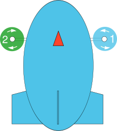
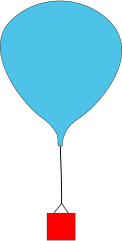

# Airframes Reference

:::note
**This list is [auto-generated](https://github.com/PX4/PX4-Autopilot/blob/release/1.13/Tools/px4airframes/markdownout.py) from the source code** using the build command: `make airframe_metadata`.
:::

This page lists all supported airframes and types including the motor assignment and numbering. The motors in **green** rotate clockwise, the ones in **blue** counterclockwise.

**AUX** channels may not be present on some flight controllers. If present, PWM AUX channels are commonly labelled **AUX OUT**.

## Airship

### Airship

<table>
 <thead>
   <tr><th>Common Outputs</th></tr>
 </thead>
 <tbody>
<tr>
 <td><ul><li><b>MAIN1</b>: starboard thruster</li><li><b>MAIN2</b>: port thruster</li><li><b>MAIN3</b>: thrust tilt</li><li><b>MAIN4</b>: tail thruster</li></ul></td>
</tr>
</tbody></table>

<table>
 <thead>
   <tr><th>Name</th><th></th></tr>
 </thead>
<tbody>
<tr id="airship_airship_cloudship">
 <td>Cloudship</td>
 <td>Maintainer: John Doe &lt;john@example.com&gt;
<code>SYS_AUTOSTART</code> = 2507
</td>
</tr>
</tbody>
</table>

## Autogyro

### Autogyro

<table>
 <thead>
   <tr><th>Common Outputs</th></tr>
 </thead>
 <tbody>
<tr>
 <td><ul><li><b>MAIN4</b>: rudder</li></ul></td>
</tr>
</tbody></table>

<table>
 <thead>
   <tr><th>Name</th><th></th></tr>
 </thead>
<tbody>
<tr id="autogyro_autogyro_thunderfly_auto-g2">
 <td><a href="https://github.com/ThunderFly-aerospace/Auto-G2/">ThunderFly Auto-G2</a></td>
 <td>Maintainer: ThunderFly s.r.o., Roman Dvorak &lt;dvorakroman@thunderfly.cz&gt;
<code>SYS_AUTOSTART</code> = 17002

<b>Specific Outputs:</b><ul><li><b>MAIN1</b>: rotor_head_L</li><li><b>MAIN2</b>: rotor_head_R</li><li><b>MAIN3</b>: elevator</li><li><b>MAIN5</b>: rudder (second, optional)</li><li><b>MAIN6</b>: throttle</li><li><b>MAIN7</b>: wheel</li><li><b>AUX1</b>: feed-through of RC AUX1 channel for prerotator (optional)</li><li><b>AUX2</b>: feed-through of RC AUX2 channel for release device (optional)</li></ul>
</td>
</tr>
<tr id="autogyro_autogyro_thunderfly_tf-g2">
 <td><a href="https://github.com/ThunderFly-aerospace/TF-G2/">ThunderFly TF-G2</a></td>
 <td>Maintainer: ThunderFly s.r.o., Roman Dvorak &lt;dvorakroman@thunderfly.cz&gt;
<code>SYS_AUTOSTART</code> = 17003

<b>Specific Outputs:</b><ul><li><b>MAIN2</b>: rotor_head_L</li><li><b>MAIN3</b>: rotor_head_R</li><li><b>MAIN5</b>: throttle</li></ul>
</td>
</tr>
</tbody>
</table>

## Balloon

### Balloon

<table>
 <thead>
   <tr><th>Name</th><th></th></tr>
 </thead>
<tbody>
<tr id="balloon_balloon_thunderfly_balloon_tf-b1">
 <td><a href="https://github.com/ThunderFly-aerospace/TF-B1/">ThunderFly balloon TF-B1</a></td>
 <td>Maintainer: ThunderFly s.r.o.
<code>SYS_AUTOSTART</code> = 18001
</td>
</tr>
</tbody>
</table>

## Copter

### Coaxial Helicopter

<table>
 <thead>
   <tr><th>Common Outputs</th></tr>
 </thead>
 <tbody>
<tr>
 <td><ul><li><b>MAIN1</b>: Left swashplate servomotor, pitch axis</li><li><b>MAIN2</b>: Right swashplate servomotor, roll axis</li><li><b>MAIN3</b>: Upper rotor (CCW)</li><li><b>MAIN4</b>: Lower rotor (CW)</li></ul></td>
</tr>
</tbody></table>

<table>
 <thead>
   <tr><th>Name</th><th></th></tr>
 </thead>
<tbody>
<tr id="copter_coaxial_helicopter_esky_(big)_lama_v4">
 <td>Esky (Big) Lama v4</td>
 <td>Maintainer: Emmanuel Roussel
<code>SYS_AUTOSTART</code> = 15001
</td>
</tr>
</tbody>
</table>

### Dodecarotor cox

<table>
 <thead>
   <tr><th>Common Outputs</th></tr>
 </thead>
 <tbody>
<tr>
 <td><ul><li><b>MAIN1</b>: motor 1</li><li><b>MAIN2</b>: motor 2</li><li><b>MAIN3</b>: motor 3</li><li><b>MAIN4</b>: motor 4</li><li><b>MAIN5</b>: motor 5</li><li><b>MAIN6</b>: motor 6</li><li><b>AUX1</b>: motor 7</li><li><b>AUX2</b>: motor 8</li><li><b>AUX3</b>: motor 9</li><li><b>AUX4</b>: motor 10</li><li><b>AUX5</b>: motor 11</li><li><b>AUX6</b>: motor 12</li></ul></td>
</tr>
</tbody></table>

<table>
 <thead>
   <tr><th>Name</th><th></th></tr>
 </thead>
<tbody>
<tr id="copter_dodecarotor_cox_generic_dodecarotor_cox_geometry">
 <td>Generic Dodecarotor cox geometry</td>
 <td>Maintainer: William Peale &lt;develop707@gmail.com&gt;
<code>SYS_AUTOSTART</code> = 24001
</td>
</tr>
</tbody>
</table>

### Helicopter

<table>
 <thead>
   <tr><th>Common Outputs</th></tr>
 </thead>
 <tbody>
<tr>
 <td><ul><li><b>MAIN1</b>: main motor</li><li><b>MAIN2</b>: front swashplate servo</li><li><b>MAIN3</b>: right swashplate servo</li><li><b>MAIN4</b>: left swashplate servo</li><li><b>MAIN5</b>: tail-rotor servo</li></ul></td>
</tr>
</tbody></table>

<table>
 <thead>
   <tr><th>Name</th><th></th></tr>
 </thead>
<tbody>
<tr id="copter_helicopter_blade_130x">
 <td>Blade 130X</td>
 <td>Maintainer: Bart Slinger &lt;bartslinger@gmail.com&gt;
<code>SYS_AUTOSTART</code> = 16001
</td>
</tr>
</tbody>
</table>

### Hexarotor +

<table>
 <thead>
   <tr><th>Common Outputs</th></tr>
 </thead>
 <tbody>
<tr>
 <td><ul><li><b>MAIN1</b>: motor1</li><li><b>MAIN2</b>: motor2</li><li><b>MAIN3</b>: motor3</li><li><b>MAIN4</b>: motor4</li><li><b>MAIN5</b>: motor5</li><li><b>MAIN6</b>: motor6</li><li><b>AUX1</b>: feed-through of RC AUX1 channel</li><li><b>AUX2</b>: feed-through of RC AUX2 channel</li><li><b>AUX3</b>: feed-through of RC AUX3 channel</li></ul></td>
</tr>
</tbody></table>

<table>
 <thead>
   <tr><th>Name</th><th></th></tr>
 </thead>
<tbody>
<tr id="copter_hexarotor_+_generic_hexarotor_+_geometry">
 <td>Generic Hexarotor + geometry</td>
 <td>Maintainer: Lorenz Meier &lt;lorenz@px4.io&gt;
<code>SYS_AUTOSTART</code> = 7001
</td>
</tr>
</tbody>
</table>

### Hexarotor Coaxial

<table>
 <thead>
   <tr><th>Common Outputs</th></tr>
 </thead>
 <tbody>
<tr>
 <td><ul><li><b>MAIN1</b>: front right top, CW; angle:60; direction:CW</li><li><b>MAIN2</b>: front right bottom, CCW; angle:60; direction:CCW</li><li><b>MAIN3</b>: back top, CW; angle:180; direction:CW</li><li><b>MAIN4</b>: back bottom, CCW; angle:180; direction:CCW</li><li><b>MAIN5</b>: front left top, CW; angle:-60; direction:CW</li><li><b>MAIN6</b>: front left bottom, CCW;angle:-60; direction:CCW</li><li><b>AUX1</b>: feed-through of RC AUX1 channel</li><li><b>AUX2</b>: feed-through of RC AUX2 channel</li><li><b>AUX3</b>: feed-through of RC AUX3 channel</li></ul></td>
</tr>
</tbody></table>

<table>
 <thead>
   <tr><th>Name</th><th></th></tr>
 </thead>
<tbody>
<tr id="copter_hexarotor_coaxial_generic_hexarotor_coaxial_geometry">
 <td>Generic Hexarotor coaxial geometry</td>
 <td>Maintainer: Lorenz Meier &lt;lorenz@px4.io&gt;
<code>SYS_AUTOSTART</code> = 11001
</td>
</tr>
</tbody>
</table>

### Hexarotor x

<table>
 <thead>
   <tr><th>Common Outputs</th></tr>
 </thead>
 <tbody>
<tr>
 <td><ul><li><b>MAIN1</b>: motor 1</li><li><b>MAIN2</b>: motor 2</li><li><b>MAIN3</b>: motor 3</li><li><b>MAIN4</b>: motor 4</li><li><b>MAIN5</b>: motor 5</li><li><b>MAIN6</b>: motor 6</li><li><b>AUX1</b>: feed-through of RC AUX1 channel</li><li><b>AUX2</b>: feed-through of RC AUX2 channel</li></ul></td>
</tr>
</tbody></table>

<table>
 <thead>
   <tr><th>Name</th><th></th></tr>
 </thead>
<tbody>
<tr id="copter_hexarotor_x_generic_hexarotor_x_geometry">
 <td>Generic Hexarotor x geometry</td>
 <td>Maintainer: Lorenz Meier &lt;lorenz@px4.io&gt;
<code>SYS_AUTOSTART</code> = 6001

<b>Specific Outputs:</b><ul><li><b>AUX3</b>: feed-through of RC AUX3 channel</li></ul>
</td>
</tr>
<tr id="copter_hexarotor_x_uvify_draco-r">
 <td>UVify Draco-R</td>
 <td>Maintainer: Hyon Lim &lt;lim@uvify.com&gt;
<code>SYS_AUTOSTART</code> = 6002
</td>
</tr>
</tbody>
</table>

### Octorotor +

<table>
 <thead>
   <tr><th>Common Outputs</th></tr>
 </thead>
 <tbody>
<tr>
 <td><ul><li><b>MAIN1</b>: motor 1</li><li><b>MAIN2</b>: motor 2</li><li><b>MAIN3</b>: motor 3</li><li><b>MAIN4</b>: motor 4</li><li><b>MAIN5</b>: motor 5</li><li><b>MAIN6</b>: motor 6</li><li><b>MAIN7</b>: motor 7</li><li><b>MAIN8</b>: motor 8</li><li><b>AUX1</b>: feed-through of RC AUX1 channel</li><li><b>AUX2</b>: feed-through of RC AUX2 channel</li><li><b>AUX3</b>: feed-through of RC AUX3 channel</li></ul></td>
</tr>
</tbody></table>

<table>
 <thead>
   <tr><th>Name</th><th></th></tr>
 </thead>
<tbody>
<tr id="copter_octorotor_+_generic_octocopter_+_geometry">
 <td>Generic Octocopter + geometry</td>
 <td>Maintainer: Lorenz Meier &lt;lorenz@px4.io&gt;
<code>SYS_AUTOSTART</code> = 9001
</td>
</tr>
</tbody>
</table>

### Octorotor Coaxial

<table>
 <thead>
   <tr><th>Common Outputs</th></tr>
 </thead>
 <tbody>
<tr>
 <td><ul><li><b>MAIN1</b>: motor 1</li><li><b>MAIN2</b>: motor 2</li><li><b>MAIN3</b>: motor 3</li><li><b>MAIN4</b>: motor 4</li><li><b>MAIN5</b>: motor 5</li><li><b>MAIN6</b>: motor 6</li><li><b>MAIN7</b>: motor 7</li><li><b>MAIN8</b>: motor 8</li></ul></td>
</tr>
</tbody></table>

<table>
 <thead>
   <tr><th>Name</th><th></th></tr>
 </thead>
<tbody>
<tr id="copter_octorotor_coaxial_generic_10__octo_coaxial_geometry">
 <td>Generic 10" Octo coaxial geometry</td>
 <td>Maintainer: Lorenz Meier &lt;lorenz@px4.io&gt;
<code>SYS_AUTOSTART</code> = 12001
</td>
</tr>
</tbody>
</table>

### Octorotor x

<table>
 <thead>
   <tr><th>Common Outputs</th></tr>
 </thead>
 <tbody>
<tr>
 <td><ul><li><b>MAIN1</b>: motor 1</li><li><b>MAIN2</b>: motor 2</li><li><b>MAIN3</b>: motor 3</li><li><b>MAIN4</b>: motor 4</li><li><b>MAIN5</b>: motor 5</li><li><b>MAIN6</b>: motor 6</li><li><b>MAIN7</b>: motor 7</li><li><b>MAIN8</b>: motor 8</li><li><b>AUX1</b>: feed-through of RC AUX1 channel</li><li><b>AUX2</b>: feed-through of RC AUX2 channel</li><li><b>AUX3</b>: feed-through of RC AUX3 channel</li></ul></td>
</tr>
</tbody></table>

<table>
 <thead>
   <tr><th>Name</th><th></th></tr>
 </thead>
<tbody>
<tr id="copter_octorotor_x_generic_octocopter_x_geometry">
 <td>Generic Octocopter X geometry</td>
 <td>Maintainer: Lorenz Meier &lt;lorenz@px4.io&gt;
<code>SYS_AUTOSTART</code> = 8001
</td>
</tr>
</tbody>
</table>

### Quadrotor +

<table>
 <thead>
   <tr><th>Common Outputs</th></tr>
 </thead>
 <tbody>
<tr>
 <td><ul><li><b>MAIN1</b>: motor 1</li><li><b>MAIN2</b>: motor 2</li><li><b>MAIN3</b>: motor 3</li><li><b>MAIN4</b>: motor 4</li><li><b>MAIN5</b>: feed-through of RC AUX1 channel</li><li><b>MAIN6</b>: feed-through of RC AUX2 channel</li><li><b>AUX1</b>: feed-through of RC AUX1 channel</li><li><b>AUX2</b>: feed-through of RC AUX2 channel</li><li><b>AUX3</b>: feed-through of RC AUX3 channel</li><li><b>AUX4</b>: feed-through of RC FLAPS channel</li></ul></td>
</tr>
</tbody></table>

<table>
 <thead>
   <tr><th>Name</th><th></th></tr>
 </thead>
<tbody>
<tr id="copter_quadrotor_+_generic_10__quad_+_geometry">
 <td>Generic 10" Quad + geometry</td>
 <td>Maintainer: Lorenz Meier &lt;lorenz@px4.io&gt;
<code>SYS_AUTOSTART</code> = 5001
</td>
</tr>
</tbody>
</table>

### Quadrotor H

<table>
 <thead>
   <tr><th>Common Outputs</th></tr>
 </thead>
 <tbody>
<tr>
 <td><ul><li><b>MAIN1</b>: motor 1</li><li><b>MAIN2</b>: motor 2</li><li><b>MAIN3</b>: motor 3</li><li><b>MAIN4</b>: motor 4</li></ul></td>
</tr>
</tbody></table>

<table>
 <thead>
   <tr><th>Name</th><th></th></tr>
 </thead>
<tbody>
<tr id="copter_quadrotor_h_reaper_500_quad">
 <td>Reaper 500 Quad</td>
 <td>Maintainer: Blankered
<code>SYS_AUTOSTART</code> = 4040

<b>Specific Outputs:</b><ul><li><b>MAIN5</b>: feed-through of RC AUX1 channel</li><li><b>MAIN6</b>: feed-through of RC AUX2 channel</li></ul>
</td>
</tr>
<tr id="copter_quadrotor_h_betafpv_beta75x_2s_brushless_whoop">
 <td>BetaFPV Beta75X 2S Brushless Whoop</td>
 <td>Maintainer: Beat Kueng &lt;beat-kueng@gmx.net&gt;
<code>SYS_AUTOSTART</code> = 4041
</td>
</tr>
</tbody>
</table>

### Quadrotor Wide

<table>
 <thead>
   <tr><th>Common Outputs</th></tr>
 </thead>
 <tbody>
<tr>
 <td><ul><li><b>MAIN1</b>: motor 1</li><li><b>MAIN2</b>: motor 2</li><li><b>MAIN3</b>: motor 3</li><li><b>MAIN4</b>: motor 4</li><li><b>AUX1</b>: feed-through of RC AUX1 channel</li><li><b>AUX2</b>: feed-through of RC AUX2 channel</li><li><b>AUX3</b>: feed-through of RC AUX3 channel</li><li><b>AUX4</b>: feed-through of RC FLAPS channel</li></ul></td>
</tr>
</tbody></table>

<table>
 <thead>
   <tr><th>Name</th><th></th></tr>
 </thead>
<tbody>
<tr id="copter_quadrotor_wide_team_blacksheep_discovery">
 <td>Team Blacksheep Discovery</td>
 <td>Maintainer: Lorenz Meier &lt;lorenz@px4.io&gt;
<code>SYS_AUTOSTART</code> = 10015

<b>Specific Outputs:</b><ul><li><b>MAIN5</b>: feed-through of RC AUX1 channel</li><li><b>MAIN6</b>: feed-through of RC AUX2 channel</li></ul>
</td>
</tr>
<tr id="copter_quadrotor_wide_3dr_iris_quadrotor">
 <td>3DR Iris Quadrotor</td>
 <td>Maintainer: Lorenz Meier &lt;lorenz@px4.io&gt;
<code>SYS_AUTOSTART</code> = 10016
</td>
</tr>
<tr id="copter_quadrotor_wide_team_blacksheep_discovery_endurance">
 <td>Team Blacksheep Discovery Endurance</td>
 <td>Maintainer: Simon Wilks &lt;simon@uaventure.com&gt;
<code>SYS_AUTOSTART</code> = 10018

<b>Specific Outputs:</b><ul><li><b>MAIN5</b>: feed-through of RC AUX1 channel</li><li><b>MAIN6</b>: feed-through of RC AUX2 channel</li></ul>
</td>
</tr>
</tbody>
</table>

### Quadrotor asymmetric

<table>
 <thead>
   <tr><th>Common Outputs</th></tr>
 </thead>
 <tbody>
<tr>
 <td><ul><li><b>MAIN1</b>: motor1 (front right: CCW)</li><li><b>MAIN2</b>: motor2 (back left: CCW)</li><li><b>MAIN3</b>: motor3 (front left: CW)</li><li><b>MAIN4</b>: motor4 (back right: CW)</li><li><b>MAIN5</b>: feed-through of RC AUX1 channel</li><li><b>MAIN6</b>: feed-through of RC AUX2 channel</li></ul></td>
</tr>
</tbody></table>

<table>
 <thead>
   <tr><th>Name</th><th></th></tr>
 </thead>
<tbody>
<tr id="copter_quadrotor_asymmetric_spedix_s250aq">
 <td><a href="https://docs.px4.io/master/en/frames_multicopter/spedix_s250_pixracer.html">Spedix S250AQ</a></td>
 <td>Maintainer: Lorenz Meier &lt;lorenz@px4.io&gt;
<code>SYS_AUTOSTART</code> = 4051
</td>
</tr>
</tbody>
</table>

### Quadrotor x

<table>
 <thead>
   <tr><th>Name</th><th></th></tr>
 </thead>
<tbody>
<tr id="copter_quadrotor_x_generic_quadcopter">
 <td>Generic Quadcopter</td>
 <td>Maintainer: Lorenz Meier &lt;lorenz@px4.io&gt;
<code>SYS_AUTOSTART</code> = 4001

<b>Specific Outputs:</b><ul><li><b>MAIN1</b>: motor 1</li><li><b>MAIN2</b>: motor 2</li><li><b>MAIN3</b>: motor 3</li><li><b>MAIN4</b>: motor 4</li><li><b>MAIN5</b>: feed-through of RC AUX1 channel</li><li><b>MAIN6</b>: feed-through of RC AUX2 channel</li><li><b>AUX1</b>: feed-through of RC AUX1 channel</li><li><b>AUX2</b>: feed-through of RC AUX2 channel</li><li><b>AUX3</b>: feed-through of RC AUX3 channel</li><li><b>AUX4</b>: feed-through of RC FLAPS channel</li></ul>
</td>
</tr>
<tr id="copter_quadrotor_x_lumenier_qav-r_(raceblade)_5__arms">
 <td>Lumenier QAV-R (raceblade) 5" arms</td>
 <td>Maintainer: James Goppert &lt;james.goppert@gmail.com&gt;
<code>SYS_AUTOSTART</code> = 4003
</td>
</tr>
<tr id="copter_quadrotor_x_lumenier_qav250">
 <td>Lumenier QAV250</td>
 <td>Maintainer: Lorenz Meier &lt;lorenz@px4.io&gt;
<code>SYS_AUTOSTART</code> = 4009
</td>
</tr>
<tr id="copter_quadrotor_x_s500_generic">
 <td>S500 Generic</td>
 <td>Maintainer: Lorenz Meier &lt;lorenz@px4.io&gt;
<code>SYS_AUTOSTART</code> = 4014
</td>
</tr>
<tr id="copter_quadrotor_x_holybro_s500">
 <td>Holybro S500</td>
 <td>Maintainer: Lorenz Meier &lt;lorenz@px4.io&gt;
<code>SYS_AUTOSTART</code> = 4015
</td>
</tr>
<tr id="copter_quadrotor_x_px4_vision_devkit_platform">
 <td>PX4 Vision DevKit Platform</td>
 <td>Maintainer: John Doe &lt;john@example.com&gt;
<code>SYS_AUTOSTART</code> = 4016

<b>Specific Outputs:</b><ul><li><b>MAIN1</b>: motor 1</li><li><b>MAIN2</b>: motor 2</li><li><b>MAIN3</b>: motor 3</li><li><b>MAIN4</b>: motor 4</li></ul>
</td>
</tr>
<tr id="copter_quadrotor_x_nxp_hovergames">
 <td>NXP HoverGames</td>
 <td>Maintainer: Iain Galloway &lt;iain.galloway@nxp.com&gt;
<code>SYS_AUTOSTART</code> = 4017

<b>Specific Outputs:</b><ul><li><b>MAIN1</b>: motor 1</li><li><b>MAIN2</b>: motor 2</li><li><b>MAIN3</b>: motor 3</li><li><b>MAIN4</b>: motor 4</li></ul>
</td>
</tr>
<tr id="copter_quadrotor_x_holybro_x500_v2">
 <td>Holybro X500 V2</td>
 <td>Maintainer: Farhang Naderi &lt;farhang.nba@gmail.com&gt;
<code>SYS_AUTOSTART</code> = 4019
</td>
</tr>
<tr id="copter_quadrotor_x_3dr_solo">
 <td>3DR Solo</td>
 <td>Maintainer: Andreas Antener &lt;andreas@uaventure.com&gt;
<code>SYS_AUTOSTART</code> = 4030
</td>
</tr>
<tr id="copter_quadrotor_x_3dr_diy_quad">
 <td>3DR DIY Quad</td>
 <td>Maintainer: Lorenz Meier &lt;lorenz@px4.io&gt;
<code>SYS_AUTOSTART</code> = 4031
</td>
</tr>
<tr id="copter_quadrotor_x_generic_250_racer">
 <td>Generic 250 Racer</td>
 <td>Maintainer: Lorenz Meier &lt;lorenz@px4.io&gt;
<code>SYS_AUTOSTART</code> = 4050
</td>
</tr>
<tr id="copter_quadrotor_x_holybro_qav250">
 <td><a href="https://docs.px4.io/master/en/frames_multicopter/holybro_qav250_pixhawk4_mini.html">HolyBro QAV250</a></td>
 <td>Maintainer: Beat Kueng &lt;beat-kueng@gmx.net&gt;
<code>SYS_AUTOSTART</code> = 4052
</td>
</tr>
<tr id="copter_quadrotor_x_holybro_kopis_2">
 <td>Holybro Kopis 2</td>
 <td>Maintainer: Beat Kueng &lt;beat@px4.io&gt;
<code>SYS_AUTOSTART</code> = 4053
</td>
</tr>
<tr id="copter_quadrotor_x_advanced_technology_labs_(atl)_mantis_edu">
 <td>Advanced Technology Labs (ATL) Mantis EDU</td>
 <td>
<code>SYS_AUTOSTART</code> = 4061

<b>Specific Outputs:</b><ul><li><b>MAIN1</b>: motor 1</li><li><b>MAIN2</b>: motor 2</li><li><b>MAIN3</b>: motor 3</li><li><b>MAIN4</b>: motor 4</li></ul>
</td>
</tr>
<tr id="copter_quadrotor_x_uvify_ifo">
 <td>UVify IFO</td>
 <td>Maintainer: Hyon Lim &lt;lim@uvify.com&gt;
<code>SYS_AUTOSTART</code> = 4071

<b>Specific Outputs:</b><ul><li><b>MAIN1</b>: motor 1</li><li><b>MAIN2</b>: motor 2</li><li><b>MAIN3</b>: motor 3</li><li><b>MAIN4</b>: motor 4</li></ul>
</td>
</tr>
<tr id="copter_quadrotor_x_uvify_draco">
 <td>UVify Draco</td>
 <td>Maintainer: Hyon Lim &lt;lim@uvify.com&gt;
<code>SYS_AUTOSTART</code> = 4072

<b>Specific Outputs:</b><ul><li><b>MAIN1</b>: motor 1</li><li><b>MAIN2</b>: motor 2</li><li><b>MAIN3</b>: motor 3</li><li><b>MAIN4</b>: motor 4</li></ul>
</td>
</tr>
<tr id="copter_quadrotor_x_uvify_ifo">
 <td>UVify IFO</td>
 <td>Maintainer: Hyon Lim &lt;lim@uvify.com&gt;
<code>SYS_AUTOSTART</code> = 4073

<b>Specific Outputs:</b><ul><li><b>MAIN1</b>: motor 1</li><li><b>MAIN2</b>: motor 2</li><li><b>MAIN3</b>: motor 3</li><li><b>MAIN4</b>: motor 4</li></ul>
</td>
</tr>
<tr id="copter_quadrotor_x_zmr250_racer">
 <td>ZMR250 Racer</td>
 <td>Maintainer: Anton Matosov &lt;anton.matosov@gmail.com&gt;
<code>SYS_AUTOSTART</code> = 4080
</td>
</tr>
<tr id="copter_quadrotor_x_nanomind_110_quad">
 <td>NanoMind 110 Quad</td>
 <td>Maintainer: Henry Zhang &lt;zhanghui629@gmail.com&gt;
<code>SYS_AUTOSTART</code> = 4090
</td>
</tr>
<tr id="copter_quadrotor_x_coex_clover_4">
 <td>COEX Clover 4</td>
 <td>Maintainer: Oleg Kalachev &lt;okalachev@gmail.com&gt;
<code>SYS_AUTOSTART</code> = 4500
</td>
</tr>
<tr id="copter_quadrotor_x_crazyflie_2">
 <td>Crazyflie 2</td>
 <td>Maintainer: Dennis Shtatov &lt;densht@gmail.com&gt;
<code>SYS_AUTOSTART</code> = 4900
</td>
</tr>
<tr id="copter_quadrotor_x_crazyflie_2.1">
 <td>Crazyflie 2.1</td>
 <td>Maintainer: Dennis Shtatov &lt;densht@gmail.com&gt;
<code>SYS_AUTOSTART</code> = 4901
</td>
</tr>
</tbody>
</table>

### Simulation (Copter)

<table>
 <thead>
   <tr><th>Name</th><th></th></tr>
 </thead>
<tbody>
<tr id="copter_simulation_(copter)_hil_quadcopter_x">
 <td>HIL Quadcopter X</td>
 <td>Maintainer: Lorenz Meier &lt;lorenz@px4.io&gt;
<code>SYS_AUTOSTART</code> = 1001
</td>
</tr>
<tr id="copter_simulation_(copter)_sih_quadcopter_x">
 <td>SIH Quadcopter X</td>
 <td>Maintainer: Romain Chiappinelli &lt;romain.chiap@gmail.com&gt;
<code>SYS_AUTOSTART</code> = 1100
</td>
</tr>
</tbody>
</table>

### Tilt-Quad

<table>
 <thead>
   <tr><th>Common Outputs</th></tr>
 </thead>
 <tbody>
<tr>
 <td><ul><li><b>MAIN1</b>: motor 1</li><li><b>MAIN2</b>: motor 2</li><li><b>MAIN3</b>: motor 3</li><li><b>MAIN4</b>: motor 4</li><li><b>AUX1</b>: Outer servo motor for rotor 2 arm</li><li><b>AUX2</b>: Outer servo motor for rotor 4 arm</li><li><b>AUX3</b>: Inner servo motor for rotor 2 arm</li><li><b>AUX4</b>: Inner servo motor for rotor 4 arm</li></ul></td>
</tr>
</tbody></table>

<table>
 <thead>
   <tr><th>Name</th><th></th></tr>
 </thead>
<tbody>
<tr id="copter_tilt-quad_tilt-quadrotor">
 <td><a href="http://www.alivaero.com/the-project.html">Tilt-Quadrotor</a></td>
 <td>Maintainer: Ricardo Marques &lt;marques.ricardo17@gmail.com&gt;
<code>SYS_AUTOSTART</code> = 4100
</td>
</tr>
</tbody>
</table>

### Tricopter Y+

<table>
 <thead>
   <tr><th>Common Outputs</th></tr>
 </thead>
 <tbody>
<tr>
 <td><ul><li><b>MAIN1</b>: motor 1</li><li><b>MAIN2</b>: motor 2</li><li><b>MAIN3</b>: motor 3</li><li><b>MAIN4</b>: yaw servo</li></ul></td>
</tr>
</tbody></table>

<table>
 <thead>
   <tr><th>Name</th><th></th></tr>
 </thead>
<tbody>
<tr id="copter_tricopter_y+_generic_tricopter_y+_geometry">
 <td>Generic Tricopter Y+ Geometry</td>
 <td>Maintainer: Trent Lukaczyk &lt;aerialhedgehog@gmail.com&gt;
<code>SYS_AUTOSTART</code> = 14001
</td>
</tr>
</tbody>
</table>

### Tricopter Y-

<table>
 <thead>
   <tr><th>Common Outputs</th></tr>
 </thead>
 <tbody>
<tr>
 <td><ul><li><b>MAIN1</b>: motor 1</li><li><b>MAIN2</b>: motor 2</li><li><b>MAIN3</b>: motor 3</li><li><b>MAIN4</b>: yaw servo</li></ul></td>
</tr>
</tbody></table>

<table>
 <thead>
   <tr><th>Name</th><th></th></tr>
 </thead>
<tbody>
<tr id="copter_tricopter_y-_generic_tricopter_y-_geometry">
 <td>Generic Tricopter Y- Geometry</td>
 <td>Maintainer: Trent Lukaczyk &lt;aerialhedgehog@gmail.com&gt;
<code>SYS_AUTOSTART</code> = 14002
</td>
</tr>
</tbody>
</table>

## Plane

### Flying Wing

<table>
 <thead>
   <tr><th>Common Outputs</th></tr>
 </thead>
 <tbody>
<tr>
 <td><ul><li><b>MAIN1</b>: left aileron</li><li><b>MAIN2</b>: right aileron</li><li><b>MAIN4</b>: throttle</li><li><b>AUX1</b>: feed-through of RC AUX1 channel</li><li><b>AUX2</b>: feed-through of RC AUX2 channel</li><li><b>AUX3</b>: feed-through of RC AUX3 channel</li></ul></td>
</tr>
</tbody></table>

<table>
 <thead>
   <tr><th>Name</th><th></th></tr>
 </thead>
<tbody>
<tr id="plane_flying_wing_generic_flying_wing">
 <td>Generic Flying Wing</td>
 <td>
<code>SYS_AUTOSTART</code> = 3000
</td>
</tr>
<tr id="plane_flying_wing_phantom_fpv_flying_wing">
 <td><a href="https://docs.px4.io/master/en/frames_plane/wing_wing_z84.html">Phantom FPV Flying Wing</a></td>
 <td>Maintainer: Simon Wilks &lt;simon@uaventure.com&gt;
<code>SYS_AUTOSTART</code> = 3031
</td>
</tr>
<tr id="plane_flying_wing_skywalker_x5_flying_wing">
 <td>Skywalker X5 Flying Wing</td>
 <td>Maintainer: Julian Oes &lt;julian@px4.io&gt;
<code>SYS_AUTOSTART</code> = 3032
</td>
</tr>
<tr id="plane_flying_wing_wing_wing_(aka_z-84)_flying_wing">
 <td><a href="https://docs.px4.io/master/en/frames_plane/wing_wing_z84.html">Wing Wing (aka Z-84) Flying Wing</a></td>
 <td>Maintainer: Lorenz Meier &lt;lorenz@px4.io&gt;
<code>SYS_AUTOSTART</code> = 3033
</td>
</tr>
<tr id="plane_flying_wing_sparkle_tech_pigeon">
 <td><a href="http://www.sparkletech.hk/">Sparkle Tech Pigeon</a></td>
 <td>Maintainer: Simon Wilks &lt;simon@uaventure.com&gt;
<code>SYS_AUTOSTART</code> = 3036
</td>
</tr>
<tr id="plane_flying_wing_tbs_caipirinha">
 <td>TBS Caipirinha</td>
 <td>Maintainer: Lorenz Meier &lt;lorenz@px4.io&gt;
<code>SYS_AUTOSTART</code> = 3100
</td>
</tr>
</tbody>
</table>

### Plane A-Tail

<table>
 <thead>
   <tr><th>Common Outputs</th></tr>
 </thead>
 <tbody>
<tr>
 <td><ul><li><b>MAIN1</b>: aileron right</li><li><b>MAIN2</b>: aileron left</li><li><b>MAIN3</b>: v-tail right</li><li><b>MAIN4</b>: v-tail left</li><li><b>MAIN5</b>: throttle</li><li><b>MAIN6</b>: wheel</li><li><b>MAIN7</b>: flaps right</li><li><b>MAIN8</b>: flaps left</li><li><b>AUX1</b>: feed-through of RC AUX1 channel</li><li><b>AUX2</b>: feed-through of RC AUX2 channel</li><li><b>AUX3</b>: feed-through of RC AUX3 channel</li></ul></td>
</tr>
</tbody></table>

<table>
 <thead>
   <tr><th>Name</th><th></th></tr>
 </thead>
<tbody>
<tr id="plane_plane_a-tail_applied_aeronautics_albatross">
 <td>Applied Aeronautics Albatross</td>
 <td>Maintainer: Andreas Antener &lt;andreas@uaventure.com&gt;
<code>SYS_AUTOSTART</code> = 2106
</td>
</tr>
</tbody>
</table>

### Plane V-Tail

<table>
 <thead>
   <tr><th>Common Outputs</th></tr>
 </thead>
 <tbody>
<tr>
 <td><ul><li><b>MAIN1</b>: aileron right</li><li><b>MAIN2</b>: aileron left</li><li><b>MAIN3</b>: v-tail right</li><li><b>MAIN4</b>: v-tail left</li><li><b>MAIN5</b>: throttle</li><li><b>MAIN6</b>: wheel</li><li><b>MAIN7</b>: flaps right</li><li><b>MAIN8</b>: flaps left</li><li><b>AUX1</b>: feed-through of RC AUX1 channel</li><li><b>AUX2</b>: feed-through of RC AUX2 channel</li><li><b>AUX3</b>: feed-through of RC AUX3 channel</li></ul></td>
</tr>
</tbody></table>

<table>
 <thead>
   <tr><th>Name</th><th></th></tr>
 </thead>
<tbody>
<tr id="plane_plane_v-tail_x-uav_mini_talon">
 <td>X-UAV Mini Talon</td>
 <td>Maintainer: Friedrich Beckmann &lt;friedrich.beckmann@hs-augsburg.de&gt;
<code>SYS_AUTOSTART</code> = 2200
</td>
</tr>
</tbody>
</table>

### Simulation (Plane)

<table>
 <thead>
   <tr><th>Name</th><th></th></tr>
 </thead>
<tbody>
<tr id="plane_simulation_(plane)_hilstar_(xplane)">
 <td>HILStar (XPlane)</td>
 <td>Maintainer: Lorenz Meier &lt;lorenz@px4.io&gt;
<code>SYS_AUTOSTART</code> = 1000

<b>Specific Outputs:</b><ul><li><b>MAIN1</b>: aileron</li><li><b>MAIN2</b>: elevator</li><li><b>MAIN3</b>: rudder</li><li><b>MAIN4</b>: throttle</li><li><b>MAIN5</b>: flaps</li><li><b>MAIN6</b>: gear</li></ul>
</td>
</tr>
<tr id="plane_simulation_(plane)_sih_plane_aert">
 <td>SIH plane AERT</td>
 <td>Maintainer: Romain Chiappinelli &lt;romain.chiap@gmail.com&gt;
<code>SYS_AUTOSTART</code> = 1101
</td>
</tr>
</tbody>
</table>

### Standard Plane

<table>
 <thead>
   <tr><th>Common Outputs</th></tr>
 </thead>
 <tbody>
<tr>
 <td><ul><li><b>MAIN1</b>: aileron</li><li><b>MAIN4</b>: rudder</li><li><b>AUX1</b>: feed-through of RC AUX1 channel</li><li><b>AUX2</b>: feed-through of RC AUX2 channel</li><li><b>AUX3</b>: feed-through of RC AUX3 channel</li></ul></td>
</tr>
</tbody></table>

<table>
 <thead>
   <tr><th>Name</th><th></th></tr>
 </thead>
<tbody>
<tr id="plane_standard_plane_standard_plane">
 <td>Standard Plane</td>
 <td>Maintainer: Lorenz Meier &lt;lorenz@px4.io&gt;
<code>SYS_AUTOSTART</code> = 2100

<b>Specific Outputs:</b><ul><li><b>MAIN2</b>: elevator</li><li><b>MAIN3</b>: throttle</li><li><b>MAIN5</b>: flaps</li><li><b>MAIN6</b>: gear</li></ul>
</td>
</tr>
<tr id="plane_standard_plane_bormatec_maja">
 <td>Bormatec Maja</td>
 <td>Maintainer: Andreas Antener &lt;andreas@uaventure.com&gt;
<code>SYS_AUTOSTART</code> = 2105

<b>Specific Outputs:</b><ul><li><b>MAIN2</b>: aileron</li><li><b>MAIN3</b>: elevator</li><li><b>MAIN5</b>: throttle</li><li><b>MAIN6</b>: wheel</li><li><b>MAIN7</b>: flaps</li></ul>
</td>
</tr>
</tbody>
</table>

## Rover

### Rover

<table>
 <thead>
   <tr><th>Name</th><th></th></tr>
 </thead>
<tbody>
<tr id="rover_rover_generic_ground_vehicle">
 <td>Generic Ground Vehicle</td>
 <td>
<code>SYS_AUTOSTART</code> = 50000

<b>Specific Outputs:</b><ul><li><b>MAIN2</b>: steering</li><li><b>MAIN4</b>: throttle</li></ul>
</td>
</tr>
<tr id="rover_rover_aion_robotics_r1_ugv">
 <td><a href="https://www.aionrobotics.com/r1">Aion Robotics R1 UGV</a></td>
 <td>Maintainer: Timothy Scott
<code>SYS_AUTOSTART</code> = 50003

<b>Specific Outputs:</b><ul><li><b>MAIN0</b>: Speed of left wheels</li><li><b>MAIN1</b>: Speed of right wheels</li></ul>
</td>
</tr>
<tr id="rover_rover_nxp_cup_car:_df_robot_gpx">
 <td>NXP Cup car: DF Robot GPX</td>
 <td>Maintainer: Katrin Moritz
<code>SYS_AUTOSTART</code> = 50004

<b>Specific Outputs:</b><ul><li><b>MAIN2</b>: Steering servo</li><li><b>MAIN3</b>: Speed of left wheels</li><li><b>MAIN4</b>: Speed of right wheels</li></ul>
</td>
</tr>
</tbody>
</table>

## Underwater Robot

### Underwater Robot

<table>
 <thead>
   <tr><th>Name</th><th></th></tr>
 </thead>
<tbody>
<tr id="underwater_robot_underwater_robot_generic_underwater_robot">
 <td>Generic Underwater Robot</td>
 <td>
<code>SYS_AUTOSTART</code> = 60000
</td>
</tr>
<tr id="underwater_robot_underwater_robot_hippocampus_uuv_(unmanned_underwater_vehicle)">
 <td>HippoCampus UUV (Unmanned Underwater Vehicle)</td>
 <td>Maintainer: Daniel Duecker &lt;daniel.duecker@tuhh.de&gt;
<code>SYS_AUTOSTART</code> = 60001
</td>
</tr>
</tbody>
</table>

### Vectored 6 DOF UUV

<table>
 <thead>
   <tr><th>Common Outputs</th></tr>
 </thead>
 <tbody>
<tr>
 <td><ul><li><b>MAIN1</b>: motor 1 CCW, bow starboard horizontal, , propeller CCW</li><li><b>MAIN2</b>: motor 2 CCW, bow port horizontal, propeller CCW</li><li><b>MAIN3</b>: motor 3 CCW, stern starboard horizontal, propeller CW</li><li><b>MAIN4</b>: motor 4 CCW, stern port horizontal, propeller CW</li><li><b>MAIN5</b>: motor 5 CCW, bow starboard vertical, propeller CCW</li><li><b>MAIN6</b>: motor 6 CCW, bow port vertical, propeller CW</li><li><b>MAIN7</b>: motor 7 CCW, stern starboard vertical, propeller CW</li><li><b>MAIN8</b>: motor 8 CCW, stern port vertical, propeller CCW</li></ul></td>
</tr>
</tbody></table>

<table>
 <thead>
   <tr><th>Name</th><th></th></tr>
 </thead>
<tbody>
<tr id="underwater_robot_vectored_6_dof_uuv_bluerov2_(heavy_configuration)">
 <td>BlueROV2 (Heavy Configuration)</td>
 <td>Maintainer: Thies Lennart Alff &lt;thies.lennart.alff@tuhh.de&gt;
<code>SYS_AUTOSTART</code> = 60002
</td>
</tr>
</tbody>
</table>

## VTOL

### Simulation (VTOL)

<table>
 <thead>
   <tr><th>Common Outputs</th></tr>
 </thead>
 <tbody>
<tr>
 <td><ul><li><b>MAIN1</b>: motor right</li><li><b>MAIN2</b>: motor left</li><li><b>MAIN5</b>: elevon right</li><li><b>MAIN6</b>: elevon left</li></ul></td>
</tr>
</tbody></table>

<table>
 <thead>
   <tr><th>Name</th><th></th></tr>
 </thead>
<tbody>
<tr id="vtol_simulation_(vtol)_sih_tailsitter_duo">
 <td>SIH Tailsitter Duo</td>
 <td>Maintainer: Romain Chiappinelli &lt;romain.chiap@gmail.com&gt;
<code>SYS_AUTOSTART</code> = 1102
</td>
</tr>
</tbody>
</table>

### Standard VTOL

<table>
 <thead>
   <tr><th>Name</th><th></th></tr>
 </thead>
<tbody>
<tr id="vtol_standard_vtol_hil_standard_vtol_quadplane">
 <td>HIL Standard VTOL QuadPlane</td>
 <td>Maintainer: Roman Bapst &lt;roman@auterion.com&gt;
<code>SYS_AUTOSTART</code> = 1002
</td>
</tr>
<tr id="vtol_standard_vtol_generic_quadplane_vtol">
 <td>Generic Quadplane VTOL</td>
 <td>
<code>SYS_AUTOSTART</code> = 13000

<b>Specific Outputs:</b><ul><li><b>MAIN1</b>: motor 1</li><li><b>MAIN2</b>: motor 2</li><li><b>MAIN3</b>: motor 3</li><li><b>MAIN4</b>: motor 4</li><li><b>AUX1</b>: Aileron 1</li><li><b>AUX2</b>: Aileron 2</li><li><b>AUX3</b>: Elevator</li><li><b>AUX4</b>: Rudder</li><li><b>AUX5</b>: Throttle</li></ul>
</td>
</tr>
<tr id="vtol_standard_vtol_fun_cub_quad_vtol">
 <td>Fun Cub Quad VTOL</td>
 <td>Maintainer: Simon Wilks &lt;simon@uaventure.com&gt;
<code>SYS_AUTOSTART</code> = 13005

<b>Specific Outputs:</b><ul><li><b>MAIN1</b>: motor 1</li><li><b>MAIN2</b>: motor 2</li><li><b>MAIN3</b>: motor 3</li><li><b>MAIN4</b>: motor 4</li><li><b>AUX1</b>: Aileron 1</li><li><b>AUX2</b>: Aileron 2</li><li><b>AUX3</b>: Elevator</li><li><b>AUX4</b>: Rudder</li><li><b>AUX5</b>: Throttle</li></ul>
</td>
</tr>
<tr id="vtol_standard_vtol_generic_quad_delta_vtol">
 <td>Generic quad delta VTOL</td>
 <td>Maintainer: Simon Wilks &lt;simon@uaventure.com&gt;
<code>SYS_AUTOSTART</code> = 13006

<b>Specific Outputs:</b><ul><li><b>MAIN1</b>: motor 1</li><li><b>MAIN2</b>: motor 2</li><li><b>MAIN3</b>: motor 3</li><li><b>MAIN4</b>: motor 4</li><li><b>AUX1</b>: Right elevon</li><li><b>AUX2</b>: Left elevon</li><li><b>AUX3</b>: Motor</li></ul>
</td>
</tr>
<tr id="vtol_standard_vtol_generic_aavvt_v-tail_plane_airframe_with_quad_vtol.">
 <td>Generic AAVVT v-tail plane airframe with Quad VTOL.</td>
 <td>Maintainer: Sander Smeets &lt;sander@droneslab.com&gt;
<code>SYS_AUTOSTART</code> = 13007
</td>
</tr>
<tr id="vtol_standard_vtol_quadranger">
 <td>QuadRanger</td>
 <td>Maintainer: Sander Smeets &lt;sander@droneslab.com&gt;
<code>SYS_AUTOSTART</code> = 13008
</td>
</tr>
<tr id="vtol_standard_vtol_sparkle_tech_ranger_vtol">
 <td>Sparkle Tech Ranger VTOL</td>
 <td>Maintainer: Andreas Antener &lt;andreas@uaventure.com&gt;
<code>SYS_AUTOSTART</code> = 13009
</td>
</tr>
<tr id="vtol_standard_vtol_vertical_technologies_deltaquad">
 <td>Vertical Technologies DeltaQuad</td>
 <td>Maintainer: Sander Smeets &lt;sander@droneslab.com&gt;
<code>SYS_AUTOSTART</code> = 13013

<b>Specific Outputs:</b><ul><li><b>MAIN1</b>: motor 1</li><li><b>MAIN2</b>: motor 2</li><li><b>MAIN3</b>: motor 3</li><li><b>MAIN4</b>: motor 4</li><li><b>MAIN5</b>: Right elevon</li><li><b>MAIN6</b>: Left elevon</li><li><b>MAIN7</b>: Pusher motor</li><li><b>MAIN8</b>: Pusher reverse channel</li></ul>
</td>
</tr>
<tr id="vtol_standard_vtol_babyshark_vtol">
 <td>BabyShark VTOL</td>
 <td>Maintainer: Silvan Fuhrer &lt;silvan@auterion.com&gt;
<code>SYS_AUTOSTART</code> = 13014

<b>Specific Outputs:</b><ul><li><b>MAIN1</b>: Ailerons</li><li><b>MAIN2</b>: A-tail left</li><li><b>MAIN3</b>: Pusher motor</li><li><b>MAIN4</b>: A-tail right</li><li><b>MAIN5</b>: motor 1</li><li><b>MAIN6</b>: motor 2</li><li><b>MAIN7</b>: motor 3</li><li><b>MAIN8</b>: motor 4</li></ul>
</td>
</tr>
</tbody>
</table>

### VTOL Duo Tailsitter

<table>
 <thead>
   <tr><th>Common Outputs</th></tr>
 </thead>
 <tbody>
<tr>
 <td><ul><li><b>MAIN1</b>: motor right</li><li><b>MAIN2</b>: motor left</li><li><b>MAIN5</b>: elevon right</li><li><b>MAIN6</b>: elevon left</li></ul></td>
</tr>
</tbody></table>

<table>
 <thead>
   <tr><th>Name</th><th></th></tr>
 </thead>
<tbody>
<tr id="vtol_vtol_duo_tailsitter_caipiroshka_duo_tailsitter">
 <td>Caipiroshka Duo Tailsitter</td>
 <td>Maintainer: Roman Bapst &lt;roman@px4.io&gt;
<code>SYS_AUTOSTART</code> = 13001
</td>
</tr>
<tr id="vtol_vtol_duo_tailsitter_generic_tailsitter">
 <td>Generic Tailsitter</td>
 <td>Maintainer: Roman Bapst &lt;roman@px4.io&gt;
<code>SYS_AUTOSTART</code> = 13200
</td>
</tr>
</tbody>
</table>

### VTOL Octoplane

<table>
 <thead>
   <tr><th>Common Outputs</th></tr>
 </thead>
 <tbody>
<tr>
 <td><ul><li><b>MAIN1</b>: motor 1</li><li><b>MAIN2</b>: motor 2</li><li><b>MAIN3</b>: motor 3</li><li><b>MAIN4</b>: motor 4</li><li><b>MAIN5</b>: motor 5</li><li><b>MAIN6</b>: motor 6</li><li><b>MAIN7</b>: motor 7</li><li><b>MAIN8</b>: motor 8</li><li><b>AUX1</b>: Aileron 1</li><li><b>AUX2</b>: Aileron 2</li><li><b>AUX3</b>: Elevator</li><li><b>AUX4</b>: Rudder</li><li><b>AUX5</b>: Throttle</li></ul></td>
</tr>
</tbody></table>

<table>
 <thead>
   <tr><th>Name</th><th></th></tr>
 </thead>
<tbody>
<tr id="vtol_vtol_octoplane_generic_octoplane_vtol">
 <td>Generic Octoplane VTOL</td>
 <td>Maintainer: John Doe &lt;john@example.com&gt;
<code>SYS_AUTOSTART</code> = 13050
</td>
</tr>
</tbody>
</table>

### VTOL Quad Tailsitter

<table>
 <thead>
   <tr><th>Name</th><th></th></tr>
 </thead>
<tbody>
<tr id="vtol_vtol_quad_tailsitter_quadrotor_x_tailsitter">
 <td>Quadrotor X Tailsitter</td>
 <td>Maintainer: Roman Bapst &lt;roman@px4.io&gt;
<code>SYS_AUTOSTART</code> = 13003
</td>
</tr>
<tr id="vtol_vtol_quad_tailsitter_quadrotor_+_tailsitter">
 <td>Quadrotor + Tailsitter</td>
 <td>Maintainer: Roman Bapst &lt;roman@px4.io&gt;
<code>SYS_AUTOSTART</code> = 13004

<b>Specific Outputs:</b><ul><li><b>MAIN1</b>: motor 1</li><li><b>MAIN2</b>: motor 2</li><li><b>MAIN3</b>: motor 3</li><li><b>MAIN4</b>: motor 4</li><li><b>MAIN5</b>: elevon left</li><li><b>MAIN6</b>: elevon right</li><li><b>MAIN7</b>: canard surface</li><li><b>MAIN8</b>: rudder</li></ul>
</td>
</tr>
</tbody>
</table>

### VTOL Tiltrotor

<table>
 <thead>
   <tr><th>Name</th><th></th></tr>
 </thead>
<tbody>
<tr id="vtol_vtol_tiltrotor_birdseyeview_aerobotics_firefly6">
 <td>BirdsEyeView Aerobotics FireFly6</td>
 <td>Maintainer: Roman Bapst &lt;roman@uaventure.com&gt;
<code>SYS_AUTOSTART</code> = 13002

<b>Specific Outputs:</b><ul><li><b>MAIN1</b>: Front right motor bottom</li><li><b>MAIN2</b>: Front right motor top</li><li><b>MAIN3</b>: Back motor bottom</li><li><b>MAIN4</b>: Back motor top</li><li><b>MAIN5</b>: Front left motor bottom</li><li><b>MAIN6</b>: Front left motor top</li><li><b>AUX1</b>: Tilt servo</li><li><b>AUX2</b>: Elevon 1</li><li><b>AUX3</b>: Elevon 2</li><li><b>AUX4</b>: Gear</li></ul>
</td>
</tr>
<tr id="vtol_vtol_tiltrotor_e-flite_convergence">
 <td>E-flite Convergence</td>
 <td>Maintainer: Andreas Antener &lt;andreas@uaventure.com&gt;
<code>SYS_AUTOSTART</code> = 13012

<b>Specific Outputs:</b><ul><li><b>MAIN1</b>: Motor right</li><li><b>MAIN2</b>: Motor left</li><li><b>MAIN3</b>: Motor back</li><li><b>MAIN4</b>: empty</li><li><b>MAIN5</b>: Tilt servo right</li><li><b>MAIN6</b>: Tilt servo left</li><li><b>MAIN7</b>: Elevon right</li><li><b>MAIN8</b>: Elevon left</li></ul>
</td>
</tr>
<tr id="vtol_vtol_tiltrotor_generic_quadplane_vtol_tiltrotor">
 <td>Generic Quadplane VTOL Tiltrotor</td>
 <td>
<code>SYS_AUTOSTART</code> = 13030

<b>Specific Outputs:</b><ul><li><b>MAIN1</b>: motor 1</li><li><b>MAIN2</b>: motor 2</li><li><b>MAIN3</b>: motor 3</li><li><b>MAIN4</b>: motor 4</li><li><b>AUX1</b>: Motor tilt front left</li><li><b>AUX2</b>: Motor tilt front right</li><li><b>AUX3</b>: Motor tilt rear left</li><li><b>AUX4</b>: Motor tilt rear right</li><li><b>AUX5</b>: Aileron left</li><li><b>AUX6</b>: Aileron right</li><li><b>AUX7</b>: Elevator</li><li><b>AUX8</b>: Rudder</li></ul>
</td>
</tr>
</tbody>
</table>

