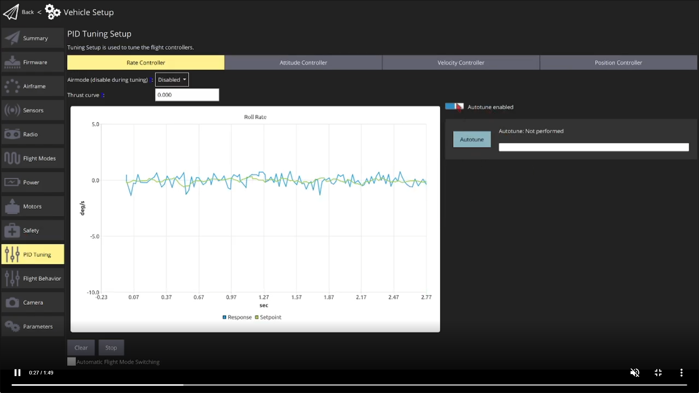

# Auto-tuning

Auto-tuning automates the process of tuning the PX4 rate and attitude controllers, which are the most important controllers for stable and responsive flight (other tuning is more "optional"). It is currently enabled for multicopter, fixed wing, and hybrid VTOL fixed wing vehicles.

Tuning only needs to be done once, and is recommended unless unless you're using vehicle that has already been tuned by the manufacturer (and not modified since).

:::note
The QGroundControl Autotuning UI is not enabled for Fixed wing vehicles - see [qgroundcontrol#10194](https://github.com/mavlink/qgroundcontrol/issues/10194) (though it is for VTOL vehicles in fixed wing flight). You can start Fixed-wing autotuning by setting the parameter [FW_AT_START](../advanced_config/parameter_reference.md#FW_AT_START).
:::

:::warning
Auto-tuning is performed while flying. The airframe must fly well enough handle moderate disturbances, and should be closely attended:
- Test that your vehicle is [stable enough for autotuning](#pre-tuning-test).
- Be ready to abort the autotuning process by moving the remote control sticks.
- Verify that the vehicle flies well after tuning.
:::

@[youtube](https://youtu.be/5xswOhhqrIQ)

## Pre-tuning Test

The vehicle must be able to fly and adequately stabilize itself before running auto-tune. This test ensures that the vehicle can fly safely in position controlled modes.

:::note
During [Airframe Setup](../config/airframe.md) you should have selected the frame that most closely matches your vehicle. This will usually be tuned well enough to fly, and it _may_ also be sufficiently well tuned to run autotuning.
:::

To make sure the vehicle is stable enough for auto-tuning:

1. Perform a normal preflight safety checklist to ensure the flight zone is clear and has enough space.
1. Takeoff and prepare for the test
   - **Multicopters:** Take off and hover at 1m above ground in [Altitude mode](../flight_modes/altitude_mc.md) or Stabilized mode.
   - **Fixed-wing:** Take off and fly at cruise speed in [Position mode](../flight_modes/position_mc.md) or [Altitude mode](../flight_modes/altitude_mc.md).
1. Use the RC transmitter roll stick to perform the following maneuver, tilting the vehicle just a few degrees: _roll left > roll right > center_ (The whole maneuver should take about 3 seconds). The vehicle should stabilise itself within 2 oscillations.
1. Repeat the maneuver, tilting with larger amplitudes at each attempt. If the vehicle can stabilise itself within 2 oscillations at ~20 degrees move to the next step.
1. Repeat the same maneuvers but on the pitch axis. A above, start with small angles and confirm that the vehicle can itself within 2 oscillations before increasing the tilt.

If the drone can stabilize itself within 2 oscillations it is ready for the auto-tuning procedure.

If not, go to the [troubleshooting](#troubleshooting) section, which explains the minimal manual tuning to prepare the vehicle for auto-tuning.

### Auto-tuning procedure

The auto-tuning sequence must be performed in a **safe flight zone, with enough space**. It takes about 40 seconds ([between 19 and 68 seconds](#how-long-does-autotuning-take)). For best results, we recommend running the test in calm weather conditions.

:::note
The sequence can be aborted at any time by the operator by moving the roll/pitch stick on the RC controller.
:::

The test steps are:

1. Perform the [pre-tuning test](#pre-tuning-test).
1. Takeoff using RC control and prepare for test:
   - **Multicopters:** Takeoff using the remote controller in [Altitude mode](../flight_modes/altitude_mc.md). Hover the vehicle at a safe distance and at a few meters above ground (between 4 and 20m).
   - **Fixed-wing:** Once flying at cruise speed, activate [Hold mode](../flight_modes/hold.md). This will guide the plane to fly in circle at constant altitude and speed.
1. In QGroundControl, open the menu: **Vehicle setup > PID Tuning**

   
1. Select either the *Rate Controller* or *Attitude Controller* tabs. Ensure that the **Autotune enabled** button is enabled (this will display the **Autotune** button and remove the manual tuning selectors).
1. Stop moving the joysticks and click on the **Autotune** button. Read the warning popup and click on **OK** to start tuning.
1. The drone will first start to perform quick roll motions followed by pitch and yaw motions. The progress is shown in the progress bar, next to the _Autotune_ button.
1. Apply the tuning:
   - **Fixed Wing:** The tuning will be immediately/automatically be applied and tested in flight (by default). PX4 will then run a 4 second test and revert the new tuning if a problem is detected.
   - **Multicopters:** Manually land and disarm to apply the new tuning parameters. Takeoff carefully and manually test that the vehicle is stable.
1. If any strong oscillations occur, land immediately and follow the instructions in the [Troubleshooting](#troubleshooting) section below.

 

Additional notes:
- **VTOL:** Hybrid VTOL fixed wing vehicles must be tuned twice, following multicopter instructions in MC mode and fixed-wing instructions in FW mode.
- **Multicopter:** The instructions above tune the vehicle in [Altitude mode](../flight_modes/altitude_mc.md). You can instead takeoff in [Takeoff mode](../flight_modes/takeoff.md) and tune in [Position mode](../flight_modes/position_mc.md) if the vehicle is is _known_ to be stable in these modes.
- **Fixed wing:** Autotuning can also be run in [Altitude mode](../flight_modes/altitude_mc.md) or [Position mode](../flight_modes/position_mc.md). However running the test while flying straight requires a larger safe area for tuning, and does not give a significantly better tuning result.
- Whether tuning is applied in-air or after landing can be [configured using parameters](#parameters).

## Troubleshooting

#### The drone oscillates when performing the testing maneuvers prior to the auto-tuning

* slow oscillations (1 oscillation per second or slower): this often occurs on large platforms and means that the attitude loop is too fast compared to the rate loop.
   - **Multicopter:** decrease [MC_ROLL_P](../advanced_config/parameter_reference.md#MC_ROLL_P) and [MC_PITCH_P](../advanced_config/parameter_reference.md#MC_PITCH_P) by steps of 1.0
   - **Fixed-wing:** increase [FW_R_TC](../advanced_config/parameter_reference.md#FW_R_TC), [FW_P_TC](../advanced_config/parameter_reference.md#FW_P_TC), [FW_Y_TC](../advanced_config/parameter_reference.md#FW_Y_TC) by steps of 0.1
* fast oscillations (more than 1 oscillation per second): this is because the gain of the rate loop is too high.
   - **Multicopter:** decrease `MC_[ROLL|PITCH|YAW]RATE_K` by steps of 0.02
   - **Fixed-wing:** decrease [FW_RR_R](../advanced_config/parameter_reference.md#FW_RR_R), [FW_RR_P](../advanced_config/parameter_reference.md#FW_RR_P), [FW_RR_Y](../advanced_config/parameter_reference.md#FW_RR_Y) by steps of 0.01

#### The auto-tuning sequence fails

If the drone was not moving enough during auto-tuning, the system identification algorithm might have issues to find the correct coefficients. Increase the [FW_AT_SYSID_AMP](../advanced_config/parameter_reference.md#FW_AT_SYSID_AMP), [MC_AT_SYSID_AMP](../advanced_config/parameter_reference.md#MC_AT_SYSID_AMP) by steps of 1 and trigger the auto-tune again.

#### The drone oscillates after auto-tuning

Due to effects not included in the mathematical model such as delays, saturation, slew-rate, airframe flexibility, the loop gain can be too high. To fix this, follow the same steps described [when the drone oscillates in the pre-tuning test](#the-drone-oscillates-when-performing-the-testing-maneuvers-prior-to-the-auto-tuning).

#### I still can't get it to work

Attempt manual tuning using the appropriate guides:
- [Multicopter PID Tuning Guide](../config_mc/pid_tuning_guide_multicopter_basic.md) (Manual/Simple)
- [Multicopter PID Tuning Guide](../config_mc/pid_tuning_guide_multicopter.md) (Advanced/Detailed)
- [Fixed-Wing PID Tuning Guide](../config_fw/pid_tuning_guide_fixedwing.md)

## Parameters

By default MC vehicles land before parameters are applied, while FW vehicles apply the parameters in-air and then test that the controllers work properly. This behaviour can be configured using the [MC_AT_APPLY](../advanced_config/parameter_reference.md#MC_AT_APPLY) and [FW_AT_APPLY](../advanced_config/parameter_reference.md#FW_AT_APPLY) parameters respectively:

* `0`: the gains are not applied. This is used for testing purposes if the user wants to inspect results of the auto-tuning algorithm without using them directly.
* `1`: apply the gains after disarm (default for multirotors). The operator can then test the new tuning while taking-off carefully.
* `2`: apply immediately (default for fixed-fings). The new tuning is applied, disturbances are sent to the controller and the stability is monitored during the next 4 seconds. If the control loop is unstable, the control gains are immediately reverted back to their previous value. If the test passes, the pilot can then use the new tuning.

Fixed wing vehicles (only) can select which axes are tuned using the [FW_AT_AXES](../advanced_config/parameter_reference.md#FW_AT_AXES) bitmask parameter:

* bit `0`: roll (default)
* bit `1`: pitch (default)
* bit `2`: yaw

## Developers/SDKs

Autotuning is started using [MAV_CMD_DO_AUTOTUNE_ENABLE](https://mavlink.io/en/messages/common.html#MAV_CMD_DO_AUTOTUNE_ENABLE) MAVLink command.

At time of writing the message is resent at regular intervals to poll PX4 for progress: the `COMMAND_ACK` includes result that the operation is in progress, and also the progress as a percentage. The operation completes when the progress is 100% or the vehicle lands and disarms.

:::note
This is not a MAVLink-compliant implementation of a [command protocol long running command](https://mavlink.io/en/services/command.html#long_running_commands). PX4 should stream progress as the protocol does not allow polling.
:::

The feature is not yet supported by MAVSDK.

## Background/Detail

PX4 uses [PID controllers](../flight_stack/controller_diagrams.md) (rate, attitude, velocity, and position) to calculate the outputs required to move a vehicle from its current estimated state to match a desired setpoint. The controllers must be well tuned in order to get the best performance out of a vehicle. In particular, a poorly tuned rate controller results in less stable flight in all modes, and takes longer to recover from disturbances.

Generally if you use an [airframe configuration](../config/airframe.md) that is similar to your vehicle then the vehicle will be able to fly. However unless the configuration precisely matches your hardware you should tune the rate and attitude controllers. Tuning the velocity and position controllers is less important because they are less affected by vehicle dynamics, and the default tuning configuration for a similar airframe is often sufficient.

Autotuning provides an automatic mechanism to tune the rate and attitude controllers. It can be used to tune fixed wing and multicopter vehicles, and VTOL vehicles when flying as a multicopter or as a fixed wing (transition between modes must be manually tuned). In theory it should work for other vehicle types that have a rate controller, but currently only the above types are supported.

Automatic tuning works well for the multicopter and fixed wing vehicle configurations supported by PX4, provided the frame is not too flexible (see [below for more information](#does-autotuning-work-for-all-supported-airframes)).

The vehicle must be flying in an altitude-stabilized mode ([Altitude mode](../flight_modes/altitude_mc.md), [Hold mode](../flight_modes/hold.md), or [Position mode](../flight_modes/position_mc.md)). The flight stack will apply a small disturbance to the vehicle in each axis and then attempt to calculate the new tuning parameters. For fixed wing vehicles the new tuning is applied in-air by default, after which the vehicle tests the new settings and reverts the tuning if the controllers are not stable. For multicopter, the vehicle lands and applies the new tuning parameters after disarming; the pilot is expected to then take off carefully and test the tuning.

The tuning process takes about 40 seconds ([between 19 and 68 seconds](#how-long-does-autotuning-take)). The default behaviour can be configured using [parameters](#parameters).

### FAQ

#### What frames types are supported?

Autotuning is enabled for multicopter, fixed wing, and hybrid VTOL fixed wing vehicles.

While it is not yet enabled for other frame types, in theory it an be used with any frame that uses a rate controller.

#### Does autotuning work for all supported airframes?

The mathematical model used by autotuning to estimate the dynamics of the drone assumes this it is a linear system with no coupling between the axes (SISO), and with a limited complexity (2 poles and 2 zeros). If the real drone is too far from those conditions, the model will not be able to represent the real dynamics of the drone.

In practise, autotuning generally works well for fixed wing and multicopter, provided the frame is not too flexible.

#### How long does autotuning take?

Tuning takes 5s-20s per axis (aborted if tuning could not be established in 20s) + 2s pause between each axis + 4s of testing if the new gains are applied in air.

A multicopter must tune all three axes, and by default does not test the new gains in-air. Tuning will therefore take between 19s (`5 + 2 + 5 + 2 + 5`) and 64s (`20x3 + 2x2`).

By default a fixed wing vehicle tunes all three axes and then tests the new gains in-air. The range is therefore between 25s (`5 + 2 + 5 + 2 + 5 + 2 + 4`) and 70s (`20x3 + 3x2 + 4`).

Note however that the above settings are defaults. A multicopter can choose to run the tests in air, and a fixed wing can choose not to. Further, a fixed wing can choose to tune fewer axes.

Anecdotally, it usually takes around 40s for either vehicle.

<!-- 
#### How vigorous is the disturbance applied by tuning

This might be added later. I'd like to just point to a video.

If not, perhaps say "not very" but you should expect that the vehicle might deflect by as much as 20degrees and so should be able to cope with that deflection with default tuning.

-->

## See also

- [Multicopter PID Tuning Guide](../config_mc/pid_tuning_guide_multicopter_basic.md) (Manual/Simple)
- [Multicopter PID Tuning Guide](../config_mc/pid_tuning_guide_multicopter.md) (Advanced/Detailed)
- [Fixed-Wing PID Tuning Guide](../config_fw/pid_tuning_guide_fixedwing.md)
