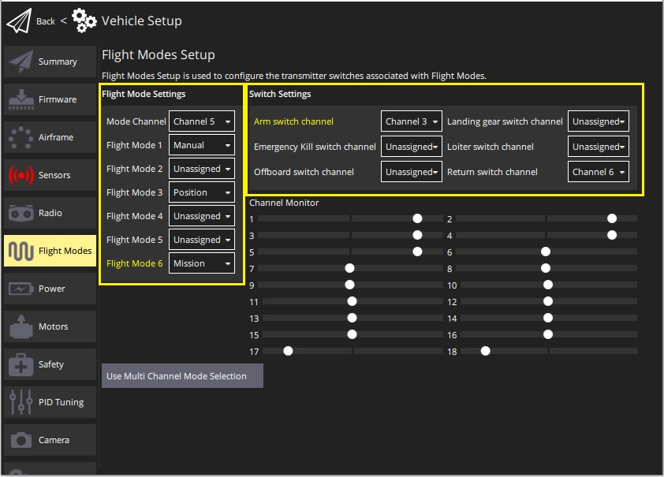
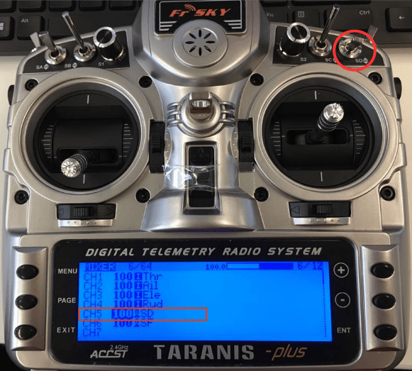
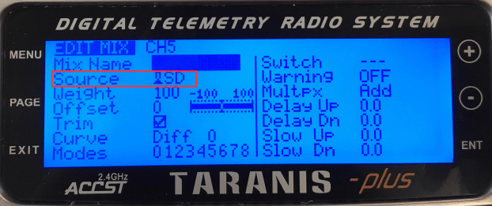
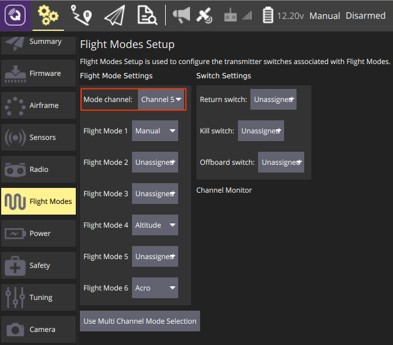
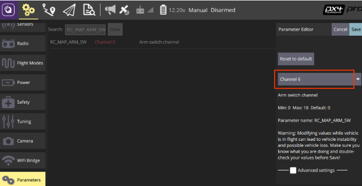
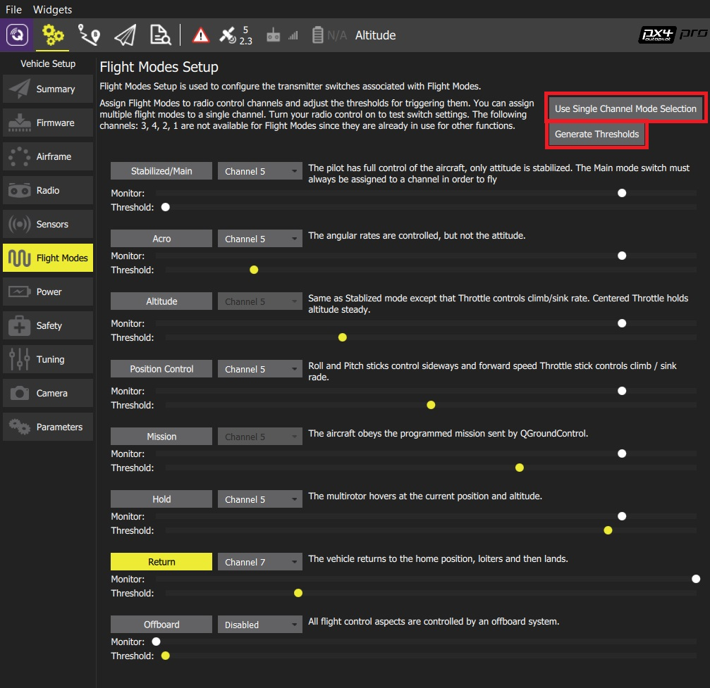

# Flight Mode Configuration

[Flight Modes](../flight_modes/README.md) provide different types of *autopilot-assisted flight*, and *fully autonomous flight* via missions or offboard (companion computer) control. Different flight modes allow new users to learn flying with a more forgiving platform than provided by basic RC control alone. They also enable automation of common tasks like taking off, landing and returning to the original launch position.

PX4 allows you to select flight modes from a ground station (tablet or desktop) or from a radio control transmitter. If radio control and tablet are both connected, either system can change the mode and override the previous setting.

This topic explains how to map flight modes to the switches on your radio control transmitter.

:::tip
You must already have [configured your radio](../config/radio.md) in order to set flight modes.
:::

## What Flight Modes Should I Set?

You can set any (or none) of the flight modes [described here](../flight_modes/README.md).

New users should consider setting one or more of the following modes, which make the vehicle much easier to fly:

* **Stabilized** - Vehicle hard to flip, and will level-out if the sticks are released (but not hold position).
* **Position** - When sticks are released the vehicle will stop (and hold position against wind drift).
* **Altitude** - Climb and drop are controlled to have a maximum rate.

It is also common to map switches to:

* [Return](../flight_modes/return.md) - This mode raises the vehicle to a safe height and returns to the launch position.
* [Mission](../flight_modes/mission.md) - This mode runs a pre-programmed mission sent by the ground control station.
*  [Kill Switch](../config/safety.md#kill_switch) - Immediately stops all motor outputs (the vehicle will crash, which may in some circumstances be more desirable than allowing it to continue flying).

## Multi Channel vs Single Channel Mode Selection

*PX4* (*QGroundControl*) supports two modes for mapping flight modes to transmitter switches/dials:

* **Single Channel Mode Selection:** Assign up to 6 flight modes to switch positions encoded in a single channel.
* **Multi Channel Mode Selection:** Assign modes to switch positions encoded in one or more channels. Some modes are hard coded to share channels, or are defined/set automatically based on other mode selections (the behaviour of multi-channel mode selection can sometimes be confusing). 

:::tip
The recommended approach is use *Single Channel Mode Selection* because it easy to understand and configure.
:::

## Single-Channel Flight Mode Selection

The single-channel selection mode allows you to specify a "mode" channel and select up to 6 flight modes that will be activated based on the PWM value of the channel. You can also separately specify channels for mapping a kill switch, return to launch mode, and offboard mode.

:::note
In order to use this approach you will first need to configure your *transmitter* to encode the physical positions of your mode switch(es) into a single channel. We provide a video guide of how this is done for the popular *Taranis* transmitter [below](#taranis_setup) (check your documentation if you use a different transmitter).
:::

To configure single-channel flight mode selection:

1. Start *QGroundControl* and connect the vehicle.
2. Turn on your RC transmitter.
3. Select the **Gear** icon (Vehicle Setup) in the top toolbar and then **Flight Modes** in the sidebar.
    
    
    
:::tip
If the screen opens in *Multi Channel Mode* click the **Use Single Channel Mode Selection** button to change screen.
:::

4. Specify *Flight Mode Settings*:
    
    * Select the **Mode channel** (above this shown as Channel 5, but this will depend on your transmitter configuration). 
    * Select up to six **Flight Modes**.
5. Specify *Switch Settings*: 
    * Select the channels that you want to map to specific actions - e.g.: *Return* mode, *Kill switch*, *offboard* mode, etc. (if you have spare switches and channels on your transmitter).
6. Test that the modes are mapped to the right transmitter switches: 
    * Check the *Channel Monitor* to confirm that the expected channel is changed by each switch.
    * Select each mode switch on your transmitter in turn, and check that the desired flight mode is activated (the text turns yellow on *QGroundControl* for the active mode).

All values are automatically saved as they are changed.

### Single-Channel Setup Video Example (including Transmitter Setup)

It is common to use the positions of a 2- and a 3-position switch on the transmitter to represent the 6 flight modes, and encode each combination of switches as a particular PWM value for the mode that will be sent on a single channel.

The video below shows how this is done with the *FrSky Taranis* transmitter (a very popular and highly recommended RC transmitter). The process involves assigning a "logical switch" to each combination of positions of the two real switches. Each logical switch is then assigned to a different PWM value on the same channel.

The video then shows how to use *QGroundControl* to specify the mode channel and map modes to each of the 6 "slots".

@[youtube](https://youtu.be/scqO7vbH2jo)

### Single-Channel Setup Instructional Example

This example shows how you can configure a transmitter and PX4 with:

* A 3-way switch to choose between flight modes using the single-channel mode setting approach (Manual, Altitude, Acro).
* A 2-way switch that invokes some function (arm/disarm) (via a [Radio switch](../advanced_config/parameter_reference.md#radio-switches) parameter).

:::note
This example shows how to set up the popular *FrSky Taranis* transmitter. Configuration will be slightly different for other transmitters.
:::

First set up your transmitter. Below we show how to map the Taranis "SD" switch to channel 5. This is done in the Taranis UI 'mixer' page, as shown below:

You can then select the channel and the flight modes in single channel mode selection option in *QGroundControl*:

The [Radio switch](../advanced_config/parameter_reference.md#radio-switches) parameters map a particular function to a channel. Assuming you have already mapped a channel in your transmitter you can assign the channel by [setting the parameter](../advanced_config/parameters.md).

For example, below we map channel 6 to the [RC_MAP_ARM_SW](../advanced_config/parameter_reference.md#RC_MAP_ARM_SW) parameter in *QGroundControl*.

## Multi-Channel Flight Mode Selection

:::tip
We recommend you use [Single Channel Flight Mode](#single_channel) selection because the Multi Channel selection user interface can be confusing. If you do choose to use this method, then the best approach is to start assigning channels and take note of information displayed by *QGroundControl* following your selection.
:::

The multi-channel selection user interface allows you to map one or more modes to one or more channels. There are some modes (and hence switches) that must always be defined, and the channel to which they must be allocated.

To configure flight modes using the multi-channel UI:

1. Turn on your RC transmitter.
2. Start *QGroundControl* and connect the vehicle.
3. Select the **Gear** icon (Vehicle Setup) in the top toolbar and then **Flight Modes** in the sidebar.
    
    
    
:::tip
If the screen opens in *Single Channel Mode* click the **Use Multi Channel Mode Selection** button to change screen.
:::

4. Select the modes you want to assign to your switches and select the associated channel (selected modes will *move* in the user interface to be grouped by channel). There are a number of complications on the mode to channel assignments:
    
    * Some modes cannot be manually edited (are grayed out) because their channel and threshold level are automatically defined based on the values of other mode settings. For example: 
        * *Mission* mode - is automatically assigned the same channel number as *Hold* (if the channel for *Hold* is defined by the user). If the channel for *Hold* is not defined, *Mission* mode is automatically assigned the same channel as *Stabilized/Main* mode. This, for example, prevents the user from defining *Stabilized/Main* and *Mission* mode on different channels, to ensure that the user cannot switch both modes ON at the same time. 
        * *Altitude* mode - is automatically assigned the same channel number as *Position Control* (if it is defined), or otherwise the same channel as *Stabilized/Main* mode.
    * *Assist* mode - This mode is added to the same channel as *Stabilized/Main* mode if (and only if) *Position Control* is enabled and defined on a different channel than *Stabilized/Main*.
5. Click the **Generate Thresholds** button. 
    * This will automatically create threshold values for all modes, spread evenly across each channel for its assigned modes. For example, in the mode assignment shown above, most modes are assigned to mode 5, and you can see that the channel thresholds for each mode are spread evenly across the channel. 

This mode is demonstrated in the [autopilot setup video here](https://youtu.be/91VGmdSlbo4?t=6m53s) (youtube).

:::note
This flight mode selection mechanism is relatively complicated due to the way that PX4 works out which mode should be selected. You may be able to gain some insight from this [flow chart](../concept/flight_modes.md#flight-mode-evaluation-diagram).
:::

## Further Information

* [Flight Modes Overview](../flight_modes/README.md)
* [QGroundControl > Flight Modes](https://docs.qgroundcontrol.com/en/SetupView/FlightModes.html#px4-pro-flight-mode-setup)
* [PX4 Setup Video - @6m53s](https://youtu.be/91VGmdSlbo4?t=6m53s) (Youtube)