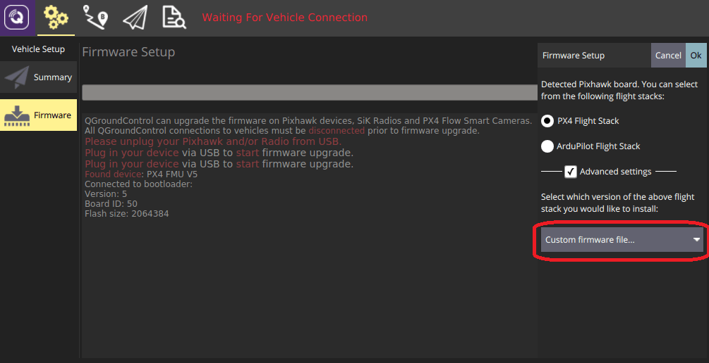

# Adding a New Airframe Configuration

PX4 uses canned airframe configurations as starting point for airframes. The configurations are defined in [config files](#config-file) that are stored in the [ROMFS/px4fmu_common/init.d](https://github.com/PX4/PX4-Autopilot/tree/master/ROMFS/px4fmu_common/init.d) folder. The config files reference [mixer files](#mixer-file) that describe the physical configuration of the system, and which are stored in the [ROMFS/px4fmu_common/mixers](https://github.com/PX4/PX4-Autopilot/tree/master/ROMFS/px4fmu_common/mixers) folder.

Adding a configuration is straightforward: create a new config file in the [init.d/airframes folder](https://github.com/PX4/PX4-Autopilot/tree/master/ROMFS/px4fmu_common/init.d/airframes) (prepend the filename with an unused autostart ID), add the name of your new airframe config file to the [CMakeLists.txt](https://github.com/PX4/PX4-Autopilot/blob/master/ROMFS/px4fmu_common/init.d/airframes/CMakeLists.txt) in the relevant section, then [build and upload](../dev_setup/building_px4.md) the software.

Developers who do not want to create their own configuration can instead customize existing configurations using text files on the microSD card, as detailed on the [custom system startup](../concept/system_startup.md) page.

:::note
To determine which parameters/values need to be set in the configuration file, you can first assign a generic airframe and tune the vehicle, and then use [`param show-for-airframe`](../modules/modules_command.md#param) to list the parameters that changed.
:::

## Configuration File Overview

The configuration in the config and mixer files consists of several main blocks:

* Airframe documentation (used in the [Airframes Reference](../airframes/airframe_reference.md) and *QGroundControl*).
* Vehicle-specific parameter settings, including [tuning gains](#tuning-gains).
* The controllers and apps it should start, e.g. multicopter or fixed wing controllers, land detectors etc.
* The physical configuration of the system (e.g. a plane, wing or multicopter). This is called a [mixer](../concept/mixing.md).

These aspects are mostly independent, which means that many configurations share the same physical layout of the airframe, start the same applications and differ most in their tuning gains.

:::note
New airframe files are only automatically added to the build system after a clean build (run `make clean`).
:::

<a id="config-file"></a>

### Config File

A typical configuration file is shown below ([original file here](https://github.com/PX4/PX4-Autopilot/blob/master/ROMFS/px4fmu_common/init.d/airframes/3033_wingwing)).

The first section is the airframe documentation. This is used in the [Airframes Reference](../airframes/airframe_reference.md) and *QGroundControl*.
```bash
#!/bin/sh
#
# @name Wing Wing (aka Z-84) Flying Wing
#
# @url https://docs.px4.io/master/en/frames_plane/wing_wing_z84.html
#
# @type Flying Wing
# @class Plane
#
# @output MAIN1 left aileron
# @output MAIN2 right aileron
# @output MAIN4 throttle
#
# @output AUX1 feed-through of RC AUX1 channel
# @output AUX2 feed-through of RC AUX2 channel
# @output AUX3 feed-through of RC AUX3 channel
#
# @maintainer Lorenz Meier <lorenz@px4.io>
#
# @board px4_fmu-v2 exclude
# @board bitcraze_crazyflie exclude
#
```

The next section specifies vehicle-specific parameters, including [tuning gains](#tuning-gains):
```bash
. ${R}etc/init.d/rc.fw_defaults

param set-default BAT_N_CELLS 2
param set-default FW_AIRSPD_MAX 15
param set-default FW_AIRSPD_MIN 10
param set-default FW_AIRSPD_TRIM 13
param set-default FW_R_TC 0.3
param set-default FW_P_TC 0.3
param set-default FW_L1_DAMPING 0.74
param set-default FW_L1_PERIOD 16
param set-default FW_LND_ANG 15
param set-default FW_LND_FLALT 5
param set-default FW_LND_HHDIST 15
param set-default FW_LND_HVIRT 13
param set-default FW_LND_TLALT 5
param set-default FW_THR_LND_MAX 0
param set-default FW_PR_FF 0.35
param set-default FW_RR_FF 0.6
param set-default FW_RR_P 0.04

param set-default PWM_MAIN_DISARM 1000
```

Set frame type ([MAV_TYPE](https://mavlink.io/en/messages/common.html#MAV_TYPE)):
```bash
# Configure this as plane
set MAV_TYPE 1
```

Set the [mixer](#mixer-file) to use:
```bash
# Set mixer
set MIXER wingwing
```

Configure PWM outputs (specify the outputs to drive/activate, and the levels).
```bash
set PWM_OUT 4
```

:::warning
If you want to reverse a channel, never do this on your RC transmitter or with e.g `RC1_REV`. The channels are only reversed when flying in manual mode, when you switch in an autopilot flight mode, the channels output will still be wrong (it only inverts your RC signal). Thus for a correct channel assignment change either your PWM signals with `PWM_MAIN_REV1` (e.g. for channel one) or change the signs of the output scaling in the corresponding mixer (see below).
:::

<a id="mixer-file"></a>

### Mixer File

:::note
First read [Concepts > Mixing](../concept/mixing.md). This provides background information required to interpret this mixer file.
:::

A typical mixer file is shown below ([original file here](https://github.com/PX4/PX4-Autopilot/blob/master/ROMFS/px4fmu_common/mixers/wingwing.main.mix)). A mixer filename, in this case `wingwing.main.mix`, gives important information about the type of airframe (`wingwing`), the type of output (`.main` or `.aux`) and lastly that it is a mixer file (`.mix`).

The mixer file contains several blocks of code, each of which refers to one actuator or ESC. So if you have e.g. two servos and one ESC, the mixer file will contain three blocks of code.

:::note
The plugs of the servos / motors go in the order of the mixers in this file.
:::

So MAIN1 would be the left aileron, MAIN2 the right aileron, MAIN3 is empty (note the Z: zero mixer) and MAIN4 is throttle (to keep throttle on output 4 for common fixed wing configurations).

A mixer is encoded in normalized units from -10000 to 10000, corresponding to -1..+1.

```
M: 2
O:      10000  10000      0 -10000  10000
S: 0 0  -6000  -6000      0 -10000  10000
S: 0 1   6500   6500      0 -10000  10000
```

Where each number from left to right means:

* M: Indicates two scalers for two control inputs. It indicates the number of control inputs the mixer will receive.
* O: Indicates the output scaling (\*1 in negative, \*1 in positive), offset (zero here), and output range (-1..+1 here).
  * If you want to invert your PWM signal, the signs of the output scalings have to be changed:
    ```
    O:      -10000  -10000      0 -10000  10000
    ```
  * This line can (and should) be omitted completely if it specifies the default scaling:
    ```
    O:      10000  10000   0 -10000  10000
    ```
* S: Indicates the first input scaler: It takes input from control group #0 (Flight Control) and the first input (roll). It scales the roll control input * 0.6 and reverts the sign (-0.6 becomes -6000 in scaled units). It applies no offset (0) and outputs to the full range (-1..+1)
* S: Indicates the second input scaler: It takes input from control group #0 (Flight Control) and the second input (pitch). \ It scales the pitch control input * 0.65. It applies no offset (0) and outputs to the full range (-1..+1)

:::note
In short, the output of this mixer would be SERVO = ( (roll input \* -0.6 + 0)  \* 1 + (pitch input \* 0.65 + 0)  \* 1 ) \* 1 + 0
:::

Behind the scenes, both scalers are added, which for a flying wing means the control surface takes maximum 60% deflection from roll and 65% deflection from pitch.

The complete mixer looks like this:


```bash
Delta-wing mixer for PX4FMU
===========================

Designed for Wing Wing Z-84

This file defines mixers suitable for controlling a delta wing aircraft using
PX4FMU. The configuration assumes the elevon servos are connected to PX4FMU
servo outputs 0 and 1 and the motor speed control to output 3. Output 2 is
assumed to be unused.

Inputs to the mixer come from channel group 0 (vehicle attitude), channels 0
(roll), 1 (pitch) and 3 (thrust).

See the README for more information on the scaler format.

Elevon mixers
-------------
Three scalers total (output, roll, pitch).

The scaling factor for roll inputs is adjusted to implement differential travel
for the elevons.

This first block of code is for Servo 0...

M: 2
O:      10000  10000      0 -10000  10000
S: 0 0  -6000  -6000      0 -10000  10000
S: 0 1   6500   6500      0 -10000  10000

And this is for Servo 1...

M: 2
O:      10000  10000      0 -10000  10000
S: 0 0  -6000  -6000      0 -10000  10000
S: 0 1  -6500  -6500      0 -10000  10000

Note that in principle, you could implement left/right wing asymmetric mixing, but in general the two blocks of code will be numerically equal, and just differ by the sign of the third line (S: 0 1), since to roll the plane, the two ailerons must move in OPPOSITE directions.
The signs of the second lines (S: 0 0) are indentical, since to pitch the plane, both servos need to move in the SAME direction.

Output 2
--------
This mixer is empty.

Z:

Motor speed mixer
-----------------
Two scalers total (output, thrust).

This mixer generates a full-range output (-1 to 1) from an input in the (0 - 1)
range.  Inputs below zero are treated as zero.

M: 1
O:      10000  10000      0 -10000  10000
S: 0 3      0  20000 -10000 -10000  10000

```

## Adding a New Airframe Group

Airframe "groups" are used to group similar airframes for selection in [QGroundControl](https://docs.qgroundcontrol.com/en/SetupView/Airframe.html) and in the *Airframe Reference* documentation ([PX4 DevGuide](../airframes/airframe_reference.md) and [PX4 UserGuide](../airframes/airframe_reference.md)). Every group has a name, and an associated svg image which shows the common geometry, number of motors, and direction of motor rotation for the grouped airframes.

The airframe metadata files used by *QGroundControl* and the documentation source code are generated from the airframe description, via a script, using the build command: `make airframe_metadata`

For a new airframe belonging to an existing group, you don't need to do anything more than provide documentation in the airframe description located at [ROMFS/px4fmu_common/init.d](https://github.com/PX4/PX4-Autopilot/tree/master/ROMFS/px4fmu_common/init.d).

If the airframe is for a **new group** you additionally need to:
1. Add the svg image for the group into user guide documentation (if no image is provided a placeholder image is displayed): [assets/airframes/types](https://github.com/PX4/px4_user_guide/tree/master/assets/airframes/types)
1. Add a mapping between the new group name and image filename in the [srcparser.py](https://github.com/PX4/PX4-Autopilot/blob/master/Tools/px4airframes/srcparser.py) method `GetImageName()` (follow the pattern below):
   ```
   def GetImageName(self):
       """
       Get parameter group image base name (w/o extension)
       """
       if (self.name == "Standard Plane"):
           return "Plane"
       elif (self.name == "Flying Wing"):
           return "FlyingWing"
        ...
    ...
       return "AirframeUnknown"
   ```
1. Update *QGroundControl*:
   * Add the svg image for the group into: [src/AutopilotPlugins/Common/images](https://github.com/mavlink/qgroundcontrol/tree/master/src/AutoPilotPlugins/Common/Images)
   * Add reference to the svg image into [qgcimages.qrc](https://github.com/mavlink/qgroundcontrol/blob/master/qgcimages.qrc), following the pattern below:
     ```
     <qresource prefix="/qmlimages">
        ...
        <file alias="Airframe/AirframeSimulation">src/AutoPilotPlugins/Common/Images/AirframeSimulation.svg</file>
        <file alias="Airframe/AirframeUnknown">src/AutoPilotPlugins/Common/Images/AirframeUnknown.svg</file>
        <file alias="Airframe/Boat">src/AutoPilotPlugins/Common/Images/Boat.svg</file>
        <file alias="Airframe/FlyingWing">src/AutoPilotPlugins/Common/Images/FlyingWing.svg</file>
        ...
     ```
:::note
The remaining airframe metadata should be automatically included in the firmware (once **srcparser.py** is updated).
:::


## Tuning Gains

The following topics explain how to tune the parameters that will be specified in the config file:

* [Multicopter PID Tuning Guide](../config_mc/pid_tuning_guide_multicopter.md)
* [Fixed Wing PID Tuning Guide](../config_fw/pid_tuning_guide_fixedwing.md)
* [VTOL Configuration](../config_vtol/README.md)


## Add New Airframe to QGroundControl

To make a new airframe available for section in the *QGroundControl* [airframe configuration](../config/airframe.md):

1. Make a clean build (e.g. by running `make clean` and then `make px4_fmu-v5_default`)
1. Open QGC and select **Custom firmware file...** as shown below:

  

  You will be asked to choose the **.px4** firmware file to flash (this file is a zipped JSON file and contains the airframe metadata).
1. Navigate to the build folder and select the firmware file (e.g. **PX4-Autopilot/build/px4_fmu-v5_default/px4_fmu-v5_default.px4**).
1. Press **OK** to start flashing the firmware.
1. Restart *QGroundControl*.

The new airframe will then be available for selection in *QGroundControl*.
