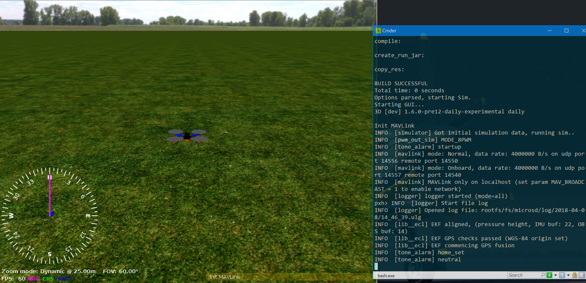

# Windows WSL-Based Development Environment

:::warning
This development environment is [not supported](../advanced/dev_env_unsupported.md). See [Toolchain Installation](../dev_setup/dev_env.md) for information about the environments and tools we do support!
:::

Windows users can alternatively install a *slightly modified* Ubuntu Linux PX4 development environment within [Bash on Windows](https://github.com/Microsoft/BashOnWindows), and use it to:
* Build firmware for NuttX/Pixhawk targets.
* Run the PX4 JMAVSim simulation (using a Windows-hosted X-Windows app to display the UI)

:::note
This mechanism only works on Windows 10. It essentially runs the toolchain in a virtual machine, and is relatively slow compared to other solutions.
:::

### Setup Environment

The easiest way to setup the environment is to use the <strong><a href="https://raw.githubusercontent.com/PX4/Devguide/master/build_scripts/windows_bash_nuttx.sh" target="_blank" download>windows_bash_nuttx.sh</a></strong> script (details for script are [given below](#build_script_details)). <!-- NEED px4_version -->

To setup the development environment:
1. Install [Bash on Windows](https://github.com/Microsoft/BashOnWindows).
1. Open the bash shell.
1. Download the **windows_bash_nuttx.sh**:<br> `wget https://raw.githubusercontent.com/PX4/Devguide/master/build_scripts/windows_bash_nuttx.sh` <!-- NEED px4_version -->
1. Run the script using the command below (acknowledging any prompts as required):
  ```sh
  bash windows_bash_nuttx.sh
  ```

### Build Firmware

To build the firmware (i.e. for px4_fmu-v4):
1. Enter the following commands in the bash shell:
   ```
   cd ~/src/PX4-Autopilot
   make px4_fmu-v4_default
   ```
   On successful completion you'll find the firmware here: `PX4-Autopilot/build/px4_fmu-v4_default/px4_fmu-v4_default.px4`

:::note
The `make` commands to build firmware for other boards can be found in [Building the Code](../dev_setup/building_px4.md#nuttx-pixhawk-based-boards).
:::

1. You can flash the custom firmware on Windows using *QGroundControl* or *Mission Planner* (it is not possible to directly flash the firmware from within the bash shell using the `upload` command).


### Simulation (JMAVSim)

Bash on Windows does not include support for UI libraries. In order to display the jMAVSim UI you will first need to install an X-Window application like [XMing](https://sourceforge.net/projects/xming/) into Windows.

To run JMAVSim:
1. Install and start [XMing](https://sourceforge.net/projects/xming/) on Windows.
1. Enter the following command in the bash shell:
   ```sh
   export DISPLAY=:0
   ```

:::tip
Add this line to the Ubuntu **.bashrc** file if you don't want to enter it every session.
:::
1. Start PX4 and jMAVSim in the bash shell:
   ```sh
   make px4_sitl jmavsim
   ```
   The JMAVSim UI is then displayed in XMing as shown below:

   

:::warning
Gazebo can similarly be run within Ubuntu Bash for Windows, but too slow to be useful. To try this, follow the [ROS kinetic install guide](http://wiki.ros.org/kinetic/Installation/Ubuntu) and run Gazebo in the Bash shell as shown:
```sh
export DISPLAY=:0
export GAZEBO_IP=127.0.0.1
make px4_sitl gazebo
```
:::

<a id="build_script_details"></a>

### Build Script Details

The <a href="https://raw.githubusercontent.com/PX4/Devguide/master/build_scripts/windows_bash_nuttx.sh">windows_bash_nuttx.sh</a> <!-- NEED px4_version --> build script modifies the Ubuntu build instructions to remove Ubuntu-specific and UI-dependent components, including the *Qt Creator* IDE and the simulators.

In addition, it uses a [64 bit arm-none-eabi compiler](https://github.com/SolinGuo/arm-none-eabi-bash-on-win10-.git) since BashOnWindows doesn't run 32 bit ELF programs (and the default compiler from `https://launchpad.net/gcc-arm-embedded` is 32 bit).

To add this compiler to your environment manually:

1. Download the compiler:
   ```sh
   wget https://github.com/SolinGuo/arm-none-eabi-bash-on-win10-/raw/master/gcc-arm-none-eabi-5_4-2017q2-20170512-linux.tar.bz2
   ```
1. Unpack it using this command line in the Bash On Windows console:
   ```sh
   tar -xvf gcc-arm-none-eabi-5_4-2017q2-20170512-linux.tar.bz2
   ```
   This will unpack the arm gcc cross-compiler to:
   ```
   gcc-arm-none-eabi-5_4-2017q2/bin
   ```
1. Add the to the environment (add the line to your bash profile to make the change permanent)
   ```
   export PATH=$HOME/gcc-arm-none-eabi-5_4-2017q2/bin:$PATH
   ```
