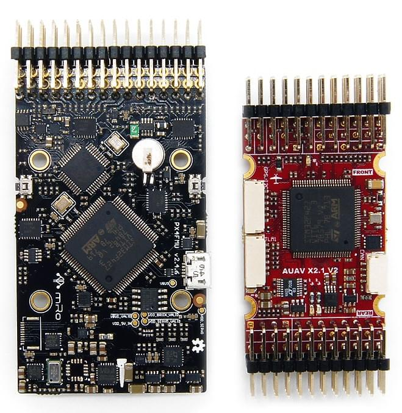

# mRo-X2.1 Autopilot

:::warning PX4 does not manufacture this (or any) autopilot. Contact the [manufacturer](https://store.mrobotics.io/) for hardware support or compliance issues.
:::

The [mRo-X2.1 autopilot](http://www.mRobotics.io/) is based on the [Pixhawk<sup>&reg;</sup>-project](https://pixhawk.org/) **FMUv2** open hardware design. It runs PX4 on the [NuttX](https://nuttx.apache.org/) OS.


:::note
This flight controller is [manufacturer supported](../flight_controller/autopilot_manufacturer_supported.md).
:::

## Quick Summary

- Main System-on-Chip: [STM32F427](http://www.st.com/web/en/catalog/mmc/FM141/SC1169/SS1577/LN1789)
  - CPU: STM32F427VIT6 ARM<sup>&reg;</sup> microcontroller - Revision 3
  - IO: STM32F100C8T6 ARM<sup>&reg;</sup> microcontroller
- Sensors:
  - Invensense<sup>&reg;</sup> MPU9250 9DOF
  - Invensense ICM-20602 6DOF
  - MEAS MS5611 barometer
- Dimensions/Weight
  - Size: 36mm x 50mm (Can be ordered with vertical, horizontal or no headers installed)
  - Mounting Points: 30.5mm x 30.5mm 3.2mm diameter
  - Weight: 10.9g

The diagram below provides a side-by-side comparison with a Pixhawk 1. The mRo features almost identical hardware and connectivity but has a much smaller footprint. Major differences are updated sensors and Rev 3 FMU.



## Connectivity

- 2.54mm headers:
- GPS (UART4) with I2C
- CAN Bus
- RC input
- PPM input
- Spektrum input
- RSSI input
- sBus input
- sBus output
- Power input
- Buzzer output
- LED output
- 8 x Servo outputs
- 6 x Aux outputs
- Offboard microUSB connector
- Kill Pin output _(Currently not supported by firmware)_
- AirSpeed Sensor
- USART2 (Telem 1)
- USART3 (Telem 2)
- UART7 (Console)
- UART8 (OSD)

## PX4 BootLoader Issue

By default a mRo X2.1 might come preconfigured for ArduPilot<sup>&reg;</sup> rather than PX4. This can be seen during firmware update when the board is recognized as FMUv2 instead of X2.1.

In this case you must update the BootLoader using [BL_Update_X21.zip](https://github.com/PX4/PX4-user_guide/raw/v1.14/assets/hardware/BL_Update_X21.zip). If this correction is not carried out your compass direction will be wrong and the secondary IMU will not be detected.

The update steps are:

1. Download and extract [BL_Update_X21.zip](https://github.com/PX4/PX4-user_guide/raw/v1.14/assets/hardware/BL_Update_X21.zip).
2. Find the folder _BL_Update_X21_. This contains a **bin** file and a subfolder named **/etc** containing an **rc.txt** file
3. Copy these files to your micro SD card's root directory and insert it into the mRO x2.1
4. Power on the mRO x2.1 Wait for it to boot and then reboot 1 time.

## Availability

This product can be ordered at the [mRobotics<sup>&reg;</sup> Store](https://store.mrobotics.io/mRo-X2-1-Rev-2-p/m10021a.htm).

## Wiring Guide


## Building Firmware

:::tip
Most users will not need to build this firmware! It is pre-built and automatically installed by _QGroundControl_ when appropriate hardware is connected.
:::

To [build PX4](../dev_setup/building_px4.md) for this target:

```
make mro_x21_default
```

## Schematics

The board is documented on the mRo hardware repo: [x21_V2_schematic.pdf](https://github.com/mRoboticsIO/Hardware/blob/master/X2.1/Docs/x21_V2_schematic.pdf).

## Serial Port Mapping

| UART   | Device     | Port            |
| ------ | ---------- | --------------- |
| USART1 | /dev/ttyS0 | IO debug        |
| USART2 | /dev/ttyS1 | SERIAL1         |
| USART3 | /dev/ttyS2 | TELEM2          |
| UART4  | /dev/ttyS3 | GPS/I2C         |
| USART6 | /dev/ttyS4 | PX4IO           |
| UART7  | /dev/ttyS5 | SERIAL5 CONSOLE |
| UART8  | /dev/ttyS6 | SERIAL4         |

<!-- Note: Got ports using https://github.com/PX4/PX4-user_guide/pull/672#issuecomment-598198434 -->
