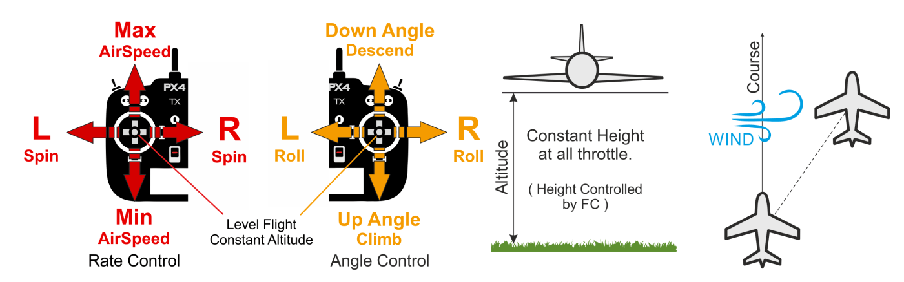

# Altitude Mode (Fixed Wing)

&nbsp;&nbsp;

The *Altitude* flight mode makes it easier for users to control vehicle altitude, and in particular to reach and maintain a fixed altitude. The mode will not attempt to hold the vehicle course against wind.

The climb/descent rate is controlled via the pitch/elevator stick. Once centered the autopilot latches onto the current altitude and will maintain it during yaw/roll, and at any airspeed.

The throttle input controls airspeed. Roll and pitch are angle-controlled (so it is impossible to roll over or loop the vehicle).

When all remote control inputs are centered (no roll, pitch, yaw, and ~50% throttle) the aircraft will return to straight, level flight (subject to wind) and keep its current altitude.

The diagram below shows the mode behaviour visually (for a [mode 2 transmitter](../getting_started/rc_transmitter_receiver.md#transmitter_modes)).

## Technical Summary

RC/manual mode like Stabilized mode but with altitude stabilization (centered sticks put vehicle into straight and level flight and maintain current altitude). The vehicle course is not maintained, and can drift due to wind.

* Centered Roll/Pitch/Yaw inputs (inside deadband): 
  * Autopilot levels vehicle/wings and maintains altitude.
  * Throttle stick controls the airspeed of the aircraft if an airspeed sensor is connected. Without an airspeed sensor the user cannot control throttle (in which case the vehicle will fly level at cruise throttle ([FW_THR_CRUISE](../advanced_config/parameter_reference.md#FW_THR_CRUISE)), increasing or decreasing throttle as needed to climb or descend).
* Outside center: 
  * Pitch stick controls altitude.
  * Throttle stick controls the airspeed of the aircraft (as for centered Roll/Pitch/Yaw inputs).
  * Roll stick controls roll angle. Autopilot will maintain [coordinated flight](https://en.wikipedia.org/wiki/Coordinated_flight). This is same as in [Stabilized mode](../flight_modes/stabilized_fw.md).
  * Yaw stick actuates the rudder (signal will be added to the one calculated by the autopilot to maintain [coordinated flight](https://en.wikipedia.org/wiki/Coordinated_flight)). This is same as in [Stabilized mode](../flight_modes/stabilized_fw.md).

:::note

* Manual input is required (RC controller, or gamepad/thumbsticks through MAVLink).
* The altitude is normally measured using a barometer, which may become inaccurate in extreme weather conditions. Vehicles that include a LIDAR/range sensor will be able to control altitude with greater reliability and accuracy.
:::

## Parameters

The mode is affected by the following parameters:<a href="../advanced_config/parameter_reference.md#FW_MAN_P_MAX">FW_MAN_P_MAX</a></td> 

<td>
  Max pitch for manual control in attitude stabilized mode. Default: 45 degrees.
</td></tr> 

<tr>
  <td>
    <a href="../advanced_config/parameter_reference.md#FW_MAN_R_MAX">FW_MAN_R_MAX</a></td> 
    
    <td>
      Max roll for manual control in attitude stabilized mode. Default: 45 degrees.
    </td></tr> 
    
    <tr>
      <td>
        <a href="../advanced_config/parameter_reference.md#fw-l1-control">FW L1 Control</a></td> 
        
        <td>
          The roll/yaw needed to maintain the commanded altitude and airspeed are also affected by the FW L1 Control parameters.
        </td></tr> </tbody> </table> 
        
        <!-- 
FW notes: 
FW position controller is basically 2 independent pieces

* L1 is for navigation - determines the roll and yaw needed to achieve the desired waypoint (or loiter)
* TECS is for speed and height control - determines throttle and elevator position needed to achieve the commanded altitude and airspeed
Overall that gives you an attitude setpoint (roll, pitch, yaw) and throttle which is sent off to the attitude controller
-->