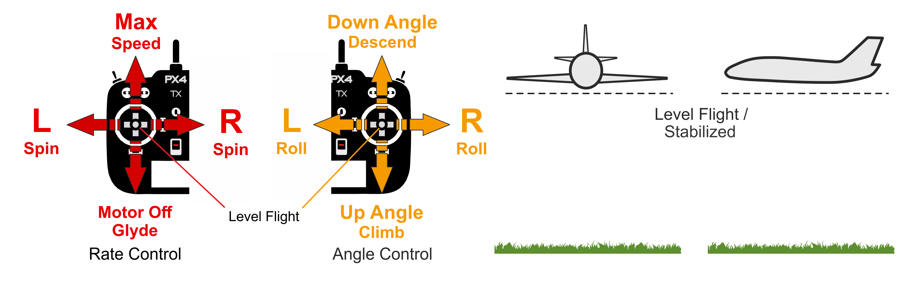

# Stabilized Mode (Fixed-wing)

&nbsp;

_Stabilized mode_ puts the vehicle into straight and level flight when the RC sticks are centered, maintaining the horizontal posture against wind (but not vehicle heading and altitude).

:::note
_Stabilized mode_ is similar to [Altitude mode](../flight_modes_fw/altitude.md) in that releasing the sticks levels the vehicle, but unlike altitude mode it does not maintain altitude or heading. It is much easier to fly than [Manual mode](../flight_modes_fw/manual.md) because you can't roll or flip it, and if needed it is easy to level the vehicle (by centering the control sticks).
:::

The vehicle climb/descends based on pitch input and performs a [coordinated turn](https://en.wikipedia.org/wiki/Coordinated_flight) if the roll/pitch sticks are non-zero. Roll and pitch are angle controlled (you can't roll upside down or loop).

The vehicle will glide if the throttle is lowered to 0% (motor stops). In order to perform a turn the command must be held throughout the maneuver because if the roll is released the plane will stop turning and level itself (the same is true for pitch and yaw commands).

The diagram below shows the mode behaviour visually (for a [mode 2 transmitter](../getting_started/rc_transmitter_receiver.md#transmitter_modes)).

## Technical Description

Manual mode where centered roll/pitch sticks levels vehicle attitude. The vehicle course and altitude are not maintained, and can drift due to wind.

- Centered Roll/Pitch/Yaw sticks (inside deadband) put vehicle into straight and level flight. The vehicle course and altitude are not maintained, and can drift due to wind.
- If roll/pitch sticks are non-zero the vehicle does a coordinated turn (manual yaw input is added to rudder control input to control sideslip).
- Pitch stick controls pitch angle.
- Roll stick controls roll angle. Autopilot will maintain <a href="https://en.wikipedia.org/wiki/Coordinated_flight">coordinated flight</a>.
- Throttle stick controls throttle.
- Yaw stick adds an additional yaw rate setpoint (signal will be added to the one calculated by the autopilot to maintain [coordinated flight](https://en.wikipedia.org/wiki/Coordinated_flight)).
- Manual control input is required (such as RC control, joystick).
  - Roll: Assistance from autopilot to stabilize the attitude. Position of stick maps to the orientation of vehicle.
  - Pitch: Assistance from autopilot to stabilize the attitude. Position of stick maps to the orientation of vehicle.
  - Yaw: Stick input is sent directly to control allocation.
  - Throttle: Stick input is sent directly to control allocation.

## Parameters

The mode is affected by the following parameters:

| Parameter | Description |
| --------- | ----------- |
|           |             |
[FW_MAN_P_MAX](../advanced_config/parameter_reference.md#FW_MAN_P_MAX)          | Max pitch for manual control in attitude stabilized mode. Default: 45 degrees.                                           | | [FW_MAN_R_MAX](../advanced_config/parameter_reference.md#FW_MAN_R_MAX)          | Max roll for manual control in attitude stabilized mode. Default: 45 degrees.                                            |

<!-- this document needs to be extended -->
