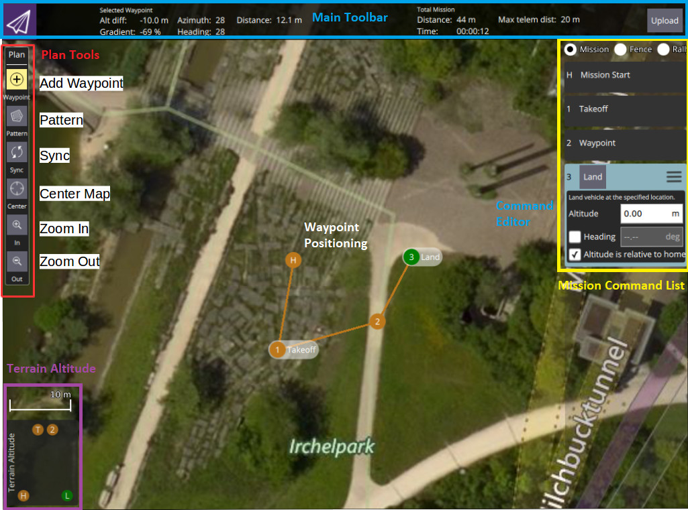
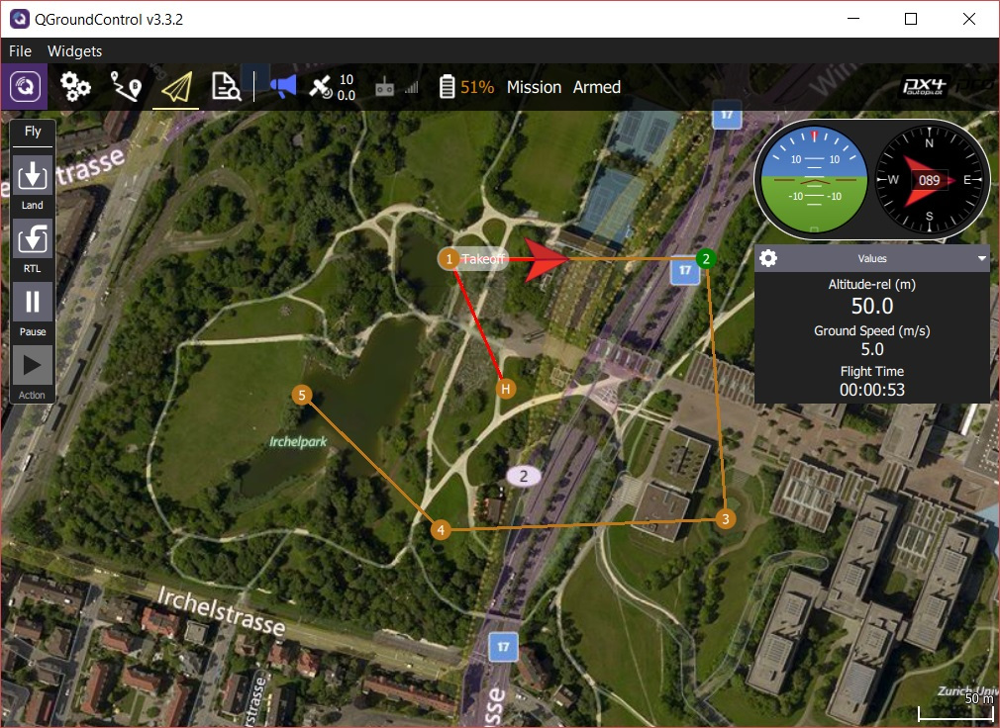

# Missions

## Planning Missions

Manually planning missions is straightforward:

- Switch to the mission view
- Select the **Add Waypoint** ("plus") icon in the top left. 
- Click on the map to add waypoints.
- Use the waypoint list on the right to modify the waypoint parameters/type The altitude indicator on the bottom provides a sense of the relative altitude of each waypoint.
- Once finished, click on the **Upload** button (top right) to send the mission to the vehicle.

You can also use the *Pattern* tool to automate creation of survey grids.

> **Tip** For more information see the [QGroundControl User Guide](https://docs.qgroundcontrol.com/en/PlanView/PlanView.html).

## Flying Missions

Once the mission is uploaded, switch to the flight view. The mission is displayed in a way that makes it easy to track progress (it cannot be modified in this view).

