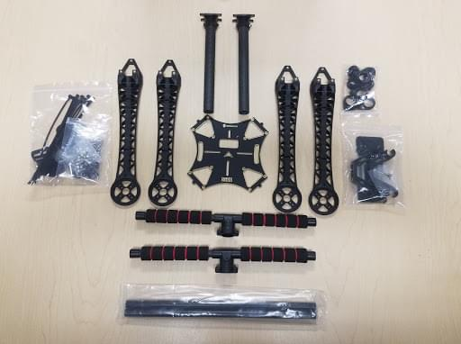
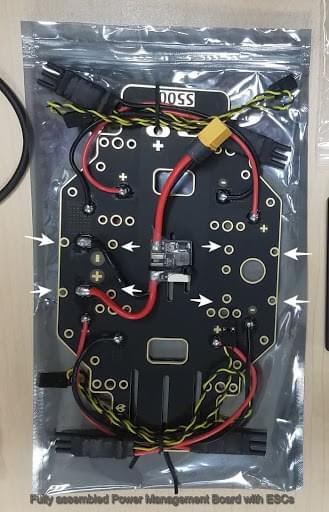
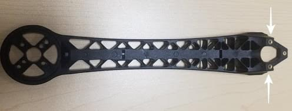
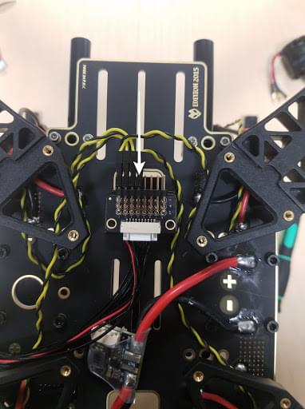
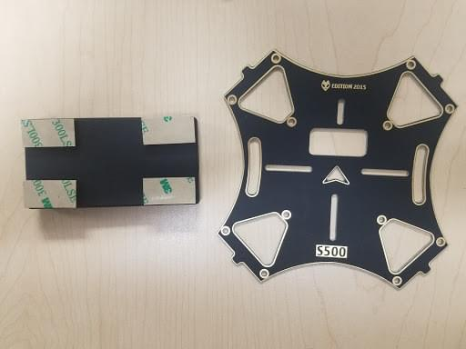
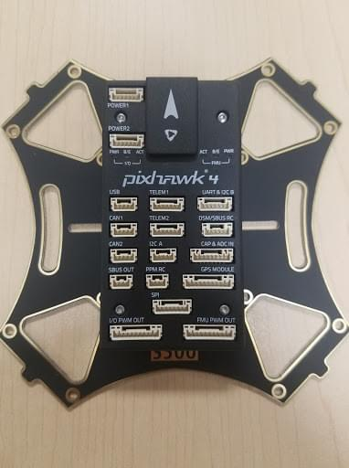

# Holybro S500 V2 + Pixhawk 4 Build

This topic provides full instructions for building the kit and configuring PX4 using *QGroundControl*.

## Key information

- **Frame:** Holybro S500
- **Flight controller:** [Pixhawk 4](../flight_controller/pixhawk4.html)
- **Assembly time (approx.):** 90 minutes (45 minutes for frame, 45 minutes for autopilot installation/configuration)

## Bill of materials

The Holybro [S500 V2 Kit](https://shop.holybro.com/s500-v2-kitmotor2216-880kv-propeller1045_p1153.html) includes almost all the required components:

* Pixhawk 4 autopilot（PM07 not included)
* Power Management PM02（Assembled）
* ARM adopts high strength plastics
* Motors - 2216 KV880（ V2 Update）
* Propeller 1045（ V2 Update）
* Pixhawk4 GPS
* Fully assembled Power Management Board with ESCs
* 433MHz Telemetry Radio / 915MHz Telemetry Radio
* Power and Radio Cables
* Battery Straps
* Dimensions:383*385*240mm
* Wheelbase:480mm

Note: No LiPo battery included. In addition, we use a FrSky Taranis controller.

## Hardware

| Item Description           | Quantity |
| -------------------------- | -------- |
| Wheelbase: 480mm           | 1        |
| Arms                       | 4        |
| Set of Landing Gear        | 2        |
| M3*8 screws                | 18       |
| M2 5*6 screws              | 24       |
| Battery Straps             | 1        |
| Propeller 1045 (V2 Update) | 1        |

## Package
| Items                            | Package |
| -------------------------------- | ------- |
| Pixhawk 4                        | 1       |
| Pixhawk4 GPS MODULE              | 1       |
| I2C splitter Board               | 2       |
| 6 to 6 pin cable (power)         | 3       |
| 4 to 4 pin cable (CAN)           | 2       |
| 6 to 4 pin cable (Data)          | 1       |
| 10 to 10 pin cable (PWM)         | 2       |
| 8 to 8 pin cable(AUX)            | 1       |
| 7 to 7 pin cable(SPI)            | 1       |
| 6 to 6 pin cable(Debug)          | 1       |
| PPM/SBUS out cable               | 1       |
| XSR receiver cable               | 1       |
| DSMX receiver cable              | 1       |
| SBUS receiver cable              | 1       |
| USB cable                        | 1       |
| 'X'type folding pedestal mount   | 1       |
| 70mm & 140mm carbon rod standoff | 2       |
| 6*3 2.54mm pitch Horizontal Pin  | 1       |
| 8*3 2.54mm pitch Horizontal Pin  | 2       |
| Foam Set                         | 1       |
| Pixhawk4 Quick Start Guide       | 1       |
| Pixhawk4 Pinouts                 | 1       |
| GPS Quick Start Guide            | 1       |

### Electronics
| Item Description                                 | Quantity |
| ------------------------------------------------ | -------- |
| Pixhawk 4 autopilot (PM06 not included)          | 1        |
| Power Management PM02 (Assembled)                | 1        |
| Motors - 2216 KV880 (V2 Update)                  | 4        |
| Pixhawk 4 GPS                                    | 1        |
| Fully assembled Power Management Board with ESCs | 1        |
| 433MHz Telemetry Radio / 915MHz Telemetry Radio  | 1        |

### Tools needed

The following tools are used in this assembly:

- 1.5 mm Hex screwdriver
- 2.0 mm Hex screwdriver
- 2.5 mm Hex screwdriver
- 3mm Phillips screwdriver
- Wire cutters
- Precision tweezers

## Assembly

Estimate time to assemble is 90 minutes, about 45 minutes for frame assembly and 45 minutes installing and configuring the autopilot in QGroundControl.

**Step 1:** Assembling the Landing Gear. We are going to start by assembling the landing gear to the vertical pole. Unscrew the landing gear screws and insert the vertical pole, see Figures 1 and 2.

(Figure 1)

(Figure 2)

**Step 2:**  Assemble the Power Management Board to the landing gear. Screw the landing gear with a vertical pole to the Fully assembled Power Management Board.

The Board has 4 holes (see Figure 3 arrows) use the M3X8 screws, a total of 8 pieces, 4 on each side, see Figure 4.

(Figure 3)

(Figure 4)

**Step 3:**  Assemble the arms to the Power Management Board. Attach the arm to the Power Management Board, see Figures 6 and 7.

(Figure 6)

(Figure 7)

Use M2 5X6 screws a total of 2 in each arm. Insert the screws from the bottom of the plate, see Figure 8.

(Figure 8)

Make sure the ESC cables run through the middle of the arm, see Figure 9.

(Figure 9)

**Step 4:** Assemble the 8*3 2.54mm pitch Horizontal Pin to the 10 to 10 pin cable (PWM) to the Power Management Board. Connect the 10 to 10 pin cable (PWM) to the 8*3 2.54mm pitch Horizontal Pin, see Figure 10.

(Figure 10)

Cut a piece of 3M Tape and attach to the bottom of the Horizontal Pin, (see Figure 11)

(Figure 11)

Stick the Horizontal Pin to the Power Management Board, see Figures 12 and 13.

(Figure 12)

(Figure 13)

**Step 5:** Assemble the motors to the arms. For this, we will need the 16 screws M3X7, 4 motors, and the 4 arms.

Mount the motors in each arm put the screw through the bottom of the arm, see Figures 14 and 15.

(Figure 14)

(Figure 15)

After the 4 motors are mounted on the arm grab the cables(red, blue, black) and put them through the arm thread, see Figures 16 and 17. The 3 cables that are color-coded go connected to the ESC.

(Figure 16)

(Figure 17)

**Step 6:** Mounting the GPS on the frame. For this, we will need the Pixhawk 4 GPS and the mounting plate.

Mount the GPS mast to the back of the Board, use the 4 screws see Figure 18 and 19.

(Figure 18)

(Figure 19)

Use the tape and stick the GPS to the top of the GPS mast, see Figure 20.

(Figure 20)

**Step 7:** Paste the FrSky to the Board. Paste FrSky with double-sided tape (3M) to the bottom board. Attach the FrSky to the frame, See Figures 21 and 22.

(Figure 21)

(Figure 22)

**Step 8:** Attach the Telemetry to the frame. The next step is to take the Holybro telemetry radio and attach it onto the frame, use 3M tape, see Figure 23 and 24.

(Figure 23)

(Figure 24)

This assembly attached it inside the frame facing outwards to the front of the vehicle. A picture is shown below of the radio sitting inside the bottom of the frame, see Figure 25.

(Figure 25)

**Step 9:** Mounting the Pixhawk 4 to the plate. Use double-sided tape to attach the Pixhawk 4 to the center plate, see Figure 26-27 and 28.

(Figure 26)

(Figure 27)

(Figure 28)

The next step is to mount the Pixhawk 4 with the plate to the frame. For this, we will need the M2 5X6 screws. Align the plate to the frame, see Figures 29 and 30, insert the screws.

Before you mount the plate we recommend putting tape on the Power Module that way it’s tight and not loose, see Figure 29.

(Figure 29)

(Figure 30)

**Step 10:** Assembling the Battery Mount to the frame. For this we will need the M2 5X6 screws and the battery mount see Figure 31.

(Figure 31)

Insert the long rods to the small rings see Figure 32 and 33.

(Figure 32)

(Figure 33)

Attach that to the frame, make sure all four sides are aligned to insert the screws, see Figure 34.

(Figure 34)

Assemble the small plate to the legs, see Figure 35 screw on all four sides.

(Figure 35)

The final step is to attach the plate to the, see figure 36.

(Figure 36)

**Step 11:** Pixhawk 4 wiring. The Pixhawk 4, which has several different wires and connections with it. Included below is a picture of every wire needed with the Pixhawk and how it looks when connected.

Plugin Telemetry and GPS module to the flight controller as seen in Figure 37; plug in the RC receiver, all 4 ESCs to the flight controller as well as the power module as shown in Figure 37.

(Figure 37)

(Fully assembled Pixhawk)

(Fully assembled S500 V2 Kit)

## Install/Configure PX4 {#configure}

*QGroundControl* is used to install the PX4 autopilot and configure/tune it for the QAV250 frame. [Download and install](http://qgroundcontrol.com/downloads/) *QGroundControl* for your platform.

> **Tip** Full instructions for installing and configuring PX4 can be found in [Basic Configuration](../config/README.md).

First update the firmware and airframe:

* [Firmware](../config/firmware.md)
* [Airframe](../config/airframe.md)

> **Note** You will need to select the *Holybro S500* airframe (**Quadrotor x > Holybro S500**).

Then perform the mandatory setup/calibration:

* [Sensor Orientation](../config/flight_controller_orientation.md)
* [Compass](../config/compass.md)
* [Accelerometer](../config/accelerometer.md)
* [Level Horizon Calibration](../config/level_horizon_calibration.md)
* [Radio Setup](../config/radio.md)
* [Flight Modes](../config/flight_mode.md)

Ideally you should also do:

* [ESC Calibration](../advanced_config/esc_calibration.md)
* [Battery](../config/battery.md)
* [Safety](../config/safety.md)

## Tuning

Airframe selection sets *default* autopilot parameters for the frame. These are good enough to fly with, but it is a good idea to tune the parameters for a specific frame build.

For general information on tuning see: [Multicopter PID Tuning Guide](../config_mc/pid_tuning_guide_multicopter.md).

## Acknowledgements

This build log was provided by the Dronecode Test Flight Team.