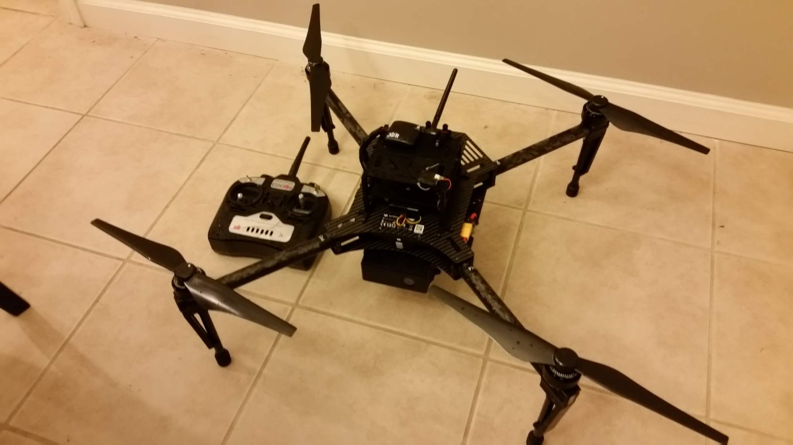
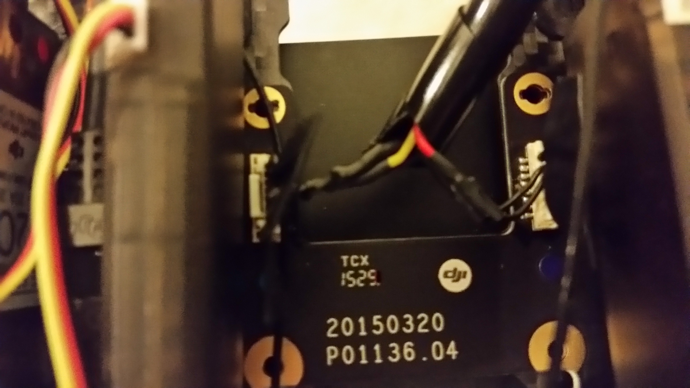
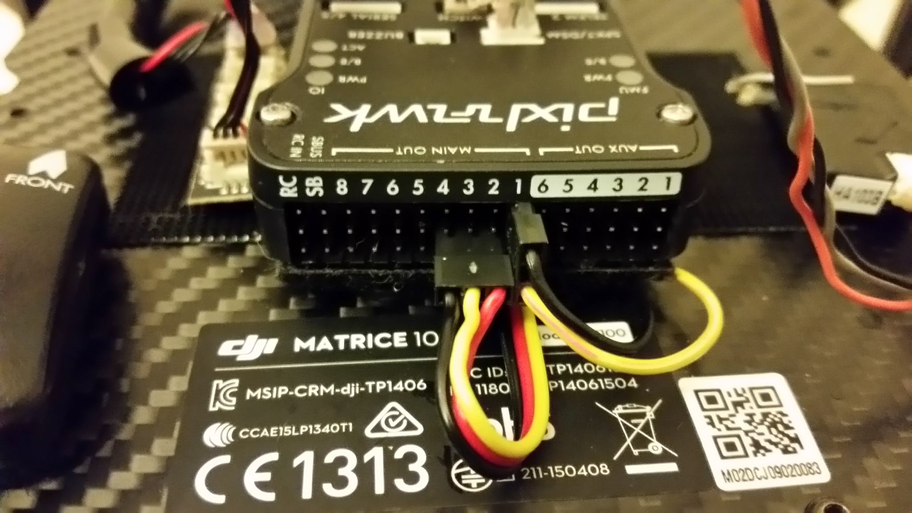
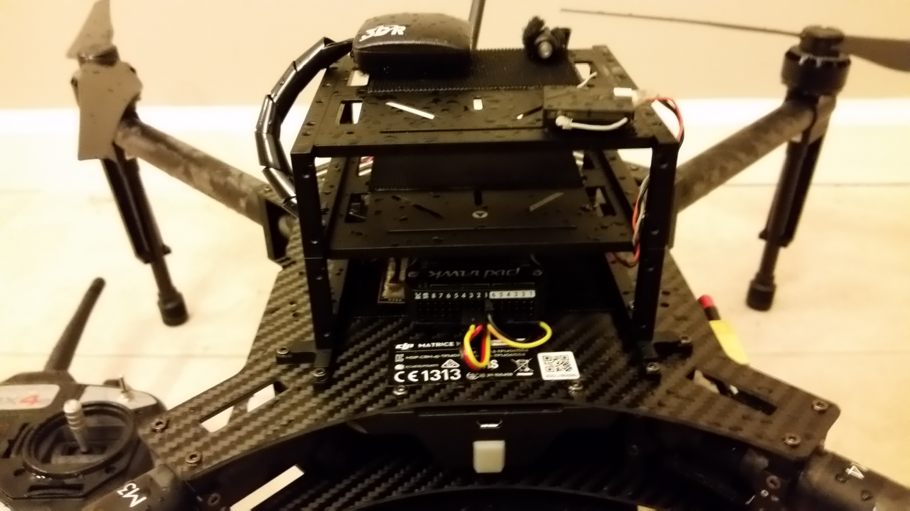
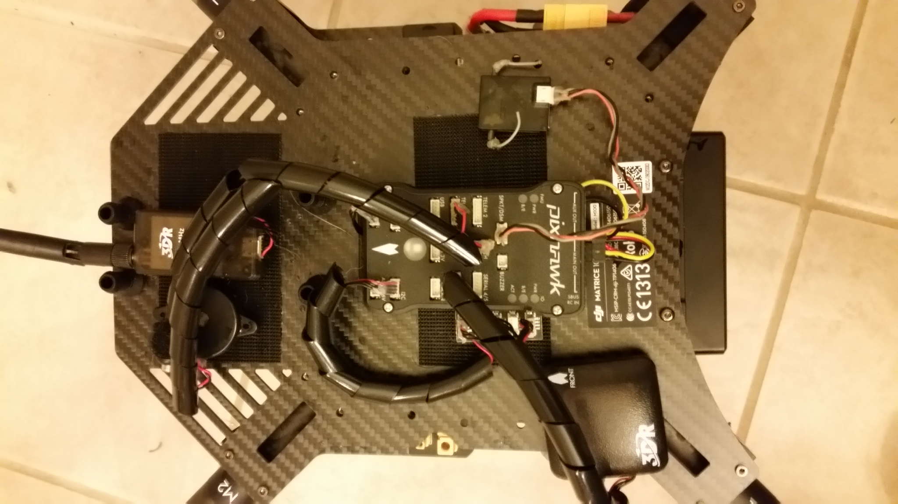

# DJI Matrice 100 (Pixhawk 1)

The DJI&reg; Matrice quadcopter is a fully customizable and programmable flight platform. This build log provides build and configuration instructions for using the frame with the *3DR Pixhawk* flight controller.

Key information:

* **Frame:** DJI Matrice 100
* **Flight controller:** [Pixhawk 1](../flight_controller/pixhawk.md)

## Parts List

    * [DJI Matrice 100](http://store.dji.com/product/matrice-100) Just ESCs motors, and frame.
    

## Motor Connections

See the [Pixhawk Wiring Quickstart](../assembly/quick_start_pixhawk.md) for autopilot assembly instructions.

### Wiring Diagram

### Wiring Harness

### PWM Connections

### Other views

### Autopilot Outputs

<!-- 
The autopilot outputs are specified in [Airframe Reference > DJI Matrice 100](../airframes/airframe_reference.md#copter_quadrotor_x_dji_matrice_100)) (or more specifically, in the [quadrotor-x configuration section](../airframes/airframe_reference.md#quadrotor-x). 
-->

| Output | Rate   | Actuator         |
| ------ | ------ | ---------------- |
| MAIN1  | 400 Hz | Front right, CCW |
| MAIN2  | 400 Hz | Back left, CCW   |
| MAIN3  | 400 Hz | Front left, CW   |
| MAIN4  | 400 Hz | Back right, CW   |
| AUX1   | 50 Hz  | RC AUX1          |
| AUX2   | 50 Hz  | RC AUX2          |
| AUX3   | 50 Hz  | RC AUX3          |

## Parameters

* At high throttle the inner loop causes oscillations with default x quad gains. At low throttle, higher gains give a better response, this suggests that some gain scheduling based on the throttle may improve the overall response and this could be implemented in mc_att_control. For now we will just tune it so that there are no oscillations at low or high throttle, and take the bandwidth hit at low throttle. 
  * MC_PITCHRATE_P: 0.05
  * MC_PITCHRATE_D: 0.001
* The battery has 6 cells instead of the default 3 
  * BAT_N_CELLS: 6

## Video

@[youtube](https://youtu.be/3OGs0ONemGc)