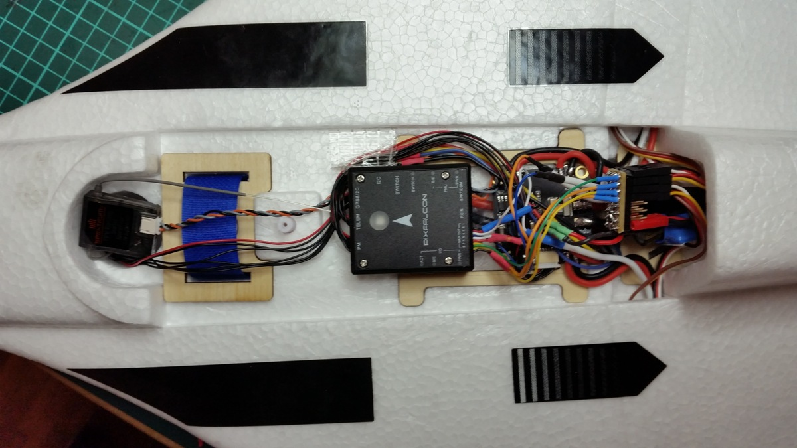
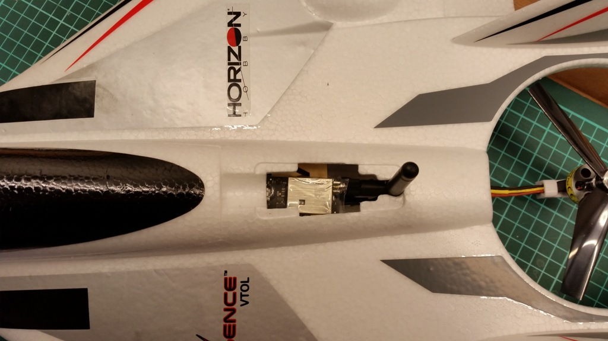
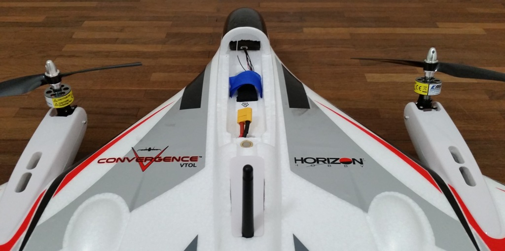

# E-flite Convergence Tiltrotor VTOL (Pixfalcon)

The [E-Flite Convergence](https://www.modelflight.com.au/e-flite-convergence-vtol-bnf-basic.html) can easily be converted to a fully autonomous VTOL with PX4. There is not much space but it's enough for a Pixfalcon with GPS and telemetry.

@[youtube](https://youtu.be/E61P2f2WPNU)

## Hardware Setup

The convergence needs 7 PWM signals and is connected to a Pixfalcon in the following way (matching the airframe configuration in PX4, left/right seen looking from behind the plane):

| Port   | Connection       |
| ------ | ---------------- |
| MAIN 1 | Motor right      |
| MAIN 2 | Motor left       |
| MAIN 3 | Motor back       |
| MAIN 4 | empty            |
| MAIN 5 | Tilt servo right |
| MAIN 6 | Tilt servo left  |
| MAIN 7 | Elevon right     |
| MAIN 8 | Elevon left      |

The Pixfalcon can be mounted at the same place the original autopilot was.

The telemetry module fits into the bay meant to hold FPV transmission gear.

For the GPS we cut out a section of foam inside the "cockpit". That way the GPS can be put inside the body and is nicely stowed away without compromising the looks :).

## Configuration

Before the autopilot is configured normally (radio, sensors, flight modes), select the airframe configuration "E-flite Convergence" under "VTOL Tiltrotor" in QGC and restart.

If the airframe is not yet visible in QGC, set the following parameters and restart:

- `SYS_AUTOSTART`: 13012
- `SYS_AUTOCONFIG`: 1

Notes:

- Remember to assign the transition switch for switching to fixed-wing.
- By default permanent stabilization is enabled. If you like fully manual flying in fixed-wing, set VT\_FW\_PERM\_STAB to 0.