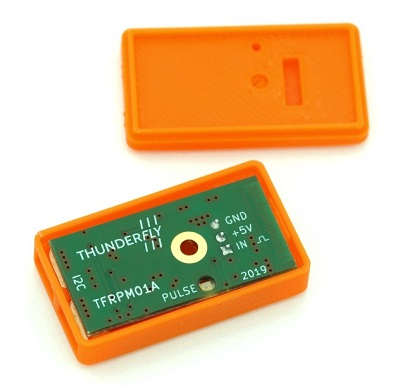

# Sensors

PX4-based systems use sensors to determine vehicle state (needed for stabilization and to enable autonomous control). The vehicle states include: position/altitude, heading, speed, airspeed, orientation (attitude), rates of rotation in different directions, battery level, etc.

The system *minimally requires* a gyroscope, accelerometer, magnetometer (compass) and barometer. A GPS or other positioning system is needed to enable all automatic [modes](../getting_started/flight_modes.md#categories), and some assisted modes. Fixed wing and VTOL-vehicles should additionally include an airspeed sensor (very highly recommended).

The minimal set of sensors is incorporated into [Pixhawk Series](../flight_controller/pixhawk_series.md) flight controllers (and may also be in other controller platforms). Additional/external sensors can be attached to the controller.

Below we describe some of the sensors. At the end there are links to information about [sensor wiring](#wiring).

## GPS & Compass

PX4 supports a number of global navigation satellite system (GNSS) receivers and compasses (magnetometers). It also supports [Real Time Kinematic (RTK) GPS Receivers](../gps_compass/rtk_gps.md), which extend GPS systems to centimetre-level precision.

:::note
[Pixhawk-series](../flight_controller/pixhawk_series.md) controllers include an *internal* compass. This *may* be useful on larger vehicles (e.g. VTOL) where it is possible to reduce electromagnetic interference by mounting the Pixhawk a long way from power supply lines. On small vehicles an external compass is almost always required.
:::

We recommend the use of an external "combined" compass/GPS module mounted as far away from the motor/ESC power supply lines as possible - typically on a pedestal or wing (for fixed-wing).

Common GPS/compass hardware options are listed in: [GPS/Compass](../gps_compass/README.md).

## Airspeed

Airspeed sensors are *highly recommended* for fixed-wing and VTOL frames.

They are so important because the autopilot does not have other means to detect stall. For fixed-wing flight it is the airspeed that guarantees lift not ground speed!

For more information and recommended hardware see: [Airspeed Sensors](../sensor/airspeed.md).

## Tachometer

Tachometers ([revolution-counter sensors](https://en.wikipedia.org/wiki/Tachometer#In_automobiles,_trucks,_tractors_and_aircraft)) are *highly recommended* for rotor-wing frames because they allow the autopilot to detect stall or another rotor failure (for rotor-wing flight it is the rotation of blades that guarantees lift not airspeed or ground speed).

For more information and recommended hardware see: [Sensors > Tachometers](../sensor/tachometers.md).

## Distance

Distance sensors are used for precision landing, object avoidance and terrain following.

PX4 supports many affordable distance sensors, using different technologies, and supporting different ranges and features. For more information see: [Distance Sensors](../sensor/rangefinders.md).

## Optical Flow

[Optical Flow](../sensor/optical_flow.md) sensors use a downward facing camera and a downward facing distance sensor for velocity estimation. PX4 blends the sensor output with information from other position sources (e.g. GPS) to provide a more accurate position lock. This sensor can be used indoors, when no GPS signal is available.

Some options include:

* [PX4Flow](../sensor/px4flow.md) based flow sensors, which have an integrated sonar sensor.
* [PMW3901](../sensor/pmw3901.md) based flow sensors, which have a sensor much like in an optical mouse trackpad.

## Sensor Wiring

Sensor wiring information is usually provided in manufacturer documentation for flight controllers and the sensors themselves.

In addition, see:

* [Basic Assembly](../assembly/README.md) contains flight controller quick start guides. These cover wiring of the core sensors to specific flight controller hardware.
* [Flight Controller](../flight_controller/README.md) topics often contain wiring information.
* [Peripheral Hardware](../peripherals/README.md) contains documentation for other sensors.