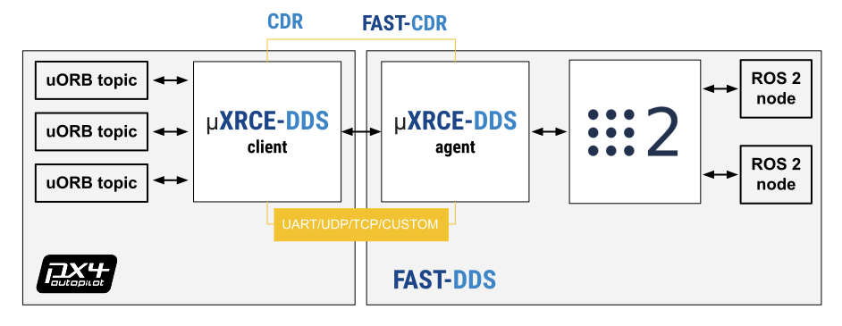

# XRCE-DDS (PX4-FastDDS Bridge)

:::note
XRCE-DDS replaces the [Fast-RTPS Bridge](https://docs.px4.io/v1.13/en/middleware/micrortps.html#rtps-dds-interface-px4-fast-rtps-dds-bridge) used in PX4 v1.13.
:::

PX4 uses XRCE-DDS middleware to allow [uORB messages](../middleware/uorb.md) to be published and subscribed on a companion computer as though they were [ROS 2](../ros/ros2_comm.md) topics. This provides a fast and reliable integration between PX4 and ROS 2, and makes it much easier for ROS 2 applications to get vehicle information and send commands.

PX4 uses an XRCE-DDS implementation that leverages [eProsima Micro XRCE-DDS](https://micro-xrce-dds.docs.eprosima.com/en/stable/introduction.html).

The following guide describes the architecture and various options for setting up the client and agent. In particular it covers the options that are most important to PX4 users.


## Architecture

The XRCE-DDS middleware consists of a client running on PX4 and an agent running on the companion computer, with bi-directional data exchange between them over a serial or UDP link. The agent acts as a proxy for the client, enabling it to publish and subscribe to topics in the global DDS data space.



In order for PX4 uORB topics to be shared on the DDS network you will need _XRCE-DDS client_ running on PX4, connected to the _XRCE-DDS agent_ running on the companion.

The PX4 [microdds-client](../modules/modules_system.md#microdds-client) publishes to/from a defined set of uORB topics to the global DDS data space.

The [eProsima XRCE-DDS _agent_](https://github.com/eProsima/Micro-XRCE-DDS-Agent) runs on the companion computer and acts as a proxy for the client in the DDS/ROS 2 network.

The agent itself has no dependency on client-side code and can be built and/or installed independent of PX4 or ROS.

Code that wants to subscribe/publish to PX4 does have a dependency on client-side code; it requires uORB message definitions that match those used to create the PX4 XRCE-DDS client so that it can interpret the messages.


## Code Generation

The PX4 [microdds-client](../modules/modules_system.md#microdds-client) is generated at build time and included in PX4 firmare by default. The agent has no dependency on client code. It can be built standalone or in a ROS 2 workspace, or installed as a snap package on Ubuntu.

When PX4 is built, a code generator uses the uORB message definitions in the source tree ([PX4-Autopilot/msg](https://github.com/PX4/PX4-Autopilot/tree/release/1.14/msg)) to compile support for the subset of uORB topics in [PX4-Autopilot/src/modules/microdds_client/dds_topics.yaml](https://github.com/PX4/PX4-Autopilot/blob/release/1.14/src/modules/microdds_client/dds_topics.yaml) into [microdds-client](../modules/modules_system.md#microdds-client).

PX4 main or release builds automatically export the set of uORB messages definitions in the build to an associated branch in [PX4/px4_msgs](https://github.com/PX4/px4_msgs).

ROS 2 applications need to be built in a workspace that includes the _same_ message definitions that were used to create the XRCE-DDS client module in the PX4 Firmware. These can be included into a workspace by cloning the interface package [PX4/px4_msgs](https://github.com/PX4/px4_msgs) into your ROS 2 workspace and switching to the appropriate branch. Note that all code generation associated with the messages is handled by ROS 2.


## XRCE-DDS Agent Installation

The XRCE-DDS Agent can be installed on the companion computer using a binary package, built and installed from source, or built and run from within a ROS 2 workspace. All of these methods fetch _all_ the dependencies needed to communicate with the client (such as FastCDR)

:::note
The official (and more complete) installation guide is the Eprosima: [micro XRCE-DDS Installation Guide](https://micro-xrce-dds.docs.eprosima.com/en/latest/installation.html) This section summarises the options that have been tested with PX4 during creation of these docs.
:::

### Install Standalone from Source

On Ubuntu you can build from source and install the Agent standalone using the following commands:

```sh
git clone https://github.com/eProsima/Micro-XRCE-DDS-Agent.git
cd Micro-XRCE-DDS-Agent
mkdir build
cd build
cmake ..
make
sudo make install
sudo ldconfig /usr/local/lib/
```

:::note
There are various build configuration options linked from the corresponding topic in the [official guide](https://micro-xrce-dds.docs.eprosima.com/en/latest/installation.html#installing-the-agent-standalone), but these have not been tested.
:::

To start the agent with settings for connecting to the XRCE-DDS client running on the simulator:

```sh
MicroXRCEAgent udp4 -p 8888
```

### Install from Snap Package

Install from a snap package on Ubuntu using the following command:

```sh
sudo snap install micro-xrce-dds-agent --edge
```

To start the agent with settings for connecting to the XRCE-DDS client running on the simulator (note that the command name is different than if you build the agent locally):

```sh
micro-xrce-dds-agent udp4 -p 8888
```

:::note
At time of writing the stable of version installed from snap connects to PX4 but reports errors creating topics. The development version, fetched using `--edge` above, does work.
:::

### Build/Run within ROS 2 Workspace

The agent can be built and launched within a ROS 2 workspace (or build standalone and launched from a workspace. You must already have installed ROS 2 following the instructions in: [ROS 2 User Guide > Install ROS 2](../ros/ros2_comm.md#install-ros-2).

To build the agent within ROS:

1. Create a workspace directory for the agent:

   ```sh
   mkdir -p ~/ws_xrce_dds_agent/src
   ```

1. Clone the source code for the eProsima [Micro-XRCE-DDS-Agent](https://github.com/eProsima/Micro-XRCE-DDS-Agent) to the `/src` directory (the `main` branch is cloned by default):

   ```sh
   cd ~/px4_ros_xrce_dds_ws/src
   git clone https://github.com/eProsima/Micro-XRCE-DDS-Agent.git
   ```
1. Source the ROS 2 development environment, in this case "ROS 2 Foxy", and compile the workspace using `colcon`:

   ```sh
   cd ..
   source /opt/ros/foxy/setup.bash
   colcon build
   ```
   This builds all the folders under `/src` using the sourced toolchain.


To run the XRCE-DDS agent in the workspace:

1. Source the `local_setup.bash` to make the executables available in the terminal (also `setup.bash` if using a new terminal).

   ```sh
   source /opt/ros/foxy/setup.bash
   source install/local_setup.bash
   ```
1. Start the agent with settings for connecting to the XRCE-DDS client running on the simulator:

   ```sh
   MicroXRCEAgent udp4 -p 8888
   ```

## Starting XRCE-DDS

### Starting the Agent

The agent is used to connect to the client over a particular channel, such as UDP or a serial connection. The channel settings are specified when the agent is started, using command line options. These are documented in the eProsima user guide: [Micro XRCE-DDS Agent > Agent CLI](https://micro-xrce-dds.docs.eprosima.com/en/latest/agent.html#agent-cli). Note that the agent supports many channel options, but PX4 only supports UDP and serial connections.


:::note
You should create a single instance of the agent for each channel over which you need to connect.
:::

For example, the PX4 simulator runs the XRCE-DDS client over UDP on port 8888, so to connect to the simulator you would start the agent with the command:

```sh
MicroXRCEAgent udp4 -p 8888
```

When working with real hardware, the setup depends on the hardware, OS, and channel. For example, if you're using the RasPi `UART0` serial port, you might connect using this command (based on the information in [Raspberry Pi Documentation > Configuring UARTS](https://www.raspberrypi.com/documentation/computers/configuration.html#configuring-uarts)):

```sh
sudo MicroXRCEAgent serial --dev /dev/AMA0 -b 921600
```

:::note
For more information about setting up communications channels see [Pixhawk + Companion Setup > Serial Port setup](../companion_computer/pixhawk_companion.md#serial-port-setup), and sub-documents.
:::


### Starting the Client

The XRCE-DDS client module ([microdds-client](../modules/modules_system.md#microdds-client)) is included by default in all firmware and the simulator. This must be started with appropriate settings for the communication channel that you wish to use to communicate with the agent.

:::note
The simulator automatically starts the client on localhost UDP port `8888` using the default microdds namespace.
:::

The configuration can be done using the [Micro XRCE-DDS parameters](../advanced_config/parameter_reference.md#micro-xrce-dds):

- [XRCE_DDS_CFG](../advanced_config/parameter_reference.md#XRCE_DDS_CFG): Set the port to connect on, such as `TELEM2`, `Ethernet`, or `Wifi`.
- If using an Ethernet connection:
  - [XRCE_DDS_PRT](../advanced_config/parameter_reference.md#XRCE_DDS_PRT): Use this to specify the agent UDP listening port. The default value is `8888`.
  - [XRCE_DDS_AG_IP](../advanced_config/parameter_reference.md#XRCE_DDS_AG_IP): Use this to specify the IP address of the agent. The IP address must be provided in `int32` format as PX4 does not support string parameters. The default value is `2130706433` which corresponds to the _localhost_ `127.0.0.1`.

    You can use [Tools/convert_ip.py](https://github.com/PX4/PX4-Autopilot/blob/pr-micro-XRCE-DDS-allow-IP-parameter/Tools/convert_ip.py) to convert between the formats:

    - To obtain the `int32` version of an IP in decimal dot notation the command is:

      ```sh
      python3 ./PX4-Autopilot/Tools/convert_ip.py <the IP address in decimal dot notation>
      ```
    - To get the IP address in decimal dot notation from the `int32` version:

      ```sh
      python3 ./PX4-Autopilot/Tools/convert_ip.py -r <the IP address in int32 notation>
      ```

- If using a serial connection:
  - [SER_TEL2_BAUD](../advanced_config/parameter_reference.md#SER_TEL2_BAUD), [SER_URT6_BAUD](../advanced_config/parameter_reference.md#SER_URT6_BAUD) (and so on): Use the `_BAUD` parameter associated with the serial port to set the baud rate. For example, you'd set a value for `SER_TEL2_BAUD` if you are connecting to the companion using `TELEM2`. For more information see [Serial port configuration](../peripherals/serial_configuration.md#serial-port-configuration).

- Some setups might also need these parameters to be set:

  - [XRCE_DDS_KEY](../advanced_config/parameter_reference.md#XRCE_DDS_KEY): The XRCE-DDS key. If you're working in a multi-client, single agent configuration, each client should have a unique non-zero key. This is primarily important for multi-vehicle simulations, where all clients are connected in UDP to the same agent. (See the [official eprosima documentation](https://micro-xrce-dds.docs.eprosima.com/en/stable/client_api.html#session) , `uxr_init_session`.)
  - [XRCE_DDS_DOM_ID](../advanced_config/parameter_reference.md#XRCE_DDS_DOM_ID): The DDS domain ID. This provides a logical separation between DDS networks, and can be used to separate clients on different networks. By default, ROS 2 operates on ID 0.

:::note
Many ports are already have a default configuration. To use these ports you must first disable the existing configuration:

- `TELEM1` and `TELEM2` are set up by default to connect via MAVLink to a GCS and a companion computer (respectively). Disable by setting [MAV_0_CONFIG=0](../advanced_config/parameter_reference.md#MAV_0_CONFIG) or [MAV_1_CONFIG=0](../advanced_config/parameter_reference.md#MAV_1_CONFIG) to zero. See [MAVLink Peripherals](../peripherals/mavlink_peripherals.md) for more information.
- Other ports can similarly be configured. See [Serial port configuration](../peripherals/serial_configuration.md#serial-port-configuration).
:::

Once set, you may need to reboot PX4 for the parameters to take effect. They will then persist through subsequent reboots.

You can also start the [microdds-client](../modules/modules_system.md#microdds-client) using a command line. This can be called as part of [System Startup](../concept/system_startup.md) or through the [MAVLink Shell](../debug/mavlink_shell.md) (or a system console). This method is useful when you need to set a custom client namespace, as no parameter is provided for this purpose. For example, the following command can be used to connect via Ethernet to a remote host at `192.168.0.100:8888` and to set the client namespace to `/drone/`.

```sh
microdds_client start -t udp -p 8888 -h 192.168.0.100 -n drone
```
Options `-p` or `-h` are used to bypass `XRCE_DDS_PRT` and `XRCE_DDS_AG_IP`.

The simulator [startup logic](../concept/system_startup.md) ([init.d-posix/rcS](https://github.com/PX4/PX4-Autopilot/blob/release/1.14/ROMFS/px4fmu_common/init.d-posix/rcS)) uses the client startup commands for single and [multi vehicle simulations](../ros/ros2_multi_vehicle.md), enabling the setting of appropriate instance ids and DDS namespaces.

## Supported uORB Messages

The set of [PX4 uORB topics](../msg_docs/README.md) that are exposed through the client are set in [dds_topics.yaml](https://github.com/PX4/PX4-Autopilot/blob/release/1.14/src/modules/microdds_client/dds_topics.yaml).

The topics are release specific (support is compiled into [microdds-client](../modules/modules_system.md#microdds-client) at build time). While most releases should support a very similar set of messages, to be certain you would need to check the yaml file for your particular release.
<!-- Jublish the set we use?: https://github.com/PX4/px4_msgs/issues/22 -->

Note that ROS 2/DDS needs to have the _same_ message definitions that were used to create the XRCE-DDS client module in the PX4 Firmware in order to interpret the messages. The message definitions are stored in the ROS 2 interface package [PX4/px4_msgs](https://github.com/PX4/px4_msgs), and they are automatically synchronized by CI on the `main` and release branches. Note that all the messages from PX4 source code are present in the repository, but only those listed in `dds_topics.yaml` will be available as ROS 2 topics. Therefore,

- If you're using a main or release version of PX4 you can get the message definitions by cloning the interface package [PX4/px4_msgs](https://github.com/PX4/px4_msgs) into your workspace.
- If you're creating or modifying uORB messages you must manually update the messages in your workspace from your PX4 source tree. Generally this means that you would update [dds_topics.yaml](https://github.com/PX4/PX4-Autopilot/blob/release/1.14/src/modules/microdds_client/dds_topics.yaml), clone the interface package, and then manually synchronize it by copying the new/modified message definitions from [PX4-Autopilot/msg](https://github.com/PX4/PX4-Autopilot/tree/release/1.14/msg) to its `msg` folders. Assuming that PX4-Autopilot is in your home directory `~`, while `px4_msgs` is in `~/px4_ros_com/src/`, then the command might be:

  ```sh
  rm ~/px4_ros_com/src/px4_msgs/msg/*.msg
  cp ~/PX4-Autopilot/mgs/*.msg ~/px4_ros_com/src/px4_msgs/msg/
  ```

:::note
Technically, [dds_topics.yaml](https://github.com/PX4/PX4-Autopilot/blob/release/1.14/src/modules/microdds_client/dds_topics.yaml) completely defines the relationship between PX4 uORB topics and ROS 2 messages. For more information see [DDS Topics YAML](#dds-topics-yaml) below.
:::


## Customizing the Topic Namespace

Custom topic namespaces can be applied at build time (changing [dds_topics.yaml](https://github.com/PX4/PX4-Autopilot/blob/release/1.14/src/modules/microdds_client/dds_topics.yaml)) or at runtime (which is useful for multi vehicle operations):

 - One possibility is to use the `-n` option when starting the [microdds-client](../modules/modules_system.md#microdds-client) from command line. This technique can be used both in simulation and real vehicles.
 - A custom namespace can be provided for simulations (only) by setting the environment variable `PX4_MICRODDS_NS` before starting the simulation.


:::note
Changing the namespace at runtime will append the desired namespace as a prefix to all `topic` fields in [dds_topics.yaml](https://github.com/PX4/PX4-Autopilot/blob/release/1.14/src/modules/microdds_client/dds_topics.yaml). Therefore, commands like:

```sh
microdds_client start -n uav_1
```

or

```sh
PX4_MICRODDS_NS=uav_1 make px4_sitl gz_x500
```

will generate topics under the namespaces:

```sh
/uav_1/fmu/in/  # for subscribers
/uav_1/fmu/out/ # for publishers
```
:::

## PX4 ROS 2 QoS Settings

PX4 QoS settings for publishers are incompatible with the default QoS settings for ROS 2 subscribers. So if ROS 2 code needs to subscribe to a uORB topic, it will need to use compatible QoS settings. One example of which is shown in [ROS 2 User Guide > ROS 2 Subscriber QoS Settings](../ros/ros2_comm.md#ros-2-subscriber-qos-settings).

PX4 uses the following QoS settings for publishers:

```cpp
uxrQoS_t qos = {
  .durability = UXR_DURABILITY_TRANSIENT_LOCAL,
  .reliability = UXR_RELIABILITY_BEST_EFFORT,
  .history = UXR_HISTORY_KEEP_LAST,
  .depth = 0,
};
```

PX4 uses the following QoS settings for subscribers:

```cpp
uxrQoS_t qos = {
  .durability = UXR_DURABILITY_VOLATILE,
  .reliability = UXR_RELIABILITY_BEST_EFFORT,
  .history = UXR_HISTORY_KEEP_LAST,
  .depth = queue_depth,
};
```

ROS 2 uses the following QoS settings (by default) for publishers and subscriptions: "keep last" for history with a queue size of 10, "reliable" for reliability, "volatile" for durability, and "system default" for liveliness. Deadline, lifespan, and lease durations are also all set to "default".
<!-- From https://github.com/PX4/PX4-user_guide/pull/2259#discussion_r1099788316 -->


## DDS Topics YAML

The PX4 yaml file [dds_topics.yaml](https://github.com/PX4/PX4-Autopilot/blob/release/1.14/src/modules/microdds_client/dds_topics.yaml) defines the set of PX4 uORB topics that are built into firmware and published. More precisely, it completely defines the relationship/pairing between PX4 uORB and ROS 2 messages.

The file is structured as follows:

```
publications:

  - topic: /fmu/out/collision_constraints
    type: px4_msgs::msg::CollisionConstraints

  ...  

  - topic: /fmu/out/vehicle_odometry
    type: px4_msgs::msg::VehicleOdometry

  - topic: /fmu/out/vehicle_status
    type: px4_msgs::msg::VehicleStatus

  - topic: /fmu/out/vehicle_trajectory_waypoint_desired
    type: px4_msgs::msg::VehicleTrajectoryWaypoint

subscriptions:

  - topic: /fmu/in/offboard_control_mode
    type: px4_msgs::msg::OffboardControlMode

  ...

  - topic: /fmu/in/vehicle_trajectory_waypoint
    type: px4_msgs::msg::VehicleTrajectoryWaypoint
```

Each (`topic`,`type`) pairs defines:

1. A new subscription or publication depending on the list to which it is added.
2. The topic _base name_, which **must** coincide with the desired uORB topic name that you want to publish/subscribe. It is identified by the last token in `topic:` that starts with `/` and does not contains any `/` in it. `vehicle_odometry`, `vehicle_status` and `offboard_control_mode` are examples of base names.
3. The topic [namespace](https://design.ros2.org/articles/topic_and_service_names.html#namespaces). By default it is set to:

    - `/fmu/out/` for topics that are _published_ by PX4.
    - `/fmu/in/` for topics that are _subscribed_ by PX4.
4. The message type (`VehicleOdometry`, `VehicleStatus`, `OffboardControlMode`, etc.) and the ROS 2 package (`px4_msgs`) that is expected to provide the message definition.

You can arbitrarily change the configuration. For example, you could use different default namespaces or use a custom package to store the message definitions.


## Helpful Resources

- [ROS 2 in PX4: Technical Details of a Seamless Transition to XRCE-DDS](https://www.youtube.com/watch?v=F5oelooT67E) - Pablo Garrido & Nuno Marques (youtube)
- [PX4 ROS 2 offboard tutorial](https://gist.github.com/julianoes/adbf76408663829cd9aed8d14c88fa29) (Github gist - JulianOes)
- [ROS 2 PX4 Offboard Tutorial](https://github.com/Jaeyoung-Lim/px4-offboard/blob/2d784532fd323505ac8a6e53bb70145600d367c4/doc/ROS2_PX4_Offboard_Tutorial.md) (Jaeyoung-Lim).<!---
Some of this might be useful.
I'd like to see a real example first.

## Setting up the bridge with real hardware

This section is work-in-progress.

## Troubleshooting

### Client reports that selected UART port is busy

If the selected UART port is busy, it's possible that the MAVLink application is already being used.
If both MAVLink and RTPS connections are required you will have to either move the connection to use another port or using the available protocol splitter for PX4 and companion computers.

:::tip
A quick/temporary fix to allow bridge testing during development is to stop MAVLink from *NuttShell*:
```sh
mavlink stop-all
```
:::  

### Enable UART on a companion computer

For UART transport on a Raspberry Pi or any other companion computer you will have to enable the serial port:

1. Make sure the `userid` (default is pi on a Raspberry Pi) is a member of the `dialout` group:

   ```sh
   groups pi
   sudo usermod -a -G dialout pi
   ```
1. For the Raspberry Pi in particular, you need to stop the GPIO serial console that is using the port:

   ```sh
   sudo raspi-config
   ```

   In the menu showed go to **Interfacing options > Serial**.
   Select **NO** for *Would you like a login shell to be accessible over serial?*. Valid and reboot.
1. Check UART in kernel:

   ```sh
   sudo vi /boot/config.txt
   ```

   And make sure that the `enable_uart` value is set to 1:
   ```
    enable_uart=1
   ```
-->
