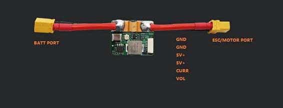

# CUAV HV PM(High voltage power module)
> **Tip** The HV PM is included in the V5+/V5 nano kit, which can also be sold separately. There are different cables depending on the flight control (pixhack v3, pixhawk, V5+/V5 nano); you can also use it on other flight controllers, but you may need to modify the cable pin.

## Overview：

The CUAV&reg; HV_PM module is a new high voltage voltage power module independently developed by CUAV with the following features:
* Higher voltage input: 10v-60v (3s~14s battery)
* accurate battery monitor:
   * voltage detection accuracy: +-0.1v;
   * current detection accuracy: +-0.2A
* Bec (5v) max current: 5A
* Max (detection) current: 60A
* Max output current(ESC/MOTOR PORT): 60A

## Purchase:

[CUAV aliexpress store](https://www.aliexpress.com/item/32841805115.html?spm=2114.12010615.8148356.1.64165998hPvTKQ)

## Pinouts

## Enable hv pm

[Battery and Power Module Setup](../config/battery.md) Describes how to configure your battery and power module. Below is important information about HV PM.

* Voltage divider:18

* Amps per volt:24A/V