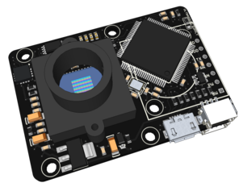
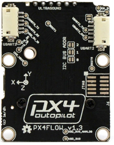
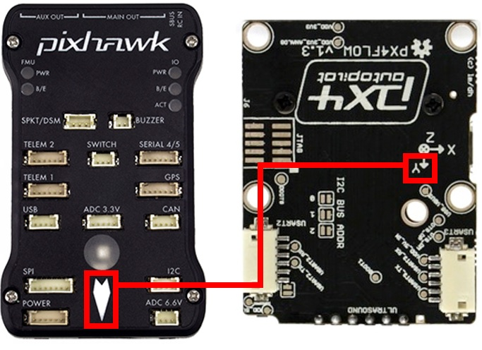
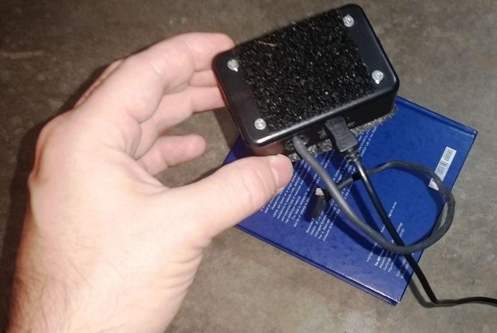
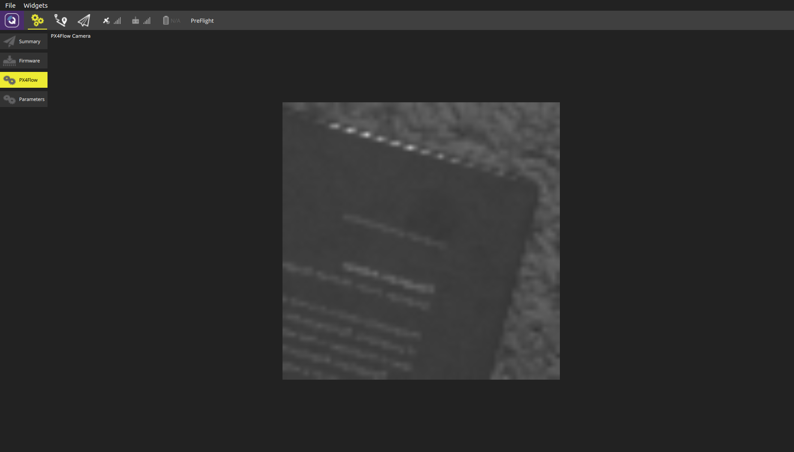
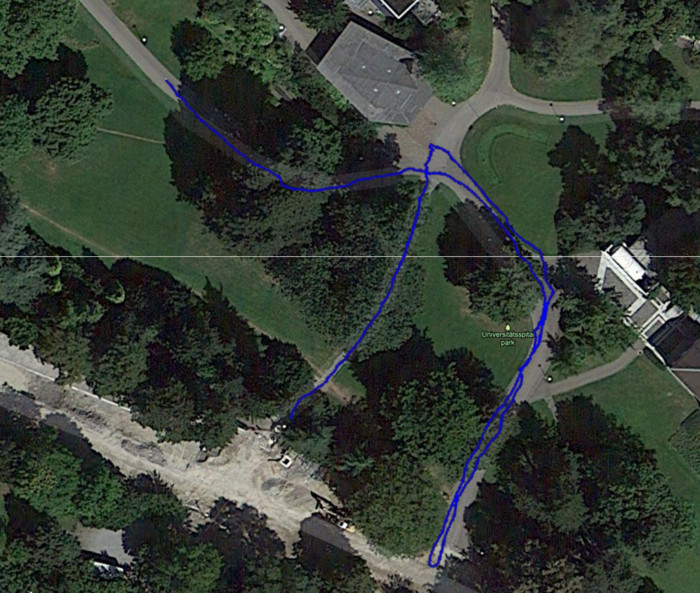
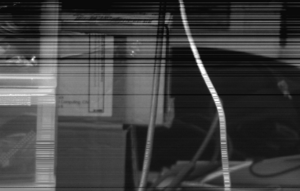
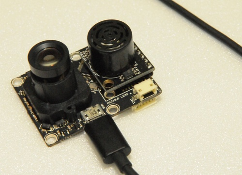
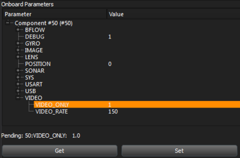
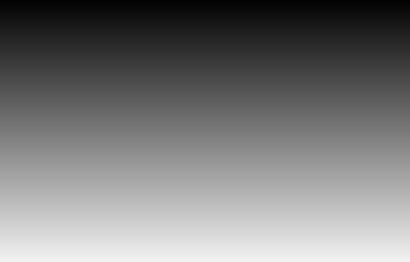

# PX4FLOW Smart Camera

PX4FLOW is an [optical flow](../sensor/optical_flow.md) smart camera. It has a native resolution of 752x480 pixels and calculates optical flow on a 4x binned and cropped area at 400 Hz, giving it a very high light sensitivity.



Unlike many mouse sensors, it also works indoors and in low outdoor light conditions without the need for an illumination LED. It can be freely reprogrammed to perform any other basic, efficient low-level computer vision tasks.

* 168 MHz Cortex M4F CPU (128 + 64 KB RAM)
* 752x480 MT9V034 image sensor, L3GD20 3D Gyro
* 16 mm M12 lens (IR block filter)
* Size 45.5 mm x 35mm
* Power consumption 115mA / 5V

@[youtube](https://youtu.be/0Jpq6DU_HVg)

## Where to Buy

Order this module from:

* [Unmanned Tech](http://www.unmannedtechshop.co.uk/px4flow-smart-camera-optical-flow-sensor/) (UK)
* [Holybro](https://shop.holybro.com/px4flow-kit_p1035.html) (Germany & EU)
* [Drotek](https://store-drotek.com/798-optical-flow-kit-px4flow.html)


## Specifications

* MT9V034 machine vision CMOS sensor with global shutter
* Optical flow processing at 4x4 binned image at **400 Hz**
* Superior light sensitivity with 24x24 μm super-pixels
* Onboard 16bit gyroscope up to 2000°/s and 780 Hz update rate, default high precision-mode at 500°/s
* Onboard sonar input and mount for [Maxbotix sonar sensors](../sensor/rangefinders.md#maxbotix-i2cxl-maxsonar-ez). (HRLV-EZ4 recommended, [SparkFun Product Link](https://www.sparkfun.com/products/11309))
* USB bootloader
* USB serial up to 921600 baud (including live camera view with [QGroundControl](http://qgroundcontrol.com/))
* USB power option
* **Does fit the MatrixVision Bluefox MV mounting holes (camera center off-centered)**

 


## Pixhawk Setup

In order to use the PX4Flow board, connect it to the I2C bus (on any Pixhawk series controller) and enable the driver using [SENS_EN_PX4FLOW](../advanced_config/parameter_reference.md#SENS_EN_PX4FLOW).

:::warning PX4FLOW does not work on FMUv5 (Pixhawk 4) for PX4 versions less than **1.9.0**. All other PX4/PX4-Autopilot versions should work.
:::

The steps are:
- In *QGroundControl*:
  - Update the firmware on PX4Flow (in the top left menu, click on CONFIG, then on Firmware Upgrade)
  - Set the parameter [SENS_EN_PX4FLOW](../advanced_config/parameter_reference.md#SENS_EN_PX4FLOW) and reboot (see [Parameters](../advanced_config/parameters.md) for information on finding and setting parameters).
- Connect PX4Flow I2C to the Pixhawk I2C

Once enabled, the module will be detected on boot. Flow data should be coming through at 10Hz if the autopilot is connected via **USB**. Flow data is transmitted over wireless channels at a lower rate.


<span id="mounting"></span>
### Mounting/Orientation

The recommended mounting orientation is defined as Y on flow board pointing towards **front of vehicle**, as shown in the following picture.



On **PX4**, the orientation should be set using the parameter [SENS_FLOW_ROT](../advanced_config/parameter_reference.md#SENS_FLOW_ROT). The above orientation maps to [SENS_FLOW_ROT=270](#SENS_FLOW_ROT) degrees (the default).

Make sure the PX4Flow board is well dampened.

:::warning PX4Flow emits a significant amount of electromagnetic radiation, and should be placed as far away from other electronics (in particular GPS modules) as possible (see [Hardware/issues/8](https://github.com/PX4/Hardware/issues/8) for more information).
:::

<span id="px4_configuration"></span>
## PX4 Configuration

The PX4Flow parameters that you may need to configure are listed below.

| Parameter                                                                                                           | Description                                                               |
| ------------------------------------------------------------------------------------------------------------------- | ------------------------------------------------------------------------- |
| <span id="SENS_EN_PX4FLOW"></span>[SENS_EN_PX4FLOW](../advanced_config/parameter_reference.md#SENS_EN_PX4FLOW)    | Start the PX4 Flow driver.                                                |
| <span id="SENS_FLOW_MAXHGT"></span>[SENS_FLOW_MAXHGT](../advanced_config/parameter_reference.md#SENS_FLOW_MAXHGT) | Maximum height above ground when reliant on optical flow.                 |
| <span id="SENS_FLOW_MINHGT"></span>[SENS_FLOW_MINHGT](../advanced_config/parameter_reference.md#SENS_FLOW_MINHGT) | Minimum height above ground when reliant on optical flow.                 |
| <span id="SENS_FLOW_MAXR"></span>[SENS_FLOW_MAXR](../advanced_config/parameter_reference.md#SENS_FLOW_MAXR)       | Maximum angular flow rate reliably measurable by the optical flow sensor. |
| <span id="SENS_FLOW_ROT"></span>[SENS_FLOW_ROT](../advanced_config/parameter_reference.md#SENS_FLOW_ROT)          | Yaw rotation of the PX4FLOW board relative to the vehicle body frame.     |

If you're using flow with the ECL/EFK2 estimator you will also need to set the [Optical Flow > Estimators > EKF2](../sensor/optical_flow.md#ekf2) parameters. These enable fusing optical flow measurements for velocity calculation and also allow you to define offsets if the sensor is not centred within the vehicle.


### Connecting

The PX4flow is connected to the I2C bus. If you are connecting multiple devices to the same bus you will need to set each with a unique address. The next section explains how.


### PX4FLOW I2C Device address

The default I2C address of the PX4Flow is 0x42, but it can be incremented using the three solder jumpers labeled "I2C BUS ADDR". This is useful if another device has the same address.

The address increment is equal to the 3-bit value encoded by the jumpers. For example if jumper 0 and 1 are soldered and jumper 2 is unsoldered, the address is incremented by 1\*1 + 1\*2 + 0\*4 = 3, which gives address 0x45. If all jumpers are unsoldered, the camera will be automatically discovered by the autopilot firmware.

The address range for the 8 possible choices is: 0x42 - 0x49.

| Address                      | Bit 2 | Bit 1 | Bit 0 |
| ---------------------------- | ----- | ----- | ----- |
| 7 Bit Address 0x42 (default) | 0     | 0     | 0     |
| 7 Bit Address 0x43           | 0     | 0     | 1     |
| :                            | :     | :     | :     |
| 7 Bit Address 0x49           | 1     | 1     | 1     |

:::tip
There are different I2C readouts available. Details about the **I2C frame** and the **I2C integral frame** are in the driver source code.
:::

If you modify the I2C address of the PX4Flow, make sure to start the PX4 driver with the correct address:
```
px4flow start                  # address=0x42 (default)
px4flow stop
px4flow start -a 0x45          # address=0x45
```


## Focusing the Lens

In order to ensure good optical flow quality, it is important to focus the camera on the PX4Flow to the desired height of flight. To focus the camera, put an object with text on (e. g. a book) and plug in the PX4Flow into USB and run *QGroundControl*. Under the settings menu, select the PX4Flow and you should see a camera image. Focus the lens by unscrewing the set screw and loosening and tightening the lens to find where it is in focus.

:::note
If you fly above 3m, the camera will be focused at infinity and won't need to be changed for higher flight.
:::



*Figure: Use a text book to focus the flow camera at the height you want to fly, typically 1-3 meters. Above 3 meters the camera should be focused at infinity and work for all higher altitudes.*



*Figure: The QGroundControl px4flow interface that can be used for focusing the camera*


## Accuracy

The ortho photo below shows that a flight on the park roads is accurately measured. This was done with a PX4FMU on a 7" quad flying at about 1.6 m altitude in manual flight. No GPS, only PX4FLOW integration of position.




## Downloads

### Manual and Schematics

* [PX4FLOW v1.3 User Manual](https://github.com/PX4/PX4-user_guide/raw/main/assets/hardware/sensors/px4flow/px4flow_manual_v1.3.pdf)
* [PX4FLOW v1.3 Schematic and Layout](https://github.com/PX4/PX4-user_guide/raw/main/assets/hardware/sensors/px4flow/px4flow_schematic_v1.3.pdf)
* Documentation in hardware repo: [PX4/Hardware/FLOWv1](https://github.com/PX4/Hardware/tree/master/FLOWv1)

### USB Driver

Linux and MacOS come with the required drivers. Windows drivers can be downloaded from: [px4flow_win_drivers.zip](https://github.com/PX4/PX4-user_guide/raw/main/assets/hardware/sensors/px4flow/px4flow_win_drivers.zip)

### Papers

The flow module as been accepted as paper to the International Conference on Robotics and Automation (ICRA 2013) in Karlsruhe, Germany.

* Dominik Honegger, Lorenz Meier, Petri Tanskanen and Marc Pollefeys: [An Open Source and Open Hardware Embedded Metric Optical Flow CMOS Camera for Indoor and Outdoor Applications](https://github.com/PX4/PX4-user_guide/raw/main/assets/hardware/sensors/px4flow/px4flow_paper.pdf)


### Libraries

The following are third party libraries that can be used to integrate the flow module in your projects.

* [mavros](https://github.com/vooon/mavros): A general MAVLink ROS interface, maintained by Vladimir Ermakov
* \[px-ros-pkg]\](https://github.com/cvg/px-ros-pkg): A PX4FLOW ROS (Robot Operating System) interface, maintained by Lionel Heng (hengli@inf.ethz.ch).
* [arduino-px4flow-i2c](https://github.com/eschnou/arduino-px4flow-i2c): An Arduino library wrapping the I2C interface, maintained by Laurent Eschenauer (laurent@eschenauer.be).


## Connectors

- **USART2 (J2)**: Hirose DF13 6 pos ([Digi-Key Link: DF13A-6P-1.25H(20)](https://www.digikey.com/products/en?keywords=H3371-ND))
  - Mates: Hirose DF13 6 pos housing ([Digi-Key Link: Hirose DF13-6S-1.25C](https://www.digikey.com/products/en?keywords=H2182-ND))
- **USART3 (J1)**: Hirose DF13 6 pos ([Digi-Key Link: DF13A-6P-1.25H(20)](https://www.digikey.com/products/en?keywords=H3370-ND))
  -  Mates: Hirose DF13 6 pos housing ([Digi-Key Link: Hirose DF13-6S-1.25C](https://www.digikey.com/products/en?keywords=DF13-6S-1.25C))
- **I2C1 (J3)**: Hirose DF13 4 pos ([Digi-Key Link: DF13A-4P-1.25H(20)](https://www.digikey.com/en/products/detail/hirose-electric-co-ltd/DF13A-4P-1-25H-20/530666) - discontinued)
  - Mates: Hirose DF13 4 pos housing ([Digi-Key Link: Hirose DF13-4S-1.25C](https://www.digikey.com/products/en?keywords=DF13-4S-1.25C))
- **USB (J5)**: Micro USB-B
  - Mates: Cell phone data / charger cables, e.g. [Digi-Key Link: ASSMANN AK67421-0.5-R](https://www.digikey.com/products/en?keywords=AE10418-ND)
- **ARM MINI JTAG (J6**, //not populated per default//**)**: 1.27 mm 10pos header (SHROUDED, for Black Magic Probe: Samtec FTSH-105-01-F-DV-K or (untested) or Harwin M50-3600542 ([Digikey](https://www.digikey.com/en/products/detail/harwin-inc/M50-3600542/2264370) or [Mouser](http://ch.mouser.com/ProductDetail/Harwin/M50-3600542/?qs=%2fha2pyFadujTt%2fIEz8xdzrYzHAVUnbxh8Ki%252bwWYPNeEa09PYvTkIOQ%3d%3d))
  - JTAG Adapter Option #1: [BlackMagic Probe](https://1bitsquared.com/products/black-magic-probe). Note, may come without cables (check with vendor). If so, needs the **Samtec FFSD-05-D-06.00-01-N** cable ([Samtec sample service](http://www.samtec.com/suddenservice/samples/samples.aspx) or [Digi-Key Link: SAM8218-ND](http://www.digikey.com/product-search/en?x=0&y=0&lang=en&site=us&KeyWords=FFSD-05-D-06.00-01-N)) and a Mini-USB cable
  - JTAG Adapter Option #2: [Digi-Key Link: ST-LINK/V2](https://www.digikey.com/products/en?keywords=497-10484-ND) / [ST USER MANUAL](http://www.st.com/internet/com/TECHNICAL_RESOURCES/TECHNICAL_LITERATURE/USER_MANUAL/DM00026748.pdf), needs an ARM Mini JTAG to 20pos adapter: [Digi-Key Link: 726-1193-ND](https://www.digikey.com/en/products/detail/texas-instruments/MDL-ADA2/1986451)
    * JTAG Adapter Option #3: [SparkFun Link: Olimex ARM-TINY](http://www.sparkfun.com/products/8278) or any other OpenOCD-compatible ARM Cortex JTAG adapter, needs an ARM Mini JTAG to 20pos adapter: [Digi-Key Link: 726-1193-ND](https://www.digikey.com/en/products/detail/texas-instruments/MDL-ADA2/1986451)

### Optics

The correct optics are delivered by 3D Robotics already mounted and focused.

* [Lens mount](http://www.lensation.de/de/shop/detail/27-accessories/flypage/418-s-mount-lens-holder-13mm-sh02m13.html?sef=hcfp)
* 16 mm M12 (S-mount) lens (with IR-cut filter)


The focal length influences the maximum measurable velocity.

```
maximum velocity = +/- 4 pixels / (1second/internalupdaterate)*grounddistance/focal length in pixels
```

The internal update rate is 400 Hz.

pixelsize is 24 micro meters, a 16mm lens has therefore a focal length of 0.016 meter / 24 micro meter per pixel = 666.666 pixels

Max velocities for different focal length lenses and ground distances:


| Ground distance | 1m     | 3m      | 10m   |
| --------------- | ------ | ------- | ----- |
| 16mm lens       | 2.4m/s | 7.2m/s  | 24m/s |
| 8mm lens        | 4.8m/s | 14.4m/s | 48m/s |
| 6mm lens        | 6.4m/s | 19.2m/s | 64m/s |
| 4mm lens        | 9.6m/s | 28.8m/s | 96m/s |

```
max_vel = 4/(1/400)*grounddistance/(focallength/0.000024)
```


## Configuration: Image Quality and Output

PX4FLOW is not designed as a camera, but does all processing on-chip. You can configure the image quality and output (the image output is only intended for focusing the lens).


  - Download [QGroundControl](http://qgroundcontrol.com/#downloads)
  - Unplug your flow sensor
  - In *QGroundControl*, click on **Configuration > Firmware Update**. Hit the big green **Scan** button.
  - Connect the flow sensor. Click on upgrade once its detected (leave the default to “stable”)
  - Maximize the *QGroundControl* window. Click on **Tool Widgets > Video Downlink**
  - Enjoy the live view and **focus the camera by loosening the locking screw and turning the lens at an object at 3m distance**.
  - If you want to get higher res to focus the sensor, go to **Config > Advanced Config** and set the [VIDEO_ONLY](#VIDEO_ONLY) parameter to 1.


## General Troubleshooting

* Unplug the flow sensor if plugged
* Start *QGroundControl*, select the PX4 startup mode go to **Config > Firmware Upgrade**.
  * Click on SCAN (green button in the center)
  * Connect the flow sensor now
  * Flash the stable firmware
* Click on **Advanced Config** in the left menu to see the parameters
* Display the video stream with QGroundControl (**Tool Widgets > Video Downlink**)
  * Check that there are no stripes on the stream. If you get stripes, set `IMAGE_TEST_PAT` to 1. It should look like the examples above. If you have stripes in the image but no stripes when this mode is enabled, right-click into the image once in both modes and save and send an image of each mode to the manufacturer's support team.
  * Check that you get a clear image (its a tele / zoom lens, so the visible area will be small)
* Set the `VIDEO_ONLY` parameter to 1 to obtain a higher resolution image.
* Check that the image is sharp at the operating distance (the typical flight altitude)

:::tip
[Ask for help](../contribute/support.md#forums-and-chat) if you have a distorted image with visible dark lines (like the one below): 
:::


<span id="developer_guide"></span>
# PX4FLOW Developer Guide

## Hardware Setup

* PX4FLOW Board v1.3
* HRLV-MaxSonar-EZ (MB1043)
* 16mm Lens
* Micro USB cable





## Software / Build Source

* PC with *QGroundControl* installed
* PX4FLOW Firmware (Firmware source code on Github: [PX4/Flow](https://github.com/PX4/Flow))

:::note PX4 *driver* code can be found here: [PX4/PX4-Autopilot/src/drivers/px4flow](https://github.com/PX4/PX4-Autopilot/tree/release/1.13/src/drivers/optical_flow/px4flow)
:::

## Build

Install the [PX4 toolchain](../dev_setup/dev_env.md). Then and clone the sources from https://github.com/PX4/Flow using *git*.

```bash
cd flow
make all
make upload-usb
```

Then connect the flow sensor. It should show these steps on a successful upload:

```bash
Found board 6,0 bootloader rev 3 on /dev/ttyACM1
erase...
program...
verify...
done, rebooting.
```

## Troubleshooting

In case one doesn't see the aforementioned steps, the modem-manager should be removed by:

```bash
sudo apt-get remove modemmanager
```

User also needs to be in the plugdev group:

```bash
sudo usermod -a -G plugdev $USER
```

## Focus Image

Connect PX4FLOW to QGroundControl:

- Connect PX4FLOW sensor over USB to PC
- Open QGroundControl
- Switch to Plot perspective: Perspectives/Plot
- Connect to PX4FLOW sensor: Communication/Add Link



* Link Type: Serial
* Protocol: MAVLink
* Serial Port: corresponding Port (e.g. /dev/ttyACM* or COMM*)

Now a new unmanned system should appear and onboard parameters are loaded (click on "Get" if not)

Change Parameter `VIDEO_ONLY` to 1 and press Set.

The Widget Video Downlink shows now the Image in full resolution. Focus the lens on 1.5m. Fix the lens position and switch `VIDEO_ONLY` Mode off.


## Data Output

The PX4FLOW module outputs [MAVLink](https://mavlink.io/en/) packets on USB and serial port. Use [QGroundControl](http://qgroundcontrol.com/) to read data from the module. An I2C interface for sensor data reading is offered as well. Third party [libraries](#libraries) are available to connect and integrate PX4FLOW data in your projects.

* USART3: MAVLink at 115200, 8N1 baud: [OPTICAL_FLOW](https://mavlink.io/en/messages/common.html#OPTICAL_FLOW) message, [OPTICAL_FLOW_RAD](https://mavlink.io/en/messages/common.html#OPTICAL_FLOW_RAD), [HEARTBEAT](https://mavlink.io/en/messages/common.html#HEARTBEAT) message
* USB: Baud rate is not relevant (USB ignores it): `OPTICAL_FLOW` message, `OPTICAL_FLOW_RAD`, `HEARTBEAT` message, image.
* I2C1: latest Flow value (i2c_frame) and accumulated Flow (i2c_integral_frame) values since last I2C readout available for readout.


## PX4FLOW Parameters

The following list gives a short explanation of the current available parameters in the PX4FLOW firmware.

:::warning
Parameters are currently not written to ROM (they reset at power loss). To change them permanently build your own version of firmware using instructions in the [PX4FLOW Developer Guide](#developer_guide) above. Relevant parameters can be found [here](https://github.com/PX4/Flow/blob/master/src/modules/flow/settings.c).
:::

### BFLOW_F_THRD

This parameter is a feature threshold and limits the quality of patterns that are used to calculate the bottom flow. For low values (e.g. 10) almost every pattern is taken, for higher values (e.g. 100) only significant patters are taken.

### BFLOW_V_THRD

This is a pattern correlation threshold for filtering bad matches. Lower means only strong correlations are accepted.


### Others

| Name             | Default | Access | Comment                                                                                                                                                                                                                                        |
| ---------------- | ------- | ------ | ---------------------------------------------------------------------------------------------------------------------------------------------------------------------------------------------------------------------------------------------- |
| AEC              | 1       | RW     | Camera Automatic Exposure Control. 1: ON, 0: OFF.                                                                                                                                                                                              |
| AGC              | 1       | RW     | Camera Automatic Gain Control. 1: ON, 0: OFF.                                                                                                                                                                                                  |
| BFLOW_F_THLD   | 40      | RW     | This parameter is a feature threshold and limits the quality of patterns that are used to calculate the bottom flow. For low values (e.g. 10) almost every pattern is taken, for higher values (e.g. 100) only significant patterns are taken. |
| BFLOW_V_THLD   | 5000    | RW     | This is a pattern correlation threshold for filtering bad matches. Lower means only strong correlations are accepted.                                                                                                                          |
| BFLOW_HIST_FIL | 0       | RW     | Flow histogram filter. 1: ON, 0: OFF.                                                                                                                                                                                                          |
| BFLOW_GYRO_COM | 0       | RW     | Gyro compensation. 1: ON, 0: OFF.                                                                                                                                                                                                              |
| BFLOW_LP_FIL   | 0       | RW     | Lowpass filter on flow output. 1: ON, 0: OFF.                                                                                                                                                                                                  |
| BFLOW_W_NEW    | 0.3     | RW     | Flow lowpass filter gain                                                                                                                                                                                                                       |
| BFLOW_MAX_PIX  | 8       | R      | Delete (parameter not used).                                                                                                                                                                                                                   |
| BFLOW_RATE       | 10.0    | RW     | Rate with which updates for optical flow are published                                                                                                                                                                                         |
| BRIGHT           | 20      | RW     | Desired brightness level from camera                                                                                                                                                                                                           |
| DEBUG            | 1       | RW     | Debug messages. 1: ON, 0: OFF                                                                                                                                                                                                                  |
| EXPOSURE_MAX     | 500     | RW     | Maximal exposure time (μs)                                                                                                                                                                                                                     |
| GAIN_MAX         | 16      | RW     | Maximal gain (units?)                                                                                                                                                                                                                          |
| GYRO_SENS_DPS  | 250     | RW     | Gyroscope sensitivity: 250, 500, 2000 (dps)                                                                                                                                                                                                    |
| GYRO_COMP_THR  | 0.01    | RW     | Gyro compensation threshold (dps): Gyro data lower than this threshold is not compensated to prevent drift                                                                                                                                     |
| HDR              | 1       | RW     | Camera High Dynamic Range. 1: ON, 0: OFF                                                                                                                                                                                                       |
| IMAGE_HEIGHT     | 64      | R      | Image height (pixels)                                                                                                                                                                                                                          |
| IMAGE_WIDTH      | 64      | R      | Image width (pixels)                                                                                                                                                                                                                           |
| IMAGE_L_LIGHT  | 0       | RW     | Delete (parameter not used).                                                                                                                                                                                                                   |
| IMAGE_NOISE_C  | 1       | RW     | Image sensor noise correction, 1: ON, 0: OFF                                                                                                                                                                                                   |
| IMAGE_TEST_PAT | 0       | RW     | Gray-shaded test pattern mode. 1: ON, 0: OFF                                                                                                                                                                                                   |
| LENS_FOCAL_LEN | 16.0    | RW     | Focal length of lens (mm)                                                                                                                                                                                                                      |
| POSITION         | 0       | RW     | 0: Only position 0 is used (Bottom: 0, Front: 1, Top: 2, Back: 3, Right: 4, Left: 5)                                                                                                                                                           |
| SHTR_W_1       | 443     | RW     | Camera Shutter W_1 ?                                                                                                                                                                                                                           |
| SHTR_W_2       | 473     | RW     | Camera Shutter W_2 ?                                                                                                                                                                                                                           |
| SHTR_W_TOT     | 480     | RW     | Camera Shutter Total ?                                                                                                                                                                                                                         |
| SONAR_FILTERED   | 0       | RW     | Kalman filter on sonar output. 1: ON, 0: OFF.                                                                                                                                                                                                  |
| SONAR_KAL_L1   | 0.8461  | RW     | Sonar Kalman gain L1 (for the position)                                                                                                                                                                                                        |
| SONAR_KAL_L2   | 6.2034  | RW     | Sonar Kalman gain L2 (for the speed)                                                                                                                                                                                                           |
| SYS_ID           | 81      | RW     | [MAVLink](https://mavlink.io/en/) System ID                                                                                                                                                                                                    |
| SYS_COMP_ID    | 50      | RW     | [MAVLink](https://mavlink.io/en/) Component ID                                                                                                                                                                                                 |
| SYS_SENSOR_ID  | 77      | RW     | [MAVLink](https://mavlink.io/en/) Sensor ID                                                                                                                                                                                                    |
| SYS_TYPE         | 0       | RW     | [MAVLink](https://mavlink.io/en/) System Type (0 means generic)                                                                                                                                                                                |
| SYS_AP_TYPE    | 0       | RW     | [MAVLink](https://mavlink.io/en/) Autopilot Type (0 means generic)                                                                                                                                                                             |
| SYS_SW_VER     | 13XX    | R      | Software Version                                                                                                                                                                                                                               |
| SYS_SEND_STATE | 1       | RW     | Send [MAVLink](https://mavlink.io/en/messages/common.html#HEARTBEAT) Heartbeat. 1: ON, 0: OFF.                                                                                                                                                 |
| SYS_SEND_LPOS  | 1       | RW     | Send [MAVLink](https://mavlink.io/en/messages/common.html#LOCAL_POSITION_NED) Local position estimate. 1: ON, 0: OFF.                                                                                                                          |
| USART_2_BAUD   | 115200  | R      | Baudrate USART 2                                                                                                                                                                                                                               |
| USART_3_BAUD   | 115200  | R      | Baudrate USART 3 (Data Output)                                                                                                                                                                                                                 |
| USB_SEND_DEBUG | 1       | RW     | Send debug msgs over USB. 1: ON, 0: OFF.                                                                                                                                                                                                       |
| USB_SEND_FLOW  | 1       | RW     | Send flow over USB. 1: ON. 0: OFF.                                                                                                                                                                                                             |
| USB_SEND_FWD   | 0       | RW     | Send forwarded flow over USB. 1: ON, 0: OFF.                                                                                                                                                                                                   |
| USB_SEND_GYRO  | 1       | RW     | Send gyro data over USB. 1: ON, 0: OFF.                                                                                                                                                                                                        |
| USB_SEND_VIDEO | 1       | RW     | Send video over USB. 1: ON, 0: OFF.                                                                                                                                                                                                            |
| VIDEO_ONLY       | 0       | RW     | High resolution video mode. 1: ON, 0: OFF                                                                                                                                                                                                      |
| VIDEO_RATE       | 50      | RW     | Time between images of video transmission (ms)                                                                                                                                                                                                 |


## Modes

<span id="VIDEO_ONLY"></span>
### VIDEO ONLY Mode

Set `VIDEO_ONLY` to 1 for high resolution mode. In this mode the camera image is transmitted at a higher resolution to ease the lens focus process. No flow values are calculated in this mode.

### Test Pattern Mode

If the parameter `IMAGE_TEST_PAT` is set to 1, the sensor inserts a vertical gray-shaded test pattern in the signal chain.
* Test Pattern 64x64 (VIDEO ONLY Mode is OFF) 
* Test Pattern 376x240 (VIDEO ONLY Mode is ON) 
