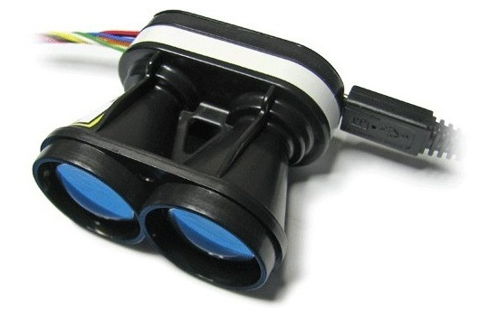

# LightWare SF1X/SF02/LW20 Lidar

LightWare develops a range of light-weight, general purpose, laser altimeters ("Lidar") suitable for mounting on UAVs. These are useful for applications including terrain following, precision hovering (e.g. for photography), warning of regulatory height limits, anti-collision sensing etc.

## Supported Models

PX4 supports the following LightWare Lidar rangefinders:

- [SF02](http://lightware.co.za/shop2017/proximity-sensors/1-sf02f.html) (50 m)
- [SF10/A](http://lightware.co.za/shop2017/drone-altimeters/26-sf10a-25-m.html) (25 m)
- [SF10/B](http://lightware.co.za/shop2017/drone-altimeters/25-sf10b-50-m.html) (50 m)
- SF10/C (100m) (Discontinued)
- [SF11/C](https://lightware.co.za/collections/lidar-rangefinders/products/sf11-c-120-m) (120 m)
- [LW20](http://lightware.co.za/shop2017/drone-altimeters/51-lw20-100-m.html) (100 m) - Waterproofed (IP67) with servo for sense-and-avoid applications

The lidars can be connected to I2C or serial ports, depending on their type (see below)

- **Serial**: SF02, SF10/a, SF10/b, SF10/c, SF11/c
- **I2C**: SF10/a, SF10/b, SF10/c, SF11/c, SF/LW20

## I2C Setup

The following models can be connected to the I2C port: SF10/a, SF10/b, SF10/c, SF11/c, SF/LW20

### Hardware {#i2c_hardware_setup}

Connect the Lidar the autopilot I2C port as shown below (in this case, for the [Pixhawk 1](../flight_controller/mro_pixhawk.md)).

> **Note** Some older revisions cannot be used with PX4. Specifically they may be miss-configured to have an I2C address equal to `0x55`, which conflicts with `rgbled` module. On Linux systems you may be able to determine the address using [i2cdetect](http://manpages.ubuntu.com/manpages/bionic/en/man8/i2cdetect.8.html). If the I2C address is equal to `0x66` the sensor can be used with PX4.

### Parameter Setup {#i2c_parameter_setup}

Set the [SENS_EN_SF1XX](../advanced_config/parameter_reference.md#SENS_EN_SF1XX) parameter to match the rangefinder model and then reboot:

- `0`: Disabled
- `1`: SF10/a
- `2`: SF10/b
- `3`: SF10/c
- `4`: SF11/c
- `5`: SF/LW20

## Serial Setup

### Hardware {#serial_hardware_setup}

The lidar can be connected to any unused *serial port* (UART), e.g.: TELEM2, TELEM3, GPS2 etc.

<!-- Would be good to show serial setup! -->

### Parameter Setup {#serial_parameter_setup}

[Configure the serial port](../peripherals/serial_configuration.md) on which the lidar will run using [SENS_SF0X_CFG](../advanced_config/parameter_reference.md#SENS_SF0X_CFG). There is no need to set the baud rate for the port, as this is configured by the driver.

> **Note** If the configuration parameter is not available in *QGroundControl* then you may need to [add the driver to the firmware](../peripherals/serial_configuration.md#parameter_not_in_firmware).

Then set the [SENS_EN_SF0X](../advanced_config/parameter_reference.md#SENS_EN_SF0X) parameter to match the rangefinder model and reboot:

- `0`: Disabled
- `1`: SF02
- `2`: SF10/a
- `3`: SF10/b
- `4`: SF10/c
- `5`: SF11/c

## Further Information

- [Modules Reference: Distance Sensor (Driver) : sf1xx](https://dev.px4.io/master/en/middleware/modules_driver_distance_sensor.html#sf1xx) (PX4 Dev Guide)