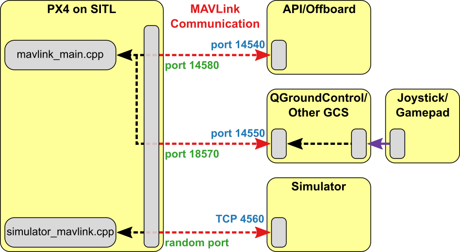

# ROS with Gazebo Simulation

[ROS](../ros/README.md) (Robot Operating System) can be used with PX4 and the [Gazebo simulator](../simulation/gazebo.md). It uses the [MAVROS](../ros/mavros_installation.md) MAVLink node to communicate with PX4.

The ROS/Gazebo integration with PX4 follows the pattern in the diagram below (this shows the *generic* [PX4 simulation environment](../simulation/README.md#sitl-simulation-environment)). PX4 communicates with the simulator (e.g. Gazebo) to receive sensor data from the simulated world and send motor and actuator values. It communicates with the GCS and an Offboard API (e.g. ROS) to send telemetry from the simulated environment and receive commands.



:::note
The only *slight* difference to "normal behaviour" is that ROS initiates the connection on port 14557, while it is more typical for an offboard API to listen for connections on UDP port 14540.
:::

## Installing ROS and Gazebo

:::note
*ROS* is only supported on Linux (not macOS or Windows).
:::

The easiest way to setup PX4 simulation with ROS on Ubuntu Linux is to use the standard installation script that can be found at [Development Environment on Linux > Gazebo with ROS](../dev_setup/dev_env_linux_ubuntu.md#rosgazebo). The script installs everything you need: PX4, ROS "Melodic", the Gazebo 9 simulator, and [MAVROS](../ros/mavros_installation.md).

:::note
The script follows the [standard ROS "Melodic" installation instructions](http://wiki.ros.org/melodic/Installation/Ubuntu), which includes Gazebo 9.
:::


## Launching ROS/Simulation

The command below can be used to launch the simulation and connect ROS to it via [MAVROS](../ros/mavros_installation.md), where `fcu_url` is the IP / port of the computer running the simulation:

```sh
roslaunch mavros px4.launch fcu_url:="udp://:14540@192.168.1.36:14557"
```

To connect to localhost, use this URL:

```sh
roslaunch mavros px4.launch fcu_url:="udp://:14540@127.0.0.1:14557"
```

:::note
It can be useful to call *roslaunch* with the `-w` (warn) and/or `-v` (verbose) in order to get warnings about missing dependencies in your setup. For example:
```sh
roslaunch mavros px4.launch fcu_url:="udp://:14540@127.0.0.1:14557"
```
:::

## Launching Gazebo with ROS Wrappers

The Gazebo simulation can be modified to integrate sensors publishing directly to ROS topics e.g. the Gazebo ROS laser plugin. To support this feature, Gazebo must be launched with the appropriate ROS wrappers.

There are ROS launch scripts available to run the simulation wrapped in ROS:

* [posix_sitl.launch](https://github.com/PX4/PX4-Autopilot/blob/master/launch/posix_sitl.launch): plain SITL launch
* [mavros_posix_sitl.launch](https://github.com/PX4/PX4-Autopilot/blob/master/launch/mavros_posix_sitl.launch): SITL and MAVROS

To run SITL wrapped in ROS the ROS environment needs to be updated, then launch as usual:

(optional): only source the catkin workspace if you compiled MAVROS or other ROS packages from source:

```sh
cd <PX4-Autopilot_clone>
DONT_RUN=1 make px4_sitl_default gazebo
source ~/catkin_ws/devel/setup.bash    # (optional)
source Tools/setup_gazebo.bash $(pwd) $(pwd)/build/px4_sitl_default
export ROS_PACKAGE_PATH=$ROS_PACKAGE_PATH:$(pwd)
export ROS_PACKAGE_PATH=$ROS_PACKAGE_PATH:$(pwd)/Tools/sitl_gazebo
roslaunch px4 posix_sitl.launch
```

Include one of the above mentioned launch files in your own launch file to run your ROS application in the simulation.

## What's Happening Behind the Scenes

This section shows how the *roslaunch* instructions provided previously actually work (you can follow them to manually launch the simulation and ROS).

First start the simulator using the command below:

```sh
no_sim=1 make px4_sitl_default gazebo
```

The console will look like this:
```sh
[init] shell id: 46979166467136
[init] task name: px4

______  __   __    ___
| ___ \ \ \ / /   /   |
| |_/ /  \ V /   / /| |
|  __/   /   \  / /_| |
| |     / /^\ \ \___  |
\_|     \/   \/     |_/

Ready to fly.


INFO  LED::init
729 DevObj::init led
736 Added driver 0x2aba34001080 /dev/led0
INFO  LED::init
742 DevObj::init led
INFO  Not using /dev/ttyACM0 for radio control input. Assuming joystick input via MAVLink.
INFO  Waiting for initial data on UDP. Please start the flight simulator to proceed..
```

Now in a new terminal make sure you will be able to insert the Iris model through the Gazebo menus, to do this set your environment variables to include the appropriate `sitl_gazebo` folders.

```sh
cd <PX4-Autopilot_clone>
source Tools/setup_gazebo.bash $(pwd) $(pwd)/build/px4_sitl_default
```

Now start Gazebo like you would when working with ROS and insert the Iris quadcopter model. Once the Iris is loaded it will automatically connect to the px4 app.

```sh
roslaunch gazebo_ros empty_world.launch world_name:=$(pwd)/Tools/sitl_gazebo/worlds/iris.world
```
