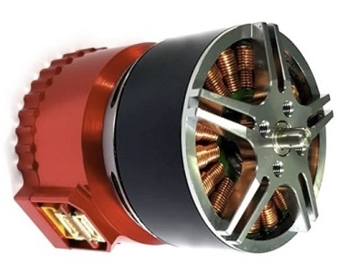
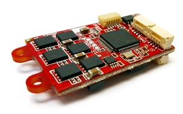
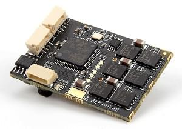
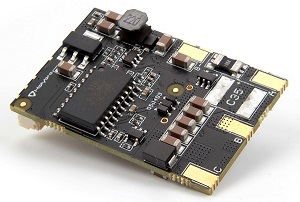
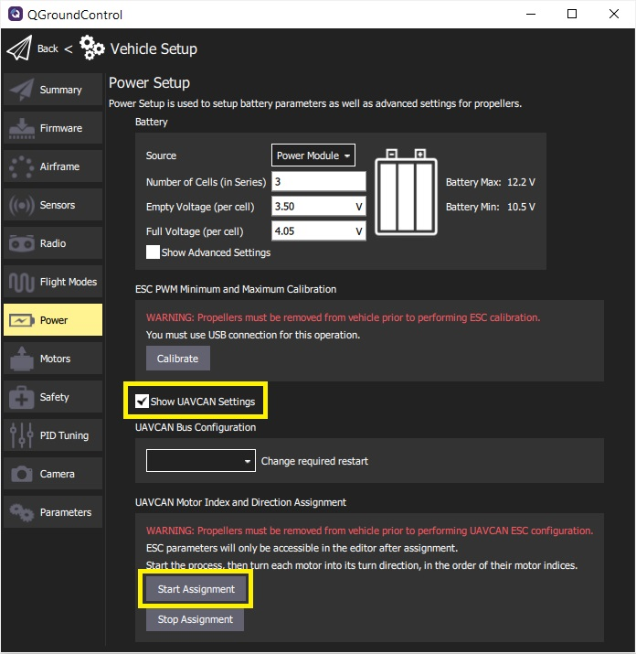

# UAVCAN ESCs (Motor Controllers)

PX4 supports [UAVCAN](../uavcan/README.md) ESCs. These have a number of advantages over [PWM ESCs](../peripherals/pwm_escs_and_servo.md):
- UAVCAN has been specifically designed to deliver robust and reliable connectivity over relatively large distances. It enables safe use of ESCs on bigger vehicles and communication redundancy.
- The bus is bi-directional, enabling health monitoring and diagnostics.
- Wiring is less complicated as you can have a single bus for connecting all your ESCs and other UAVCAN peripherals.
- Setup is easier as you configure ESC numbering by manually spinning each motor (for most types of UAVCAN ESCs).

  

     <a href="https://shop.zubax.com/collections/integrated-drives/products/sadulli-integrated-drive-open-hardware-reference-design-for-mitochondrik?variant=27740841181283">Zubax Sadulli Integrated Drive</a>
  

  
  

   <a href="https://zubax.com/products/orel_20">Zubax Orel 20</a>
  

  

     <a href="https://shop.holybro.com/kotleta20_p1156.html">Holybro Kotleta20</a>
  

## PX4 Supported ESC

PX4 is compatible with any/all UAVCAN v0 ESCs. At time of writing PX4 does not yet support UAVCAN v1.0.

UAVCAN is generally speaking a plug'n'play protocol. The main difference between UAVCAN ESCs from a setup perspective is that the physical connectors and the software tools used to configure the motor order and direction may be different.

Some popular UAVCAN ESC firmware/products include:
- [Sapog](https://github.com/PX4/sapog#px4-sapog) firmware; an advanced open source sensorless PMSM/BLDC motor controller firmware designed for use in propulsion systems of electric unmanned vehicles.
  - [Zubax Orel 20](https://zubax.com/products/orel_20)
  - [Holybro Kotleta20](https://shop.holybro.com/kotleta20_p1156.html)
- [Zubax Myxa](https://zubax.com/products/myxa) - High-end PMSM/BLDC motor controller (FOC ESC) for light unmanned aircraft and watercraft. :::note ESC based on the Zubax Telega sensorless FOC motor control technology (e.g., Zubax Myxa, Mitochondrik, Komar, etc.) require non-trivial tuning of the propulsion system in order to deliver adequate performance and ensure robust operation.

  Users who lack the necessary tuning expertise are advised to either [purchase pre-tuned UAV propulsion kits](https://zubax.com/products/uav_propulsion_kits) or to use Zubax Robotic's professional tuning service. Questions on this matter should be addressed to: [support@zubax.com](mailto:support@zubax.com).
:::
- [Zubax Mitochondrik](https://zubax.com/products/mitochondrik) - integrated sensorless PMSM/BLDC motor controller chip (used in ESCs and integrated drives)
  - [Zubax Sadulli Integrated Drive](https://shop.zubax.com/collections/integrated-drives/products/sadulli-integrated-drive-open-hardware-reference-design-for-mitochondrik?variant=27740841181283)
- [VESC Project ESCs](https://vesc-project.com/) (see also [Benjamin Vedder's blog](http://vedder.se) - project owner)
- [OlliW’s UC4H ESC-Actuator Node](http://www.olliw.eu/2017/uavcan-for-hobbyists/#chapterescactuator)
- A number of others are [listed here](https://forum.uavcan.org/t/uavcan-esc-options/452/3?u=pavel.kirienko)

:::note
This list is *not exhaustive/complete*. If you know of another ESC, please add it to the list!
:::

## Purchase

Sapog-based ESCs:
- [Zubax Orel 20](https://zubax.com/products/orel_20)
- [Holybro Kotleta20](https://shop.holybro.com/kotleta20_p1156.html)

Mitochondrik based drives and ESC:
- [Zubax Sadulli Integrated Drive](https://shop.zubax.com/collections/integrated-drives/products/sadulli-integrated-drive-open-hardware-reference-design-for-mitochondrik?variant=27740841181283)

:::note
There are many other commercially available ESCs; please add new links as you find them!
:::

<!--

-->

## Wiring/Connections

Connect all of the on-board UAVCAN devices into a chain and make sure the bus is terminated at the end nodes. The order in which the ESCs are connected/chained does not matter.

For more information see [UAVCAN > Wiring](../uavcan/README.md#wiring).

:::note
All UAVCAN ESCs share the same connection architecture/are wired the same way. Note however that the actual connectors differ (e.g. *Zubax Orel 20* and *Holybro Kotleta20* use Dronecode standard connectors (JST-GH 4 Pin) - while VESCs do not).
:::

## PX4 Configuration

In order to use a UAVCAN ESC with PX4 you will need to enable the UAVCAN driver:
1. Power the vehicle using the battery (you must power the whole vehicle, not just the flight controller) and connect *QGroundControl*.
1. Navigate to the **Vehicle Setup > Parameters** screen. :::note [Parameters](../advanced_config/parameters.md) explains how to find and set parameters.
:::
1. Set [UAVCAN_ENABLE](../advanced_config/parameter_reference.md#UAVCAN_ENABLE) to the value *Sensors and Motors* (3) and then reboot the flight controller. This enables automatic enumeration of the motors (ESC) as described in the [next section](#esc-setup).
1. (Optional) Set [UAVCAN_ESC_IDLT](../advanced_config/parameter_reference.md#UAVCAN_ESC_IDLT) to 1 in order to ensure that the motors are always running at least at the idle throttle while the system is armed. :::note
Some systems will not benefit from this behavior, e.g. glider drones).
:::

## ESC Setup

While UAVCAN devices are generally *plug'n'play* you will still need to enumerate (number) each of the ESC used in your system and set their direction so that they can be identified/controlled by PX4.

:::note
The ESC index and direction must match/map to the [Airframe Reference](../airframes/airframe_reference.md) for the vehicle type. ESC indexes from 0-7 map to MAIN 1-8, while ESC indexes 8-15 map to AUX 1-8.
:::

The mechanism for enumerating each type of UAVCAN ESC is different (look up the instructions in your ESC's manual). Setup information for some UAVCAN ESCs is provided below.

### Sapog ESC Enumeration using QGroundControl

This section shows how to enumerate any [Sapog-based](https://github.com/PX4/sapog#px4-sapog)-based ESCs "automatically" using *QGroundControl*.

:::tip
You can skip this section if there is only one ESC in your setup, because the ESC index is already set to zero by default.
:::

To enumerate the ESC:
1. Power the vehicle with a battery and connect to *QGroundControl*
1. Navigate to **Vehicle Setup > Power** in QGC.
1. Start the process of ESC auto-enumeration by pressing the **Start Assignment** button, as shown on the screenshot below.

   

   You will hear a sound indicating that the flight controller has entered the ESC enumeration mode.
1. Manually turn each motor in the correct direction of its rotation (as specified in the [Airframe Reference](../airframes/airframe_reference.md)), starting from the first motor and finishing with the last motor. Each time you turn a motor, you should hear a confirmation beep.

   :::note
Make sure to turn each of the motors in the correct direction, as the ESC will automatically learn and remember the direction (i.e. motors that spin clockwise during normal operation must also be turned clockwise during enumeration).
:::

1. After the last motor is enumerated, the confirmation sound should change to indicate that the enumeration procedure is complete.
1. Reboot PX4 and the Sapog ESCs to apply the new enumeration IDs.

The following video demonstrates the process:

@[youtube](https://www.youtube.com/watch?v=4nSa8tvpbgQ)

### Manual ESC Enumeration using Sapog

:::tip
We recommend automated [Sapog ESC Enumeration using QGroundControl](#sapog-esc-enumeration-using-qgroundcontrol) shown above rather than manual enumeration (as it is easier and safer).
:::

You can manually configure the ESC index and direction using the [UAVCAN GUI Tool](https://uavcan.org/GUI_Tool/Overview/). This assigns the following Sapog configuration parameters for each enumerated ESC:
- `esc_index`
- `ctl_dir`

:::note
See [Sapog reference manual](https://files.zubax.com/products/io.px4.sapog/Sapog_v2_Reference_Manual.pdf) for more information about the parameters.
:::

### Myxa ESC Setup

Motor enumeration for Myxa [Telega-based ESCs](https://zubax.com/products/telega) is usually performed using the [Kucher tool](https://files.zubax.com/products/com.zubax.kucher/) (or less "GUI-friendly" [UAVCAN GUI Tool](https://uavcan.org/GUI_Tool/Overview/)).

There is some guidance here: [Quick start guide for Myxa v0.1](https://forum.zubax.com/t/quick-start-guide-for-myxa-v0-1/911) (Zubax blog).

### VESC ESC Setup

For [VESC ESCs](https://vesc-project.com/) the preferred tool for motor enumeration is the [VESC tool](https://vesc-project.com/vesc_tool). In addition to the normal motor configuration that you will have to setup in the VESC tool, you will also need to properly setup the app configuration. The recommended app setup is as follows:

| Parameter               | Option                 |
| ----------------------- | ---------------------- |
| App to use              | `No App`               |
| VESC ID                 | `1,2,...`              |
| Can Status Message Mode | `CAN_STATUS_1_2_3_4_5` |
| CAN Baud Rate           | `CAN_BAUD_500K`        |
| CAN Mode                | `UAVCAN`               |
| UAVCAN ESC Index        | `0,1,...`              |

VESC ID should have the same motor numbering as in PX4 convention, starting at `1` for top-right motor, `2` for bottom-left motor etc. However the `UAVCAN ESC Index` starts from `0`, and as such it is always one index lower than the `VESC ID`. For example, in a quadcopter the bottom left motor will have `VESC ID = 2` and `UAVCAN ESC Index = 1`.

Finally the `CAN Baud Rate` must match the value set in [UAVCAN_BITRATE](../advanced_config/parameter_reference.md#UAVCAN_BITRATE).

## Troubleshooting

#### Motors not spinning when armed

If the PX4 Firmware arms but the motors do not start to rotate, check that parameter `UAVCAN_ENABLE=3` to use UAVCAN ESCs. If the motors do not start spinning before thrust is increased, check `UAVCAN_ESC_IDLT=1`.

#### UAVCAN devices dont get node ID/Firmware Update Fails

PX4 requires an SD card for UAVCAN node allocation and during firmware update (which happen during boot). Check that there is a (working) SD card present and reboot.

## Further Information

- [PX4/Sapog](https://github.com/PX4/sapog#px4-sapog) (Github)
- [Sapog v2 Reference Manual](https://files.zubax.com/products/io.px4.sapog/Sapog_v2_Reference_Manual.pdf)
- [Cyphal/CAN Device Interconnection](https://kb.zubax.com/pages/viewpage.action?pageId=2195476) (Zubax KB)
- [Using Sapog based ESC with PX4](https://kb.zubax.com/display/MAINKB/Using+Sapog-based+ESC+with+PX4) (Zubax KB)

