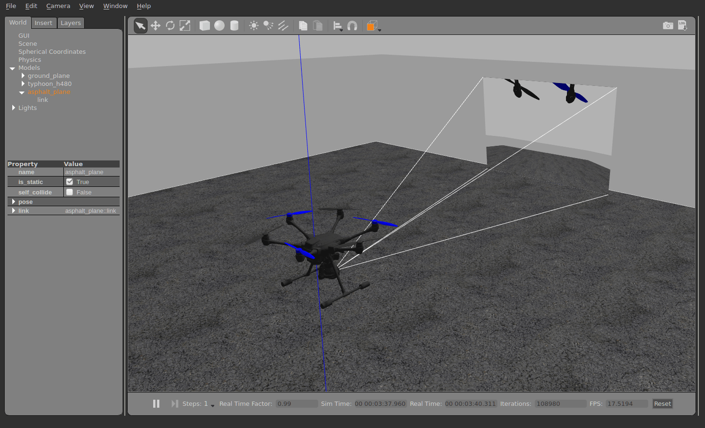

# Конфігурація  Gimbal (стабілізатора)

Ця сторінка пояснює, як налаштувати та контролювати стабілізатор, що має приєднану камеру (або будь-який інший вантаж).

## Загальний огляд

PX4 містить універсальний драйвер керування кріпленням/гімбалем, який підтримує різні методи введення та виведення:

- The input method defines the protocol used to command a gimbal mount that is managed by PX4. This might be an RC controller, a MAVLink command sent by a GCS, or both — automatically switching between them.
- The output method defines how PX4 communicates with the connected gimbal. The recommended protocol is MAVLink v2, but you can also connect directly to a flight controller PWM output port.

PX4 приймає вхідний сигнал і маршрутизує/перекладає його для відправлення на вивід. Будь-який метод введення може бути обраний для керування будь-яким виводом.

Як вхід, так і вихід налаштовуються за допомогою параметрів. The input is set using the parameter [MNT_MODE_IN](../advanced_config/parameter_reference.md#MNT_MODE_IN). By default this is set to `Disabled (-1)` and the driver does not run. After selecting the input mode, reboot the vehicle to start the mount driver.

You should set `MNT_MODE_IN` to one of: `RC (1)`, `MAVlink gimbal protocol v2 (4)` or `Auto (0)` (the other options are deprecated). If you select `Auto (0)`, the gimbal will automatically select either RC or or MAVLink input based on the latest input. Note that the auto-switch from MAVLink to RC requires a large stick motion!

The output is set using the [MNT_MODE_OUT](../advanced_config/parameter_reference.md#MNT_MODE_OUT) parameter. By default the output is set to a PXM port (`AUX (0)`). Якщо ваш гімбал підтримує [Протокол гімбала MAVLink v2](https://mavlink.io/en/services/gimbal_v2.html), ви повинні замість цього вибрати `Протокол гімбала MAVLink v2 (2)`.

The full list of parameters for setting up the mount driver can be found in [Parameter Reference > Mount](../advanced_config/parameter_reference.md#mount). Нижче наведено відповідні налаштування для декількох поширених конфігурацій гімбалів.

## MAVLink Gimbal (MNT_MODE_OUT=MAVLINK)

Кожен фізичний пристрій гімбала в системі повинен мати свій власний високорівневий менеджер гімбала, який може бути виявлений наземною станцією за допомогою протоколу MAVLink для гімбалів. Наземна станція надсилає високорівневі команди [MAVLink Gimbal Manager](https://mavlink.io/en/services/gimbal_v2.html#gimbal-manager-messages) менеджеру гімбала, який вона хоче керувати, а менеджер, в свою чергу, надсилає відповідні команди нижчого рівня "пристрою гімбала", щоб керувати гімбалом.

PX4 може бути налаштований як менеджер гімбала для керування одним пристроєм гімбала (який може бути або фізично підключений, або бути гімбалом MAVLink, який реалізує інтерфейс пристрою гімбала).

Щоб увімкнути гімбал по протоколу MAVLink, спочатку встановіть параметр [MNT_MODE_IN](../advanced_config/parameter_reference.md#MNT_MODE_IN) на `Протокол гімбала MAVLink v2` і [MNT_MODE_OUT](../advanced_config/parameter_reference.md#MNT_MODE_OUT) на `Протокол гімбала MAVLink v2`.

Гімбал можна підключити до _будь-якого вільного послідовного порту_, використовуючи інструкції у розділі [Послідовні пристрої MAVLink (GCS/OSD/Компаньйон)](../peripherals/mavlink_peripherals.md) (див. також [Конфігурація послідовного порту](../peripherals/serial_configuration.md#serial-port-configuration)). Наприклад, якщо порт `TELEM2` на контролері польоту не використовується, ви можете підключити його до гімбала і встановити наступні параметри PX4:

- [MAV_1_CONFIG](../advanced_config/parameter_reference.md#MAV_1_CONFIG) to **TELEM2** (if `MAV_1_CONFIG` is already used for a companion computer (say), use `MAV_2_CONFIG`).
- [MAV_1_MODE](../advanced_config/parameter_reference.md#MAV_1_MODE) to **NORMAL**
- [SER_TEL2_BAUD](../advanced_config/parameter_reference.md#SER_TEL2_BAUD) to manufacturer recommended baud rate.

### Multiple Gimbal Support

PX4 може автоматично створити менеджер гімбала для підключеного гімбала з PWM або першого пристрою гімбала MAVLink з тим самим ідентифікатором системи, який виявляється на будь-якому інтерфейсі. Він не автоматично створює менеджер гімбала для будь-яких інших пристроїв гімбала MAVLink, які виявляються.

Ви можете підтримувати додаткові гімбали, забезпечивши, що вони:

- implement the gimbal _manager_ protocol
- Становлять видимими для наземної станції та PX4 у мережі MAVLink. Це може вимагати налаштування пересилання трафіку між PX4, НЗП та гімбалем.
- Кожен гімбал повинен мати унікальний ідентифікатор компонента. Так, кожен гімбал повинен мати унікальний ідентифікатор компонента.

## Gimbal on FC PWM Output (MNT_MODE_OUT=AUX)

Gimbal також можна контролювати шляхом підключення до трьох портів польоту контролера польоту і налаштування режиму виводу в `MNT_MODE_OUT=AUX`.

Вихідні піни, які використовуються для керування гімбалем, встановлюються в [Конфігурація приводів > Виведення](../config/actuators.md#actuator-outputs), вибравши будь-які три невикористані виводи приводів та призначивши їм наступні функції виводу:

- `Gimbal Roll`: Output controls gimbal roll.
- `Gimbal Pitch`: Output controls Gimbal pitch.
- `Gimbal Yaw`: Output controls Gimbal pitch.

Наприклад, у вас можуть бути наступні налаштування для призначення кочення, тангажу та рида гімбала на виведення AUX1-3.


PWM значення для використання при відблокованому, максимальному та мінімальному значеннях можна визначити так само, як і для інших сервоприводів, використовуючи [повзунки тесту приводу](../config/actuators.md#actuator-testing), щоб підтвердити, що кожний повзунок переміщує відповідну вісь, і змінюючи значення так, щоб гімбал знаходився у відповідному положенні при відблокованому стані, низькому і високому положенні повзунка. Значення також можуть бути наведені у документації гімбала.

## SITL

Симуляція [Gazebo Classic](../sim_gazebo_classic/README.md) моделі [Typhoon H480](../sim_gazebo_classic/vehicles.md#typhoon-h480-hexrotor) поставляється з передконфігурованим симульованим гімбалем.

Щоб запустити, використовуйте:

```sh
make px4_sitl gazebo-classic_typhoon_h480
```

Щоб просто перевірити роботу драйвера [гімбала](../modules/modules_driver.md#gimbal) на інших моделях або симуляторах, переконайтеся, що драйвер працює (за допомогою `gimbal start`), а потім налаштуйте його параметри.

## Тестування

The driver provides a simple test command. The following describes testing in SITL, but the commands also work on a real device.

Start the simulation with (no parameter needs to be changed for that):

```sh
make px4_sitl gazebo-classic_typhoon_h480
```

Make sure it's armed, eg. with `commander takeoff`, then use the following command to control the gimbal (for example):

```sh
gimbal test yaw 30
```

Note that the simulated gimbal stabilizes itself, so if you send MAVLink commands, set the `stabilize` flags to `false`.


